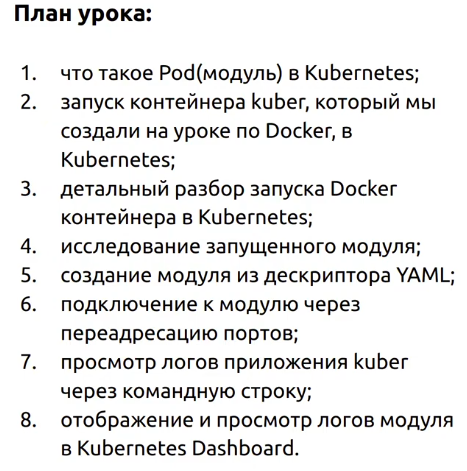
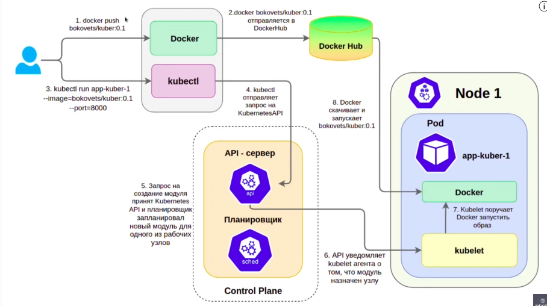
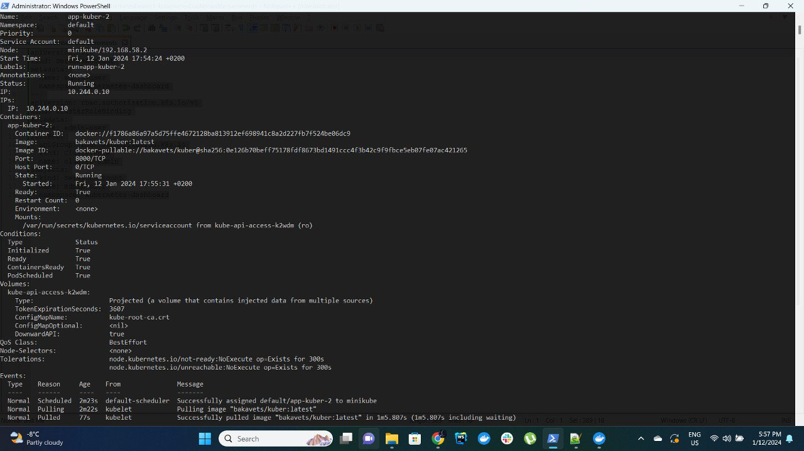

# Создание объекта Pod. Запуск контейнеров в Kubernetes

(https://www.youtube.com/watch?v=BzuC4GNoj0A&list=PL3SzV1_k2H1VDePbSWUqERqlBXIk02wCQ&index=7&ab_channel=BAKAVETS)

1. Поднимем миникуб кластер

2. Запустим под kuber-pod.yaml.

   kubectl run app-kuber-1 --image=docker pull bakavets/kuber:latest --port=8000

3. Для того чтобы более подробно исследовать запущенный под введем команду

   kubectl describe pod app-kluster-1

Внизу мы можем увидеть лог событий которые происходили для запуска приложения

4. Перейдем внутрь пода

   kubectl exec -it app-kuber-1 -- /bin/bash

Если бы в поде было запущенно больше одного контейнера то нам бы пришлось явно указать к какому из них мы обращаеся

    kubectl exec -it app-kuber-1 --container <container> -- /bin/bash

5. Теперь запустим объект под при помощи yaml файла. Кстати если вывести информацию о yaml файле каким его видит
   Кубернетс мы увидим много отличий так как в нашем файл так как в нашем файле мы даем только минимально необходимую
   информацию, остальное Kubernetes заполнит самостоятельно.

   kubectl get pod app-kuber-1 -o yaml

6. Подключимся к нашему поду при помощи переадресации портов. Она нужна, для того чтобы обменяться информацией с
   конкретным модулем. И используется в основном для отладки.

   kubectl pod-forward app-kuber-1 1111:8000

    - Первое число это настоящий локальный порт машины, а второе - порт который слушает наш контейнер.

   Теперь перейдем по адресу localhost:1111 и увидим наше приложение

7. Посмотрим логи контейнера запущенного на поде

   kubectl logs app-kuber-1 --container <container_name>

