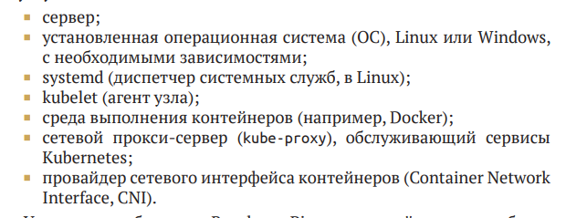
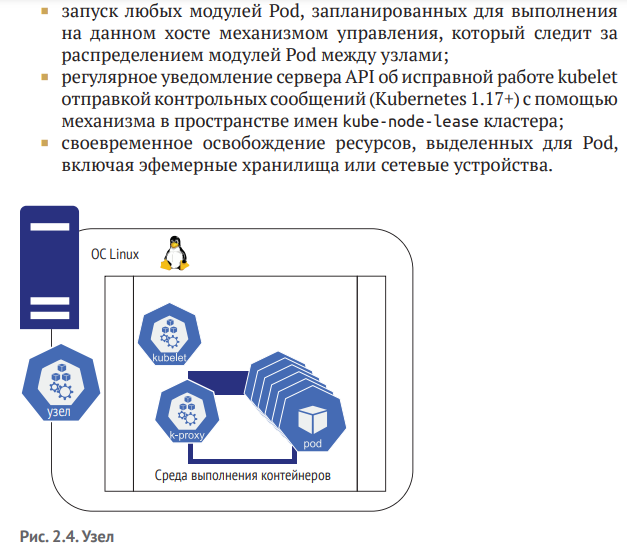

# Pods creation process 

1. Для создания подов должен быть запущен и функционировать хотя бы один объект Node (Узел), который по сути является еденицей вычислительной мощности. Но объекте Node может функционировать один и больше объектов Pod. Базовые требования к объекту Node

-- Kublet и его функции 

Однако программа kubelet не может выполнять свои обязанности без провайдера CNI и среды выполнения, доступной через интерфейс среды выполнения контейнеров (Container Runtime Interface, CRI). CNI обслуживает потребности CRI, который затем запускает и останавливает контейнеры. kubelet использует CRI и  CNI для согласования состояния узла с  состоянием плоскости управления. Например, когда плоскость управления решает, что NGINX будет работать на втором, третьем и четвертом узлах кластера, состоящего из пяти узлов, то задача kubelet – гарантировать, что провайдер CRI извлечет соответствующий контейнер из реестра образов и запустит его с IP-адресом в диапазоне podCIDR.
