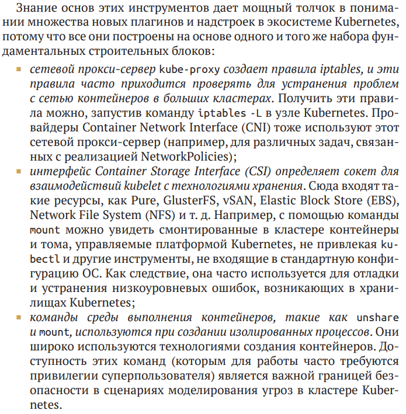
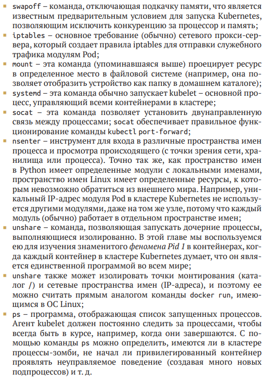

# Kubernetes and Linux primitives

    Примитивы Linux являются основными строительными блоками ОС Linux. Примерами таких примитивов могут служить такие инструменты, как iptables, ls, mount и многие другие базовые программы, доступные в большинстве дистрибутивов Linux. 

Основные примитивы на которые полагается Kubernetes

