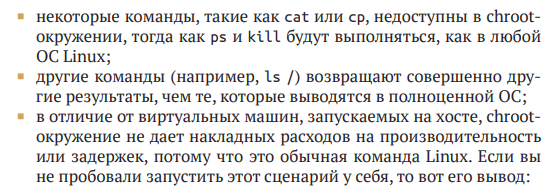
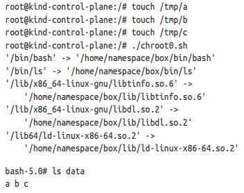
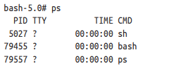
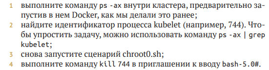
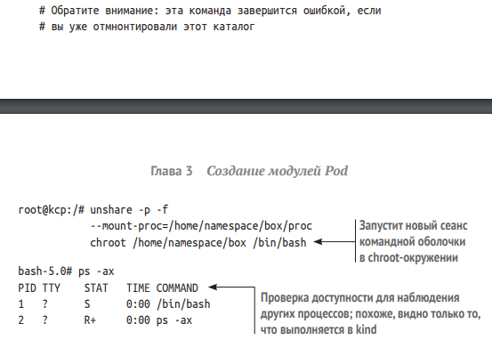

# Creating simple Pod

## Создание Пода с нуля

В этом разделе мы вернемся в прошлое и создадим систему управления контейнерами, подобную тем, что существовали до появления Kubernetes.

Для этого нам понадобится определить 4 основные составляющие модуля Под: 

    - хранилище;
    - IP-адрес;
    - изолированную сеть;
    - идентификатор процесса.

### 1. Создание изолированного процесса с помощью chroot

Для начала создадим контейнер в  самом прямом смысле  – папку, в  которой есть именно все, что нужно для запуска командной оболочки Bash, и больше ничего. Это делается с помощью известной команды chroot.

Наконец, можно запустить программу, и она будет полностью изолирована от исходной файловой системы: она не сможет видеть или изменять другую информацию в вашей файловой системе (например, она не сможет изменять файлы в /etc/ или /bin/). По сути это и делает Докер. 

Следующий сценарий создает chroot-окружение, в котором можно запустить сценарий Bash или другую программу Linux. Этому сценарию недоступна вмещающая система, а  это означает, что, запустив команду rm -rf / внутри chroot-окружения, мы не уничтожим никаких файлов в  фактической ОС.

### 2. Использование mount для передачи данных процессам

Контейнерам обычно требуется доступ к хранилищу, находящемуся где-то в другом месте: в облаке или на хосте. Команда mount позволяет взять устройство и отобразить его в любой каталог в вашей ОС. Обычно mount используется для отображения дисков в виде папок. 

В простейшем случае, с  точки зрения администратора, команда mount используется для отображения в некоторую постоянную папку диска, находящегося в каком-то другом произвольном месте. Например, представьте, что нам нужно запустить предыдущую программу, но так, чтобы она записывала данные во временное место, которое
можно очистить позже. Мы могли бы выполнить простую команду mount --bind /tmp/ /home/namespace/box/data и создать каталог /data в предыдущем сценарии chroot0.sh. Тогда любой пользователь, создавший chroot-окружение с помощью этого сценария, получит каталог /data и сможет использовать его для доступа к файлам в нашем каталоге /tmp.

    Обратите внимание, что этот шаг создает дыру в системе безопасности! После монтирования содержимого /tmp в  контейнеры любой сможет читать или изменять его содержимое. Именно поэтому функциональность hostPath томов Kubernetes часто отключается в промышленных кластерах

Убедимся, что действительно есть возможность передать некоторые данные в контейнер, созданный в  предыдущем разделе, использовав несколько основных примитивов Linux

Вот и все! Мы создали нечто похожее на контейнер, к тому же имеющее доступ к хранилищу выполним команду ps и посмотрим, какие еще процессы присутствуют в нашем контейнере. Обратите внимание, что мы увидим наш процесс bash и еще несколько других

Стоит уточнить что изолированный таким образом процесс все же не доконца безопасен, для иллюстрации следует сделать следующее 

Вы сразу увидите, что только что остановили kubelet! Несмотря на то что процесс в chroot-окружении не имеет доступа к другим папкам (потому что мы переместили / в новый корень), он может найти и остановить критически важные системные процессы. Таким образом, если бы это был наш контейнер, мы бы точно создали уязвимость из общего перечня уязвимостей и рисков (Common Vulnerabilities and
Exposures, CVE), позволяющую вывести из строя весь кластер.

Для решения этой проблеммы используется команда unshare которая может создать chroot окружение для запуска Bash в  изолированном терминале с  понастоящему ограниченным пространством процесса.

На этот раз наш процесс, который прежде получил PID 79455, работает в том же контейнере, но, будучи запущенным
командой unshare, он полагает, что имеет PID, равный 1. Обычно PID 1 присваивается процессу, который первым запускается в ОС (systemd).

В итоге используя unshare для запуска chroot мы имеем:

- изолированный процесс;
- изолированную файловую систему;
- возможность изменять определенные файлы в дереве каталогов
/tmp.

