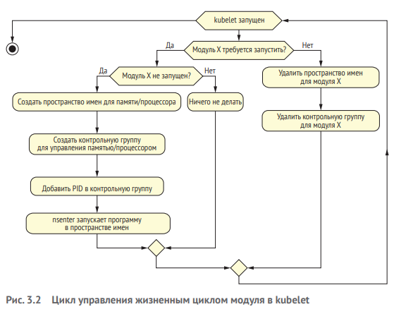
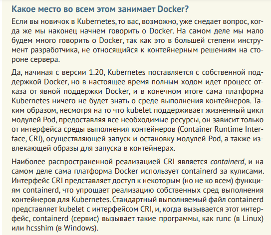
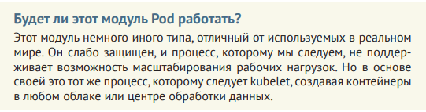
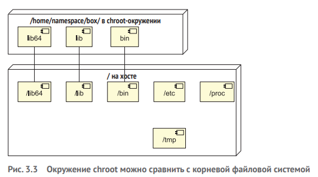
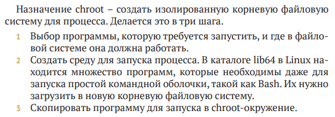
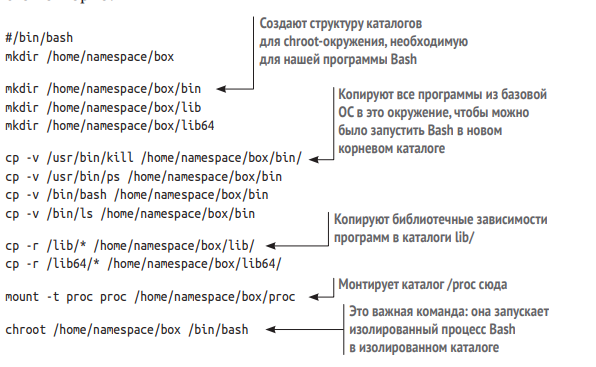

# Creating simple Pod

## Создание Пода с нуля

В этом разделе мы вернемся в прошлое и создадим систему управления контейнерами, подобную тем, что существовали до появления Kubernetes.

Для этого нам понадобится определить 4 основные составляющие модуля Под: 

    - хранилище;
    - IP-адрес;
    - изолированную сеть;
    - идентификатор процесса.

### 1. Создание изолированного процесса с помощью chroot

Для начала создадим контейнер в  самом прямом смысле  – папку, в  которой есть именно все, что нужно для запуска командной оболочки Bash, и больше ничего. Это делается с помощью известной команды chroot.

Наконец, можно запустить программу, и она будет полностью изолирована от исходной файловой системы: она не сможет видеть или изменять другую информацию в вашей файловой системе (например, она не сможет изменять файлы в /etc/ или /bin/). По сути это и делает Докер. 

Следующий сценарий создает chroot-окружение, в котором можно запустить сценарий Bash или другую программу Linux. Этому сценарию недоступна вмещающая система, а  это означает, что, запустив команду rm -rf / внутри chroot-окружения, мы не уничтожим никаких файлов в  фактической ОС.

