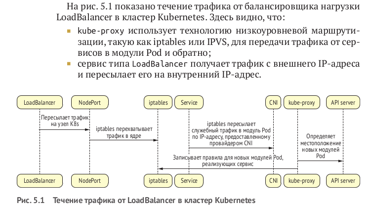
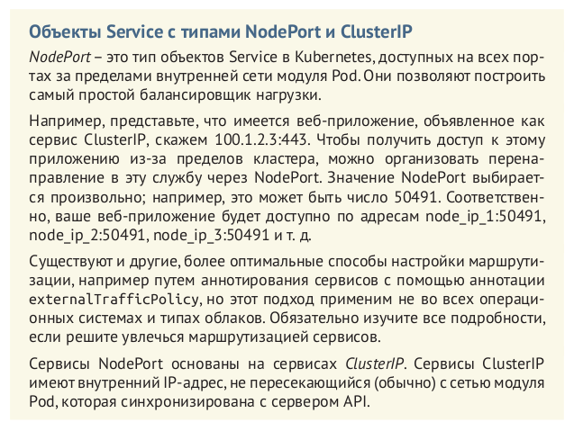
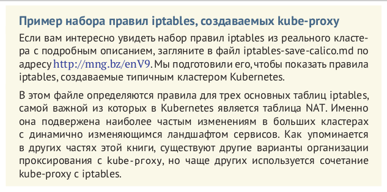
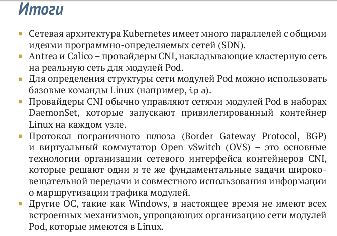

# Интерфейсы CNI и насройка сети в модулях Pod

http://mng.bz/enV9

Маршрутизацию трафика в Kubernetes можно представить в виде трех отдельных уровней:

- внешние балансировщики нагрузки или входные/шлюзовые маршру-
тизаторы – направляют трафик в кластер Kubernetes;
- kube-proxy – управляет маршрутизацией трафика между сервиса-
ми в модулях Pod. Выше уже отмечалось, что термин прокси (proxy)
несколько неточен, потому что kube-proxy просто управляет стати-
ческими правилами маршрутизации, которые реализуются ядром
или другой технологией в плоскости данных, такой как iptables;
- провайдеры CNI – направляют трафик в модули Pod и от них, не-
зависимо от способа обращения, – через конечную точку службы
или напрямую.

