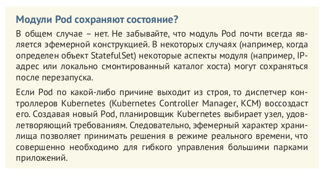
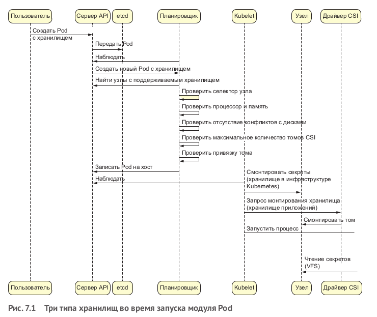
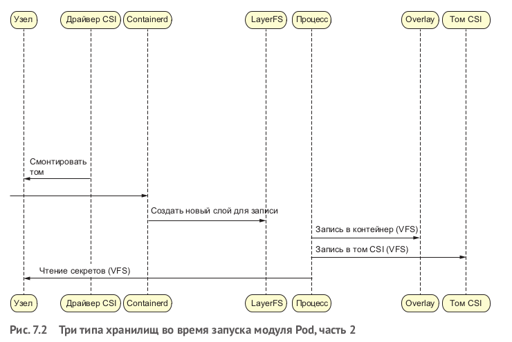
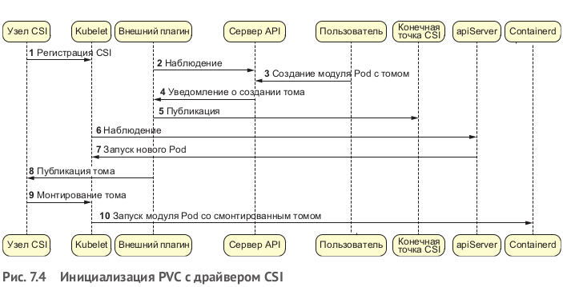

# Хранилища в модулях Pod

Организация хранилищ – сложная тема, очень тяжело описать все типы хранилищ, доступные современному
разработчику приложений. Вместо этого мы возьмем для примера конкретную задачу – реализация возможности хранения файлов
в модуле Pod – и решим ее. Файл должен сохраняться в период от остановки до повторного запуска контейнера и должен быть
досту-
пен новым узлам в кластере.

Kubernetes позволяет предтавить модель данных, предлагая такие понятия, как том храни-
лища PersistentVolume (PV), запрос на хранилище PersistentVolumeClaim (PVC) и класс хранилища StorageClass.

- тома хранилищ PV дают возможность управлять дисковыми томами в среде Kubernetes;
- запросы на хранилище PVC определяют требования приложений
  (модулей Pod) к этим томам и обрабатываются Kubernetes API;
- класс хранилища StorageClass дает возможность получать тома,
  не зная, как они реализованы. Это позволяет определять запросы PVC, не зная точно, какой тип тома PersistentVolume
  используется за кулисами.

Три типа хранилищ используемых в Kubernetes

- хранилище Docker/containerd/CRI – файловая система с копиро-
  ванием при записи, используется контейнерами. Контейнерам
  требуются специальные файловые системы во время выпол-
  нения, потому что запись выполняется на уровне VFS (именно
  поэтому, например, можно запустить rm -rf /tmp в контейнере,
  не рискуя удалить что-то на хосте). Обычно в окружении Kubernetes используются такие файловые системы, как btrfs,
  overlay
  или overlay2;
- хранилище в инфраструктуре Kubernetes – тома hostPath или Secret, которые используются на отдельных узлах для
  локального
  обмена информацией (например, для хранения секрета, кото-183 рый будет смонтирован в модуле Pod или в каталоге, откуда
  вы-
  зывается плагин хранилища или сети);
- хранилище для приложений – тома хранилища, которые модули
  Pod используют в кластере Kubernetes. Если модуль Pod должен
  записать данные на диск, то ему необходимо смонтировать том
  хранилища, для чего в объявление Pod добавляются соответствующие определения. Обычно для томов хранилищ используются
  файловые системы OpenEBS, NFS, GCE, EC2, постоянные диски
  vSphere и т. д.

## Интерфейс контейнерного хранилища (CSI)

