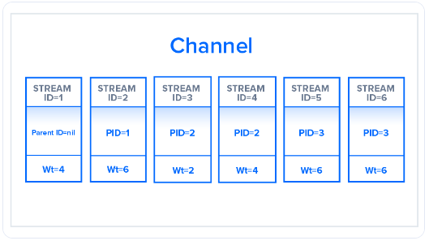

# HTTP/2 vs HTTP 
(https://www.digitalocean.com/community/tutorials/http-1-1-vs-http-2-what-s-the-difference)

From a technical point of view, one of the most significant features that 
distinguishes HTTP/1.1 and HTTP/2 is the binary framing layer, which can be 
thought of as a part of the application layer in the internet protocol stack. As
opposed to HTTP/1.1, which keeps all requests and responses in plain text format,
HTTP/2 uses the binary framing layer to encapsulate all messages in binary format,
while still maintaining HTTP semantics, such as verbs, methods, and headers. 
An application level API would still create messages in the conventional HTTP 
formats, but the underlying layer would then convert these messages into binary. 

## Delivery Methods

   HTTP/1.1 - uses multiple TCP connections to send data packets, but there are 
a limit of TCP connections which can be opened simultaneously. And each new 
connection requires significant resources.

   HTTP/2 establishes a single connection object between the two machines. 
Within this connection there are multiple streams of data. Each stream consists
of multiple messages in the familiar request/response format. Finally, each
of these messages split into smaller units called frames:

   The communication channel consists of a bunch of binary-encoded frames, each
tagged to a particular stream, the identifying tags allow th connection to 
interleave these frames during transfer and reassemble them at the end. This 
process can run in parallel without blocking the messages behind them, and
called multiplexing

## Stream Prioritization

   Stream prioritization not only solves the possible issue of requests competing 
for the same resource, but also allows developers to customize the relative 
weight of requests to better optimize application performance. Stream 1 does 
not have a parent ID associated with it and is by default associated with the
root node.

   The server uses this information to create a dependency tree, which allows the 
server to determine the order in which the requests will retrieve their data. 
Based on the streams in the preceding figure, the dependency tree will be as 
follows:

As an application developer, you can set the weights in your requests based 
on your needs.

## Buffer overflow

The client and the server have limited amount of buffer space available to hold
incoming requests. 

### In HTTP/1.1

Because HTTP/1.1 relies on the transport layer to avoid buffer overflow, each 
new TCP connection requires a separate flow control mechanism.

### In HTTP/2

## Predicting Resource Requests

### In HTTP/1.1

In HTTP/1.1, if the developer knows in advance which additional resources the 
client machine will need to render the page, they can use a technique called 
resource inlining to include the required resource directly within the HTML 
document.

But there are a few problems with resource inlining. Including the resource in 
the HTML document is a viable solution for smaller, text-based resources, but 
larger files in non-text formats can greatly increase the size of the HTML 
document, which can ultimately decrease the connection speed. In addition the 
client can not separate the resource and the document.

### In HTTP/2

Server can send a resource to a client along with the requested HTML page, 
providing the resource before the client asks for it. This process is called 
server push. In this way, an HTTP/2 connection can accomplish the same goal 
of resource inlining while maintaining the separation between the pushed 
resource and the document. This means that the client can decide to cache 
or decline the pushed resource separate from the main HTML document.

In HTTP/2, this process begins when the server sends a PUSH_PROMISE frame to
inform the client that it is going to push a resource. This frame includes only
the header of the message, and allows the client to know ahead of time which 
resource the server will push. If it already has the resource cached, the client
can decline the push by sending a RST_STREAM frame in response. 

It is important to note here that the emphasis of server push is client 
control. If a client needed to adjust the priority of server push, or even 
disable it, it could at any time send a SETTINGS frame to modify this HTTP/2
feature.

## Compression

### HTTP/1.1

Programs like gzip have long been used to compress the data sent in HTTP 
messages, especially to decrease the size of CSS and JavaScript files. The 
header component of a message, however, is always sent as plain text.

### HTTP/2

One of the themes that has come up again and again in HTTP/2 is its ability 
to use the binary framing layer to exhibit greater control over finer detail.
The same is true when it comes to header compression. HTTP/2 can split headers
from their data, resulting in a header frame and a data frame. 
The HTTP/2-specific compression program HPACK can then compress this header 
frame. This algorithm can encode the header metadata using Huffman coding, 
thereby greatly decreasing its size. Additionally, HPACK can keep track of 
previously conveyed metadata fields and further compress them according to 
a dynamically altered index shared between the client and the server.

Example. First HTTP/1.1 headers, second HTTP/2

