# Microservices Patterns 

## Scaling application

## Pattern language

## 4 + 1 view model 

An application has two categories of requirements: functional and quality of 
service. Architecture has very little to do with first you can implement all
of them using a big ball of mud. But it is important to satisfy the second, 
these are also known as quality attributes, or ilities, which defines the 
scalability and reliability, and also edfine maintainability, testability,
deployability.

## Architectural styles

Layer and Hexagonal Architecture are both organise the logical view 

### Layer Architecture

### Hexagonal Architecture

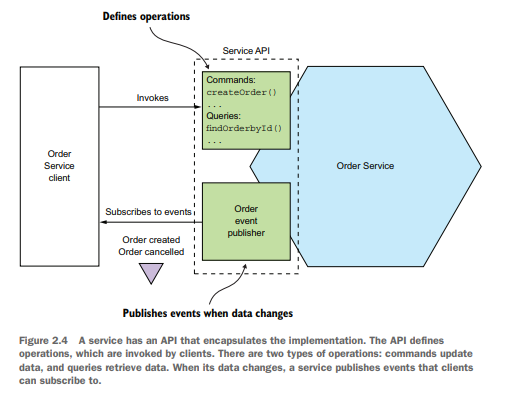

## Defining microservices architecture

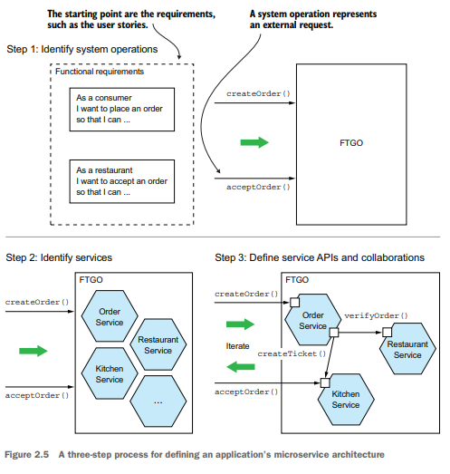

### Identifying system operations

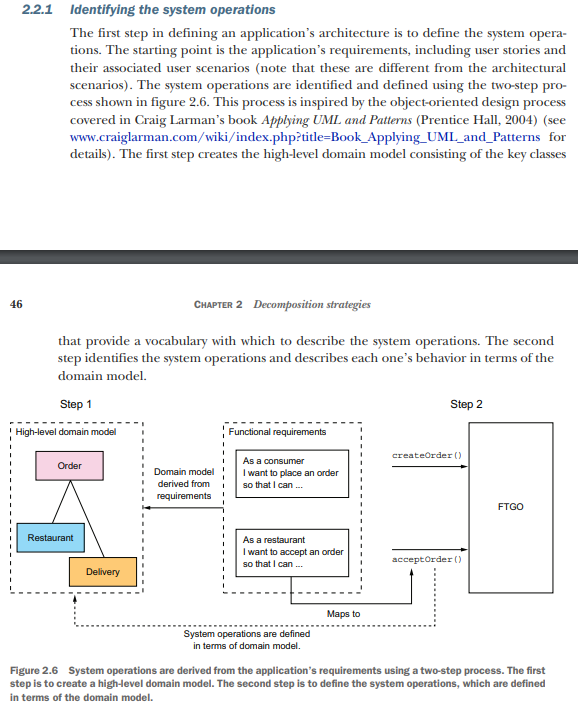

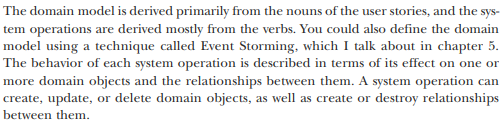

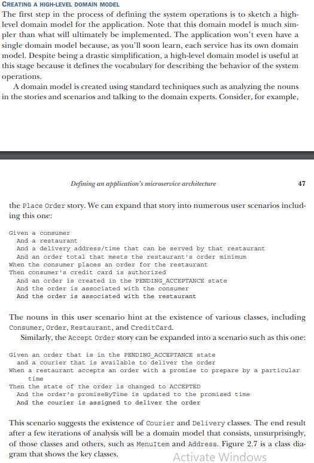

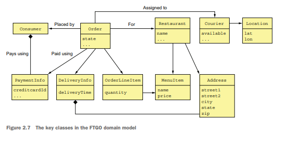

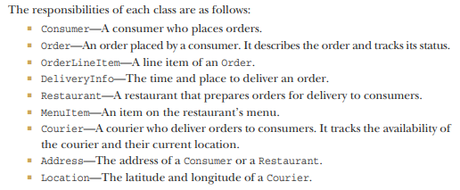

### Defining system operations

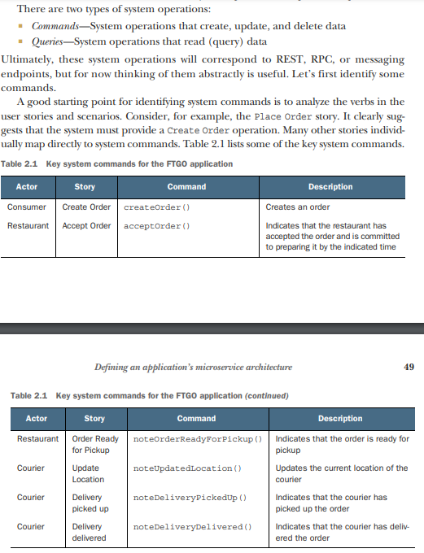

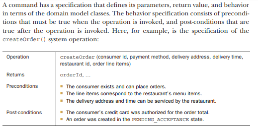

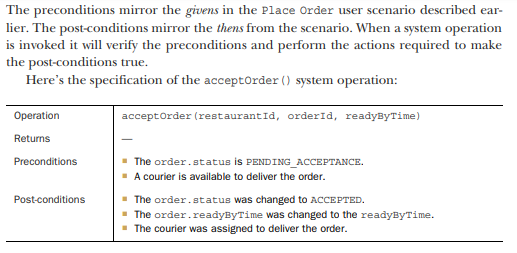

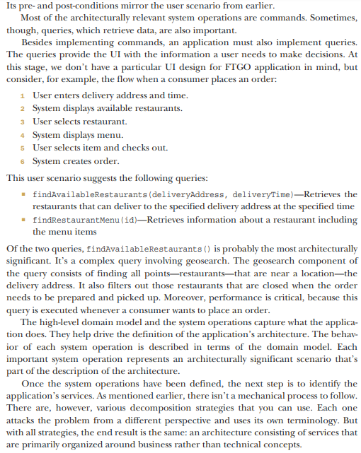

### Defining microservices by applying business capability pattern

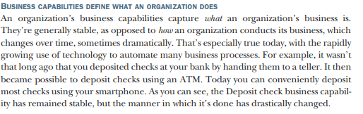

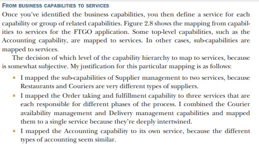

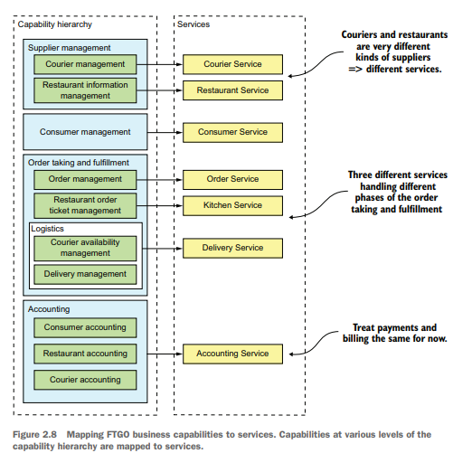

### Defining services by applying the Decompose by sub-domain pattern

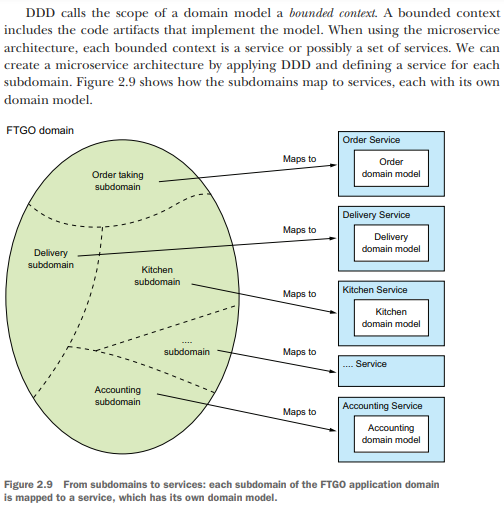

## Defining service APIs

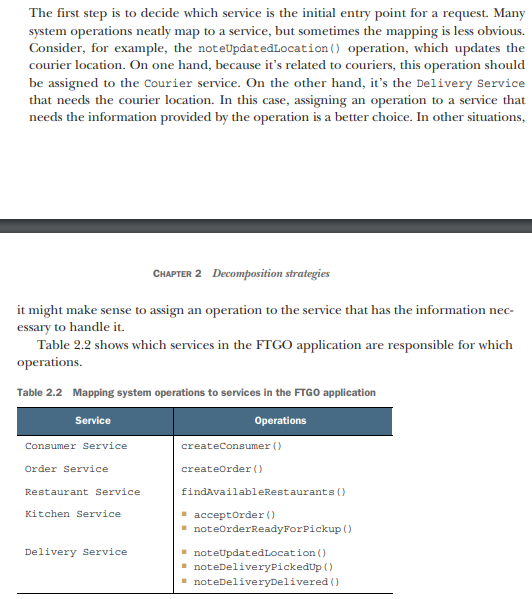

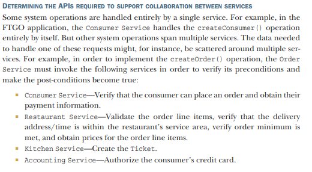

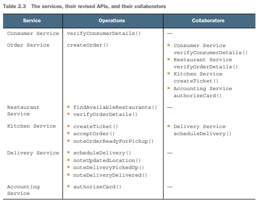

## Inter process communication

### Versioning

### Communicating using the synchronous Remote procedure invocation pattern

#### Using REST

#### Using gRPC

#### Handling partial failure. Circuit breaker pattern

##### Developing robust RPI proxies

Whenever one service synchronously invokes another service, it should protect itself
using the approach described by Netflix

##### Recovering from unavailable service

One option is for a service to simply return an error to its client. For example,
this approach makes sense for the scenario shown in figure 3.2, where the request to
create an Order fails. The only option is for the API gateway to return an error to the
mobile client.

#### Using service discovery

Service instances have dynamically assigned network locations. Moreover, the set of
service instances changes dynamically because of autoscaling, failures, and upgrades.
Consequently, your client code must use a service discovery.

##### APPLYING THE PLATFORM-PROVIDED SERVICE DISCOVERY PATTERNS

Many modern deployment platforms such as
Docker and Kubernetes have a built-in service registry and service discovery mechanism. The deployment platform gives each service a DNS name, a virtual IP (VIP)
address, and a DNS name that resolves to the VIP address. A service client makes a
request to the DNS name/VIP, and the deployment platform automatically routes the
request to one of the available service instances. As a result, service registration, service discovery, and request routing are entirely handled by the deployment platform.

The key benefit of platform-provided service discovery is that all aspects of service discovery are entirely handled by the deployment platform. Neither the services nor the
clients contain any service discovery code. Consequently, the service discovery mechanism is readily available to all services and clients regardless of which language or
framework they’re written in. One drawback of platform-provided service discovery is that it only supports the
discovery of services that have been deployed using the platform. For example, as
mentioned earlier when describing application-level discovery, Kubernetes-based discovery only works for services running on Kubernetes. Despite this limitation, I recommend using platform-provided service discovery whenever possible

### Using Asynchronous messaging pattern

### Creating an API specification for a messaging-based service API

You must also describe the format of the messages using a
standard such as JSON, XML, or Protobuf. But unlike with REST and Open API, there
isn’t a widely adopted standard for documenting the channels and the message types.
Instead, you need to write an informal document.

A service’s asynchronous API consists of operations, invoked by clients, and events,
published by the services. They’re documented in different ways.

#### Documenting asynchronous operations

#### Documenting published events

A service can also publish events using a publish/subscribe interaction style. The specification of this style of API consists of the event channel and the types and formats of
the event messages that are published by the service to the channel.
The messages and channels model of messaging is a great abstraction and a good
way to design a service’s asynchronous API. But in order to implement a service you
need to choose a messaging technology and determine how to implement your design
using its capabilities.
