# Developing production ready services

## Security

A better approach is for the API gateway to authenticate a request before forwarding it to the services.

Authenticating a client’s credentials is important but insufficient. An application must also implement an authorization
mechanism that verifies that the client is allowed to perform the requested operation. For example, in the FTGO
application the getOrderDetails() query can only be invoked by the consumer who placed the Order (an example of
instance-based security) and a customer service agent who is helping the consumer

## Using OAuth 2.0

## Designing configurable services

### Push - based approach

### Pull - based approach

### Must have patterns

There are several patterns that you, as a service developer, must implement to make your service easier to manage and
troubleshoot.

### Health check API pattern

### Log aggregation pattern

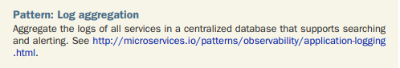

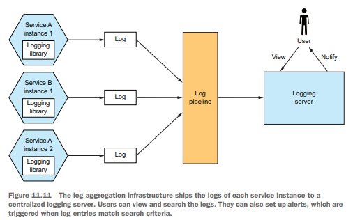

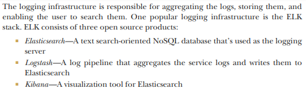

### Distributed tracing pattern

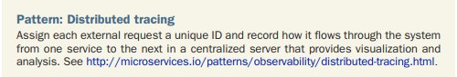

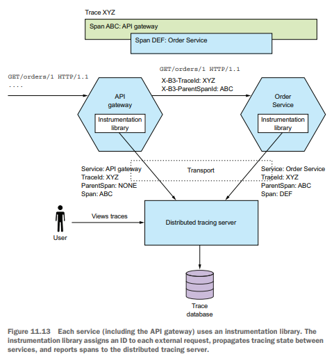

For example, one common standard for propagating trace information is the B3
standard (https://github.com/openzipkin/b3-propagation), which uses headers such as X-B3-TraceId and X-B3-ParentSpanId.
The instrumentation library also reports traces to the distributed tracing server. The distributed tracing server stores
the traces and provides a UI for visualizing them.

### Applying the Application metrics pattern

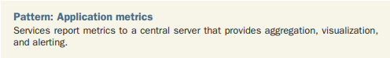
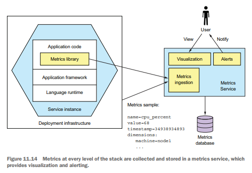

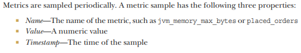

### Delivering metrics to the metrics service

A service delivers metrics to the Metrics Service in one of two ways: push or pull. With the push model, a service
instance sends the metrics to the Metrics Service by invoking an API. AWS Cloudwatch metrics, for example, implements
the push model.

With the pull model, the Metrics Service (or its agent running locally) invokes a service API to retrieve the metrics
from the service instance. Prometheus, a popular open source monitoring and alerting system, uses the pull model.

### Using the Exception tracking pattern

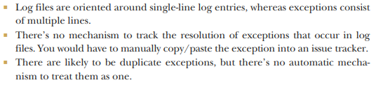

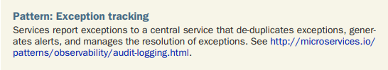

A better approach is to use an exception tracking service. As figure 11.15 shows, you configure your service to report
exceptions to an exception tracking service via, for example, a REST API. The exception tracking service de-duplicates
exceptions, generates alerts, and manages the resolution of exceptions.

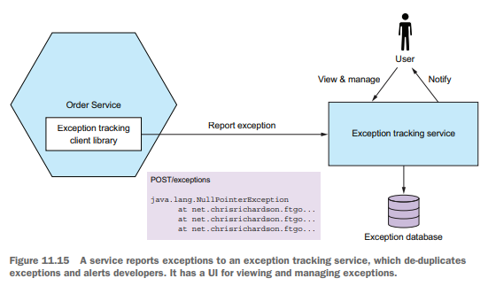
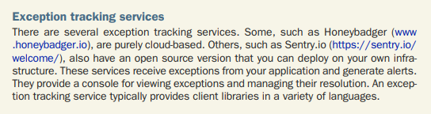

### Applying the Audit logging pattern

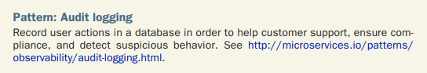

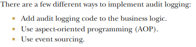

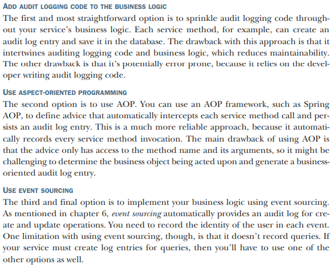

## Developing services using the Microservice chassis pattern

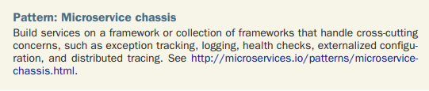
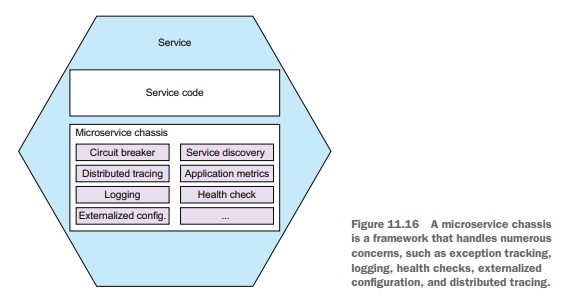

#### Using a microservice chassis

     Externalized configuration
     Health checks
     Application metrics
     Service discovery
     Circuit breakers
     Distributed tracing

One drawback of using a microservice chassis is that you need one for every language/platform combination that you use
to develop services.

#### From microservice chassis to service mesh

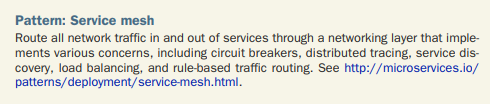

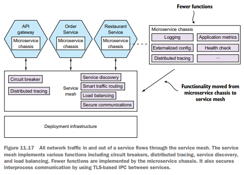

## Summary

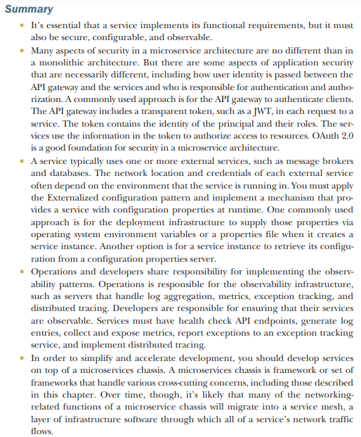
