# Developing production ready services

## Security

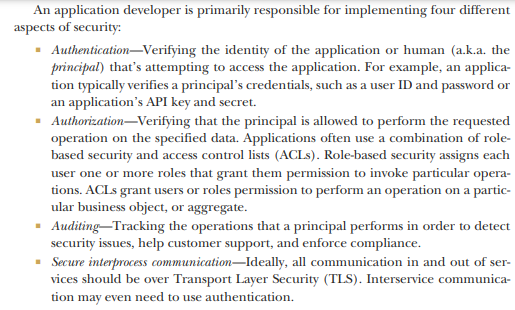

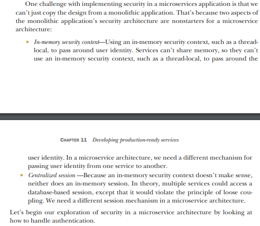

A better approach is for the API gateway to authenticate a request before forwarding it to the services.

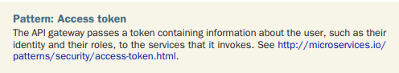

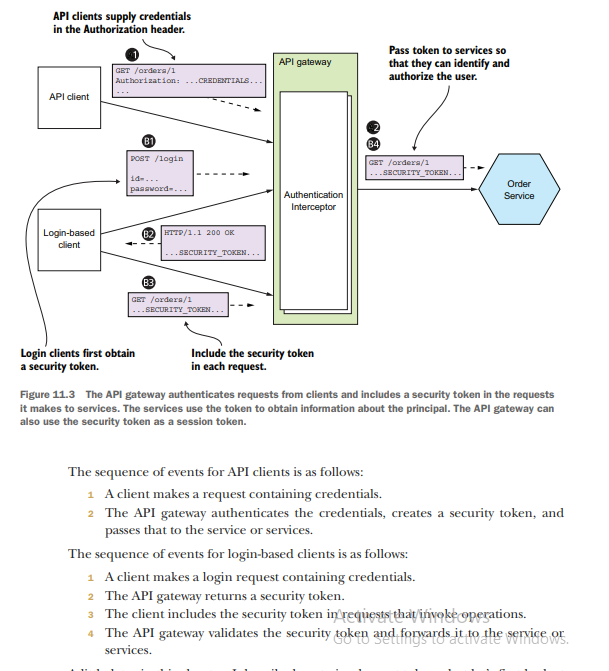

Authenticating a client’s credentials is important but insufficient. An application must also implement an authorization
mechanism that verifies that the client is allowed to perform the requested operation. For example, in the FTGO
application the getOrderDetails() query can only be invoked by the consumer who placed the Order (an example of
instance-based security) and a customer service agent who is helping the consumer

## Using OAuth 2.0

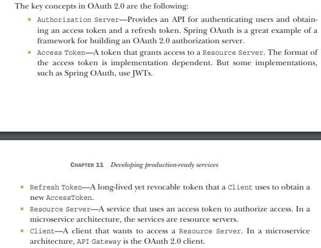

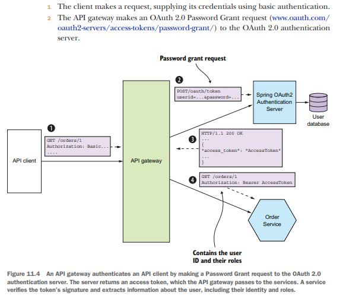

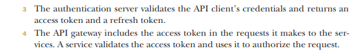

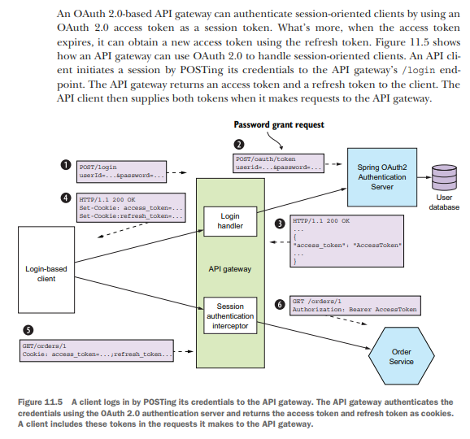

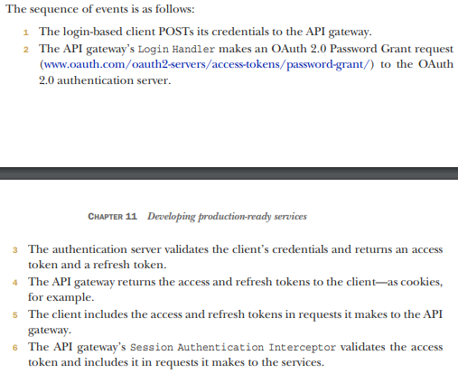

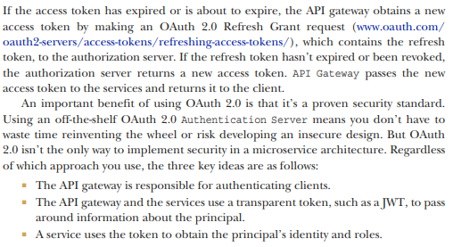

## Designing configurable services

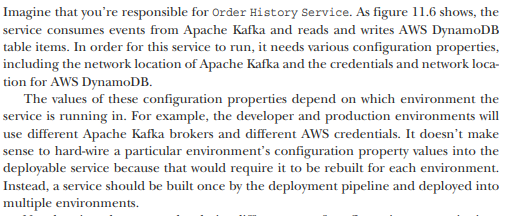

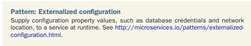

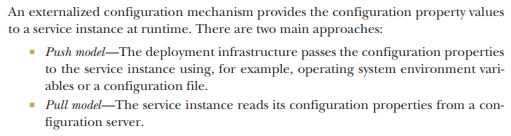

### Push - based approach

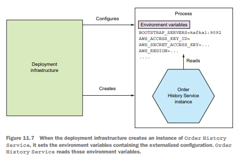

### Pull - based approach

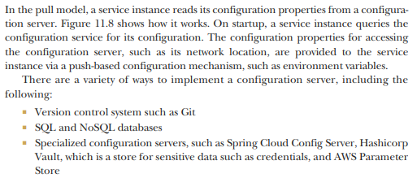

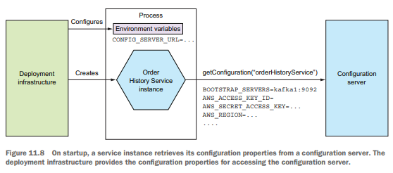

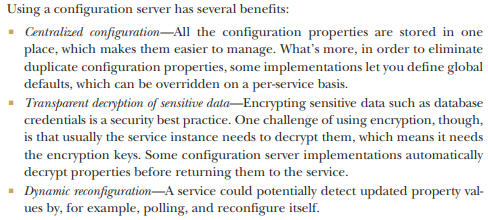

### Must have patterns

There are several patterns that you, as a service developer, must implement to make your service easier to manage and
troubleshoot.

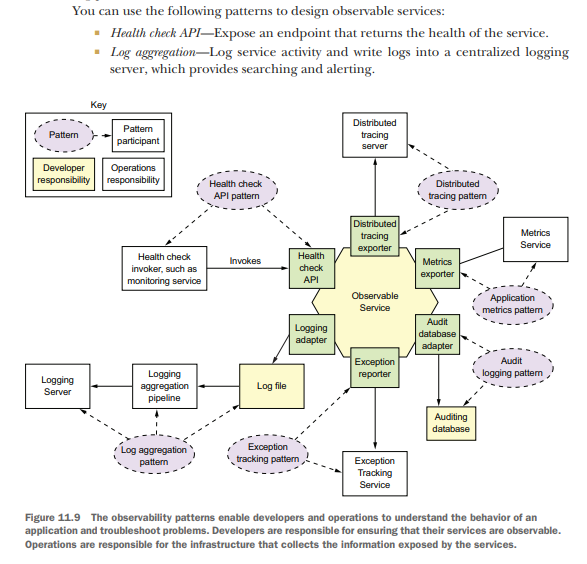

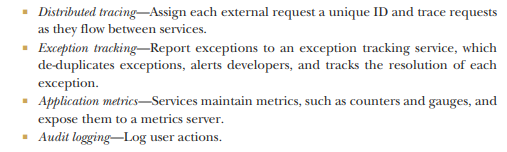

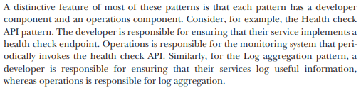

### Health check API pattern

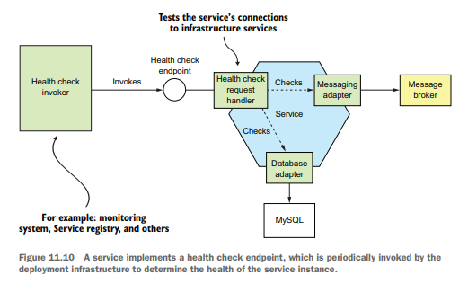

### Log aggregation pattern

