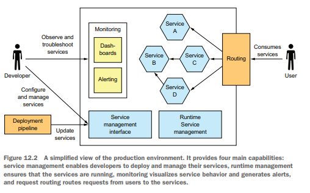
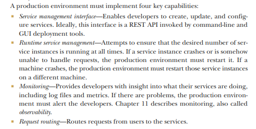
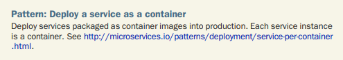
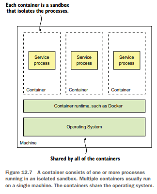
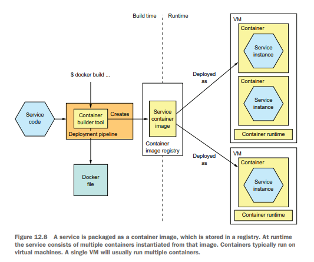
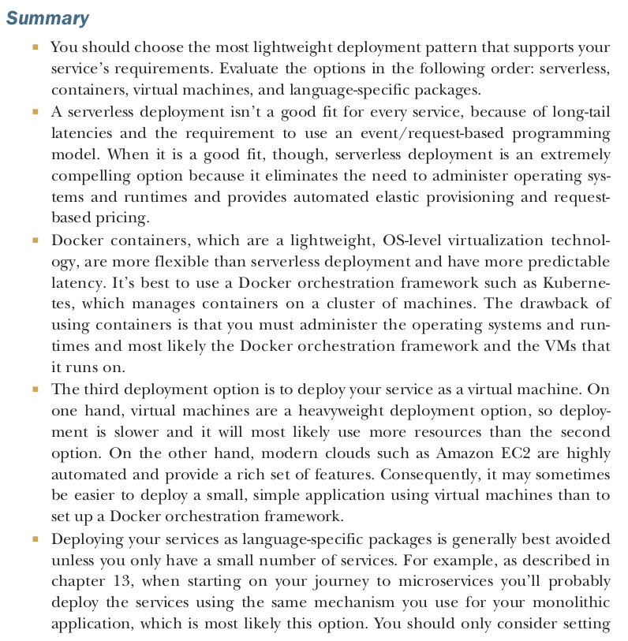
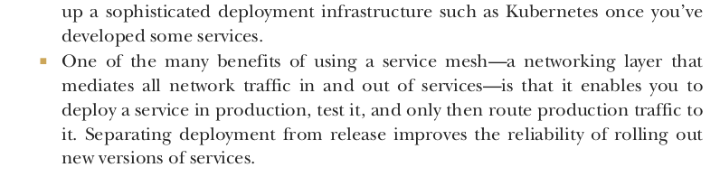
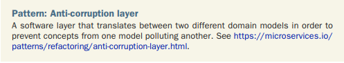
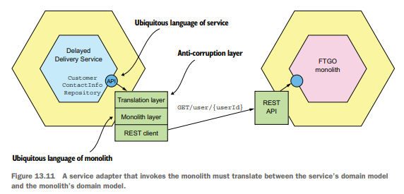
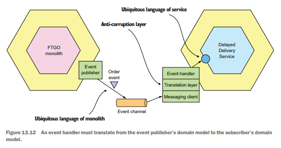

# Deploying microservices

## Deploying services using the Service as a container pattern

## Anti corruption layer pattern

The goal of an ACL is to prevent a legacy monolith’s domain model from polluting a service’s domain model. It’s a layer
of code that translates between the different domain models.

The event handler must translate domain events from the monolith’s domain language to that of Delivery Service. It might
need to map class and attribute names and potentially attribute values. It’s not just services that use an
anti-corruption layer. A monolith also uses an ACL when invoking the service and when subscribing to domain events
published by a service
