# Decomposition strategies

## Scaling application

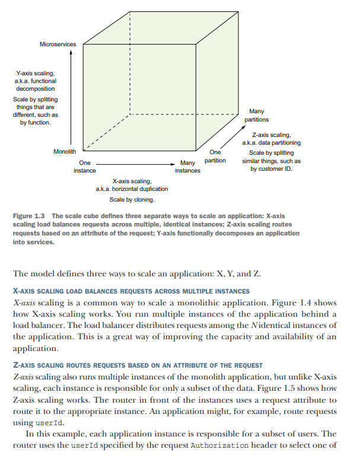

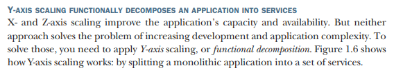

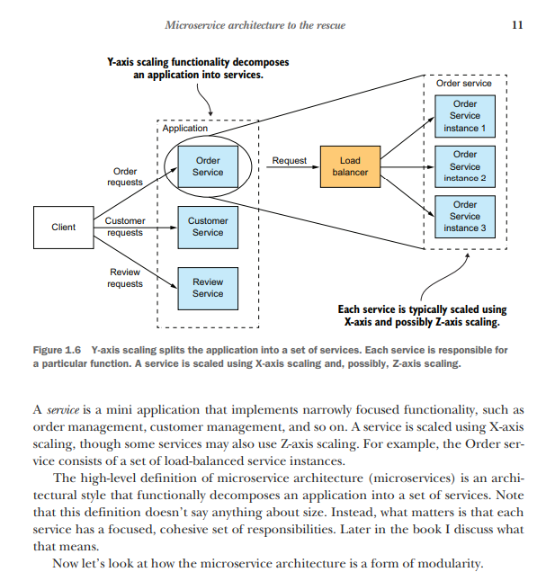

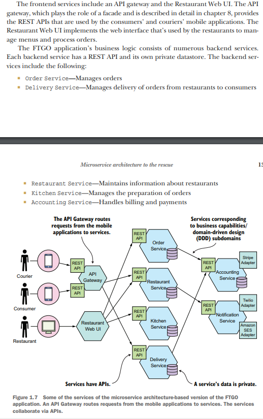

## Pattern language

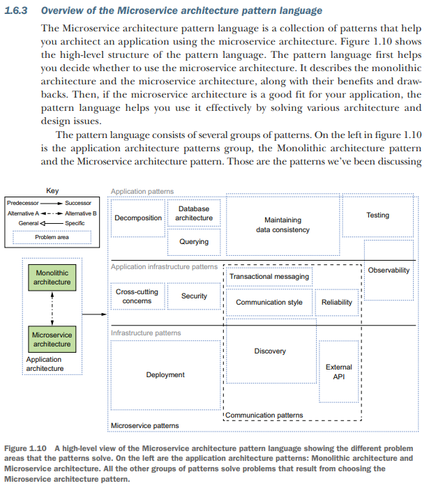

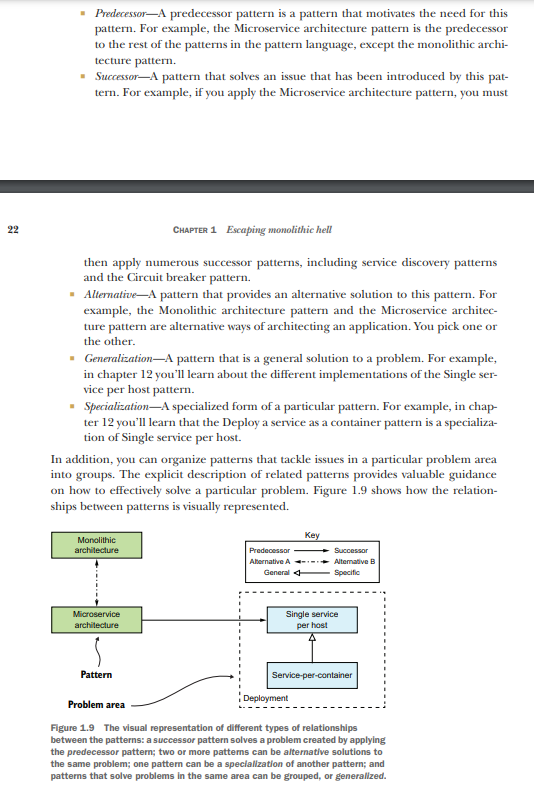

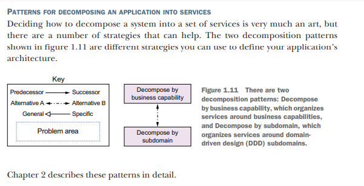

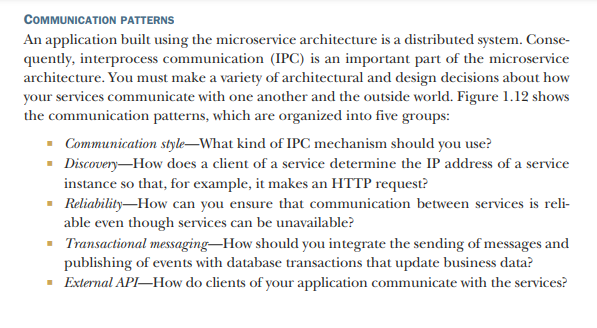

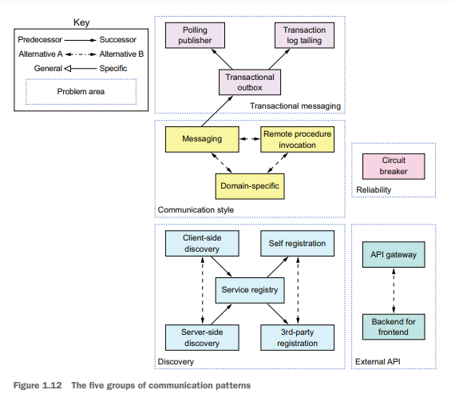

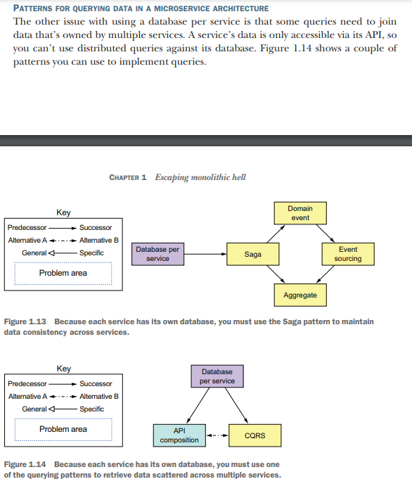

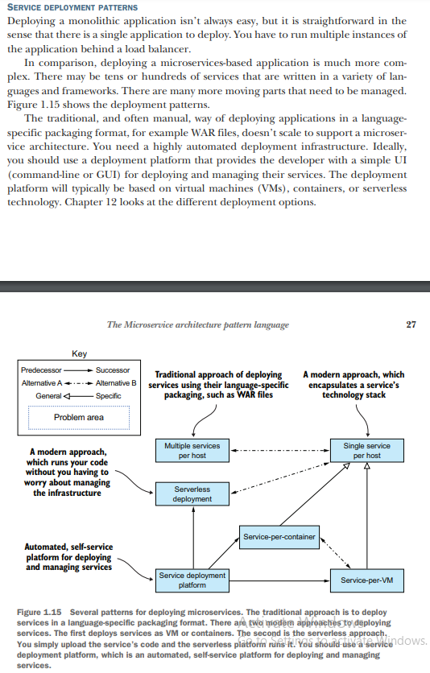

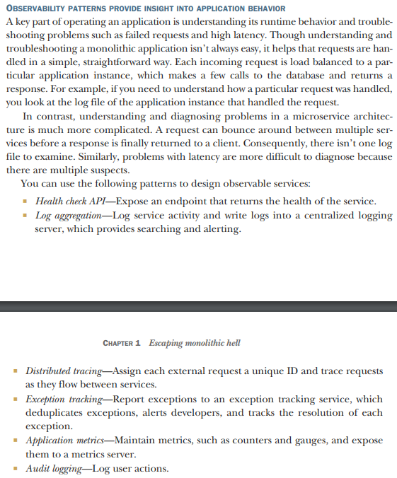

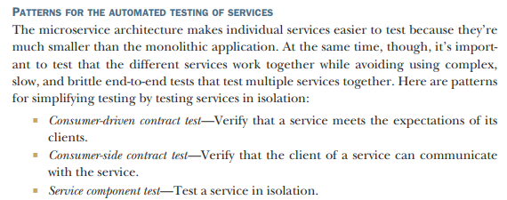

## 4 + 1 view model

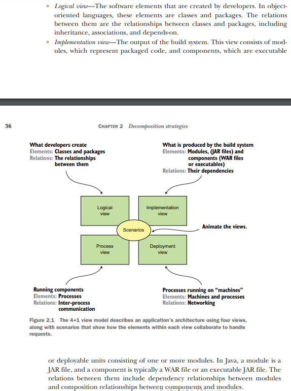

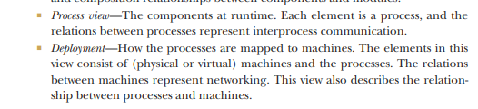

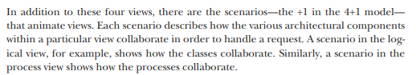

An application has two categories of requirements: functional and quality of service. Architecture has very little to do
with first you can implement all of them using a big ball of mud. But it is important to satisfy the second, these are
also known as quality attributes, or ilities, which defines the scalability and reliability, and also edfine
maintainability, testability, deployability.

## Architectural styles

Layer and Hexagonal Architecture are both organise the logical view

### Layer Architecture

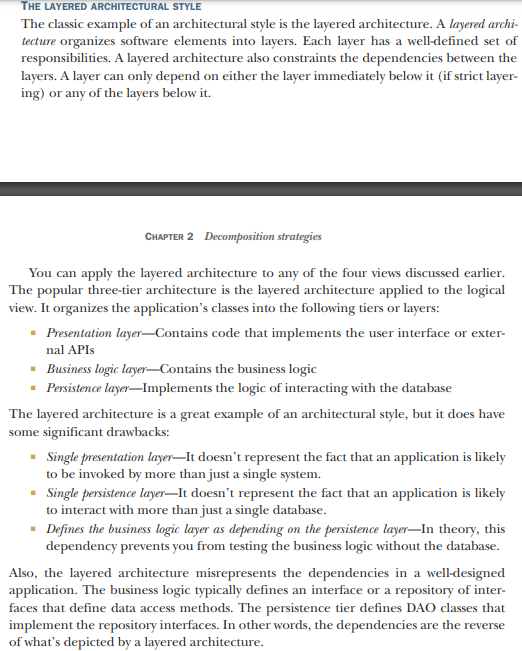

### Hexagonal Architecture

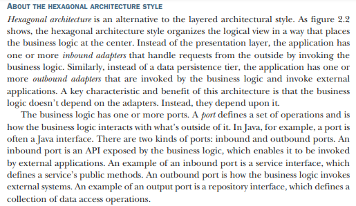

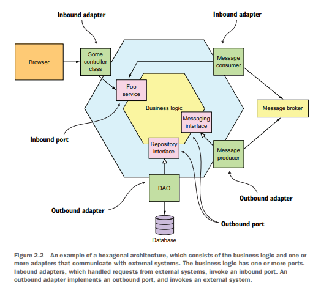

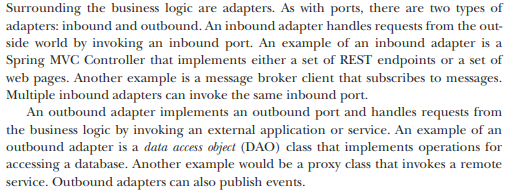

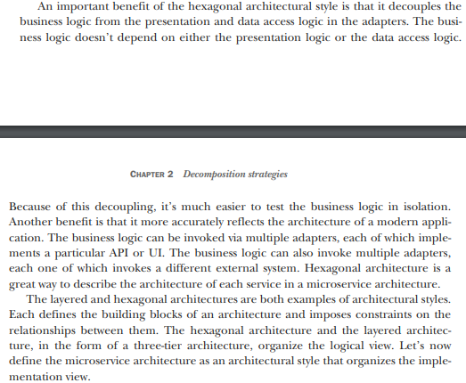

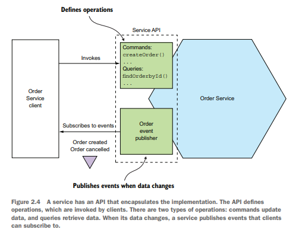

## Defining microservices architecture

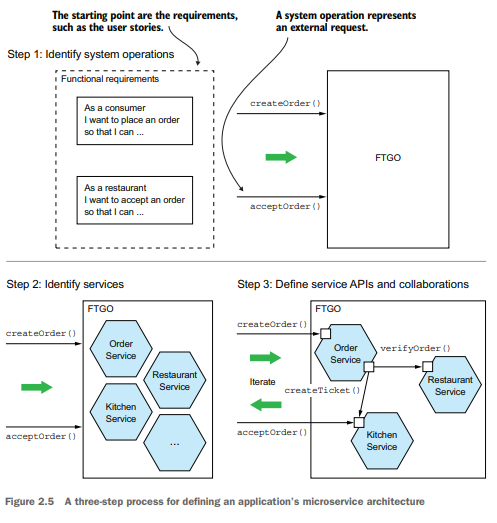

### Identifying system operations

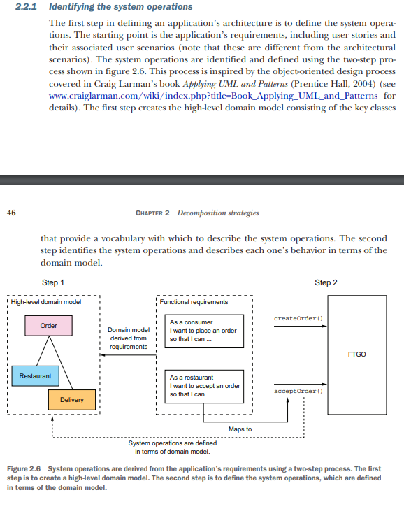

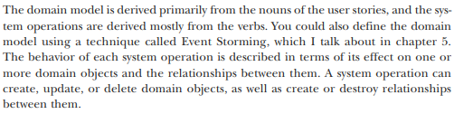

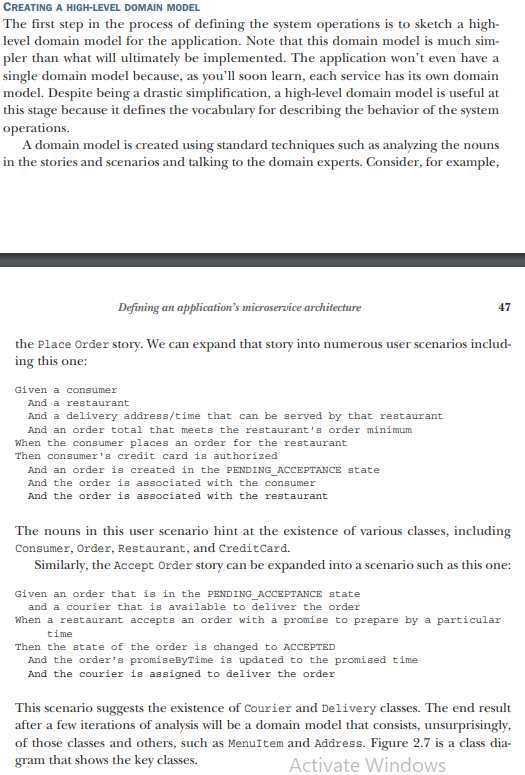

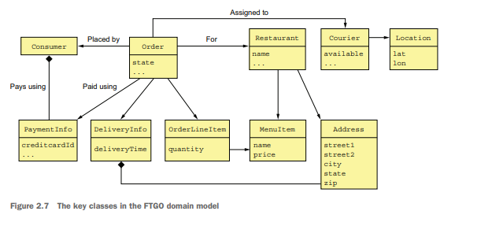

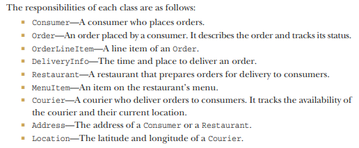

### Defining system operations

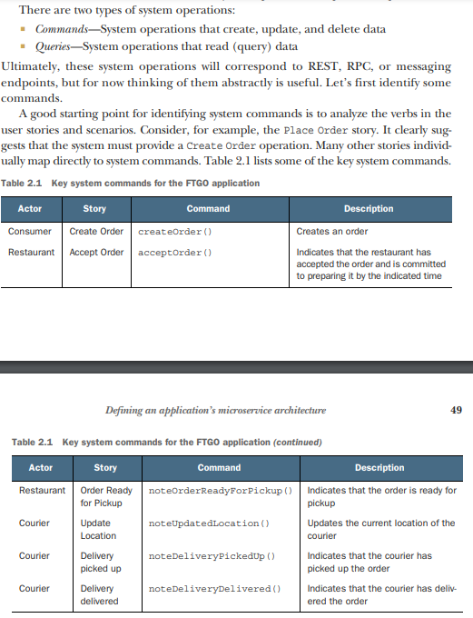

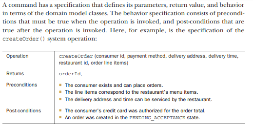

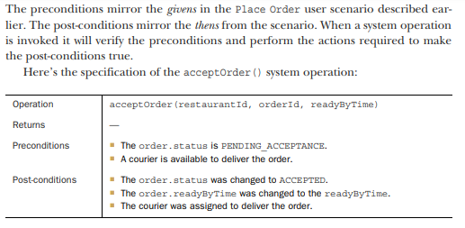

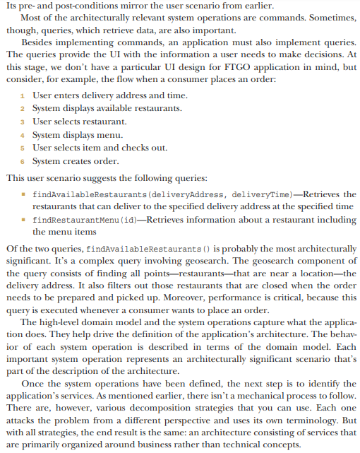

### Defining microservices by applying business capability pattern

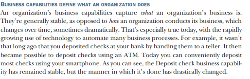

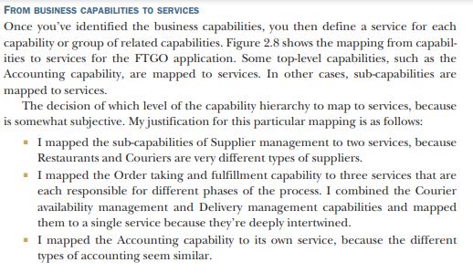

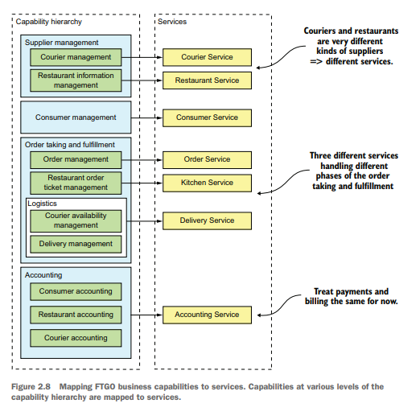

### Defining services by applying the Decompose by sub-domain pattern

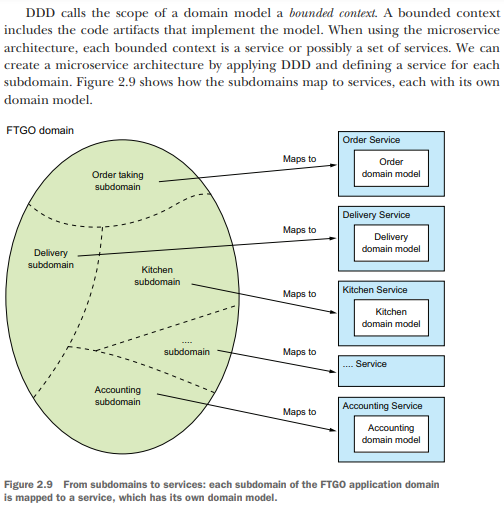

## Defining service APIs

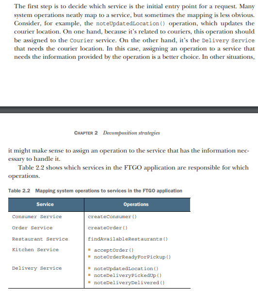

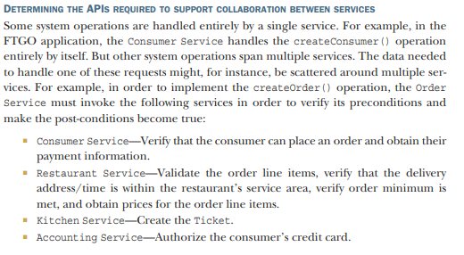

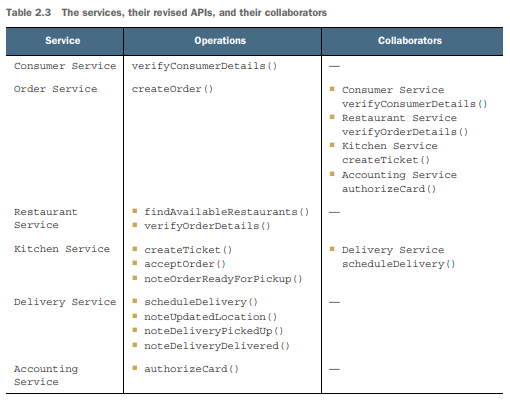
