# Interprocess communication in microservice architecture

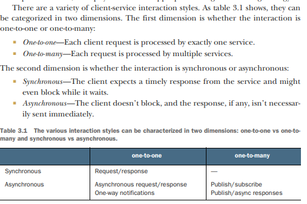

## Versioning

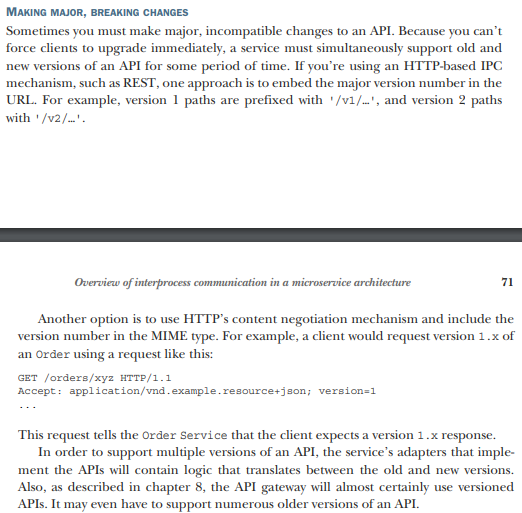

## Communicating using the synchronous Remote procedure invocation pattern

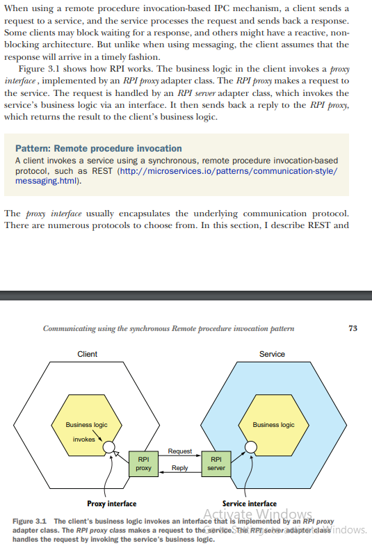

### Using REST

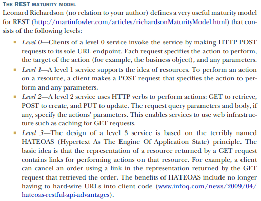

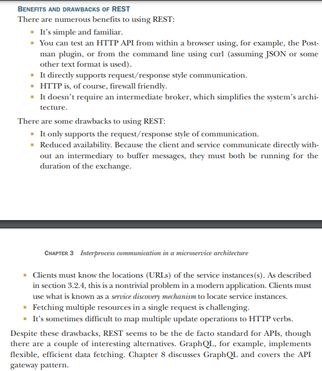

### Using gRPC

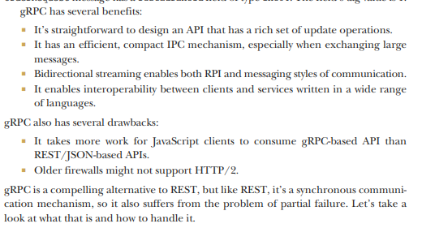

### Handling partial failure. Circuit breaker pattern

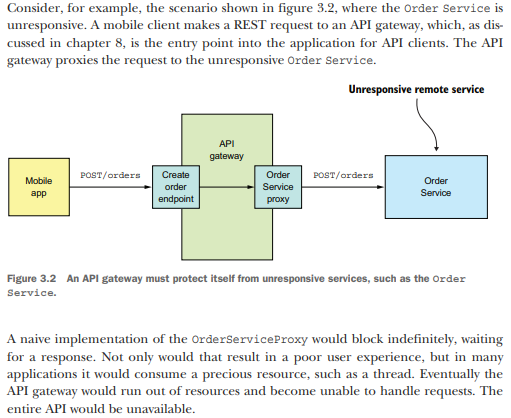

#### Developing robust RPI proxies

Whenever one service synchronously invokes another service, it should protect itself using the approach described by
Netflix

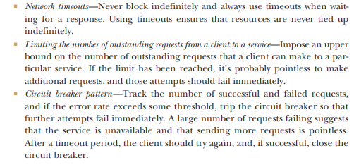

#### Recovering from unavailable service

One option is for a service to simply return an error to its client. For example, this approach makes sense for the
scenario shown in figure 3.2, where the request to create an Order fails. The only option is for the API gateway to
return an error to the mobile client.

### Using service discovery

Service instances have dynamically assigned network locations. Moreover, the set of service instances changes
dynamically because of autoscaling, failures, and upgrades. Consequently, your client code must use a service discovery.

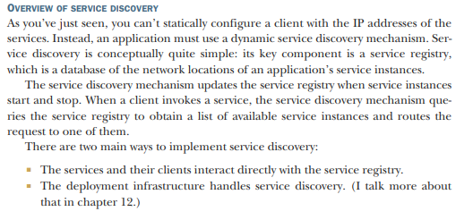

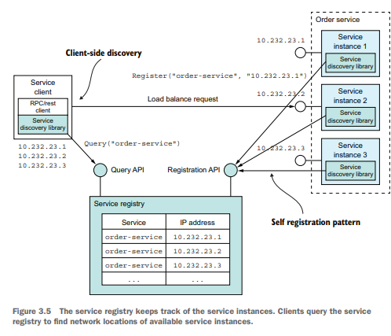

#### APPLYING THE PLATFORM-PROVIDED SERVICE DISCOVERY PATTERNS

Many modern deployment platforms such as Docker and Kubernetes have a built-in service registry and service discovery
mechanism. The deployment platform gives each service a DNS name, a virtual IP (VIP)
address, and a DNS name that resolves to the VIP address. A service client makes a request to the DNS name/VIP, and the
deployment platform automatically routes the request to one of the available service instances. As a result, service
registration, service discovery, and request routing are entirely handled by the deployment platform.

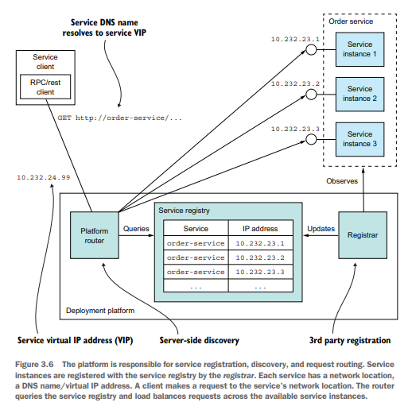

The key benefit of platform-provided service discovery is that all aspects of service discovery are entirely handled by
the deployment platform. Neither the services nor the clients contain any service discovery code. Consequently, the
service discovery mechanism is readily available to all services and clients regardless of which language or framework
they’re written in. One drawback of platform-provided service discovery is that it only supports the discovery of
services that have been deployed using the platform. For example, as mentioned earlier when describing application-level
discovery, Kubernetes-based discovery only works for services running on Kubernetes. Despite this limitation, I
recommend using platform-provided service discovery whenever possible

## Using Asynchronous messaging pattern

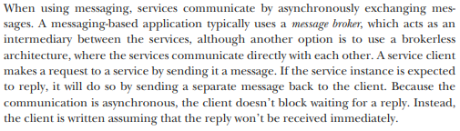

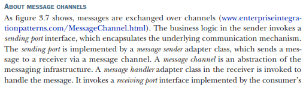

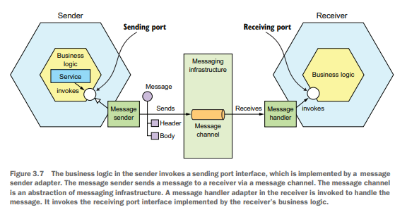

## Creating an API specification for a messaging-based service API

You must also describe the format of the messages using a standard such as JSON, XML, or Protobuf. But unlike with REST
and Open API, there isn’t a widely adopted standard for documenting the channels and the message types. Instead, you
need to write an informal document.

A service’s asynchronous API consists of operations, invoked by clients, and events, published by the services. They’re
documented in different ways.

### Documenting asynchronous operations

### Documenting published events

A service can also publish events using a publish/subscribe interaction style. The specification of this style of API
consists of the event channel and the types and formats of the event messages that are published by the service to the
channel. The messages and channels model of messaging is a great abstraction and a good way to design a service’s
asynchronous API. But in order to implement a service you need to choose a messaging technology and determine how to
implement your design using its capabilities.

## Using message brocker

A messaging-based application typically uses a message broker, an infrastructure service through which the service
communicates. But a broker-based architecture isn’t the only messaging architecture. You can also use a brokerless-based
messaging architecture, in which the services communicate with one another directly.

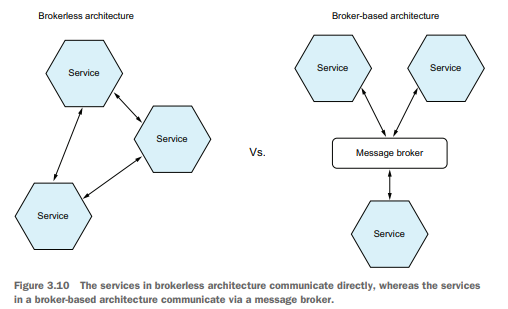

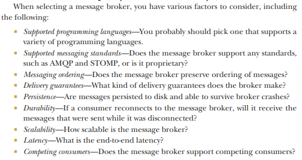

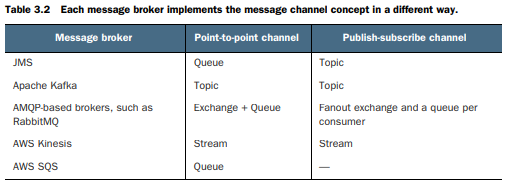

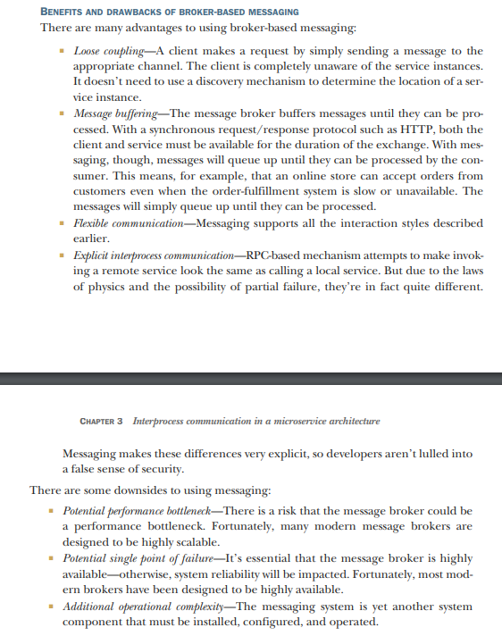

### Issues with a message brockers

Using multiple threads and service instances to concurrently process messages increases the throughput of the
application. But the challenge with processing messages concurrently is ensuring that each message is processed once and
in order

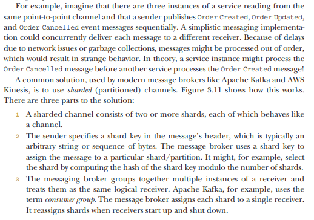

In this example, each Order event message has the orderId as its shard key. Each event for a particular order is
published to the same shard, which is read by a single consumer instance. As a result, these messages are guaranteed to
be processed in order.

### Handling duplicate messaging

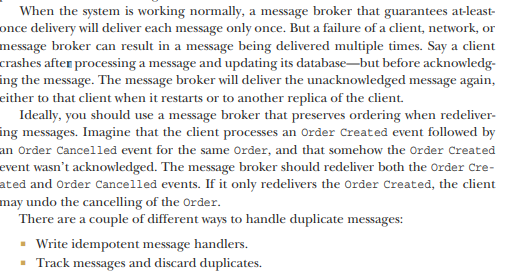

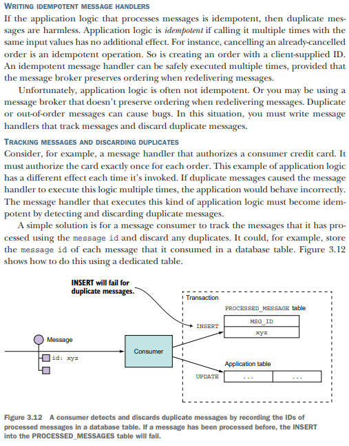

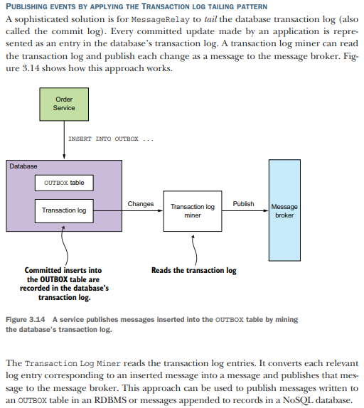

## Try to use asynchronous interaction styles

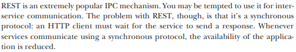

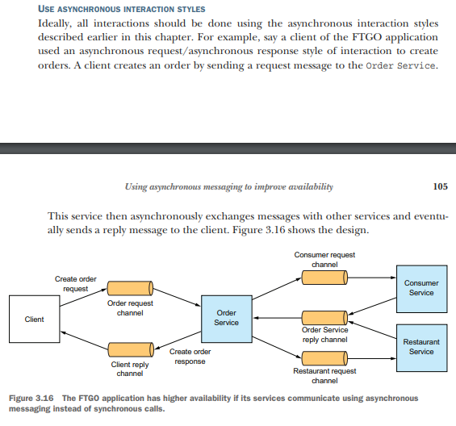

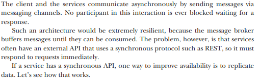

### Replicate data

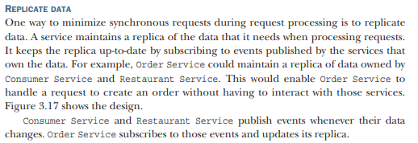

One drawback of replication is that it can sometimes require the replication of large amounts of data, which is
inefficient. For example, it may not be practical for Order Service to maintain a replica of the data owned by Consumer
Service, due to the large number of consumers.

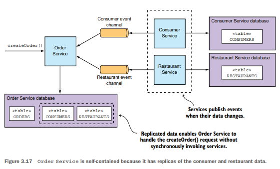

### Finish processing after returning a response

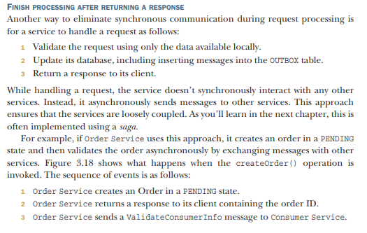

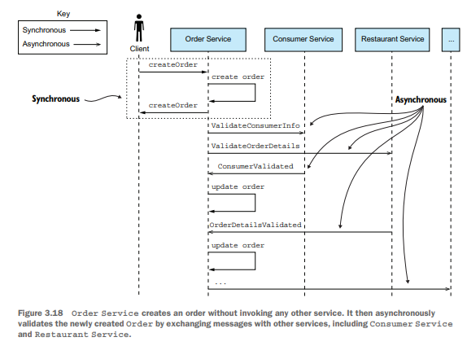

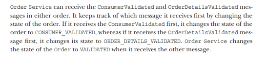

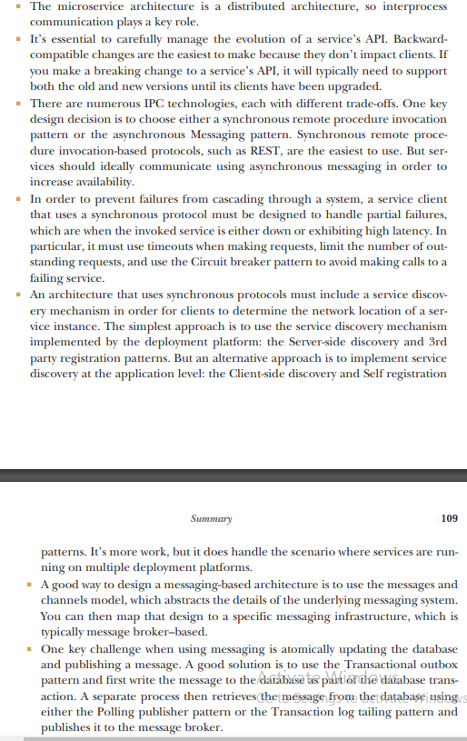
