# Managing transactions with sagas

## Using the Saga pattern to maintain data consistency

Sagas are mechanisms to maintain data consistency in a microservice architecture
without having to use distributed transactions. You define a saga for each system command that needs to update data in multiple services. A saga is a sequence of local
transactions. Each local transaction updates data within a single service using the
familiar ACID transaction frameworks and libraries.

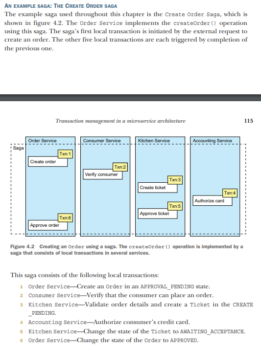

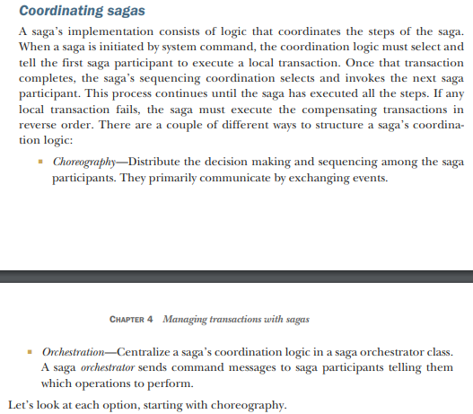

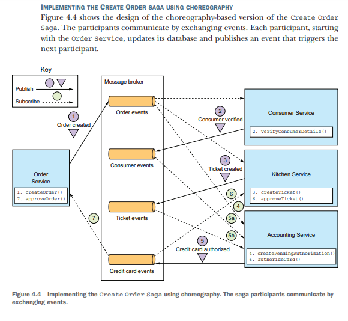

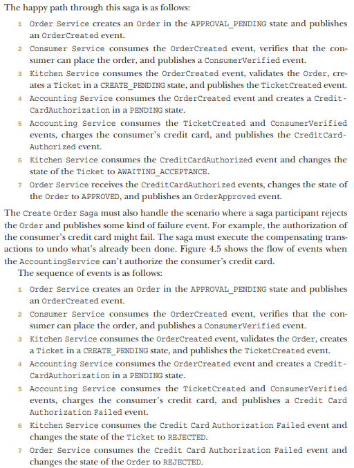

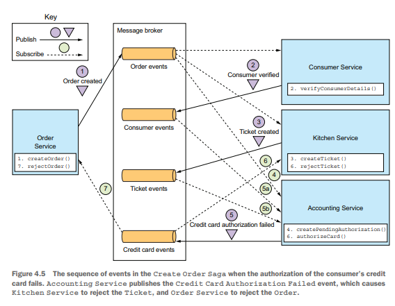

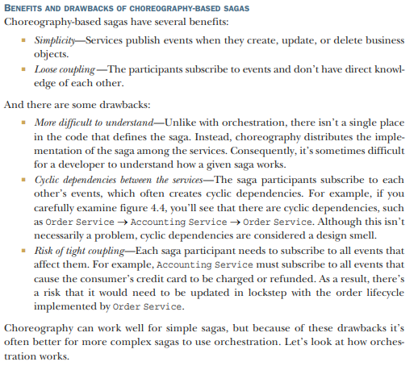

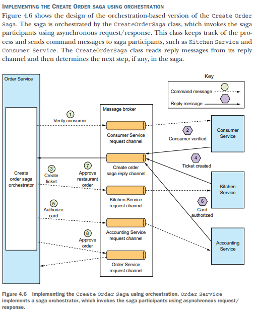

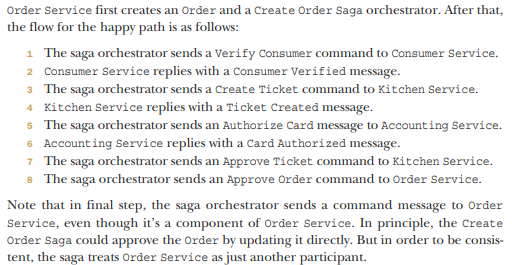

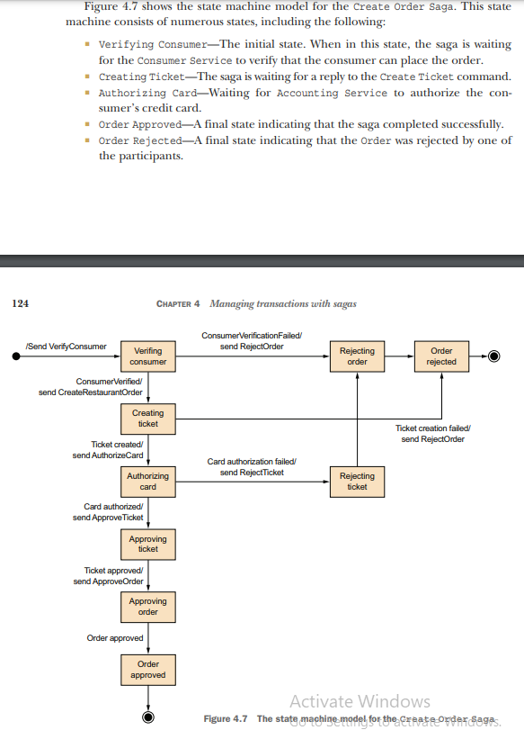

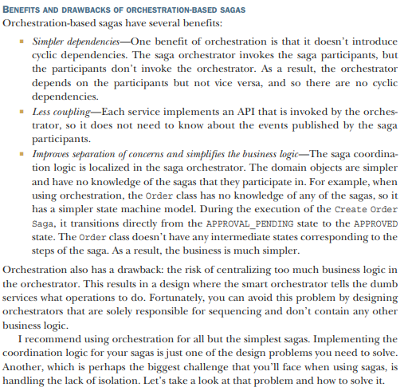

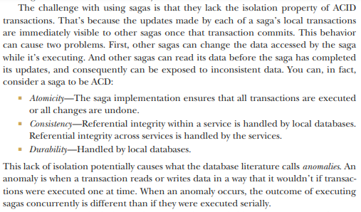

Countermeasures

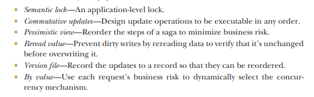

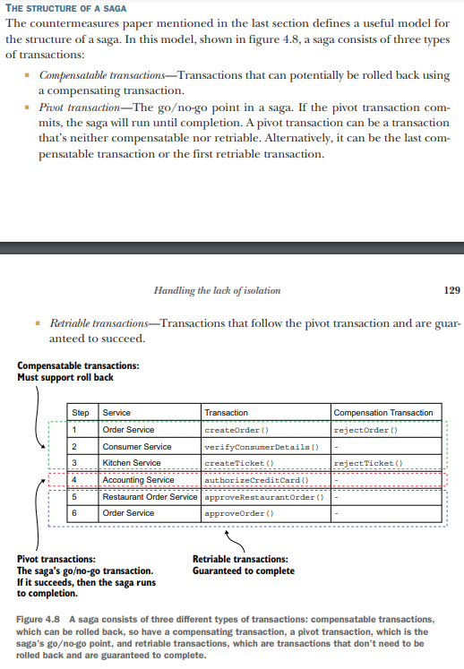

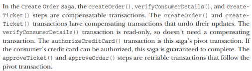

Semantic lock

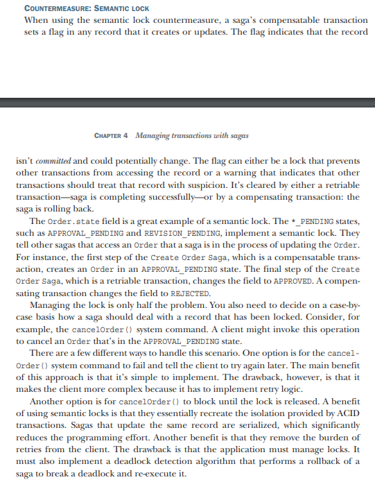

Commutative Updates

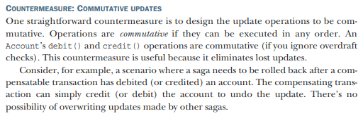

Pessimistic view

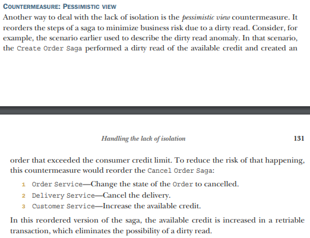

Reread value

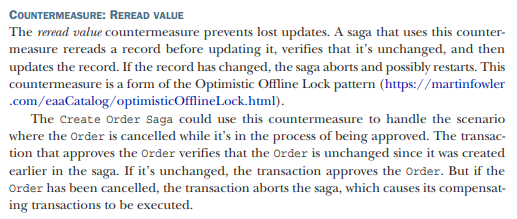

Version file

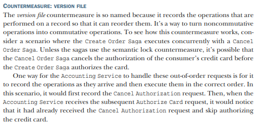

By value

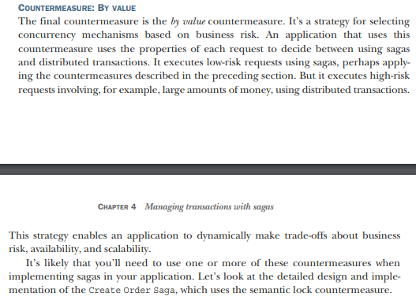

### Design of the Order Service and Create Order Saga

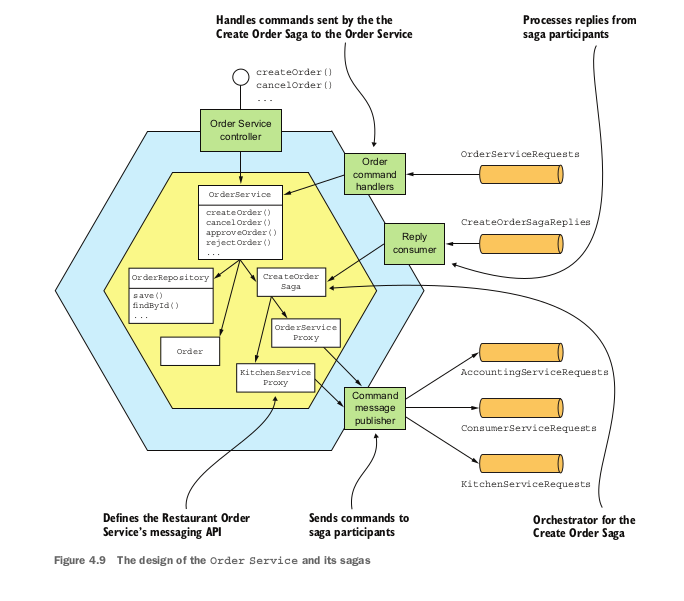

The service’s business logic consists of traditional business logic classes, such as Order Service 
and the Order entity. There are also saga orchestrator classes, including the CreateOrderSaga class,
which orchestrates Create Order Saga. Also, because Order Service participates in its
own sagas, it has an OrderCommandHandlers adapter class that handles command messages by invoking OrderService.
Some parts of Order Service should look familiar. As in a traditional application,
the core of the business logic is implemented by the OrderService, Order, and OrderRepository classes.
What’s less familiar about Order Service are the saga-related classes. This service is
both a saga orchestrator and a saga participant. Order Service has several saga orchestrators, such as CreateOrderSaga. The saga orchestrators send command messages to a
saga participant using a saga participant proxy class, such as KitchenServiceProxy and
OrderServiceProxy. A saga participant proxy defines a saga participant’s messaging
API. Order Service also has an OrderCommandHandlers class, which handles the command messages sent by sagas to Order Service.

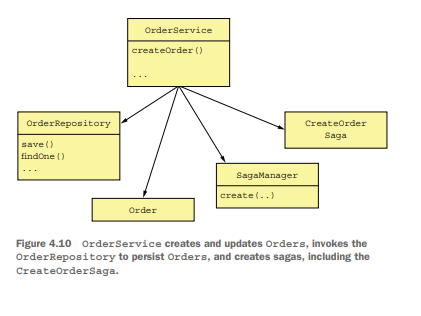

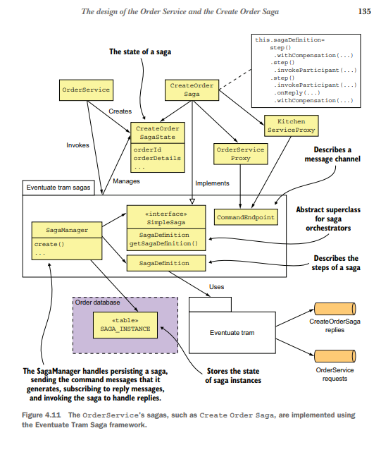

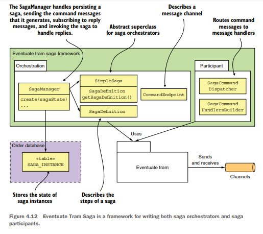

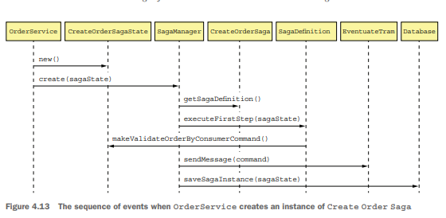

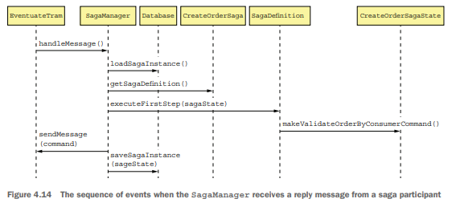

## Summary

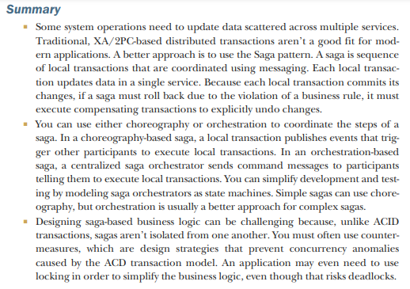
