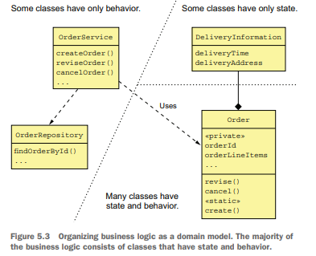
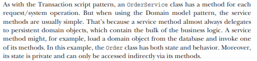
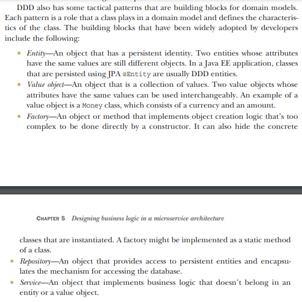
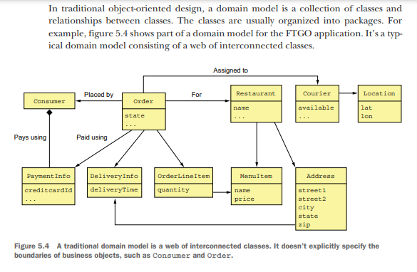
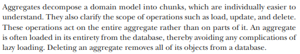
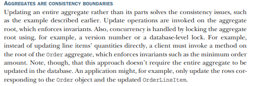
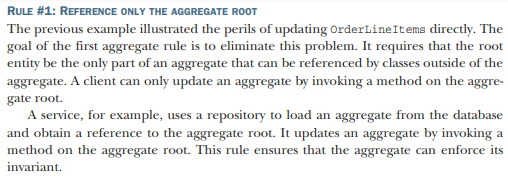
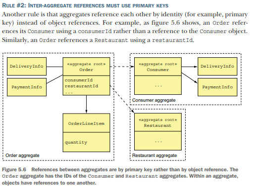
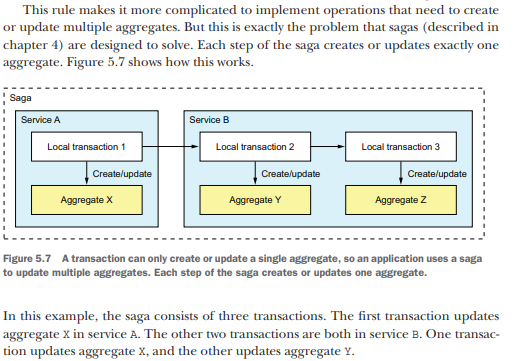

# Designing business logic in a microservice architecture

## Transaction script pattern for simple business logic

## Designing business logic using the Domain model pattern

Organize the business logic as an object model consisting of classes that have state
and behavior.

In an object-oriented design, the business logic consists of an object model, a network
of relatively small classes. These classes typically correspond directly to concepts from
the problem domain. In such a design some classes have only either state or behavior,
but many contain both, which is the hallmark of a well-designed class.

## Using DDD

### Designing a domain model using the DDD aggregate pattern

Organize a domain model as a collection of aggregates, each of which is a graph of
objects that can be treated as a unit.

An Order aggregate consists of
an Order entity, one or more OrderLineItem value objects, and other value objects
such as a delivery Address and PaymentInformation.

#### Aggregates must obey certain rules. 

-- RULE #1: REFERENCE ONLY THE AGGREGATE ROOT

-- RULE #2: INTER-AGGREGATE REFERENCES MUST USE PRIMARY KEYS

-- RULE #3: ONE TRANSACTION CREATES OR UPDATES ONE AGGREGATE

