# Designing business logic in a microservice architecture

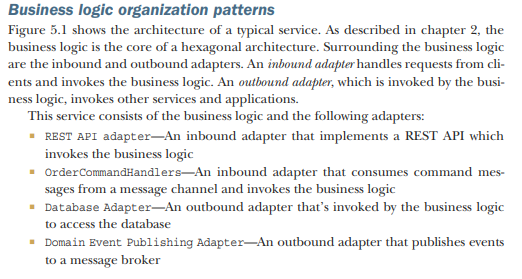

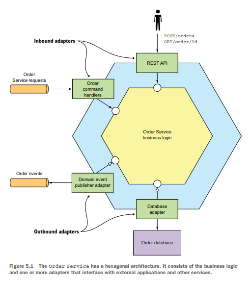

## Transaction script pattern for simple business logic

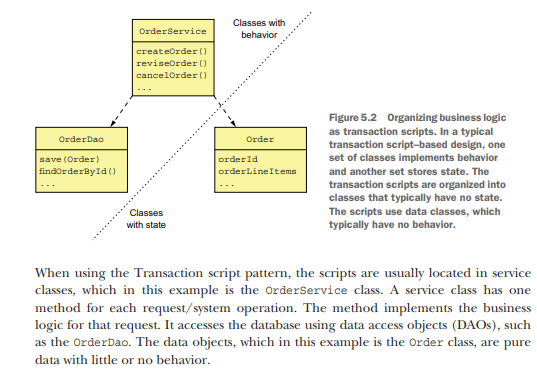

## Designing business logic using the Domain model pattern

Organize the business logic as an object model consisting of classes that have state and behavior.

In an object-oriented design, the business logic consists of an object model, a network of relatively small classes.
These classes typically correspond directly to concepts from the problem domain. In such a design some classes have only
either state or behavior, but many contain both, which is the hallmark of a well-designed class.

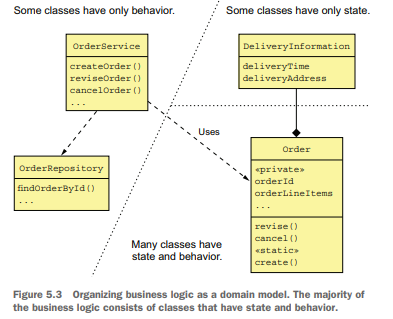

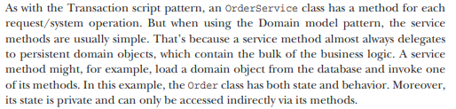

## Using DDD

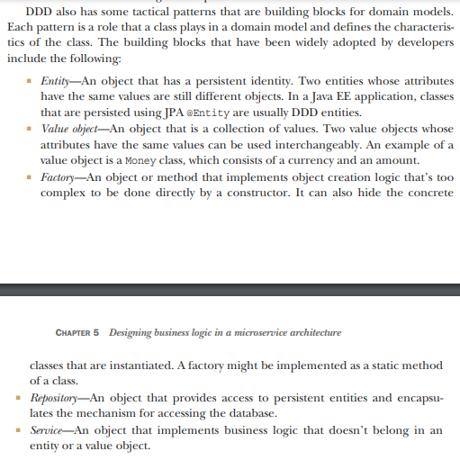

### Designing a domain model using the DDD aggregate pattern

Organize a domain model as a collection of aggregates, each of which is a graph of objects that can be treated as a
unit.

An Order aggregate consists of an Order entity, one or more OrderLineItem value objects, and other value objects such as
a delivery Address and PaymentInformation.

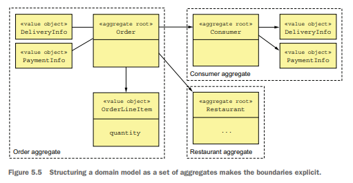

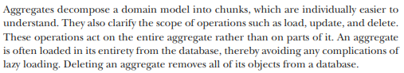

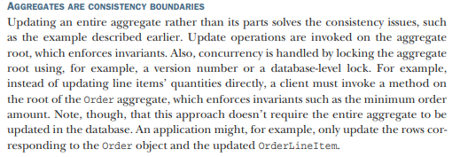

#### Aggregates must obey certain rules.

-- RULE #1: REFERENCE ONLY THE AGGREGATE ROOT

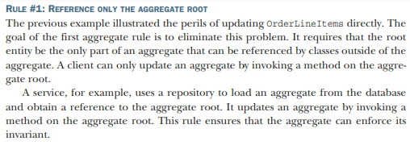

-- RULE #2: INTER-AGGREGATE REFERENCES MUST USE PRIMARY KEYS

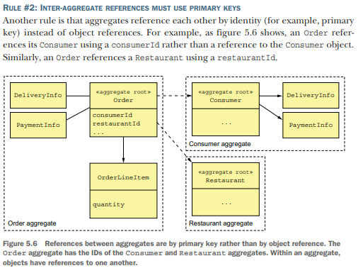

-- RULE #3: ONE TRANSACTION CREATES OR UPDATES ONE AGGREGATE

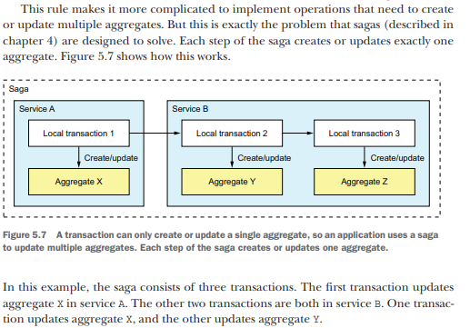

## Design business logic with aggregates

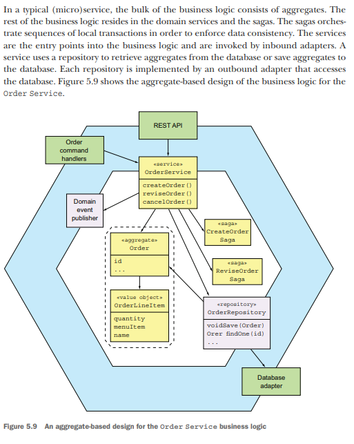

The business logic consists of the Order aggregate, the OrderService service class, the OrderRepository, and one or more
sagas. The OrderService invokes the OrderRepository to save and load Orders. For simple requests that are local to the
service, the service updates an Order aggregate.

## Publishing domain events

An aggregate publishes a domain event when it’s created or undergoes some other significant change

A domain event is a class with a name formed using a past-participle verb. It has properties that meaningfully convey
the event. Each property is either a primitive value or a value object. For example, an OrderCreated event class has an
orderId property. A domain event typically also has metadata, such as the event ID, and a timestamp. It might also have
the identity of the user who made the change, because that’s useful for auditing. The metadata can be part of the event
object, perhaps defined in a superclass. Alternatively, the event metadata can be in an envelope object that wraps the
event object. The ID of the aggregate that emitted the event might also be part of the envelope rather than an explicit
event property.

### Identifying domain events

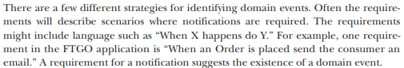

Another approach, which is increasing in popularity, is to use event storming. Event storming is an event-centric
workshop format for understanding a complex domain. It involves gathering domain experts in a room, lots of sticky
notes, and a very large surface—a whiteboard or paper roll—to stick the notes on.

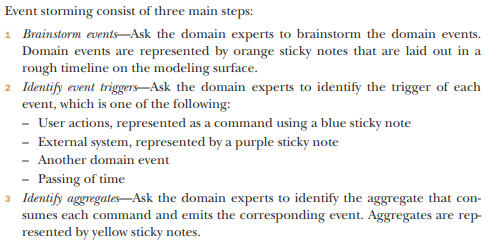

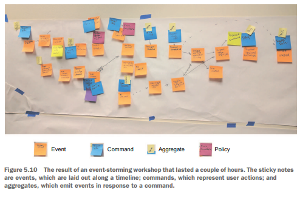

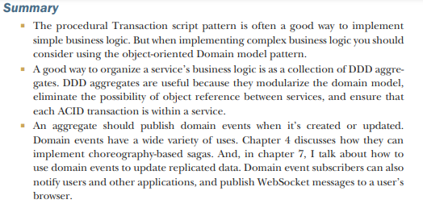
