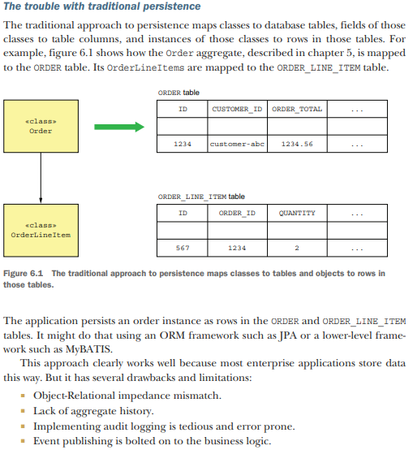
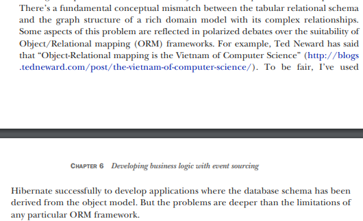

# Developing business logic with event sourcing

## Pattern: Event sourcing

    Persist an aggregate as a sequence of domain events that represent state changes.
    See http://microservices.io/patterns/data/event-sourcing.html.

## Troubles with traditional persistence

### Object-Relational Impedance Mismatch

