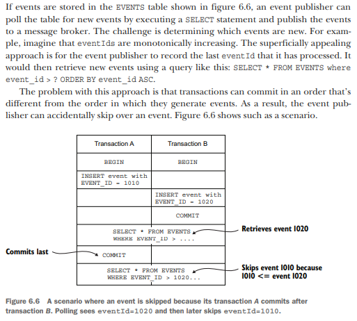

# Developing business logic with event sourcing

## Pattern: Event sourcing

    Persist an aggregate as a sequence of domain events that represent state changes.
    See http://microservices.io/patterns/data/event-sourcing.html.

Event sourcing is an event-centric technique for implementing business logic and persisting aggregates. An aggregate is
stored in the database as a series of events. Each event represents a state change of the aggregate. An aggregate’s
business logic is structured around the requirement to produce and consume these events.

## Troubles with traditional persistence

### Object-Relational Impedance Mismatch

### Lack of Aggregate history

### Implementing audit logging is tedious and error prone

### Event publishing is bolted on to the business logic

## Event Sourcing

Command method is a sequence of events that represent the state changes that must be made. These events are persisted in
the database and applied to the aggregate to update its state

Event sourcing refactors a command method into two or more methods. The first method takes a command object parameter,
which represents the request, and determines what state changes need to be performed. It validates its arguments, and
without changing the state of the aggregate, returns a list of events representing the state changes. This method
typically throws an exception if the command cannot be performed.

The other methods each take a particular event type as a parameter and update the aggregate. There’s one of these
methods for each event. It’s important to note that these methods can’t fail, because an event represents a state change
that has happened. Each method updates the aggregate based on the event.

### Event sourcing and publishing events

An event sourcing-based application can publish events using one of these mechanisms (polling and transaction log
tailing for publishing messages that are inserted into the database as part of a transaction). The main difference is
that it permanently stores events in an EVENTS table rather than temporarily saving events in an OUTBOX table and then
deleting them.

#### Using Polling

#### Using Transaction log tailing

More sophisticated event stores use transaction log tailing, which guarantees that events will be published and is also
more performant and scalable. For example, Eventuate Local, an open source event store, uses this approach. It reads
events inserted into an EVENTS table from the database transaction log and publishes them to the message broker.

