# Implementing queries in microservice architecture

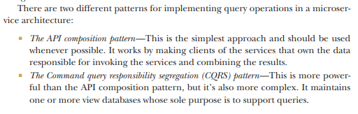

## Querying using the API composition pattern

It has two types of participants:

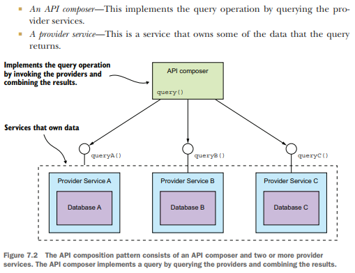

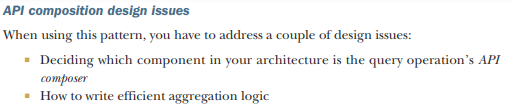

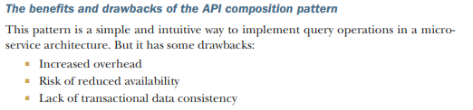

## Using the CQRS pattern

Common problems which CQRS solves

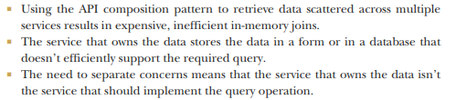

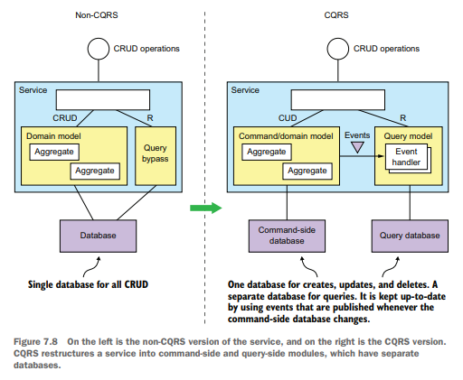

A separate query model handles the nontrivial queries. It’s much simpler than the command side because it’s not
responsible for implementing the business rules. The query side uses whatever kind of database makes sense for the
queries that it must support. The query side has event handlers that subscribe to domain events and update the database
or databases. There may even be multiple query models, one for each type of query

Example 

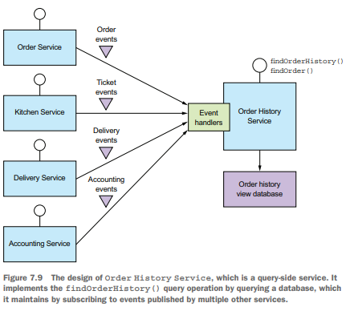

### Benefits

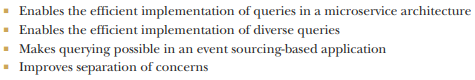

### Drawbacks

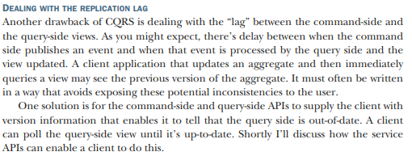

### Design

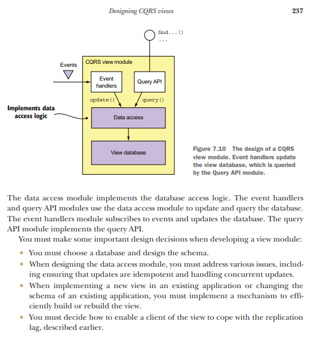

SQL vs NoSQL

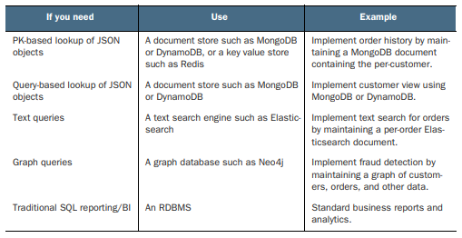

