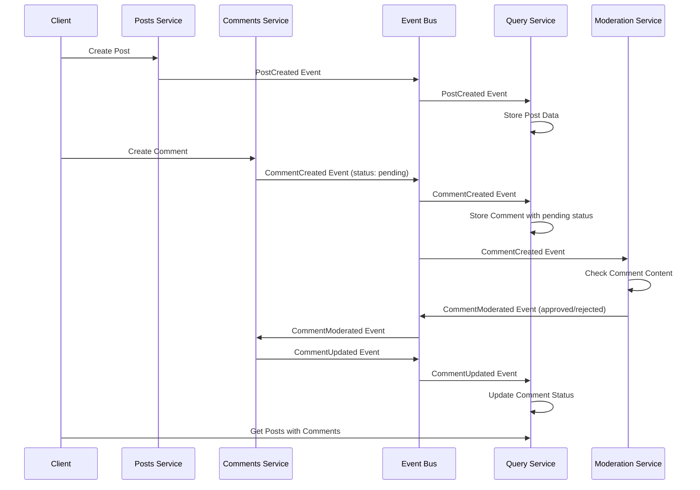

# Mini Microservices Blog Application

This project is a simple blog application built using a microservices architecture with Node.js and React. It serves as a learning example for understanding how microservices communicate and work together to form a complete application.

## Architecture Overview

The application follows an event-driven microservices architecture where each service is responsible for a specific domain and communicates with other services via an event bus. This approach allows each service to be developed, deployed, and scaled independently.

## Services

### Client (React Application)

- Frontend that interacts with all the other services
- Displays posts and their comments
- Allows users to create posts and add comments

### Posts Service (Port 4000)

- Responsible for creating and storing posts
- Exposes endpoints to create and retrieve posts
- Emits events when a post is created

### Comments Service (Port 4001)

- Manages comments for posts
- Exposes endpoints to create and retrieve comments for a specific post
- Emits events when a comment is created
- Updates comment status based on moderation results

### Query Service (Port 4002)

- Aggregates data from other services
- Maintains a local database of posts and their associated comments
- Provides efficient read operations for the client
- Listens for events to keep its data in sync

### Moderation Service (Port 4003)

- Responsible for moderating comment content
- Checks comments for inappropriate content (in this demo, rejects comments containing the word "orange")
- Emits events with moderation results

### Event Bus (Port 4005)

- Central component that facilitates communication between services
- Receives events from any service and broadcasts them to all other services
- Stores a history of all events for recovery purposes

## Event Flow Diagram

## Data Management

Each service maintains its own data store:

- **Posts Service**: Stores posts in memory (in a real application, this would be a database)
- **Comments Service**: Stores comments in memory, organized by post ID
- **Query Service**: Combines posts and comments data for efficient reads
- **Event Bus**: Maintains a history of all events for recovery

Data consistency across services is maintained through events. When a service creates or updates data, it emits an event that is broadcast to all other services, allowing them to update their local data stores accordingly.

## Event Types

The system uses the following event types for communication:

1. **PostCreated**: Emitted when a post is created, contains post ID and title
2. **CommentCreated**: Emitted when a comment is created, contains comment ID, content, post ID, and initial status
3. **CommentModerated**: Emitted when a comment has been moderated, contains updated status (approved/rejected)
4. **CommentUpdated**: Emitted when a comment status changes, updates the comment data in the query service

## Error Handling and Recovery

The system includes basic error handling and recovery mechanisms:

- Services use try/catch blocks when sending events to handle network failures
- The event bus stores all processed events
- The query service syncs with the event bus on startup to catch up on missed events
- Axios request failures are caught and logged without crashing the services

## Key Learning Points

This microservices architecture demonstrates several important concepts:

1. **Service Independence**: Each service can be developed, deployed, and scaled independently
2. **Data Autonomy**: Each service manages its own data
3. **Event-Driven Communication**: Services communicate asynchronously via events
4. **Eventual Consistency**: The system prioritizes availability over immediate consistency
5. **Single Responsibility**: Each service has a clear, focused responsibility
6. **Resilience**: Services can continue functioning independently even if other services are down

## Limitations of This Demo

This is a simplified learning example with some limitations:

- Data is stored in memory rather than persistent databases
- No authentication or authorization
- Limited error handling and retry logic
- No service discovery or API gateway
- No containerization or orchestration

In a production environment, these limitations would be addressed with additional components and practices.
