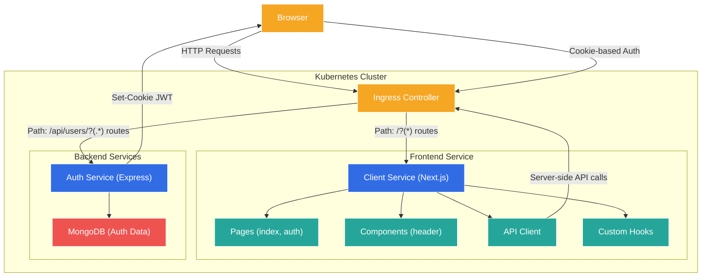
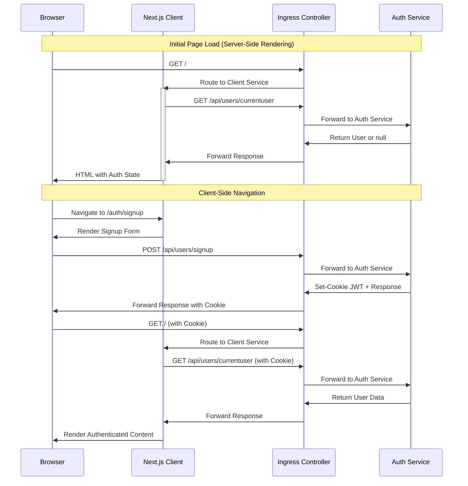

# Ticketing Application - Server-Side-Rendered React App Integration

A microservices-based ticketing platform built with Node.js, TypeScript, and Kubernetes, now featuring a server-side rendered React frontend for improved user experience and SEO.

## What's Changed from Version 9 (Testing Isolated Microservices)

Version 10 builds upon the testing infrastructure established in version 9, adding a complete frontend application with server-side rendering capabilities:

### Frontend Integration

- **Next.js-based Client Service**: Added a complete React frontend with SSR

  ```json
  "dependencies": {
    "axios": "^1.7.7",
    "bootstrap": "^5.3.3",
    "next": "^14.2.13",
    "react": "^18.3.1",
    "react-dom": "^18.3.1"
  }
  ```

- **Kubernetes Deployment**: Frontend deployed as a separate microservice

  ```yaml
  # in client-depl.yaml
  apiVersion: apps/v1
  kind: Deployment
  metadata:
    name: client-depl
  spec:
    # ...containers configuration...
  ---
  apiVersion: v1
  kind: Service
  metadata:
    name: client-srv
  # ...service configuration...
  ```

- **Ingress Configuration**: Updated to route non-API requests to the frontend

  ```yaml
  # in ingress-srv.yaml
  paths:
    - path: /api/users/?(.*)      # Auth service routes
      # ...backend configuration...
    - path: /?(.*)                # Client service routes (catch-all)
      # ...backend configuration...
  ```

### Application Architecture Changes

- **Server-Side Rendering**:

  ```javascript
  // in index.js
  LandingPage.getInitialProps = async context => {
    const client = buildClient(context);
    const { data } = await client.get('/api/users/currentuser');
    return data;
  };
  ```

- **Cross-Environment API Client**:

  ```javascript
  // in build-client.js
  export default ({ req }) => {
    if (typeof window === 'undefined') {
      // We are on the server
      return axios.create({
        baseURL: 'http://ingress-nginx-controller.ingress-nginx.svc.cluster.local',
        headers: req.headers,
      });
    } else {
      // We must be on the browser
      return axios.create({
        baseUrl: '/',
      });
    }
  };
  ```

- **Authentication Integration**:

  ```javascript
  // in _app.js
  const AppComponent = ({ Component, pageProps, currentUser }) => {
    return (
      <div>
        <Header currentUser={currentUser} />
        <Component {...pageProps} />
      </div>
    );
  };
  ```

## Architecture Overview

The application now follows a microservices architecture with a server-side rendered React frontend:



### Frontend-Backend Communication Flow



## Frontend Implementation

### Next.js Pages Structure

```
client/
├── pages/
│   ├── _app.js           # Global app wrapper
│   ├── index.js          # Landing page
│   └── auth/
│       ├── signin.js     # Sign in page
│       ├── signout.js    # Sign out page
│       └── signup.js     # Sign up page
├── components/
│   └── header.js         # Navigation header
├── hooks/
│   └── use-request.js    # API request hook
└── api/
    └── build-client.js   # Environment-aware API client
```

### Server-Side Rendering Implementation

Next.js provides server-side rendering through `getInitialProps`, which executes on both the server (for initial page loads) and the client (for client-side navigation):

```javascript
// Landing page with authentication-based content
const LandingPage = ({ currentUser }) => {
  return currentUser ? (
    <h1>You are signed in</h1>
  ) : (
    <h1>You are NOT signed in</h1>
  );
};

// Server-side data fetching
LandingPage.getInitialProps = async context => {
  const client = buildClient(context);
  const { data } = await client.get('/api/users/currentuser');
  return data;
};
```

In the custom App component, we fetch common data and merge it with page-specific data:

```javascript
AppComponent.getInitialProps = async appContext => {
  const client = buildClient(appContext.ctx);
  const { data } = await client.get('/api/users/currentuser');

  let pageProps = {};
  if (appContext.Component.getInitialProps) {
    pageProps = await appContext.Component.getInitialProps(appContext.ctx);
  }

  return {
    pageProps,
    ...data
  };
};
```

### Authentication Integration

The frontend integrates with the authentication service through:

1. **Auth-Aware Navigation**: Showing different links based on auth status

   ```javascript
   // in header.js
   const links = [
     !currentUser && { label: 'Sign Up', href: '/auth/signup' },
     !currentUser && { label: 'Sign In', href: '/auth/signin' },
     currentUser && { label: 'Sign Out', href: '/auth/signout' },
   ]
     .filter((linkConfig) => linkConfig)
     .map(({ label, href }) => {
       // Render navigation link
     });
   ```

2. **Form-Based Authentication**: Handling user credentials

   ```javascript
   // in auth/signup.js
   const { doRequest, errors } = useRequest({
     url: '/api/users/signup',
     method: 'post',
     body: {
       email,
       password
     },
     onSuccess: () => Router.push('/')
   });
   ```

3. **Error Handling**: Displaying validation errors from the API

   ```javascript
   // in use-request.js
   setErrors(
     <div className="alert alert-danger">
       <h4>Ooops....</h4>
       <ul className="my-0">
         {err.response.data.errors.map(err => (
           <li key={err.message}>{err.message}</li>
         ))}
       </ul>
     </div>
   );
   ```

## Cross-Service Communication

### Environment-Aware API Client

The `build-client.js` utility handles the different environments for API requests:

```javascript
export default ({ req }) => {
  if (typeof window === 'undefined') {
    // We are on the server
    return axios.create({
      baseURL: 'http://ingress-nginx-controller.ingress-nginx.svc.cluster.local',
      headers: req.headers,
    });
  } else {
    // We must be on the browser
    return axios.create({
      baseUrl: '/',
    });
  }
};
```

Key aspects:

- On the server, it uses the internal Kubernetes DNS for direct service communication
- On the browser, it uses relative paths which rely on ingress routing
- Request headers (including cookies) are forwarded from the original request on server-side

### Custom Request Hook

The `use-request.js` hook provides a reusable pattern for API requests:

```javascript
export default ({ url, method, body, onSuccess }) => {
  const [errors, setErrors] = useState(null);

  const doRequest = async () => {
    try {
      setErrors(null);
      const response = await axios[method](url, body);

      if (onSuccess) {
        onSuccess(response.data);
      }

      return response.data;
    } catch (err) {
      // Error handling code
    }
  };

  return { doRequest, errors };
};
```

Benefits:

- Consistent error handling across components
- Reusable success callback pattern
- Standardized API request format

## Infrastructure Configuration

### Kubernetes Deployment

The client service is deployed as a standalone Kubernetes service:

```yaml
# client-depl.yaml
apiVersion: apps/v1
kind: Deployment
metadata:
  name: client-depl
spec:
  replicas: 1
  selector:
    matchLabels:
      app: client
  template:
    metadata:
      labels:
        app: client
    spec:
      containers:
        - name: client
          image: rallycoding/ticketing-client
---
apiVersion: v1
kind: Service
metadata:
  name: client-srv
spec:
  selector:
    app: client
  ports:
    - name: client
      protocol: TCP
      port: 3000
      targetPort: 3000
```

### Ingress Configuration

The ingress controller routes requests based on path patterns:

```yaml
# ingress-srv.yaml
apiVersion: networking.k8s.io/v1
kind: Ingress
metadata:
  name: ingress-service
  annotations:
    nginx.ingress.kubernetes.io/use-regex: "true"
spec:
  ingressClassName: nginx
  rules:
    - host: ticketing.dev
      http:
        paths:
          - path: /api/users/?(.*)
            pathType: ImplementationSpecific
            backend:
              service:
                name: auth-srv
                port:
                  number: 3000
          - path: /?(.*)
            pathType: ImplementationSpecific
            backend:
              service:
                name: client-srv
                port:
                  number: 3000
```

Key changes:

- Added client service route as a catch-all pattern
- Auth service routes take precedence (more specific matching)
- All requests go through the same domain (ticketing.dev)

### Skaffold Development Configuration

Skaffold is configured to handle both backend and frontend services:

```yaml
# skaffold.yaml
apiVersion: skaffold/v4beta3
kind: Config
manifests:
  rawYaml:
    - ./infra/k8s/*
build:
  local:
    push: false
  artifacts:
    - image: rallycoding/auth
      context: auth
      # ... auth service config ...
    - image: rallycoding/ticketing-client
      context: client
      docker:
        dockerfile: Dockerfile
      sync:
        manual:
          - src: '**/*.js'
            dest: .
```

Features:

- Fast file syncing for JavaScript files
- Docker build for initial deployment
- Hot reloading for development

## Running the Application

### Prerequisites

1. **Docker Desktop** with Kubernetes enabled
2. **kubectl** command-line tool
3. **Skaffold** for development workflow
4. **Ingress-NGINX Controller** installed in your cluster

### Environment Setup

1. **Configure local hosts file**

Add this entry to your hosts file:

```
127.0.0.1 ticketing.dev
```

2. **Install NGINX Ingress Controller** (if not already installed)

```bash
kubectl apply -f https://raw.githubusercontent.com/kubernetes/ingress-nginx/controller-v1.8.2/deploy/static/provider/cloud/deploy.yaml
```

3. **Create JWT Secret**

```bash
kubectl create secret generic jwt-secret --from-literal=JWT_KEY=your_jwt_secret_key
```

### Running the Application

Start the development environment using Skaffold:

```bash
skaffold dev
```

Once everything is running, you can access the application at:

- <https://ticketing.dev/>

> **Note**: You may need to accept the self-signed certificate warning in your browser.

## Detailed System Architecture

### Request Flow

```
Browser Request
     │
     ▼
┌────────────┐
│  Ingress   │  Path-based routing
│ Controller │ 
└────────────┘
     │
     ├─────────────────┬───────────────┬─────────────────
     │                 │               │
     ▼                 ▼               ▼
┌────────────┐   ┌────────────┐   ┌────────────┐
│ Client Svc │   │  Auth Svc  │   │ Future Svcs│
│  (Next.js) │   │ (Express)  │   │            │
└────────────┘   └────────────┘   └────────────┘
     │                 │               │
     │                 ▼               │
     │           ┌────────────┐        │
     │           │  MongoDB   │        │
     │           │ (Auth DB)  │        │
     │           └────────────┘        │
     │                                 │
     └─────────────────┬───────────────┘
                       │
                       ▼
                 ┌────────────┐
                 │  Response  │
                 │ to Browser │
                 └────────────┘
```

### Authentication Flow

```
┌───────────┐   1. Request with no auth   ┌───────────┐
│  Browser  │ ───────────────────────────▶│  Next.js  │
└───────────┘                             └───────────┘
      │                                         │
      │                                         │ 2. getInitialProps
      │                                         │ requests currentUser
      │                                         ▼
      │                                   ┌───────────┐
      │                                   │   Auth    │
      │                                   │  Service  │
      │                                   └───────────┘
      │                                         │
      │                                         │ 3. Returns null for
      │                                         │ unauthenticated user
      │                                         ▼
      │                                   ┌───────────┐
      │ 4. Renders unauthenticated UI    │  Next.js  │
      │◀────────────────────────────────│           │
      │                                   └───────────┘
      │
      │ 5. User submits signup/signin form
      │────────────────────────────────────────────┐
      │                                            ▼
      │                                      ┌───────────┐
      │                                      │   Auth    │
      │                                      │  Service  │
      │                                      └───────────┘
      │                                            │
      │ 6. Returns JWT in cookie                   │
      │◀───────────────────────────────────────────┘
      │
      │ 7. Subsequent request with JWT cookie
      │────────────────────────────────────────────┐
      │                                            ▼
      │                                      ┌───────────┐
      │                                      │  Next.js  │
      │                                      └───────────┘
      │                                            │
      │                                            │ 8. getInitialProps
      │                                            │ requests currentUser
      │                                            │ with cookie
      │                                            ▼
      │                                      ┌───────────┐
      │                                      │   Auth    │
      │                                      │  Service  │
      │                                      └───────────┘
      │                                            │
      │                                            │ 9. Returns user data
      │                                            │ for authenticated user
      │                                            ▼
      │                                      ┌───────────┐
      │ 10. Renders authenticated UI         │  Next.js  │
      │◀───────────────────────────────────│           │
      │                                      └───────────┘
```

## Technical Challenges and Solutions

### Server vs. Browser Environment

**Challenge**: API requests need different base URLs depending on the environment.

**Solution**: Environment detection and conditional client creation:

```javascript
if (typeof window === 'undefined') {
  // Server-side code
} else {
  // Browser-side code
}
```

### Authentication Across Services

**Challenge**: Maintaining authentication state across separate microservices.

**Solution**:

1. Cookie-based JWT authentication
2. Header forwarding in server-side requests
3. Ingress controller routing with cookie preservation

### Server-Side Rendering with Authentication

**Challenge**: Rendering authenticated content during server-side rendering.

**Solution**:

1. `getInitialProps` to fetch auth state during SSR
2. Custom App component to provide global auth context
3. Conditional rendering based on auth state

## Future Enhancements

1. **Additional Frontend Features**
   - Ticket creation and management UI
   - User profile and settings
   - Responsive design improvements

2. **Performance Optimizations**
   - Static generation for suitable pages
   - Code splitting and lazy loading
   - Image optimization

3. **Enhanced Authentication**
   - Two-factor authentication
   - OAuth integrations
   - Role-based access control

4. **Extended Microservices**
   - Ticket service integration
   - Payment processing
   - Order management
   - Event notifications
