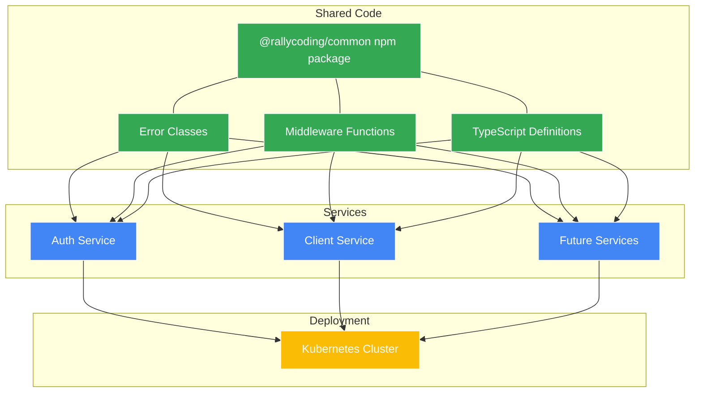
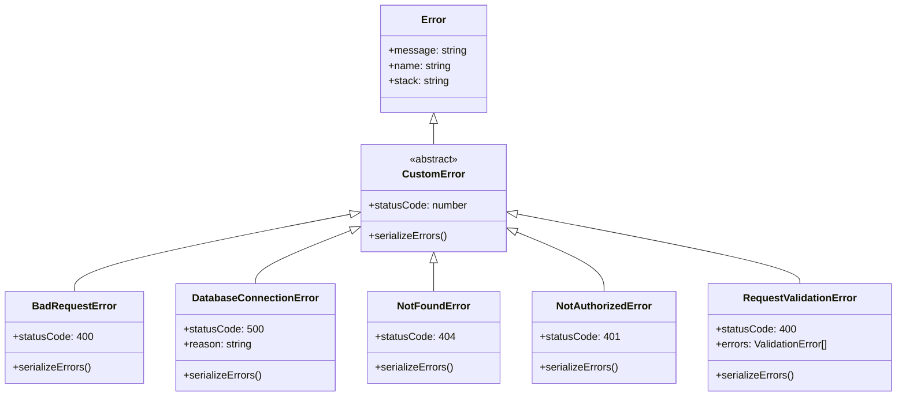
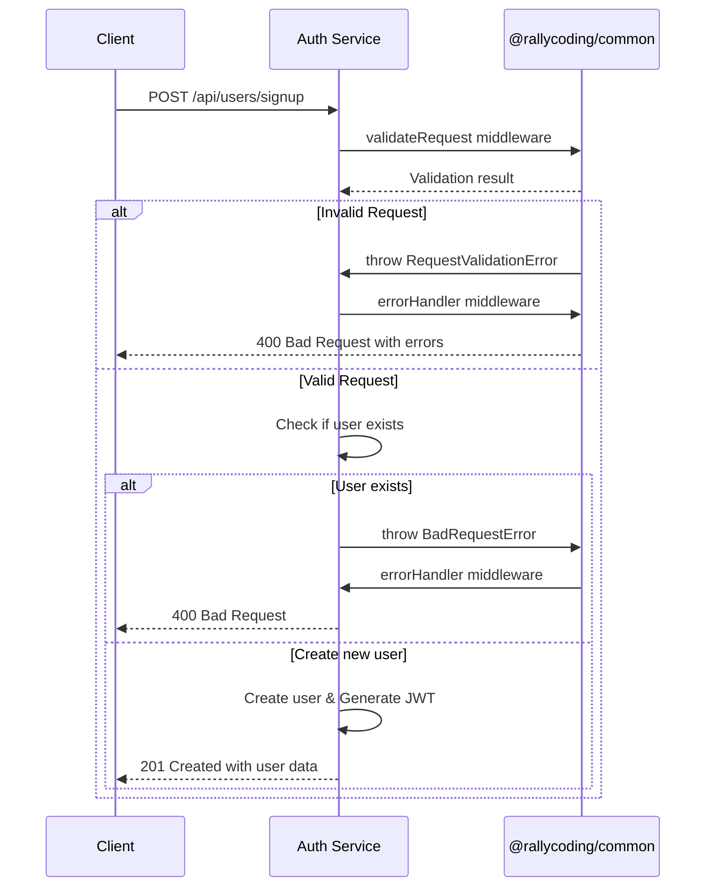
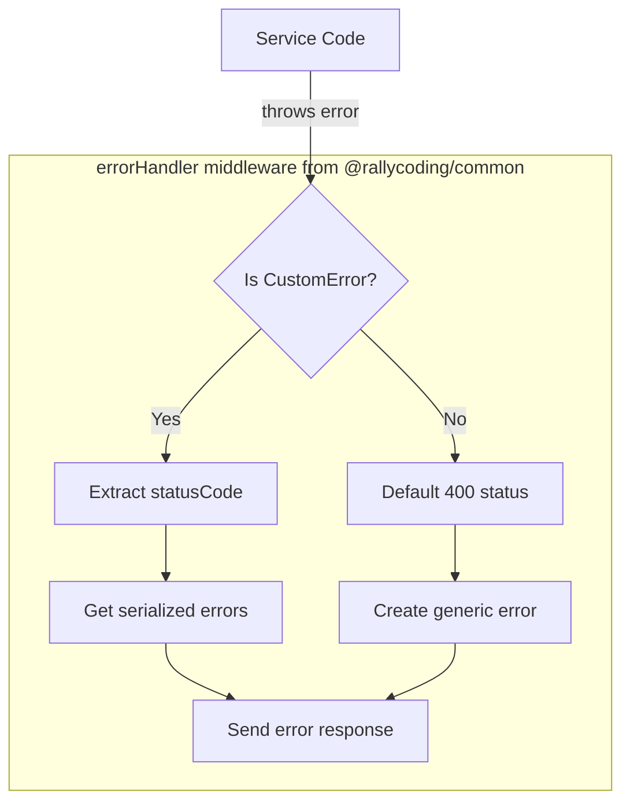
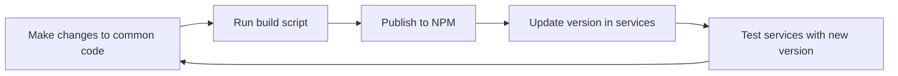

# Ticketing Application - Code Sharing and Reuse Between Services

A microservices-based ticketing platform built with Node.js, TypeScript, and Kubernetes, now featuring a shared code library for consistency and reusability across services.

## What's Changed from Version 10 (Server-Side-Rendered React App)

Version 11 builds upon the frontend integration established in version 10, adding a common code library to eliminate duplication and ensure consistency across microservices:

### Shared Code Library Creation

- **Common NPM Package**: Created a standalone reusable package

  ```json
  // in common/package.json
  {
    "name": "@rallycoding/common",
    "version": "3.0.3",
    "main": "./build/index.js",
    "types": "./build/index.d.ts",
    "files": [
      "build/**/*"
    ]
  }
  ```

- **Publishing Workflow**: Automated build and release process

  ```json
  "scripts": {
    "clean": "del ./build/*",
    "build": "npm run clean && tsc",
    "pub": "git add . && git commit -m \"Updates\" && npm version patch && npm run build && npm publish"
  }
  ```

- **Shared Code Extraction**: Moved common code from individual services

  ```typescript
  // in common/src/index.ts
  export * from './errors/bad-request-error';
  export * from './errors/custom-error';
  export * from './errors/database-connection-error';
  export * from './errors/not-authorized-error';
  export * from './errors/not-found-error';
  export * from './errors/request-validation-error';

  export * from './middlewares/current-user';
  export * from './middlewares/error-handler';
  export * from './middlewares/require-auth';
  export * from './middlewares/validate-request';
  ```

### Service Integration with Common Package

- **Dependency Updates**: Services now depend on the common package

  ```json
  // in auth/package.json
  "dependencies": {
    "@rallycoding/common": "^3.0.3",
    // other dependencies...
  }
  ```

- **Import Pattern Changes**: Imports now from common package

  ```typescript
  // Before (version 10) - local imports
  import { NotFoundError } from '../errors/not-found-error';
  
  // After (version 11) - package imports
  import { NotFoundError } from '@rallycoding/common';
  ```

- **Type Safety**: TypeScript declarations ensure correct usage

  ```typescript
  // Type definitions included in the package
  "types": "./build/index.d.ts"
  ```

## Architecture Overview

The application now implements a reusable code sharing architecture across microservices:



### Common Package Structure

```
common/
├── package.json        # NPM configuration
├── tsconfig.json       # TypeScript configuration
├── src/
│   ├── index.ts        # Public API exports
│   ├── errors/         # Error handling classes
│   │   ├── custom-error.ts
│   │   ├── bad-request-error.ts
│   │   ├── not-found-error.ts
│   │   └── ...
│   └── middlewares/    # Express middlewares
│       ├── current-user.ts
│       ├── error-handler.ts
│       ├── require-auth.ts
│       └── validate-request.ts
└── build/              # Compiled JavaScript (not in repo)
    ├── index.js
    ├── index.d.ts
    └── ...
```

## Shared Code Components

### Error Handling Architecture

The common package provides a standardized error handling system:

```typescript
// in common/src/errors/custom-error.ts
export abstract class CustomError extends Error {
  abstract statusCode: number;

  constructor(message: string) {
    super(message);
    Object.setPrototypeOf(this, CustomError.prototype);
  }

  abstract serializeErrors(): { message: string; field?: string }[];
}
```

Error hierarchy ensures consistent error responses across all services:



### Middleware Components

Shared middlewares ensure consistent request handling:

```typescript
// in common/src/middlewares/current-user.ts
export const currentUser = (
  req: Request,
  res: Response,
  next: NextFunction
) => {
  if (!req.session?.jwt) {
    return next();
  }

  try {
    const payload = jwt.verify(
      req.session.jwt,
      process.env.JWT_KEY!
    ) as UserPayload;
    req.currentUser = payload;
  } catch (err) {}

  next();
};
```

Type extensions ensure proper TypeScript integration:

```typescript
// Type definition for Express Request
declare global {
  namespace Express {
    interface Request {
      currentUser?: UserPayload;
    }
  }
}
```

## Service Integration

### Import Pattern

Services now import shared components from the common package:

```typescript
// in auth/src/app.ts
import express from 'express';
import 'express-async-errors';
import { json } from 'body-parser';
import cookieSession from 'cookie-session';
import { errorHandler, NotFoundError } from '@rallycoding/common';

// in auth/src/routes/current-user.ts
import express from 'express';
import { currentUser } from '@rallycoding/common';

// in auth/src/routes/signup.ts
import { validateRequest, BadRequestError } from '@rallycoding/common';
```

### Authentication Flow with Shared Code



### Error Handling Flow



## Benefits of the Common Package

### Consistency and Standardization

- **Error Handling**: Same error format across all services

  ```json
  // Example error response (same format in all services)
  {
    "errors": [
      {
        "message": "Email must be valid",
        "field": "email"
      }
    ]
  }
  ```

- **Middleware Behavior**: Authentication works identically everywhere
- **Type Definitions**: Consistent TypeScript interfaces across services

### Code Reuse Benefits

1. **Elimination of Duplication**:
   - Error classes not duplicated in each service
   - Middleware functions written once, used everywhere
   - Type definitions maintained in a single location

2. **Maintainability Improvements**:
   - Changes to shared code made in one place
   - All services automatically benefit from fixes
   - Reduced risk of divergent implementations

3. **Developer Experience**:
   - Consistent patterns across services
   - Clear import paths for common functionality
   - Less boilerplate code to write

## Development and Deployment Workflow

### NPM Package Development Cycle



### Publishing Process

```bash
# In the common package directory
npm run pub
```

This executes the following steps:

1. Stages changes (`git add .`)
2. Commits changes (`git commit -m "Updates"`)
3. Increments version (`npm version patch`)
4. Builds the package (`npm run build`)
5. Publishes to NPM (`npm publish`)

### Service Updates

After publishing a new common package version:

```bash
# In each service directory
npm update @rallycoding/common
```

## Architecture Patterns and Best Practices

### Domain-Driven Design (DDD) Principles

- **Shared Kernel**: Common package acts as a shared kernel with agreed-upon components
- **Bounded Contexts**: Each service maintains its own business logic
- **Ubiquitous Language**: Standardized terms through error types and middleware names

### Microservices Best Practices

- **Service Independence**: Services still deploy independently
- **Smart Endpoints, Dumb Pipes**: Logic in services, communication remains simple
- **Decentralized Governance**: Services can update common dependency on their schedule
- **Design for Failure**: Standardized error handling across services

### Clean Architecture Alignment

- **Dependency Rule**: Dependencies point inward (services depend on common core)
- **Separation of Concerns**: Error handling separate from business logic
- **Interface Segregation**: Clean, focused interfaces for middleware
- **Single Responsibility**: Each shared component does one thing well

## Running the Application

### Prerequisites

Same as version 10:

1. **Docker Desktop** with Kubernetes enabled
2. **kubectl** command-line tool
3. **Skaffold** for development workflow
4. **Ingress-NGINX Controller** installed in your cluster

### Starting the Application

```bash
# Start the application with Skaffold
skaffold dev
```

The application architecture remains the same from an operational perspective, with the key difference being the internal organization of code.

## Future Expansion Opportunities

### Additional Sharing Candidates

1. **Event Bus Abstractions**: Common interfaces for events
2. **Database Models**: Shared data structures
3. **Validation Schemas**: Common validation rules
4. **Testing Utilities**: Reusable test helpers
5. **Logging Framework**: Standardized logging

### Package Evolution

- Potential subpackages for different concerns
- More granular versioning for specific components
- Optional features for specialized services
- Better local development tools like workspaces

## Conclusion

Version 11 represents a significant architectural improvement through code sharing and reuse. While the external behavior of the system remains largely unchanged, the internal structure is now more maintainable, consistent, and follows software engineering best practices for shared code in a microservices architecture.
