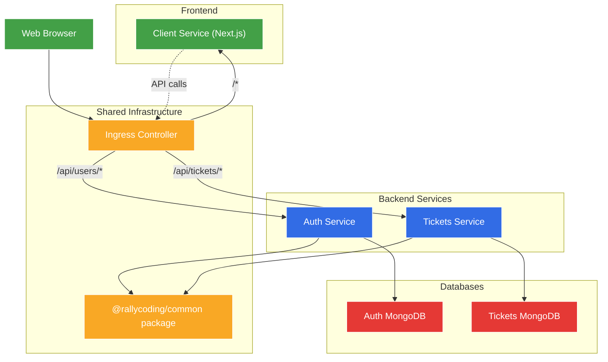
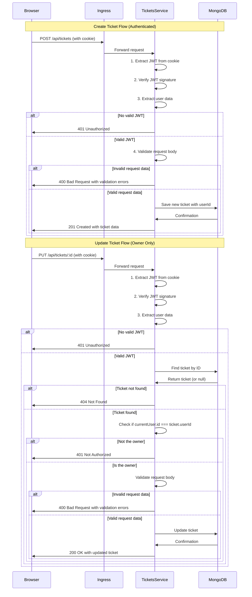

# Ticketing Application - Create-Read-Update-Destroy Server Setup

A microservices-based ticketing platform built with Node.js, TypeScript, and Kubernetes, now featuring a dedicated ticket management service with CRUD operations.

## What's Changed from Version 11 (Code Sharing and Reuse Between Services)

Version 12 builds upon the shared code architecture established in version 11, adding a complete tickets service with CRUD functionality:

### New Tickets Microservice

- **Complete Tickets Service**: Added a fully functional microservice for ticket management

  ```typescript
  // Ticket model
  interface TicketAttrs {
    title: string;
    price: number;
    userId: string;
  }
  
  // CRUD operations
  app.use(createTicketRouter);   // Create
  app.use(indexTicketRouter);    // Read (all)
  app.use(showTicketRouter);     // Read (one)
  app.use(updateTicketRouter);   // Update
  ```

- **CRUD API Endpoints**: Full REST API implementation

  ```
  POST   /api/tickets        - Create ticket (authenticated users only)
  GET    /api/tickets        - List all tickets (public)
  GET    /api/tickets/:id    - Get single ticket (public)
  PUT    /api/tickets/:id    - Update ticket (owner only)
  ```

- **MongoDB Database**: Dedicated database for ticket storage

  ```yaml
  # in tickets-mongo-depl.yaml
  apiVersion: apps/v1
  kind: Deployment
  metadata:
    name: tickets-mongo-depl
  # ...
  ```

### Infrastructure Enhancements

- **Updated Ingress Configuration**: Path-based routing for ticket APIs

  ```yaml
  # in ingress-srv.yaml
  paths:
    - path: /api/users/?(.*)      # Auth Service
      # ...
    - path: /api/tickets/?(.*)    # NEW: Tickets Service
      pathType: ImplementationSpecific
      backend:
        service:
          name: tickets-srv
          port:
            number: 3000
    - path: /?(.*)                # Client Service
      # ...
  ```

- **Environment Variables**: Configuration for ticket service

  ```typescript
  // in tickets/src/index.ts
  if (!process.env.JWT_KEY) {
    throw new Error('JWT_KEY must be defined');
  }
  if (!process.env.MONGO_URI) {
    throw new Error('MONGO_URI must be defined');
  }
  ```

### Authentication and Authorization

- **Authentication Requirements**: Creating tickets requires authentication

  ```typescript
  // in tickets/src/routes/new.ts
  router.post(
    '/api/tickets',
    requireAuth,  // User must be logged in
    [...validation],
    validateRequest,
    async (req: Request, res: Response) => {
      // Route logic
    }
  );
  ```

- **Authorization Rules**: Only ticket creators can update their tickets

  ```typescript
  // in tickets/src/routes/update.ts
  if (ticket.userId !== req.currentUser!.id) {
    throw new NotAuthorizedError();
  }
  ```

## Architecture Overview

The application now implements a more complete microservices architecture with business logic:



### Kubernetes Cluster Overview

```
┌────────────────────────── Kubernetes Cluster ──────────────────────────┐
│                                                                         │
│  ┌─────────────┐     ┌─────────────┐                                    │
│  │ Auth MongoDB│     │Tickets MongoDB│                                  │
│  └──────┬──────┘     └───────┬─────┘                                    │
│         │                    │                                          │
│  ┌──────┴──────┐     ┌───────┴─────┐                                    │
│  │ Auth Service │     │Tickets Service│                                 │
│  └──────┬──────┘     └───────┬─────┘                                    │
│         │                    │                                          │
│         └──────┬─────────────┘                                          │
│                │                                                        │
│         ┌──────┴──────┐                                                 │
│         │   Ingress   │                                                 │
│         │  Controller │                                                 │
│         └──────┬──────┘                                                 │
│                │                                                        │
│         ┌──────┴──────┐                                                 │
│         │Client Service│                                                │
│         └─────────────┘                                                 │
│                                                                         │
└─────────────────────────────────────────────────────────────────────────┘
               │
               │
       ┌───────┴───────┐
       │  Web Browser  │
       └───────────────┘
```

## Tickets Service Implementation

### Ticket Data Model

```typescript
// in tickets/src/models/ticket.ts
interface TicketAttrs {
  title: string;
  price: number;
  userId: string;
}

interface TicketDoc extends mongoose.Document {
  title: string;
  price: number;
  userId: string;
}

interface TicketModel extends mongoose.Model<TicketDoc> {
  build(attrs: TicketAttrs): TicketDoc;
}

const ticketSchema = new mongoose.Schema(
  {
    title: {
      type: String,
      required: true,
    },
    price: {
      type: Number,
      required: true,
    },
    userId: {
      type: String,
      required: true,
    },
  },
  {
    toJSON: {
      transform(doc, ret) {
        ret.id = ret._id;
        delete ret._id;
      },
    },
  }
);
```

### API Endpoints Implementation

#### Create Ticket (`POST /api/tickets`)

```typescript
// in tickets/src/routes/new.ts
router.post(
  '/api/tickets',
  requireAuth,
  [
    body('title').not().isEmpty().withMessage('Title is required'),
    body('price')
      .isFloat({ gt: 0 })
      .withMessage('Price must be greater than 0'),
  ],
  validateRequest,
  async (req: Request, res: Response) => {
    const { title, price } = req.body;

    const ticket = Ticket.build({
      title,
      price,
      userId: req.currentUser!.id,
    });
    await ticket.save();

    res.status(201).send(ticket);
  }
);
```

#### List All Tickets (`GET /api/tickets`)

```typescript
// in tickets/src/routes/index.ts
router.get('/api/tickets', async (req: Request, res: Response) => {
  const tickets = await Ticket.find({});
  res.send(tickets);
});
```

#### Get Single Ticket (`GET /api/tickets/:id`)

```typescript
// in tickets/src/routes/show.ts
router.get('/api/tickets/:id', async (req: Request, res: Response) => {
  const ticket = await Ticket.findById(req.params.id);

  if (!ticket) {
    throw new NotFoundError();
  }

  res.send(ticket);
});
```

#### Update Ticket (`PUT /api/tickets/:id`)

```typescript
// in tickets/src/routes/update.ts
router.put(
  '/api/tickets/:id',
  requireAuth,
  [
    body('title').not().isEmpty().withMessage('Title is required'),
    body('price')
      .isFloat({ gt: 0 })
      .withMessage('Price must be provided and must be greater than 0'),
  ],
  validateRequest,
  async (req: Request, res: Response) => {
    const ticket = await Ticket.findById(req.params.id);

    if (!ticket) {
      throw new NotFoundError();
    }

    if (ticket.userId !== req.currentUser!.id) {
      throw new NotAuthorizedError();
    }

    ticket.set({
      title: req.body.title,
      price: req.body.price,
    });
    await ticket.save();

    res.send(ticket);
  }
);
```

## Authentication and Authorization Flow

The ticketing application implements a consistent authentication and authorization flow across services:



### Request Processing Pipeline

```
User Request
    │
    ▼
┌─────────────────────┐
│ Ingress Controller  │
└─────────┬───────────┘
          │
          ▼
┌─────────────────────┐
│   Tickets Service   │
│                     │
│  ┌───────────────┐  │
│  │ Express App   │  │
│  │               │  │
│  │ Middleware:   │  │
│  │ 1. bodyParser │  │
│  │ 2. cookieSession│ │
│  │ 3. currentUser │ │
│  └───────┬───────┘  │
│          │          │
│          ▼          │
│  ┌───────────────┐  │
│  │Route Handlers │  │
│  │               │  │
│  │ - requireAuth │  │
│  │ - validation  │  │
│  │ - business    │  │
│  │   logic       │  │
│  └───────┬───────┘  │
│          │          │
│          ▼          │
│  ┌───────────────┐  │
│  │Error Handling │  │
│  │               │  │
│  │ - custom errors│  │
│  │ - serialization│ │
│  └───────┬───────┘  │
└─────────┬───────────┘
          │
          ▼
┌─────────────────────┐
│  MongoDB Database   │
└─────────────────────┘
```

## Public vs. Protected Routes

The ticketing service implements a clear separation between public and protected routes:

| Endpoint | Method | Authentication | Authorization | Purpose |
|----------|--------|----------------|--------------|---------|
| `/api/tickets` | POST | Required | Any authenticated user | Create a new ticket |
| `/api/tickets` | GET | Not required | Public | List all tickets |
| `/api/tickets/:id` | GET | Not required | Public | View a specific ticket |
| `/api/tickets/:id` | PUT | Required | Only ticket owner | Update a ticket |

## Infrastructure Configuration

### Kubernetes Deployment

The tickets service is deployed as a standalone Kubernetes service:

```yaml
# tickets-depl.yaml
apiVersion: apps/v1
kind: Deployment
metadata:
  name: tickets-depl
spec:
  replicas: 1
  selector:
    matchLabels:
      app: tickets
  template:
    metadata:
      labels:
        app: tickets
    spec:
      containers:
        - name: tickets
          image: rallycoding/tickets
          env:
            - name: MONGO_URI
              value: 'mongodb://tickets-mongo-srv:27017/tickets'
            - name: JWT_KEY
              valueFrom:
                secretKeyRef:
                  name: jwt-secret
                  key: JWT_KEY
---
apiVersion: v1
kind: Service
metadata:
  name: tickets-srv
spec:
  selector:
    app: tickets
  ports:
    - name: tickets
      protocol: TCP
      port: 3000
      targetPort: 3000
```

### MongoDB Deployment

Each service has its own MongoDB instance:

```yaml
# tickets-mongo-depl.yaml
apiVersion: apps/v1
kind: Deployment
metadata:
  name: tickets-mongo-depl
spec:
  replicas: 1
  selector:
    matchLabels:
      app: tickets-mongo
  template:
    metadata:
      labels:
        app: tickets-mongo
    spec:
      containers:
        - name: tickets-mongo
          image: mongo
---
apiVersion: v1
kind: Service
metadata:
  name: tickets-mongo-srv
spec:
  selector:
    app: tickets-mongo
  ports:
    - name: db
      protocol: TCP
      port: 27017
      targetPort: 27017
```

### Ingress Configuration

The ingress controller routes requests based on path patterns:

```yaml
# ingress-srv.yaml
apiVersion: networking.k8s.io/v1
kind: Ingress
metadata:
  name: ingress-service
  annotations:
    nginx.ingress.kubernetes.io/use-regex: "true"
spec:
  ingressClassName: nginx
  rules:
    - host: ticketing.dev
      http:
        paths:
          - path: /api/users/?(.*)
            pathType: ImplementationSpecific
            backend:
              service:
                name: auth-srv
                port:
                  number: 3000
          - path: /api/tickets/?(.*)
            pathType: ImplementationSpecific
            backend:
              service:
                name: tickets-srv
                port:
                  number: 3000
          - path: /?(.*)
            pathType: ImplementationSpecific
            backend:
              service:
                name: client-srv
                port:
                  number: 3000
```

### Skaffold Development Configuration

Skaffold is configured to handle all services:

```yaml
# skaffold.yaml
apiVersion: skaffold/v4beta3
kind: Config
manifests:
  rawYaml:
    - ./infra/k8s/*
build:
  local:
    push: false
  artifacts:
    - image: rallycoding/auth
      context: auth
      # ...
    - image: rallycoding/ticketing-client
      context: client
      # ...
    - image: rallycoding/tickets
      context: tickets
      # ...
```

## Data Consistency and Service Boundaries

### Service Responsibilities

| Service | Responsibility | Data Owned |
|---------|----------------|------------|
| Auth | User authentication and management | User accounts, credentials |
| Tickets | Ticket CRUD operations | Ticket data (title, price, ownership) |
| Client | User interface and interaction | None (stateless) |

### Data Isolation

- Each service has its own MongoDB database
- No direct cross-database queries
- Clear ownership of data models
- No service-to-service API calls yet

### Current Limitations

- No data consistency guarantees across services
- User must exist in Auth service to create tickets, but no verification
- No event-based coordination for data changes
- Client needs to handle potential data inconsistencies

## Running the Application

### Prerequisites

1. **Docker Desktop** with Kubernetes enabled
2. **kubectl** command-line tool
3. **Skaffold** for development workflow
4. **Ingress-NGINX Controller** installed in your cluster

### Environment Setup

1. **Configure local hosts file**

Add this entry to your hosts file:

```
127.0.0.1 ticketing.dev
```

2. **Install NGINX Ingress Controller** (if not already installed)

```bash
kubectl apply -f https://raw.githubusercontent.com/kubernetes/ingress-nginx/controller-v1.8.2/deploy/static/provider/cloud/deploy.yaml
```

3. **Create JWT Secret**

```bash
kubectl create secret generic jwt-secret --from-literal=JWT_KEY=your_jwt_secret_key
```

### Starting the Application

Start the development environment using Skaffold:

```bash
skaffold dev
```

Once everything is running, you can access the application at:

- <https://ticketing.dev/>
