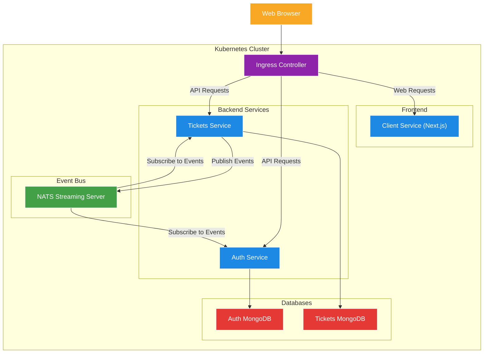
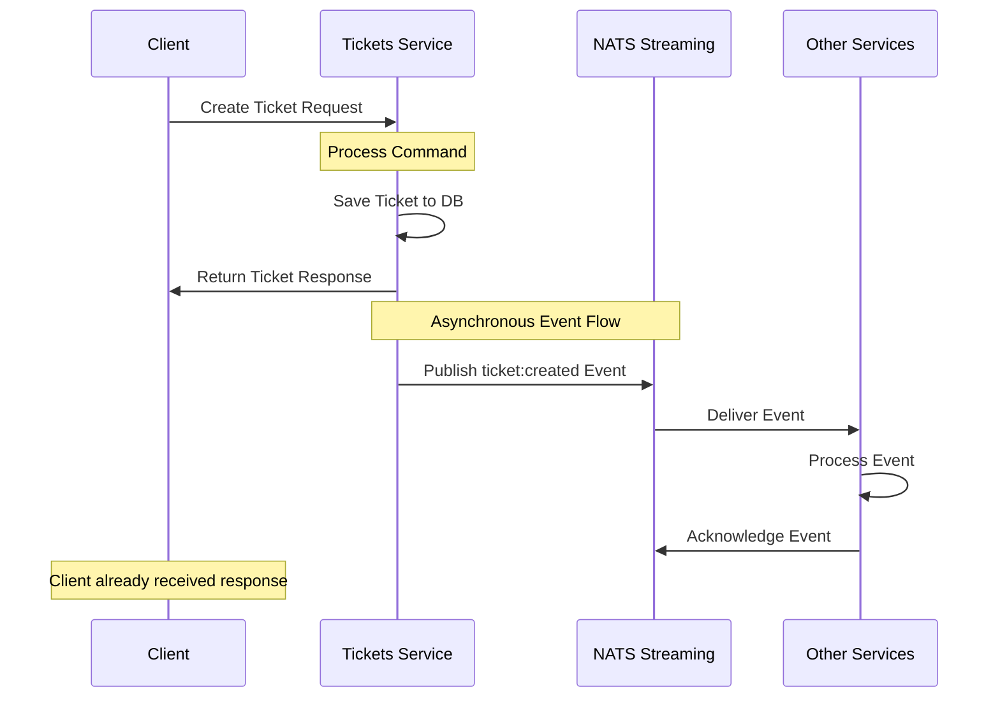

# Ticketing Application - NATS Streaming Server Event Bus Implementation

A microservices-based ticketing platform built with Node.js, TypeScript, and Kubernetes, now featuring an event bus implementation with NATS Streaming Server for asynchronous communication between services.

## What's Changed from Version 12 (Create-Read-Update-Destroy Server Setup)

Version 13 builds upon the CRUD functionality established in version 12, adding an event bus implementation with NATS Streaming Server:

### Event Bus Integration

- **NATS Streaming Server**: Added as a central message broker for event-based communication
  ```yaml
  # in nats-depl.yaml
  containers:
    - name: nats
      image: nats-streaming:0.17.0
      args:
        [
          '-p', '4222',      # Client port
          '-m', '8222',      # HTTP monitoring port
          '-hbi', '5s',      # Heartbeat interval
          '-hbt', '5s',      # Heartbeat timeout
          '-hbf', '2',       # Heartbeat failures before inactive
          '-SD',             # Stand-alone mode
          '-cid', 'ticketing', # Cluster ID
        ]
  ```

- **Test Implementation**: Created `nats-test` directory with publisher and listener examples
  ```typescript
  // Publisher example
  const stan = nats.connect('ticketing', 'abc', {
    url: 'http://localhost:4222',
  });

  stan.on('connect', () => {
    console.log('Publisher connected to NATS');
    
    const data = JSON.stringify({
      id: '123',
      title: 'concert',
      price: 20,
    });
    
    stan.publish('ticket:created', data, () => {
      console.log('Event published');
    });
  });
  ```

### Reliability Features

- **Durable Subscriptions**: Remembers subscriber position even after disconnection
  ```typescript
  const options = stan
    .subscriptionOptions()
    .setManualAckMode(true)
    .setDeliverAllAvailable()
    .setDurableName('accounting-service');
  ```

- **Manual Acknowledgment**: Ensures message processing before completion
  ```typescript
  subscription.on('message', (msg: Message) => {
    const data = msg.getData();
    console.log(`Received event #${msg.getSequence()}, with data: ${data}`);
    msg.ack();
  });
  ```

- **Queue Groups**: Distributes messages among service instances
  ```typescript
  const subscription = stan.subscribe(
    'ticket:created',
    'queue-group-name',
    options
  );
  ```

- **Graceful Shutdown**: Proper connection cleanup on process termination
  ```typescript
  stan.on('close', () => {
    console.log('NATS connection closed!');
    process.exit();
  });
  
  process.on('SIGINT', () => stan.close());
  process.on('SIGTERM', () => stan.close());
  ```

## Architecture Overview

The application has evolved from a purely HTTP-based architecture to a hybrid architecture that combines synchronous HTTP communication with asynchronous event-based communication:



### Communication Patterns

The system now supports two distinct communication patterns:

1. **Synchronous HTTP Communication**:
   - Client to Service via REST API
   - Used for user-initiated commands and queries
   - Direct request-response pattern
   - Handled by the Ingress Controller

2. **Asynchronous Event Communication**:
   - Service to Service via Event Bus
   - Used for cross-service data synchronization
   - Publish-subscribe pattern
   - Handled by NATS Streaming Server

## NATS Streaming Server Implementation

### Server Deployment

NATS Streaming Server is deployed as a standalone service in the Kubernetes cluster:

```yaml
# nats-depl.yaml
apiVersion: apps/v1
kind: Deployment
metadata:
  name: nats-depl
spec:
  replicas: 1
  selector:
    matchLabels:
      app: nats
  template:
    metadata:
      labels:
        app: nats
    spec:
      containers:
        - name: nats
          image: nats-streaming:0.17.0
          args:
            [
              '-p', '4222',      # Client port
              '-m', '8222',      # HTTP monitoring port
              '-hbi', '5s',      # Heartbeat interval
              '-hbt', '5s',      # Heartbeat timeout
              '-hbf', '2',       # Heartbeat failures before inactive
              '-SD',             # Stand-alone mode
              '-cid', 'ticketing', # Cluster ID
            ]
---
apiVersion: v1
kind: Service
metadata:
  name: nats-srv
spec:
  selector:
    app: nats
  ports:
    - name: client
      protocol: TCP
      port: 4222
      targetPort: 4222
    - name: monitoring
      protocol: TCP
      port: 8222
      targetPort: 8222
```

Key configuration parameters:
- Client port 4222 for NATS client connections
- Monitoring port 8222 for HTTP monitoring
- Heartbeat settings for detecting client disconnections
- Cluster ID 'ticketing' used by clients to connect
- Stand-alone mode for simple deployment

### Publisher Implementation

Publishers are responsible for sending events to NATS Streaming Server:

```typescript
// in publisher.ts
import nats from 'node-nats-streaming';

console.clear();

// Connect to NATS
const stan = nats.connect('ticketing', 'abc', {
  url: 'http://localhost:4222',
});

stan.on('connect', () => {
  console.log('Publisher connected to NATS');

  // Create event data
  const data = JSON.stringify({
    id: '123',
    title: 'concert',
    price: 20,
  });

  // Publish event to channel
  stan.publish('ticket:created', data, () => {
    console.log('Event published');
  });
});
```

Key aspects:
- Connect with client ID and cluster ID
- Serialize data as JSON string
- Publish to named channels (e.g., 'ticket:created')
- Callback function for publishing confirmation

### Listener Implementation

Listeners subscribe to events from NATS Streaming Server:

```typescript
// in listener.ts
import nats, { Message } from 'node-nats-streaming';
import { randomBytes } from 'crypto';

console.clear();

// Connect to NATS with random client ID
const stan = nats.connect('ticketing', randomBytes(4).toString('hex'), {
  url: 'http://localhost:4222',
});

stan.on('connect', () => {
  console.log('Listener connected to NATS');

  // Handle connection close
  stan.on('close', () => {
    console.log('NATS connection closed!');
    process.exit();
  });

  // Configure subscription options
  const options = stan
    .subscriptionOptions()
    .setManualAckMode(true)
    .setDeliverAllAvailable()
    .setDurableName('accounting-service');

  // Create subscription
  const subscription = stan.subscribe(
    'ticket:created',
    'queue-group-name',
    options
  );

  // Handle incoming messages
  subscription.on('message', (msg: Message) => {
    const data = msg.getData();

    if (typeof data === 'string') {
      console.log(`Received event #${msg.getSequence()}, with data: ${data}`);
    }

    // Acknowledge message processing
    msg.ack();
  });
});

// Graceful shutdown handlers
process.on('SIGINT', () => stan.close());
process.on('SIGTERM', () => stan.close());
```

Key aspects:
- Random client ID generation for unique identification
- Manual acknowledgment mode for reliable processing
- Durable subscriptions to resume from last position
- Queue groups for load balancing across instances
- Graceful shutdown handling

## Event Flow Sequence

The following sequence diagram illustrates the event flow in the system:



This pattern provides several advantages:
- Client gets immediate response after initial processing
- Cross-service communication happens asynchronously
- Services can process events at their own pace
- System remains responsive even during event processing

## Reliability Patterns

### Manual Acknowledgment

Messages aren't considered processed until explicitly acknowledged:

```typescript
subscription.on('message', (msg: Message) => {
  // Process message
  console.log(`Received event #${msg.getSequence()}, with data: ${data}`);
  
  // Acknowledge successful processing
  msg.ack();
});
```

- Prevents message loss during processing failures
- Creates at-least-once delivery guarantee
- Service can process message and then acknowledge
- If service crashes before acknowledging, message is redelivered

### Durable Subscriptions

Subscription position is maintained even when clients disconnect:

```typescript
const options = stan
  .subscriptionOptions()
  .setDurableName('accounting-service')
```

- NATS tracks message delivery for this subscription
- Service can resume from last acknowledged message after restart
- Named by service function (e.g., 'accounting-service')
- Prevents duplicate processing after reconnection

### Queue Groups

Multiple instances of the same service share a queue group:

```typescript
stan.subscribe('ticket:created', 'queue-group-name', options)
```

- Messages distributed among group members (load balancing)
- Only one instance in the group processes each message
- If one instance fails, others continue processing
- Essential for horizontal scaling

### Graceful Shutdown

Proper connection cleanup on process termination:

```typescript
stan.on('close', () => {
  console.log('NATS connection closed!');
  process.exit();
});

process.on('SIGINT', () => stan.close());
process.on('SIGTERM', () => stan.close());
```

- Cleanly closes NATS connection before exit
- Handles container orchestration termination signals
- Allows NATS server to cleanup client resources
- Prevents message loss during shutdown

## Running the Test Implementation

The `nats-test` directory contains a standalone implementation for testing NATS functionality:

```bash
# Start the publisher (in one terminal)
npm run publish

# Start the listener (in another terminal)
npm run listen
```

These scripts are defined in package.json:

```json
"scripts": {
  "publish": "ts-node-dev --rs --notify false src/publisher.ts",
  "listen": "ts-node-dev --rs --notify false src/listener.ts"
}
```

To test with the Kubernetes deployment:
1. Forward the NATS ports to your local machine:
   ```bash
   kubectl port-forward nats-depl-[pod-id] 4222:4222 8222:8222
   ```
2. Run the publisher and listener scripts
3. Observe events flowing through the system

## Advanced Patterns and Future Extensions

The NATS Streaming Server integration enables several advanced patterns:

### Event Sourcing

- Store all domain events in chronological order
- Rebuild application state by replaying events
- Use `.setDeliverAllAvailable()` for event replay
- Enable full history tracking and reconstruction

### Command-Query Responsibility Segregation (CQRS)

- Separate command (write) and query (read) models
- Commands update primary database and publish events
- Events update read models optimized for queries
- Provides optimal performance for different operation types

### Saga Pattern for Distributed Transactions

- Coordinate multi-step business processes across services
- Each step publishes events for the next step
- Compensating transactions for rollback
- Maintain data consistency across services

### Event Versioning and Schema Evolution

- Include version information in events
- Handle backward compatibility
- Allow services to evolve independently
- Support gradual schema migration

## Running the Application

### Prerequisites

1. **Docker Desktop** with Kubernetes enabled
2. **kubectl** command-line tool
3. **Skaffold** for development workflow
4. **Ingress-NGINX Controller** installed in your cluster

### Environment Setup

1. **Configure local hosts file**
   ```
   127.0.0.1 ticketing.dev
   ```

2. **Install NGINX Ingress Controller** (if not already installed)
   ```bash
   kubectl apply -f https://raw.githubusercontent.com/kubernetes/ingress-nginx/controller-v1.8.2/deploy/static/provider/cloud/deploy.yaml
   ```

3. **Create JWT Secret**
   ```bash
   kubectl create secret generic jwt-secret --from-literal=JWT_KEY=your_jwt_secret_key
   ```

### Starting the Application

Start the development environment using Skaffold:

```bash
skaffold dev
```

This will start all services, including the NATS Streaming Server.

## Monitoring NATS Streaming

NATS Streaming Server provides a monitoring endpoint on port 8222:

1. Forward the monitoring port:
   ```bash
   kubectl port-forward nats-depl-[pod-id] 8222:8222
   ```

2. Access the monitoring interface:
   ```
   http://localhost:8222/streaming
   ```

3. View detailed metrics:
   - Channel information
   - Subscription details
   - Client connections
   - Message rates and counts

## Conclusion

Version 13 of the ticketing application represents a significant architectural evolution with the introduction of NATS Streaming Server as an event bus. This lays the foundation for more advanced event-driven patterns, better service decoupling, and improved system resilience. While the current implementation focuses on the test components, future versions will integrate this event-based communication directly into the services to enable real-time data synchronization and eventual consistency across the microservices architecture.
