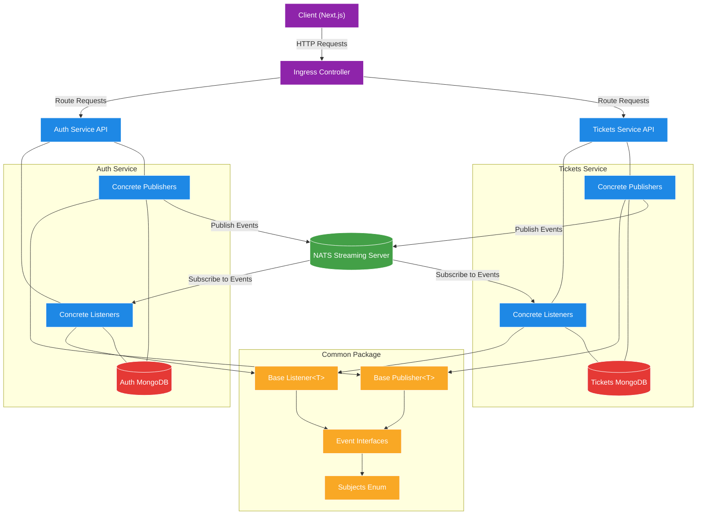
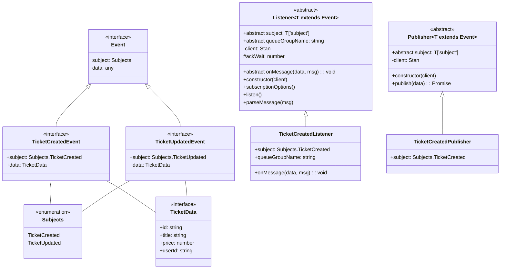
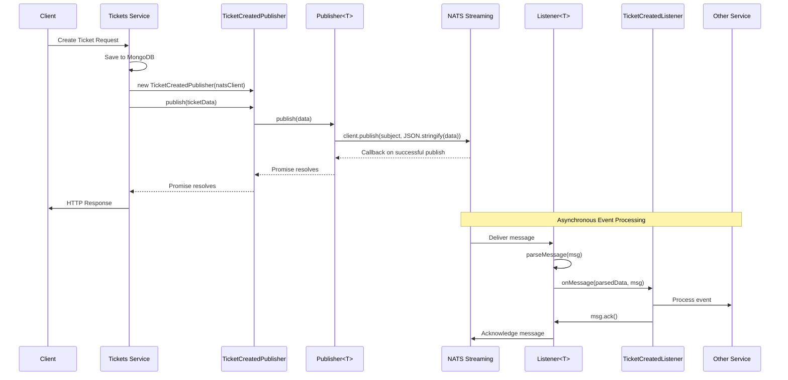

# Ticketing Application - Connecting to NATS in a NodeJS World

A microservices-based ticketing platform built with Node.js, TypeScript, and Kubernetes, now featuring a type-safe, object-oriented approach to event-driven communication with NATS Streaming Server.

## What's Changed from Version 13 (NATS Streaming Server Event Bus Implementation)

Version 14 builds upon the event bus implementation established in version 13, adding structured, type-safe abstractions for event handling:

### Type-Safe Event Handling

- **Abstract Base Classes**: Added reusable abstract classes for standardized event handling

  ```typescript
  // in common/src/events/base-listener.ts
  export abstract class Listener<T extends Event> {
    abstract subject: T['subject'];
    abstract queueGroupName: string;
    abstract onMessage(data: T['data'], msg: Message): void;
    private client: Stan;
    protected ackWait = 5 * 1000;

    constructor(client: Stan) {
      this.client = client;
    }

    // Standard implementation for all listeners
    subscriptionOptions() {
      return this.client
        .subscriptionOptions()
        .setDeliverAllAvailable()
        .setManualAckMode(true)
        .setAckWait(this.ackWait)
        .setDurableName(this.queueGroupName);
    }

    listen() {
      const subscription = this.client.subscribe(
        this.subject,
        this.queueGroupName,
        this.subscriptionOptions()
      );

      subscription.on('message', (msg: Message) => {
        console.log(`Message received: ${this.subject} / ${this.queueGroupName}`);
        const parsedData = this.parseMessage(msg);
        this.onMessage(parsedData, msg);
      });
    }

    parseMessage(msg: Message) {
      const data = msg.getData();
      return typeof data === 'string'
        ? JSON.parse(data)
        : JSON.parse(data.toString('utf8'));
    }
  }
  ```

- **Promise-Based Publishing**: Modernized event publishing with Promises

  ```typescript
  // in common/src/events/base-publisher.ts
  export abstract class Publisher<T extends Event> {
    abstract subject: T['subject'];
    private client: Stan;

    constructor(client: Stan) {
      this.client = client;
    }

    publish(data: T['data']): Promise<void> {
      return new Promise((resolve, reject) => {
        this.client.publish(this.subject, JSON.stringify(data), (err) => {
          if (err) {
            return reject(err);
          }
          console.log('Event published to subject', this.subject);
          resolve();
        });
      });
    }
  }
  ```

### Strongly Typed Events

- **Event Type Definitions**: Standardized event structures with TypeScript interfaces

  ```typescript
  // in common/src/events/ticket-created-event.ts
  import { Subjects } from './subjects';

  export interface TicketCreatedEvent {
    subject: Subjects.TicketCreated;
    data: {
      id: string;
      title: string;
      price: number;
      userId: string;
    };
  }
  ```

- **Subject Enumeration**: Type-safe event subject (channel) names

  ```typescript
  // in common/src/events/subjects.ts
  export enum Subjects {
    TicketCreated = 'ticket:created',
    TicketUpdated = 'ticket:updated',
  }
  ```

### Common Package Integration

- **Shared Abstractions**: Event handling components are now part of the common package

  ```typescript
  // in common/src/index.ts
  export * from './events/base-listener';
  export * from './events/base-publisher';
  export * from './events/subjects';
  export * from './events/ticket-created-event';
  export * from './events/ticket-updated-event';
  ```

## Architecture Overview

The application has evolved to a more structured event-driven architecture that leverages TypeScript's type system to ensure consistency and correctness:



### Communication Patterns

The system now supports two communication patterns with improved type safety:

1. **HTTP Communication** (unchanged):
   - Client to Service via REST API
   - Used for user-initiated commands and queries
   - Direct request-response pattern
   - Handled by the Ingress Controller

2. **Event Communication** (enhanced):
   - Service to Service via Event Bus
   - Now using type-safe abstractions
   - Promise-based async/await pattern
   - Standardized implementation across services

## Event Handling Components

### Base Classes and Interfaces

The common package provides abstract base classes and interfaces for standardized event handling:



### Key Components

1. **Event Interface**: Defines the structure of an event with subject and data
2. **Specific Event Interfaces**: Implement the Event interface with concrete types
3. **Listener Abstract Class**: Provides standardized subscription and message handling
4. **Publisher Abstract Class**: Provides standardized event publishing with Promises
5. **Concrete Implementations**: Services create specific listeners and publishers

## Implementation Patterns

Services implement concrete listeners and publishers by extending the base classes:

### 1. NATS Connection Management

```typescript
// Example nats-wrapper.ts (Singleton pattern)
import nats, { Stan } from 'node-nats-streaming';

class NatsWrapper {
  private _client?: Stan;

  get client() {
    if (!this._client) {
      throw new Error('Cannot access NATS client before connecting');
    }
    return this._client;
  }

  connect(clusterId: string, clientId: string, url: string) {
    this._client = nats.connect(clusterId, clientId, { url });

    return new Promise<void>((resolve, reject) => {
      this.client.on('connect', () => {
        console.log('Connected to NATS');
        resolve();
      });
      
      this.client.on('error', (err) => {
        reject(err);
      });
    });
  }
}

export const natsWrapper = new NatsWrapper();
```

### 2. Concrete Listener Implementation

```typescript
// Example concrete listener implementation
import { Message } from 'node-nats-streaming';
import { Listener, TicketCreatedEvent, Subjects } from '@rallycoding/common';

export class TicketCreatedListener extends Listener<TicketCreatedEvent> {
  readonly subject = Subjects.TicketCreated;
  queueGroupName = 'payments-service';

  onMessage(data: TicketCreatedEvent['data'], msg: Message) {
    // Business logic for handling the event
    console.log('Event data!', data);
    
    // Acknowledge the message
    msg.ack();
  }
}
```

### 3. Concrete Publisher Implementation

```typescript
// Example concrete publisher implementation
import { Publisher, TicketCreatedEvent, Subjects } from '@rallycoding/common';

export class TicketCreatedPublisher extends Publisher<TicketCreatedEvent> {
  readonly subject = Subjects.TicketCreated;
}
```

### 4. Service Initialization

```typescript
// Example service startup in index.ts
import { natsWrapper } from './nats-wrapper';

const start = async () => {
  if (!process.env.NATS_CLIENT_ID) {
    throw new Error('NATS_CLIENT_ID must be defined');
  }
  if (!process.env.NATS_URL) {
    throw new Error('NATS_URL must be defined');
  }
  if (!process.env.NATS_CLUSTER_ID) {
    throw new Error('NATS_CLUSTER_ID must be defined');
  }

  try {
    // Connect to NATS
    await natsWrapper.connect(
      process.env.NATS_CLUSTER_ID,
      process.env.NATS_CLIENT_ID,
      process.env.NATS_URL
    );
    
    // Graceful shutdown
    natsWrapper.client.on('close', () => {
      console.log('NATS connection closed!');
      process.exit();
    });
    process.on('SIGINT', () => natsWrapper.client.close());
    process.on('SIGTERM', () => natsWrapper.client.close());
    
    // Initialize listeners
    new TicketCreatedListener(natsWrapper.client).listen();
    
    // Rest of service initialization
    // ...
  } catch (err) {
    console.error(err);
  }
};

start();
```

### 5. Publishing Events

```typescript
// Example usage in a route handler
import { TicketCreatedPublisher } from '../events/publishers/ticket-created-publisher';
import { natsWrapper } from '../nats-wrapper';

router.post('/api/tickets', requireAuth, async (req, res) => {
  // Create ticket in database
  const ticket = Ticket.build({
    title: req.body.title,
    price: req.body.price,
    userId: req.currentUser!.id,
  });
  await ticket.save();
  
  // Publish event
  await new TicketCreatedPublisher(natsWrapper.client).publish({
    id: ticket.id,
    title: ticket.title,
    price: ticket.price,
    userId: ticket.userId,
  });
  
  res.status(201).send(ticket);
});
```

## Event Flow Sequence

This sequence diagram illustrates the event flow with the new abstractions:



## Testing Strategies

The new typed abstractions provide several advantages for testing:

### Unit Testing Publishers

```typescript
// Example unit test for a publisher
it('publishes an event', async () => {
  // Create an instance of the publisher with a mock NATS client
  const mockClient = {
    publish: jest.fn().mockImplementation(
      (subject: string, data: string, callback: () => void) => {
        callback();
      }
    ),
  };
  
  const publisher = new TicketCreatedPublisher(mockClient as unknown as Stan);
  
  // Define test event data
  const eventData = {
    id: 'test-id',
    title: 'test title',
    price: 10,
    userId: 'test-user-id',
  };
  
  // Publish the event
  await publisher.publish(eventData);
  
  // Assert that the client's publish method was called with correct arguments
  expect(mockClient.publish).toHaveBeenCalledWith(
    'ticket:created',
    JSON.stringify(eventData),
    expect.any(Function)
  );
});
```

### Unit Testing Listeners

```typescript
// Example unit test for a listener
it('processes an event', async () => {
  // Create a mock message object
  const mockMessage = {
    getData: jest.fn().mockReturnValue(JSON.stringify({
      id: 'test-id',
      title: 'test title',
      price: 10,
      userId: 'test-user-id',
    })),
    getSequence: jest.fn().mockReturnValue(1),
    ack: jest.fn(),
  };
  
  // Create an instance of the listener with a mock NATS client
  const mockClient = {} as Stan;
  const listener = new TicketCreatedListener(mockClient);
  
  // Call onMessage directly with mock message
  await listener.onMessage(JSON.parse(mockMessage.getData()), mockMessage as unknown as Message);
  
  // Assert that the message was acknowledged
  expect(mockMessage.ack).toHaveBeenCalled();
  
  // Assert that the expected business logic was performed
  // (e.g., database updates, further actions, etc.)
});
```

### Integration Testing

For integration tests, you can mock the `natsWrapper` singleton:

```typescript
// Example of mocking the natsWrapper singleton for integration tests
jest.mock('../nats-wrapper', () => {
  return {
    natsWrapper: {
      client: {
        publish: jest
          .fn()
          .mockImplementation(
            (subject: string, data: string, callback: () => void) => {
              callback();
            }
          ),
      },
    },
  };
});
```

## Future Considerations

As the system evolves, several advanced patterns can be implemented:

### 1. Event Versioning

```typescript
// Example: Adding version tracking to events
interface TicketUpdatedEvent {
  subject: Subjects.TicketUpdated;
  data: {
    id: string;
    title: string;
    price: number;
    userId: string;
    version: number; // Track entity version
  };
}

// In Ticket model
ticketSchema.pre('save', function(done) {
  // Increment version on each save
  this.$where = {
    version: this.get('version') - 1
  };
  
  this.increment('version');
  done()
});
```

### 2. Concurrency Control

```typescript
// Example in listener
onMessage(data: TicketUpdatedEvent['data'], msg: Message) {
  // Find the ticket
  const ticket = await Ticket.findById(data.id);
  
  // Check version for out-of-order events
  if (ticket.version !== data.version - 1) {
    // Reject out-of-sequence event
    return; // Don't ack, will be redelivered
  }
  
  // Update the ticket
  ticket.set({
    title: data.title,
    price: data.price,
  });
  
  // Save will increment the version
  await ticket.save();
  
  // Acknowledge the message
  msg.ack();
}
```

### 3. Advanced Event Patterns

- **Event Sourcing**: Store all events as the source of truth
- **CQRS**: Separate command (write) and query (read) responsibilities
- **Sagas**: Coordinate multi-step business processes across services

## Running the Application

### Prerequisites

1. **Docker Desktop** with Kubernetes enabled
2. **kubectl** command-line tool
3. **Skaffold** for development workflow
4. **Ingress-NGINX Controller** installed in your cluster

### Environment Setup

1. **Configure local hosts file**

   ```
   127.0.0.1 ticketing.dev
   ```

2. **Install NGINX Ingress Controller** (if not already installed)

   ```bash
   kubectl apply -f https://raw.githubusercontent.com/kubernetes/ingress-nginx/controller-v1.8.2/deploy/static/provider/cloud/deploy.yaml
   ```

3. **Create JWT Secret**

   ```bash
   kubectl create secret generic jwt-secret --from-literal=JWT_KEY=your_jwt_secret_key
   ```

### Starting the Application

Start the development environment using Skaffold:

```bash
skaffold dev
```

This will start all services, including the NATS Streaming Server.

## Conclusion

Version 14 of the ticketing application represents a significant architectural enhancement with the addition of type-safe abstractions for event handling. This approach provides stronger guarantees through TypeScript's type system, more consistent patterns across services, and a better developer experience with modern async/await patterns. The system is now better positioned for future growth, with a foundation that supports advanced event-driven architectural patterns.
