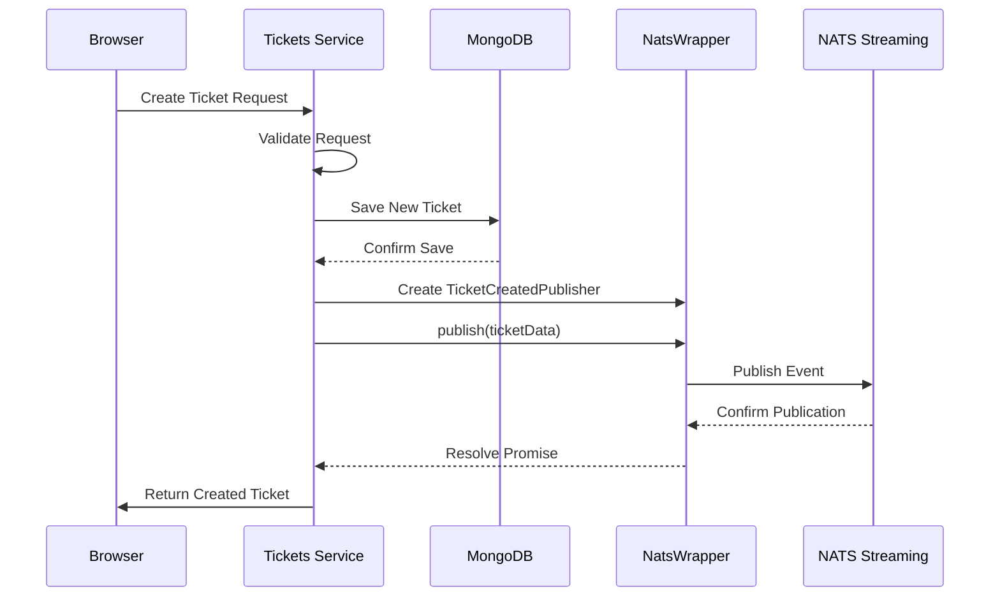

# Ticketing Application - Managing a NATS Client

A microservices-based ticketing platform built with Node.js, TypeScript, and Kubernetes, now featuring a robust NATS client management implementation for reliable event publishing between services.

## What's Changed from Version 14 (Connecting to NATS in a NodeJS World)

Version 15 builds upon the type-safe event architecture established in version 14, adding a robust NATS client management implementation:

### NATS Client Management

- **NatsWrapper Singleton**: Implemented a singleton wrapper for consistent NATS access

  ```typescript
  // in tickets/src/nats-wrapper.ts
  class NatsWrapper {
    private _client?: Stan;

    get client() {
      if (!this._client) {
        throw new Error('Cannot access NATS client before connecting');
      }
      return this._client;
    }

    connect(clusterId: string, clientId: string, url: string) {
      this._client = nats.connect(clusterId, clientId, { url });

      return new Promise<void>((resolve, reject) => {
        this.client.on('connect', () => {
          console.log('Connected to NATS');
          resolve();
        });
        this.client.on('error', (err) => {
          reject(err);
        });
      });
    }
  }

  export const natsWrapper = new NatsWrapper();
  ```

- **Service Initialization**: Added NATS connection setup in service startup

  ```typescript
  // in tickets/src/index.ts
  if (!process.env.NATS_CLIENT_ID) {
    throw new Error('NATS_CLIENT_ID must be defined');
  }
  if (!process.env.NATS_URL) {
    throw new Error('NATS_URL must be defined');
  }
  if (!process.env.NATS_CLUSTER_ID) {
    throw new Error('NATS_CLUSTER_ID must be defined');
  }

  try {
    await natsWrapper.connect(
      process.env.NATS_CLUSTER_ID,
      process.env.NATS_CLIENT_ID,
      process.env.NATS_URL
    );
    natsWrapper.client.on('close', () => {
      console.log('NATS connection closed!');
      process.exit();
    });
    process.on('SIGINT', () => natsWrapper.client.close());
    process.on('SIGTERM', () => natsWrapper.client.close());
    
    // ...rest of initialization
  }
  ```

### Event Publishing Integration

- **Publisher Implementation**: Concrete publisher classes for event types

  ```typescript
  // in tickets/src/events/publishers/ticket-created-publisher.ts
  import { Publisher, Subjects, TicketCreatedEvent } from '@rallycoding/common';

  export class TicketCreatedPublisher extends Publisher<TicketCreatedEvent> {
    readonly subject = Subjects.TicketCreated;
  }
  ```

- **Route Handler Integration**: Events now published when tickets are created or updated

  ```typescript
  // in tickets/src/routes/new.ts
  router.post(
    '/api/tickets',
    requireAuth,
    [...validation],
    validateRequest,
    async (req: Request, res: Response) => {
      const { title, price } = req.body;
      const ticket = Ticket.build({
        title,
        price,
        userId: req.currentUser!.id,
      });
      await ticket.save();
      
      // Publish event after saving to database
      await new TicketCreatedPublisher(natsWrapper.client).publish({
        id: ticket.id,
        title: ticket.title,
        price: ticket.price,
        userId: ticket.userId,
      });

      res.status(201).send(ticket);
    }
  );
  ```

### Testing Support

- **Mock Implementation**: Created a mock NatsWrapper for testing

  ```typescript
  // in tickets/src/__mocks__/nats-wrapper.ts
  export const natsWrapper = {
    client: {
      publish: jest
        .fn()
        .mockImplementation(
          (subject: string, data: string, callback: () => void) => {
            callback();
          }
        ),
    },
  };
  ```

- **Test Verification**: Easy verification of event publishing in tests

  ```typescript
  // Example test (conceptual, not actual code)
  it('publishes an event', async () => {
    // Create a ticket via API
    // ...

    // Verify publishing was called
    expect(natsWrapper.client.publish).toHaveBeenCalled();
    
    // Verify event data
    const eventData = JSON.parse(
      (natsWrapper.client.publish as jest.Mock).mock.calls[0][1]
    );
    expect(eventData.id).toEqual(ticket.id);
  });
  ```

## Architecture Overview

The application has evolved to incorporate event publishing through the NATS Streaming Server, with a well-structured client management pattern:

```mermaid
graph TD
    subgraph "Kubernetes Cluster"
        subgraph "Tickets Service"
            TicketsAPI["REST API"]
            NatsWrapper["NatsWrapper<br/>(Singleton)"]
            Publishers["Event Publishers"]
            TicketsDB[(MongoDB)]
            
            TicketsAPI --> Publishers
            Publishers --> NatsWrapper
            TicketsAPI --> TicketsDB
        end
        
        subgraph "Auth Service"
            AuthAPI["REST API"]
            AuthDB[(MongoDB)]
            
            AuthAPI --> AuthDB
        end
        
        NATS[("NATS Streaming<br/>Server")]
        
        NatsWrapper -- "Publish Events" --> NATS
        NATS -- "Future: Subscribe<br/>to Events" --> AuthAPI
        
        Ingress["Ingress Controller"]
        Client["Client (Next.js)"]
        
        Client -- "HTTP Requests" --> Ingress
        Ingress -- "Route Requests" --> TicketsAPI
        Ingress -- "Route Requests" --> AuthAPI
        
        classDef service fill:#1e88e5,stroke:#fff,stroke-width:1px,color:#fff;
        classDef database fill:#e53935,stroke:#fff,stroke-width:1px,color:#fff;
        classDef nats fill:#43a047,stroke:#fff,stroke-width:1px,color:#fff;
        classDef client fill:#8e24aa,stroke:#fff,stroke-width:1px,color:#fff;
        classDef wrapper fill:#fb8c00,stroke:#fff,stroke-width:1px,color:#fff;
        
        class TicketsAPI,AuthAPI service;
        class TicketsDB,AuthDB database;
        class NATS nats;
        class Client,Ingress client;
        class NatsWrapper,Publishers wrapper;
    end
```



### Components Explained

- **NatsWrapper Singleton**:
  - Provides application-wide access to the NATS client
  - Manages connection lifecycle and validation
  - Ensures consistent access to the NATS client

- **Event Publishers**:
  - Concrete implementations of Publisher<T> abstract class
  - Type-safe event publishing with specific subjects
  - Used by route handlers to broadcast state changes

- **NATS Streaming Server**:
  - Central message broker for event distribution
  - Deployed as a Kubernetes service
  - Configured for client connections and monitoring

## Event Publishing Flow

This sequence diagram illustrates the event flow during ticket creation:



Key aspects of this flow:

1. **Database First, Then Publish**:
   - Ticket is saved to MongoDB before publishing the event
   - Ensures event data matches actual database state

2. **Awaiting Publication**:
   - API awaits successful event publication
   - Ensures event is published before responding to client
   - Maintains consistency between HTTP response and events

3. **Clean Async/Await Pattern**:
   - Promise-based APIs enable clean async/await syntax
   - Avoids callback nesting and improves code readability
   - Errors propagate correctly through Promise chain

## NATS Wrapper Implementation Details

The `NatsWrapper` class follows the Singleton pattern to provide a consistent NATS client throughout the application:

### Singleton Pattern

```typescript
// Single exported instance
export const natsWrapper = new NatsWrapper();
```

- Only one instance exists application-wide
- Imported wherever NATS access is needed
- Ensures consistent connection management

### Lazy Validation

```typescript
get client() {
  if (!this._client) {
    throw new Error('Cannot access NATS client before connecting');
  }
  return this._client;
}
```

- Fail-fast if client accessed before connection
- Clear error message for debugging
- Prevents runtime errors from undefined client

### Promise-Based Connection

```typescript
connect(clusterId: string, clientId: string, url: string) {
  this._client = nats.connect(clusterId, clientId, { url });

  return new Promise<void>((resolve, reject) => {
    this.client.on('connect', () => {
      console.log('Connected to NATS');
      resolve();
    });
    this.client.on('error', (err) => {
      reject(err);
    });
  });
}
```

- Returns a Promise for async/await usage
- Resolves when connection is established
- Rejects if connection fails with error
- Enables clean error handling in caller

## Testing Strategy

The application uses Jest's module mocking system to mock the NATS wrapper for tests:

### Mock Implementation

```typescript
// in __mocks__/nats-wrapper.ts
export const natsWrapper = {
  client: {
    publish: jest
      .fn()
      .mockImplementation(
        (subject: string, data: string, callback: () => void) => {
          callback();
        }
      ),
  },
};
```

This mock:

- Implements the same interface as the real wrapper
- Uses Jest's mock function to track calls
- Simulates successful publishing with callback
- Allows verification in tests

### Using in Tests

```typescript
// At the top of test file or in jest setup
jest.mock('../nats-wrapper');

// In a test
it('publishes an event', async () => {
  // Create ticket via API
  // ...
  
  // Verify publish was called
  expect(natsWrapper.client.publish).toHaveBeenCalled();
});
```

### Verifying Event Data

```typescript
it('publishes correct event data', async () => {
  // Test setup and API call
  // ...
  
  // Extract published data from mock
  const eventData = JSON.parse(
    (natsWrapper.client.publish as jest.Mock).mock.calls[0][1]
  );
  
  // Verify data matches expectations
  expect(eventData.id).toEqual(expectedId);
  expect(eventData.title).toEqual(expectedTitle);
  // etc.
});
```

## Infrastructure Configuration

The NATS Streaming Server is deployed as part of the Kubernetes infrastructure:

### NATS Deployment

```yaml
# in infra/k8s/nats-depl.yaml
apiVersion: apps/v1
kind: Deployment
metadata:
  name: nats-depl
spec:
  replicas: 1
  selector:
    matchLabels:
      app: nats
  template:
    metadata:
      labels:
        app: nats
    spec:
      containers:
        - name: nats
          image: nats-streaming:0.17.0
          args:
            [
              '-p', '4222',      # Client port
              '-m', '8222',      # HTTP monitoring port
              '-hbi', '5s',      # Heartbeat interval
              '-hbt', '5s',      # Heartbeat timeout
              '-hbf', '2',       # Heartbeat failures before inactive
              '-SD',             # Stand-alone mode
              '-cid', 'ticketing', # Cluster ID
            ]
```

### Service Configuration

```yaml
# in infra/k8s/nats-depl.yaml (continued)
---
apiVersion: v1
kind: Service
metadata:
  name: nats-srv
spec:
  selector:
    app: nats
  ports:
    - name: client
      protocol: TCP
      port: 4222
      targetPort: 4222
    - name: monitoring
      protocol: TCP
      port: 8222
      targetPort: 8222
```

### Environment Configuration

The tickets service requires environment variables for NATS configuration:

```yaml
# Example configuration in tickets-depl.yaml
env:
  - name: NATS_CLIENT_ID
    valueFrom:
      fieldRef:
        fieldPath: metadata.name  # Uses pod name as client ID
  - name: NATS_URL
    value: 'http://nats-srv:4222'
  - name: NATS_CLUSTER_ID
    value: 'ticketing'
```

## Running the Application

### Prerequisites

1. **Docker Desktop** with Kubernetes enabled
2. **kubectl** command-line tool
3. **Skaffold** for development workflow
4. **Ingress-NGINX Controller** installed in your cluster

### Environment Setup

1. **Configure local hosts file**

   ```
   127.0.0.1 ticketing.dev
   ```

2. **Install NGINX Ingress Controller** (if not already installed)

   ```bash
   kubectl apply -f https://raw.githubusercontent.com/kubernetes/ingress-nginx/controller-v1.8.2/deploy/static/provider/cloud/deploy.yaml
   ```

3. **Create JWT Secret**

   ```bash
   kubectl create secret generic jwt-secret --from-literal=JWT_KEY=your_jwt_secret_key
   ```

### Starting the Application

Start the development environment using Skaffold:

```bash
skaffold dev
```

This will:

1. Start all services including NATS Streaming Server
2. Configure all required connections
3. Set up event publishing between services

## Conclusion

Version 15 represents a significant improvement in the application's event publishing infrastructure through the implementation of a robust NATS client management pattern. The singleton wrapper, event publishing integration, and testing support create a solid foundation for reliable, type-safe event-driven communication between services. This approach will enable the system to scale more effectively and handle more complex business logic across microservices as it evolves.
