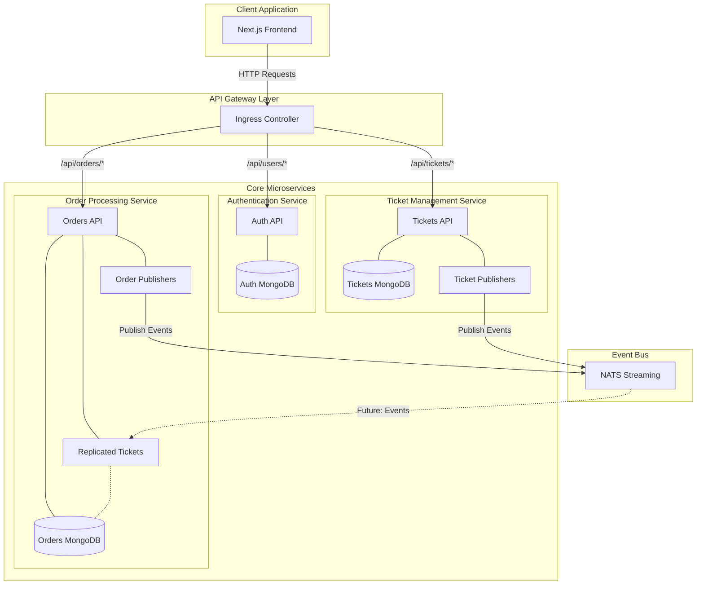
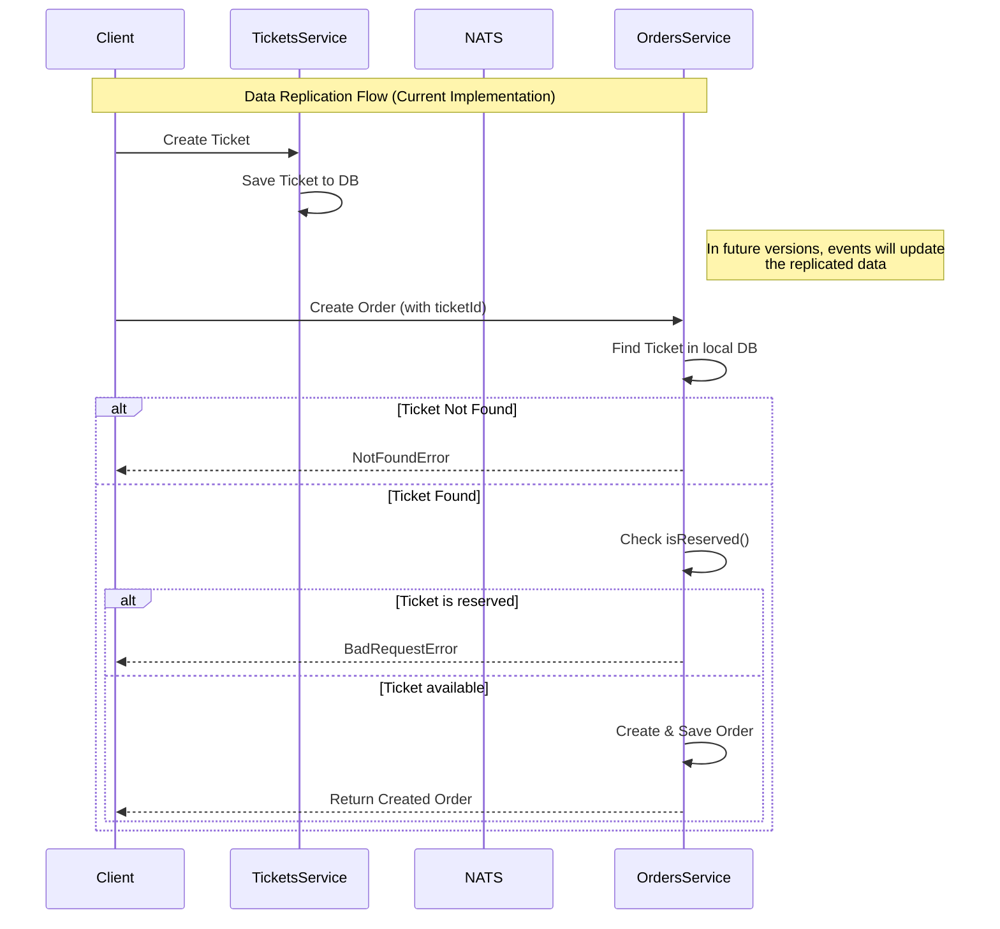
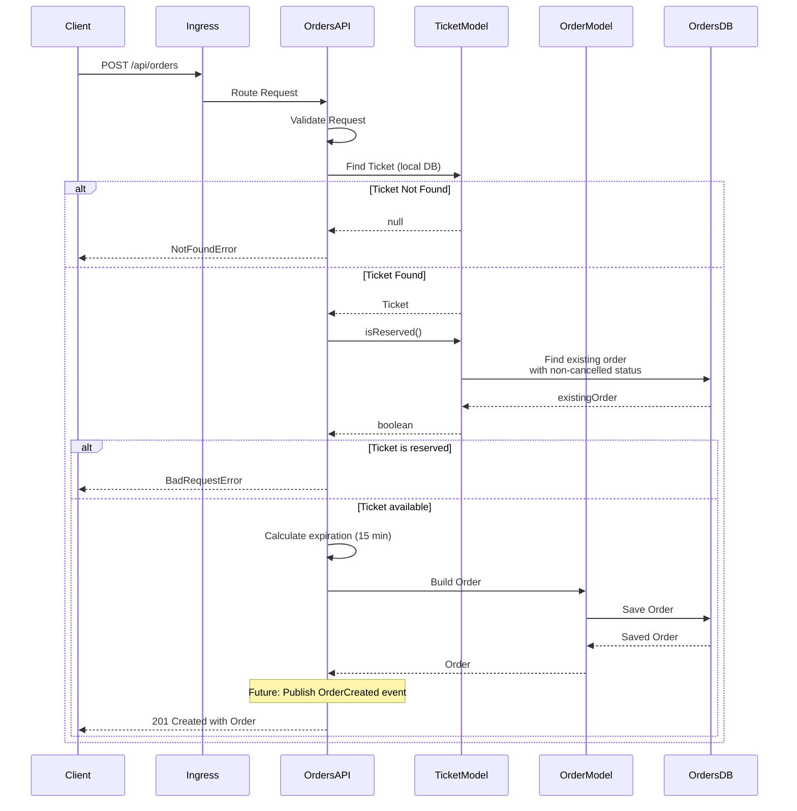
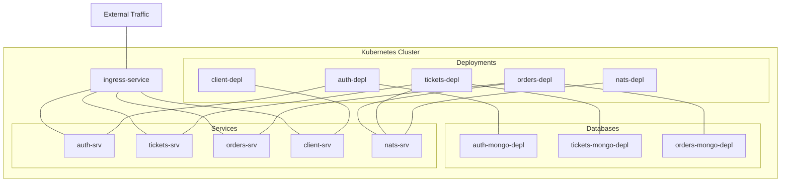

# Ticketing Application - Cross-Service Data Replication In Action

A microservices-based ticketing platform built with Node.js, TypeScript, and Kubernetes, now featuring cross-service data replication and the new Orders service.

## What's Changed from Version 15 (Managing a NATS Client)

Version 16 builds upon the robust NATS client management established in version 15, adding a new Orders service and implementing cross-service data replication:

### New Orders Service

- **Complete Service Implementation**: Added a new microservice for order management

  ```typescript
  // in orders/src/models/order.ts
  interface OrderAttrs {
    userId: string;
    status: OrderStatus;
    expiresAt: Date;
    ticket: TicketDoc;
  }

  // Order schema
  const orderSchema = new mongoose.Schema({
    userId: {
      type: String,
      required: true,
    },
    status: {
      type: String,
      required: true,
      enum: Object.values(OrderStatus),
      default: OrderStatus.Created,
    },
    expiresAt: {
      type: mongoose.Schema.Types.Date,
    },
    ticket: {
      type: mongoose.Schema.Types.ObjectId,
      ref: 'Ticket',
    },
  });
  ```

- **Order Status Management**: Comprehensive order state lifecycle

  ```typescript
  // in common/src/events/types/order-status.ts
  export enum OrderStatus {
    // When the order has been created, but the
    // ticket it is trying to order has not been reserved
    Created = 'created',

    // The ticket the order is trying to reserve has already
    // been reserved, or when the user has cancelled the order.
    // The order expires before payment
    Cancelled = 'cancelled',

    // The order has successfully reserved the ticket
    AwaitingPayment = 'awaiting:payment',

    // The order has reserved the ticket and the user has
    // provided payment successfully
    Complete = 'complete',
  }
  ```

### Cross-Service Data Replication

- **Ticket Model in Orders Service**: Replicated ticket data for independent operation

  ```typescript
  // in orders/src/models/ticket.ts
  interface TicketAttrs {
    title: string;
    price: number;
  }

  export interface TicketDoc extends mongoose.Document {
    title: string;
    price: number;
    isReserved(): Promise<boolean>;
  }

  const ticketSchema = new mongoose.Schema({
    title: {
      type: String,
      required: true,
    },
    price: {
      type: Number,
      required: true,
      min: 0,
    },
  });
  ```

- **Reservation Logic**: Method to check if a ticket is already reserved

  ```typescript
  // in orders/src/models/ticket.ts
  ticketSchema.methods.isReserved = async function () {
    // Find an existing order where the ticket is this ticket
    // and the order status is NOT cancelled
    const existingOrder = await Order.findOne({
      ticket: this,
      status: {
        $in: [
          OrderStatus.Created,
          OrderStatus.AwaitingPayment,
          OrderStatus.Complete,
        ],
      },
    });

    return !!existingOrder;
  };
  ```

### Order API Endpoints

- **Create Order**: Create a new order for a ticket

  ```typescript
  // in orders/src/routes/new.ts
  router.post(
    '/api/orders',
    requireAuth,
    [
      body('ticketId')
        .not()
        .isEmpty()
        .custom((input: string) => mongoose.Types.ObjectId.isValid(input))
        .withMessage('TicketId must be provided'),
    ],
    validateRequest,
    async (req: Request, res: Response) => {
      // Implementation details...
    }
  );
  ```

- **Get User Orders**: Retrieve all orders for the current user

  ```typescript
  // in orders/src/routes/index.ts
  router.get('/api/orders', requireAuth, async (req: Request, res: Response) => {
    const orders = await Order.find({
      userId: req.currentUser!.id,
    }).populate('ticket');

    res.send(orders);
  });
  ```

- **Get Specific Order**: Retrieve a specific order

  ```typescript
  // in orders/src/routes/show.ts
  router.get(
    '/api/orders/:orderId',
    requireAuth,
    async (req: Request, res: Response) => {
      // Implementation details...
    }
  );
  ```

- **Cancel Order**: Change order status to cancelled

  ```typescript
  // in orders/src/routes/delete.ts
  router.delete(
    '/api/orders/:orderId',
    requireAuth,
    async (req: Request, res: Response) => {
      // Implementation details...
      order.status = OrderStatus.Cancelled;
      await order.save();
      // publishing an event saying this was cancelled! (commented out)
      res.status(204).send(order);
    }
  );
  ```

### API Routing

- **Updated Ingress Configuration**: Added routing for orders API

  ```yaml
  # in infra/k8s/ingress-srv.yaml
  paths:
    - path: /api/users/?(.*)
      pathType: ImplementationSpecific
      backend:
        service:
          name: auth-srv
          port:
            number: 3000
    - path: /api/tickets/?(.*)
      pathType: ImplementationSpecific
      backend:
        service:
          name: tickets-srv
          port:
            number: 3000
    - path: /api/orders/?(.*)
      pathType: ImplementationSpecific
      backend:
        service:
          name: orders-srv
          port:
            number: 3000
  ```

## Architecture Overview

The application has evolved with a new Orders service implementing cross-service data replication for ticket data:



### Components Explained

- **Client Application**: Next.js frontend for user interactions
- **Ingress Controller**: Routes API requests to appropriate services
- **Auth Service**: Handles user authentication and authorization
- **Tickets Service**: Manages ticket creation and updates
- **Orders Service**: Manages order creation, viewing, and cancellation
- **NATS Streaming**: Message broker for event-based communication
- **Replicated Tickets**: Copy of ticket data in the Orders service

## Cross-Service Data Replication Pattern

A key architectural pattern implemented in this version is cross-service data replication, particularly for ticket data in the Orders service.

### Data Models Comparison

#### Original Ticket Model (Tickets Service)

```typescript
interface TicketDoc extends mongoose.Document {
  title: string;
  price: number;
  userId: string;
}
```

#### Replicated Ticket Model (Orders Service)

```typescript
export interface TicketDoc extends mongoose.Document {
  title: string;
  price: number;
  isReserved(): Promise<boolean>;
}
```

### Why Replicate Data?

1. **Service Independence**: The Orders service can function even if the Tickets service is down
2. **Performance**: No need for inter-service HTTP requests to get ticket data
3. **Simplified Business Logic**: The Orders service has direct access to ticket data
4. **Domain Separation**: Each service manages its own domain data

### How Replication Works



## Order Creation Flow

The order creation process demonstrates the application's business logic:



### Key Business Rules

1. **Ticket Reservation Check**: A ticket cannot be reserved twice

   ```typescript
   const isReserved = await ticket.isReserved();
   if (isReserved) {
     throw new BadRequestError('Ticket is already reserved');
   }
   ```

2. **Order Expiration**: Orders expire after 15 minutes

   ```typescript
   const EXPIRATION_WINDOW_SECONDS = 15 * 60;
   const expiration = new Date();
   expiration.setSeconds(expiration.getSeconds() + EXPIRATION_WINDOW_SECONDS);
   ```

3. **Order Status Workflow**: Orders follow a defined lifecycle

   ```
   Created → AwaitingPayment → Complete
     │
     └─────→ Cancelled
   ```

4. **Authorization**: Users can only access their own orders

   ```typescript
   if (order.userId !== req.currentUser!.id) {
     throw new NotAuthorizedError();
   }
   ```

## Kubernetes Deployment Architecture

The application is deployed in Kubernetes with multiple services and databases:



### Environment Configuration

Each service requires specific environment variables:

```yaml
# Example from orders-depl.yaml
env:
  - name: NATS_CLIENT_ID
    valueFrom:
      fieldRef:
        fieldPath: metadata.name
  - name: NATS_URL
    value: 'http://nats-srv:4222'
  - name: NATS_CLUSTER_ID
    value: ticketing
  - name: MONGO_URI
    value: 'mongodb://orders-mongo-srv:27017/orders'
  - name: JWT_KEY
    valueFrom:
      secretKeyRef:
        name: jwt-secret
        key: JWT_KEY
```

## Implementation Details

### Order Model Implementation

The Order model includes references to tickets and implements the order status workflow:

```typescript
// Order Schema
const orderSchema = new mongoose.Schema(
  {
    userId: {
      type: String,
      required: true,
    },
    status: {
      type: String,
      required: true,
      enum: Object.values(OrderStatus),
      default: OrderStatus.Created,
    },
    expiresAt: {
      type: mongoose.Schema.Types.Date,
    },
    ticket: {
      type: mongoose.Schema.Types.ObjectId,
      ref: 'Ticket',
    },
  },
  {
    toJSON: {
      transform(doc, ret) {
        ret.id = ret._id;
        delete ret._id;
      },
    },
  }
);
```

### Ticket Reservation Logic

The crucial `isReserved()` method prevents double booking of tickets:

```typescript
ticketSchema.methods.isReserved = async function () {
  // this === the ticket document that we just called 'isReserved' on
  const existingOrder = await Order.findOne({
    ticket: this,
    status: {
      $in: [
        OrderStatus.Created,
        OrderStatus.AwaitingPayment,
        OrderStatus.Complete,
      ],
    },
  });

  return !!existingOrder;
};
```

### API Implementation

The Orders API implements standard RESTful endpoints:

1. **Create Order**:

   ```typescript
   router.post('/api/orders', requireAuth, [validation], async (req, res) => {
     // Implementation details...
   });
   ```

2. **Get User Orders**:

   ```typescript
   router.get('/api/orders', requireAuth, async (req, res) => {
     const orders = await Order.find({
       userId: req.currentUser!.id,
     }).populate('ticket');

     res.send(orders);
   });
   ```

3. **Get Specific Order**:

   ```typescript
   router.get('/api/orders/:orderId', requireAuth, async (req, res) => {
     // Implementation details...
   });
   ```

4. **Cancel Order**:

   ```typescript
   router.delete('/api/orders/:orderId', requireAuth, async (req, res) => {
     // Implementation details...
   });
   ```
   
## Running the Application

### Prerequisites

1. **Docker Desktop** with Kubernetes enabled
2. **kubectl** command-line tool
3. **Skaffold** for development workflow
4. **Ingress-NGINX Controller** installed in your cluster

### Environment Setup

1. **Configure local hosts file**

   ```
   127.0.0.1 ticketing.dev
   ```

2. **Create JWT Secret**

   ```bash
   kubectl create secret generic jwt-secret --from-literal=JWT_KEY=your_jwt_secret_key
   ```

### Starting the Application

Start the development environment using Skaffold:

```bash
skaffold dev
```

This will:

1. Start all services (Auth, Tickets, Orders, Client, NATS)
2. Configure all required connections
3. Set up the ingress controller for routing

## Conclusion

Version 16 represents a significant evolution of the ticketing application with the addition of the Orders service and implementation of the cross-service data replication pattern. This architectural approach enables greater service independence and resilience while maintaining a cohesive system. The careful handling of ticket reservations and order status transitions demonstrates sophisticated business logic implementation in a microservices context.
