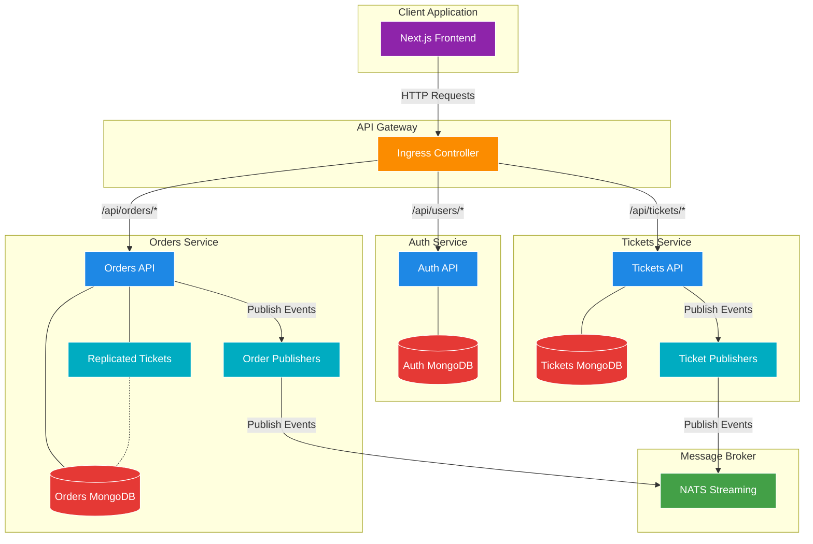
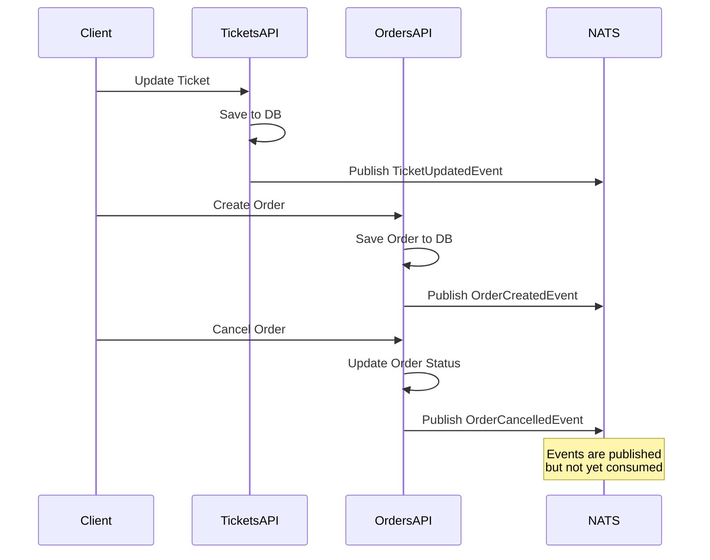
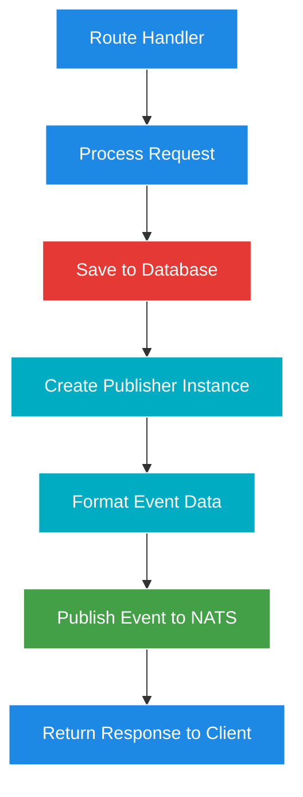
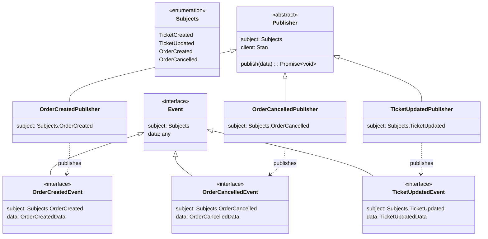
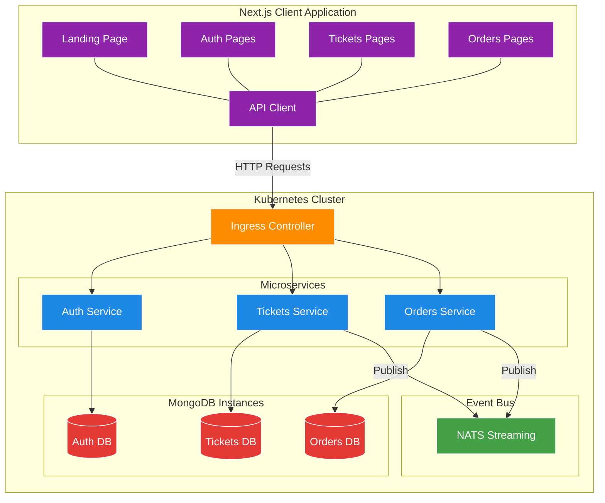
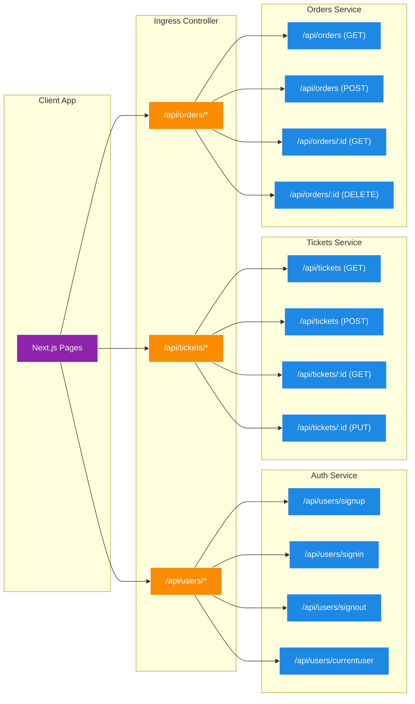
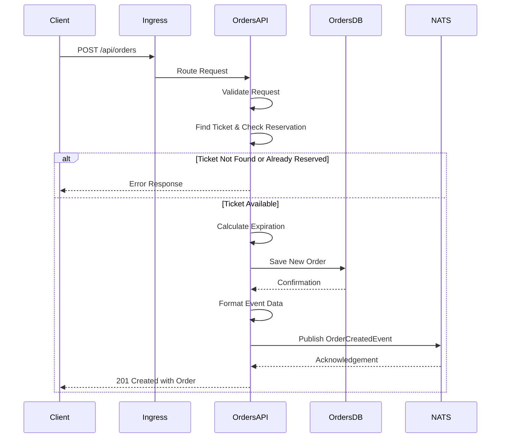

# Ticketing Application - Understanding Event Flow

A microservices-based ticketing platform built with Node.js, TypeScript, and Kubernetes, now featuring a complete event publishing implementation for inter-service communication.

## What's Changed from Version 16 (Cross-Service Data Replication In Action)

Version 17 builds upon the cross-service data replication foundation established in version 16, focusing on implementing a complete event publishing mechanism:

### Event Publishing Implementation

- **Order Creation Event Publishing**: Orders service now publishes events when orders are created

  ```typescript
  // in orders/src/routes/new.ts
  // Publish an event saying that an order was created
  new OrderCreatedPublisher(natsWrapper.client).publish({
    id: order.id,
    status: order.status,
    userId: order.userId,
    expiresAt: order.expiresAt.toISOString(),
    ticket: {
      id: ticket.id,
      price: ticket.price,
    },
  });
  ```

- **Order Cancellation Event Publishing**: Orders service now publishes events when orders are cancelled

  ```typescript
  // in orders/src/routes/delete.ts
  // publishing an event saying this was cancelled!
  new OrderCancelledPublisher(natsWrapper.client).publish({
    id: order.id,
    ticket: {
      id: order.ticket.id,
    },
  });
  ```

- **Ticket Update Event Publishing**: Tickets service now publishes events when tickets are updated

  ```typescript
  // in tickets/src/routes/update.ts
  new TicketUpdatedPublisher(natsWrapper.client).publish({
    id: ticket.id,
    title: ticket.title,
    price: ticket.price,
    userId: ticket.userId,
  });
  ```

### New Event Types in Common Library

- **Order-Related Event Interfaces**: Added interfaces for order events

  ```typescript
  // in common/src/events/order-created-event.ts
  export interface OrderCreatedEvent {
    subject: Subjects.OrderCreated;
    data: {
      id: string;
      status: OrderStatus;
      userId: string;
      expiresAt: string;
      ticket: {
        id: string;
        price: number;
      };
    };
  }

  // in common/src/events/order-cancelled-event.ts
  export interface OrderCancelledEvent {
    subject: Subjects.OrderCancelled;
    data: {
      id: string;
      ticket: {
        id: string;
      };
    };
  }
  ```

- **Enhanced Subjects Enum**: Added new event types to the Subjects enum

  ```typescript
  // in common/src/events/subjects.ts
  export enum Subjects {
    TicketCreated = 'ticket:created',
    TicketUpdated = 'ticket:updated',
    OrderCreated = 'order:created',
    OrderCancelled = 'order:cancelled',
  }
  ```

- **Order Publishers**: Created publisher classes for order events

  ```typescript
  // in orders/src/events/publishers/order-created-publisher.ts
  export class OrderCreatedPublisher extends Publisher<OrderCreatedEvent> {
    subject: Subjects.OrderCreated = Subjects.OrderCreated;
  }

  // in orders/src/events/publishers/order-cancelled-publisher.ts
  export class OrderCancelledPublisher extends Publisher<OrderCancelledEvent> {
    subject: Subjects.OrderCancelled = Subjects.OrderCancelled;
  }
  ```

## Architecture Overview

The application has evolved to implement event publishing for inter-service communication:



### Components Explained

- **Client Application**: Next.js frontend for user interactions
- **Ingress Controller**: Routes API requests to appropriate services
- **Auth Service**: Handles user authentication and authorization
- **Tickets Service**: Manages ticket creation and updates, now with event publishing
- **Orders Service**: Manages order creation, viewing, and cancellation, now with event publishing
- **NATS Streaming**: Message broker for event-based communication
- **Ticket Publishers**: Components that publish ticket-related events
- **Order Publishers**: Components that publish order-related events
- **Replicated Tickets**: Copy of ticket data in the Orders service

## Event Flow Implementation

In version 17, we have implemented a one-directional event flow where services publish events but do not yet consume them:



### Event Publishing Process

For each service that publishes events, the process follows this pattern:



### Event Types and Data Flow



## Frontend and Backend Integration

The frontend client interacts with the backend services through the Ingress controller:



### API Routes and Service Interactions



## Order Creation and Event Publishing Flow

The order creation process now includes event publishing:



## Kubernetes Deployment Architecture

The application is deployed in Kubernetes with multiple services and databases:

```mermaid
graph TB
    subgraph "Kubernetes Cluster"
        subgraph "Deployments"
            AuthDepl["auth-depl"]
            TicketsDepl["tickets-depl"]
            OrdersDepl["orders-depl"]
            ClientDepl["client-depl"]
            NatsDepl["nats-depl"]
        end
        
        subgraph "Databases"
            AuthMongo["auth-mongo-depl"]
            TicketsMongo["tickets-mongo-depl"]
            OrdersMongo["orders-mongo-depl"]
        end
        
        subgraph "Services"
            AuthSrv["auth-srv"]
            TicketsSrv["tickets-srv"]
            OrdersSrv["orders-srv"]
            ClientSrv["client-srv"]
            NatsSrv["nats-srv"]
        end
        
        Ingress["ingress-service"]
    end
    
    External["External Traffic"]
    
    AuthDepl --- AuthSrv
    TicketsDepl --- TicketsSrv
    OrdersDepl --- OrdersSrv
    ClientDepl --- ClientSrv
    NatsDepl --- NatsSrv
    
    AuthDepl --- AuthMongo
    TicketsDepl --- TicketsMongo
    OrdersDepl --- OrdersMongo
    
    TicketsDepl -- "Publish Events" --> NatsSrv
    OrdersDepl -- "Publish Events" --> NatsSrv
    
    Ingress --- AuthSrv
    Ingress --- TicketsSrv
    Ingress --- OrdersSrv
    Ingress --- ClientSrv
    
    External --- Ingress
    
    style AuthDepl fill:#1e88e5,stroke:#fff,stroke-width:1px,color:#fff
    style TicketsDepl fill:#1e88e5,stroke:#fff,stroke-width:1px,color:#fff
    style OrdersDepl fill:#1e88e5,stroke:#fff,stroke-width:1px,color:#fff
    style ClientDepl fill:#1e88e5,stroke:#fff,stroke-width:1px,color:#fff
    style NatsDepl fill:#1e88e5,stroke:#fff,stroke-width:1px,color:#fff
    style AuthMongo fill:#e53935,stroke:#fff,stroke-width:1px,color:#fff
    style TicketsMongo fill:#e53935,stroke:#fff,stroke-width:1px,color:#fff
    style OrdersMongo fill:#e53935,stroke:#fff,stroke-width:1px,color:#fff
    style AuthSrv fill:#43a047,stroke:#fff,stroke-width:1px,color:#fff
    style TicketsSrv fill:#43a047,stroke:#fff,stroke-width:1px,color:#fff
    style OrdersSrv fill:#43a047,stroke:#fff,stroke-width:1px,color:#fff
    style ClientSrv fill:#43a047,stroke:#fff,stroke-width:1px,color:#fff
    style NatsSrv fill:#43a047,stroke:#fff,stroke-width:1px,color:#fff
    style Ingress fill:#fb8c00,stroke:#fff,stroke-width:1px,color:#fff
    style External fill:#8e24aa,stroke:#fff,stroke-width:1px,color:#fff
```



## Implementation Details

### Publisher Implementation

The publisher classes follow a type-safe pattern using generic types:

```typescript
// Base Publisher in common library
export abstract class Publisher<T extends Event> {
  abstract subject: T['subject'];
  protected client: Stan;

  constructor(client: Stan) {
    this.client = client;
  }

  publish(data: T['data']): Promise<void> {
    return new Promise((resolve, reject) => {
      this.client.publish(this.subject, JSON.stringify(data), (err) => {
        if (err) {
          return reject(err);
        }
        console.log('Event published to subject', this.subject);
        resolve();
      });
    });
  }
}

// Concrete publisher implementation
export class OrderCreatedPublisher extends Publisher<OrderCreatedEvent> {
  subject: Subjects.OrderCreated = Subjects.OrderCreated;
}
```

### Route Handler Integration

Route handlers now integrate with publishers:

```typescript
// Example from orders/src/routes/new.ts
// After saving order to the database
new OrderCreatedPublisher(natsWrapper.client).publish({
  id: order.id,
  status: order.status,
  userId: order.userId,
  expiresAt: order.expiresAt.toISOString(),
  ticket: {
    id: ticket.id,
    price: ticket.price,
  },
});
```

### NATS Connection Setup

Both services connect to NATS on startup:

```typescript
// In both orders/src/index.ts and tickets/src/index.ts
await natsWrapper.connect(
  process.env.NATS_CLUSTER_ID,
  process.env.NATS_CLIENT_ID,
  process.env.NATS_URL
);
natsWrapper.client.on('close', () => {
  console.log('NATS connection closed!');
  process.exit();
});
process.on('SIGINT', () => natsWrapper.client.close());
process.on('SIGTERM', () => natsWrapper.client.close());
```

## Running the Application

### Prerequisites

1. **Docker Desktop** with Kubernetes enabled
2. **kubectl** command-line tool
3. **Skaffold** for development workflow
4. **Ingress-NGINX Controller** installed in your cluster

### Environment Setup

1. **Configure local hosts file**

   ```
   127.0.0.1 ticketing.dev
   ```

2. **Create JWT Secret**

   ```bash
   kubectl create secret generic jwt-secret --from-literal=JWT_KEY=your_jwt_secret_key
   ```

### Starting the Application

Start the development environment using Skaffold:

```bash
skaffold dev
```

This will:

1. Start all services (Auth, Tickets, Orders, Client, NATS)
2. Configure all required connections
3. Set up the ingress controller for routing
4. Connect services to NATS for event publishing

## Conclusion

Version 17 represents a significant step in the evolution of the ticketing application by implementing event publishing between services. This forms the foundation for a robust event-driven architecture, allowing for loose coupling and better scalability. Future versions will build upon this foundation by implementing event listeners to complete the event flow.
