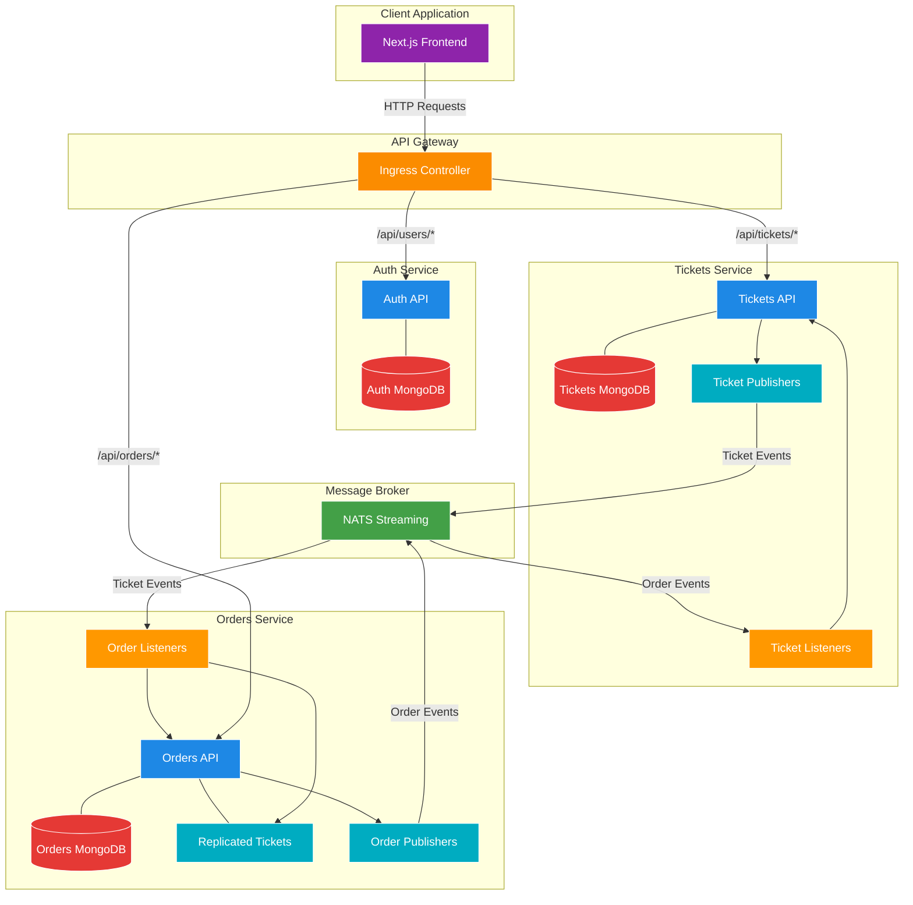
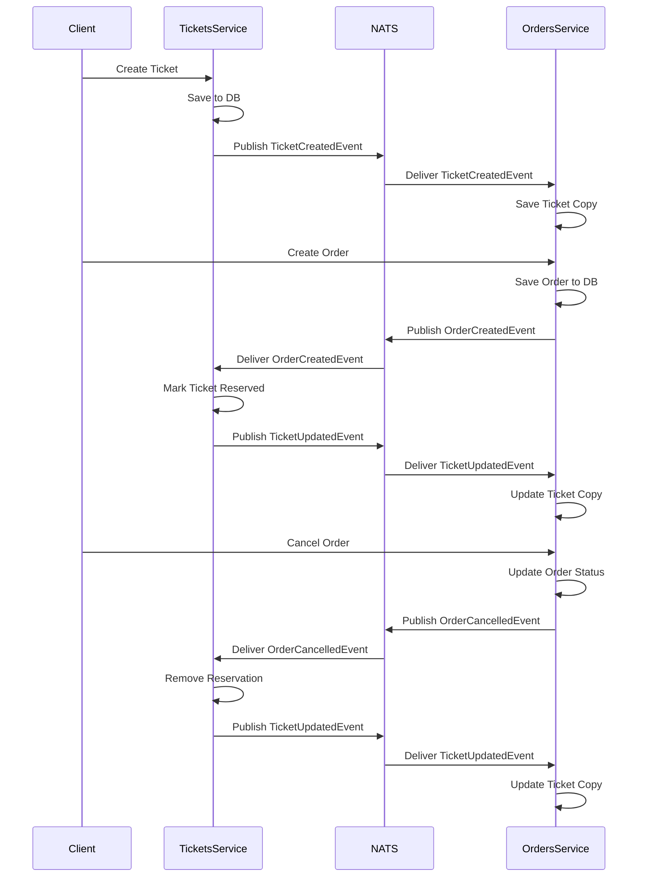
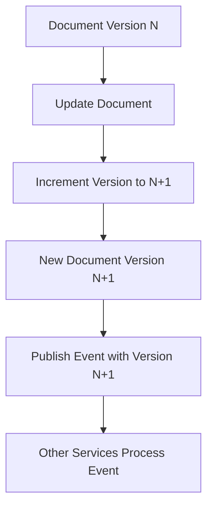
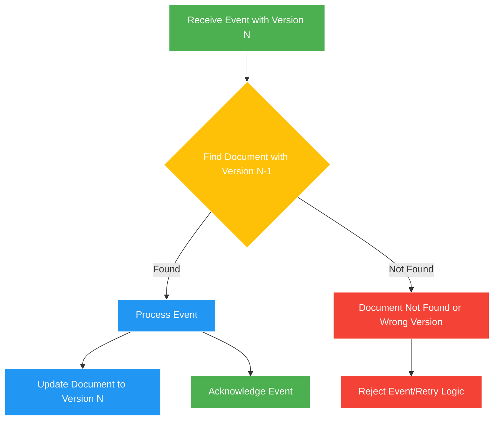
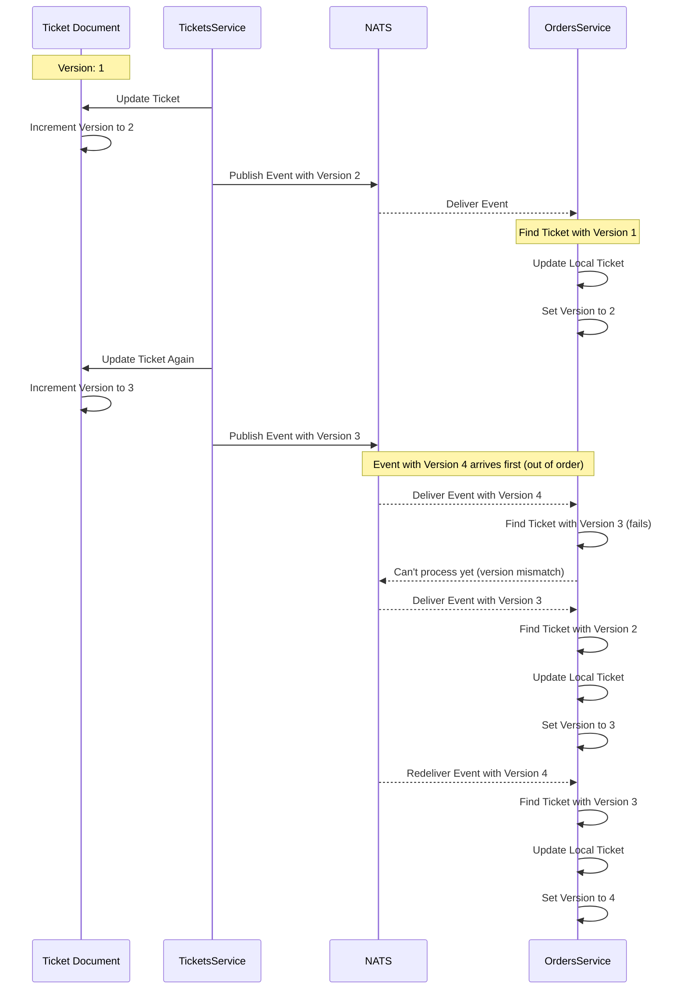
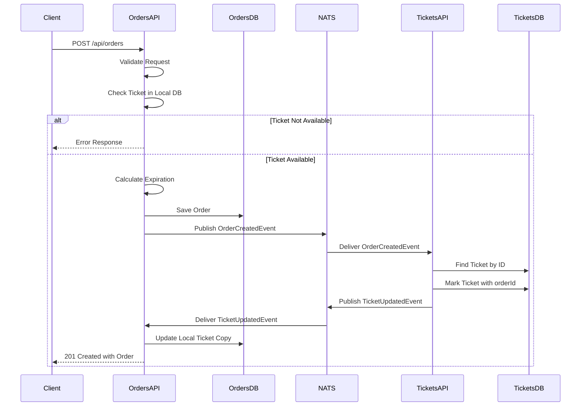
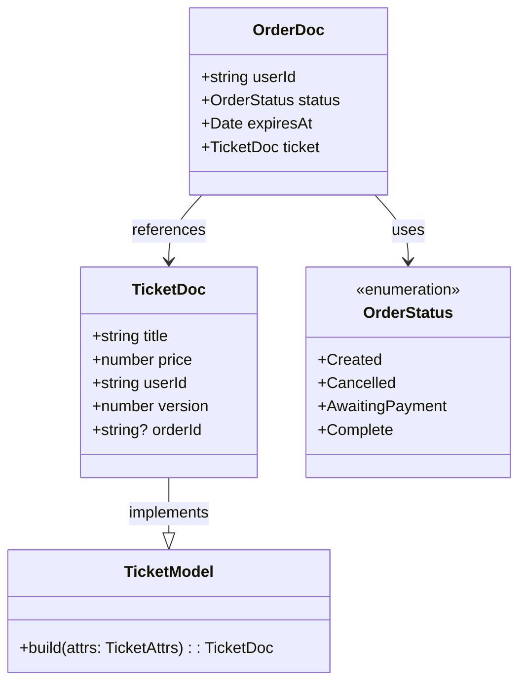
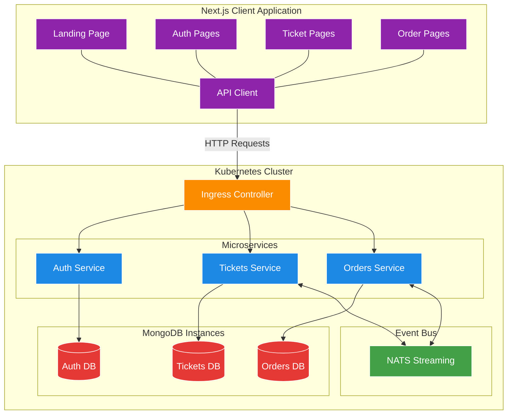
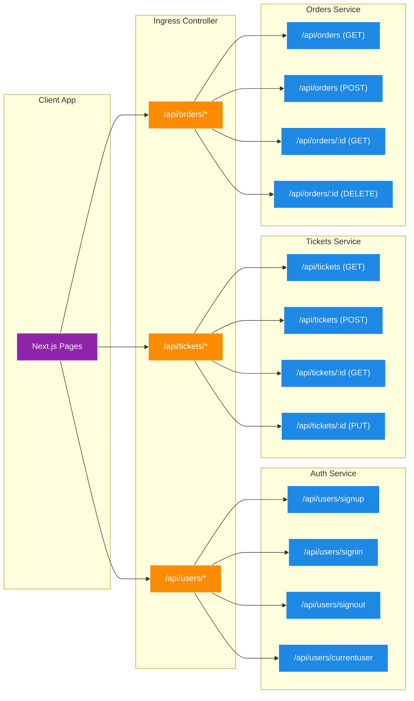

# Ticketing Application - Listening for Events and Handling Concurrency Issues

A microservices-based ticketing platform built with Node.js, TypeScript, and Kubernetes, featuring a complete event-driven architecture with bi-directional event flow and concurrency management.

## What's Changed from Version 17 (Understanding Event Flow)

Version 18 builds upon the event publishing foundation established in version 17, completing the event-driven architecture with event listening and concurrency control:

### Event Listener Implementation

- **Ticket Event Listeners in Orders Service**: Orders service now listens for ticket-related events

  ```typescript
  // in orders/src/events/listeners/ticket-created-listener.ts
  export class TicketCreatedListener extends Listener<TicketCreatedEvent> {
    subject: Subjects.TicketCreated = Subjects.TicketCreated;
    queueGroupName = queueGroupName;

    async onMessage(data: TicketCreatedEvent['data'], msg: Message) {
      const { id, title, price } = data;

      const ticket = Ticket.build({
        id,
        title,
        price,
      });
      await ticket.save();

      msg.ack();
    }
  }
  ```

- **Order Event Listeners in Tickets Service**: Tickets service now listens for order-related events

  ```typescript
  // in tickets/src/events/listeners/order-created-listener.ts
  export class OrderCreatedListener extends Listener<OrderCreatedEvent> {
    subject: Subjects.OrderCreated = Subjects.OrderCreated;
    queueGroupName = queueGroupName;

    async onMessage(data: OrderCreatedEvent['data'], msg: Message) {
      // Find the ticket that the order is reserving
      const ticket = await Ticket.findById(data.ticket.id);

      // If no ticket, throw error
      if (!ticket) {
        throw new Error('Ticket not found');
      }

      // Mark the ticket as being reserved by setting its orderId property
      ticket.set({ orderId: data.id });

      // Save the ticket
      await ticket.save();
      await new TicketUpdatedPublisher(this.client).publish({
        id: ticket.id,
        price: ticket.price,
        title: ticket.title,
        userId: ticket.userId,
        orderId: ticket.orderId,
        version: ticket.version,
      });

      // ack the message
      msg.ack();
    }
  }
  ```

### Concurrency Management

- **Versioning with mongoose-update-if-current**: Added versioning to models for optimistic concurrency control

  ```typescript
  // in tickets/src/models/ticket.ts
  import { updateIfCurrentPlugin } from 'mongoose-update-if-current';
  
  interface TicketDoc extends mongoose.Document {
    // ...
    version: number;
    // ...
  }
  
  ticketSchema.set('versionKey', 'version');
  ticketSchema.plugin(updateIfCurrentPlugin);
  ```

- **Version-Based Event Processing**: Added methods to find documents by event with version checking

  ```typescript
  // in orders/src/models/ticket.ts
  interface TicketModel extends mongoose.Model<TicketDoc> {
    // ...
    findByEvent(event: {
      id: string;
      version: number;
    }): Promise<TicketDoc | null>;
  }
  
  ticketSchema.statics.findByEvent = (event: { id: string; version: number }) => {
    return Ticket.findOne({
      _id: event.id,
      version: event.version - 1,
    });
  };
  ```

### Ticket Reservation System

- **Order ID Tracking in Tickets**: Tickets now track which order has reserved them

  ```typescript
  // in tickets/src/models/ticket.ts
  interface TicketDoc extends mongoose.Document {
    // ...
    orderId?: string;
  }
  
  const ticketSchema = new mongoose.Schema(
    {
      // ...
      orderId: {
        type: String,
      },
    },
    // ...
  );
  ```

- **Reservation Logic**: Order creation and cancellation now update ticket reservation status

  ```typescript
  // In order-created-listener.ts
  ticket.set({ orderId: data.id });
  
  // In order-cancelled-listener.ts
  ticket.set({ orderId: undefined });
  ```

### Enhanced Event Types

- **Updated TicketUpdatedEvent Interface**: Now includes orderId field for reservation tracking

  ```typescript
  // in common/src/events/ticket-updated-event.ts
  export interface TicketUpdatedEvent {
    subject: Subjects.TicketUpdated;
    data: {
      id: string;
      version: number;
      title: string;
      price: number;
      userId: string;
      orderId?: string;
    };
  }
  ```

### Event Listener Registration

- **Listener Initialization on Service Startup**: Services now initialize listeners during startup

  ```typescript
  // in orders/src/index.ts
  new TicketCreatedListener(natsWrapper.client).listen();
  new TicketUpdatedListener(natsWrapper.client).listen();
  ```

## Architecture Overview

The application has evolved to implement a complete event-driven architecture with bi-directional event flow between services:



### Components Explained

- **Client Application**: Next.js frontend for user interactions
- **Ingress Controller**: Routes API requests to appropriate services
- **Auth Service**: Handles user authentication and authorization
- **Tickets Service**:
  - Manages ticket creation and updates
  - Publishes events when tickets change
  - Listens for order events to track ticket reservations
- **Orders Service**:
  - Manages order creation and cancellation
  - Maintains replicated ticket data
  - Publishes events when orders change
  - Listens for ticket events to update local ticket data
- **NATS Streaming**: Message broker enabling asynchronous communication between services

## Bi-Directional Event Flow

Version 18 implements a complete bi-directional event flow between services:



This bi-directional flow ensures that all services have consistent data while remaining loosely coupled. Each service maintains its own database and domain logic, communicating only through events.

## Concurrency Management

Version 18 implements optimistic concurrency control to handle concurrent updates and ensure events are processed in the correct order:

### Versioning with Mongoose



### Version-Based Event Processing



### Event Processing Sequence with Versioning



This approach ensures that events are processed in the correct order, even if they arrive out of order, which is crucial in distributed systems.

## Order Creation with Event Flow

The order creation process now involves multiple services and event exchanges:



## Ticket Model with Reservation

The Ticket model in the Tickets service now includes reservation tracking:



## Frontend and Backend Integration

The complete system with frontend integration and event flows:



### API Routes and Service Interactions



## Implementation Details

### Listener Base Class

The common library provides a base Listener class:

```typescript
// Base Listener in common library
export abstract class Listener<T extends Event> {
  abstract subject: T['subject'];
  abstract queueGroupName: string;
  abstract onMessage(data: T['data'], msg: Message): void;
  protected client: Stan;
  protected ackWait = 5 * 1000;

  constructor(client: Stan) {
    this.client = client;
  }

  subscriptionOptions() {
    return this.client
      .subscriptionOptions()
      .setDeliverAllAvailable()
      .setManualAckMode(true)
      .setAckWait(this.ackWait)
      .setDurableName(this.queueGroupName);
  }

  listen() {
    const subscription = this.client.subscribe(
      this.subject,
      this.queueGroupName,
      this.subscriptionOptions()
    );

    subscription.on('message', (msg: Message) => {
      console.log(`Message received: ${this.subject} / ${this.queueGroupName}`);

      const parsedData = this.parseMessage(msg);
      this.onMessage(parsedData, msg);
    });
  }

  parseMessage(msg: Message) {
    const data = msg.getData();
    return typeof data === 'string'
      ? JSON.parse(data)
      : JSON.parse(data.toString('utf8'));
  }
}
```

### Ticket Model with Versioning

```typescript
// in tickets/src/models/ticket.ts
import mongoose from 'mongoose';
import { updateIfCurrentPlugin } from 'mongoose-update-if-current';

interface TicketAttrs {
  title: string;
  price: number;
  userId: string;
}

interface TicketDoc extends mongoose.Document {
  title: string;
  price: number;
  userId: string;
  version: number;
  orderId?: string;
}

interface TicketModel extends mongoose.Model<TicketDoc> {
  build(attrs: TicketAttrs): TicketDoc;
}

const ticketSchema = new mongoose.Schema(
  {
    title: {
      type: String,
      required: true,
    },
    price: {
      type: Number,
      required: true,
    },
    userId: {
      type: String,
      required: true,
    },
    orderId: {
      type: String,
    },
  },
  {
    toJSON: {
      transform(doc, ret) {
        ret.id = ret._id;
        delete ret._id;
      },
    },
  }
);

// Configure versioning
ticketSchema.set('versionKey', 'version');
ticketSchema.plugin(updateIfCurrentPlugin);

// Factory method
ticketSchema.statics.build = (attrs: TicketAttrs) => {
  return new Ticket(attrs);
};

const Ticket = mongoose.model<TicketDoc, TicketModel>('Ticket', ticketSchema);
```

### Ticket Updated Event with Order ID

```typescript
// in common/src/events/ticket-updated-event.ts
export interface TicketUpdatedEvent {
  subject: Subjects.TicketUpdated;
  data: {
    id: string;
    version: number;
    title: string;
    price: number;
    userId: string;
    orderId?: string;
  };
}
```

### Version-Based Event Processing

```typescript
// in orders/src/models/ticket.ts
interface TicketModel extends mongoose.Model<TicketDoc> {
  findByEvent(event: {
    id: string;
    version: number;
  }): Promise<TicketDoc | null>;
}

ticketSchema.statics.findByEvent = (event: { id: string; version: number }) => {
  return Ticket.findOne({
    _id: event.id,
    version: event.version - 1,
  });
};
```

### Listener Implementation

```typescript
// in orders/src/events/listeners/ticket-updated-listener.ts
export class TicketUpdatedListener extends Listener<TicketUpdatedEvent> {
  subject: Subjects.TicketUpdated = Subjects.TicketUpdated;
  queueGroupName = queueGroupName;

  async onMessage(data: TicketUpdatedEvent['data'], msg: Message) {
    const ticket = await Ticket.findByEvent(data);

    if (!ticket) {
      throw new Error('Ticket not found');
    }

    const { title, price } = data;
    ticket.set({ title, price });
    await ticket.save();

    msg.ack();
  }
}
```

## Running the Application

### Prerequisites

1. **Docker Desktop** with Kubernetes enabled
2. **kubectl** command-line tool
3. **Skaffold** for development workflow
4. **Ingress-NGINX Controller** installed in your cluster

### Environment Setup

1. **Configure local hosts file**

   ```
   127.0.0.1 ticketing.dev
   ```

2. **Create JWT Secret**

   ```bash
   kubectl create secret generic jwt-secret --from-literal=JWT_KEY=your_jwt_secret_key
   ```

### Starting the Application

Start the development environment using Skaffold:

```bash
skaffold dev
```

This will:

1. Start all services (Auth, Tickets, Orders, Client, NATS)
2. Configure all required connections
3. Set up the ingress controller for routing
4. Register event listeners for cross-service communication

## Conclusion

Version 18 represents a significant evolution of the ticketing application by implementing a complete event-driven architecture with bi-directional event flow and robust concurrency control. The addition of event listeners and versioning mechanisms ensures data consistency across services while maintaining loose coupling. This architecture provides a solid foundation for building scalable, resilient microservices systems.
