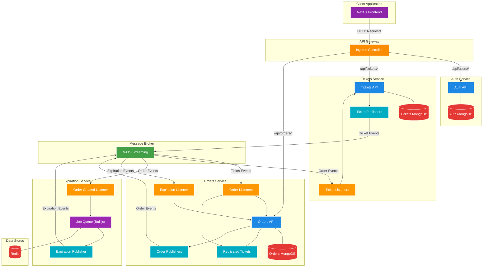
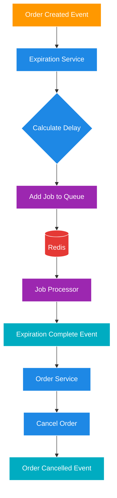
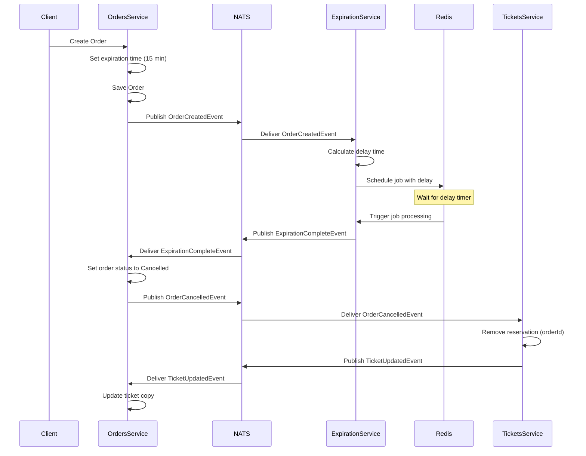
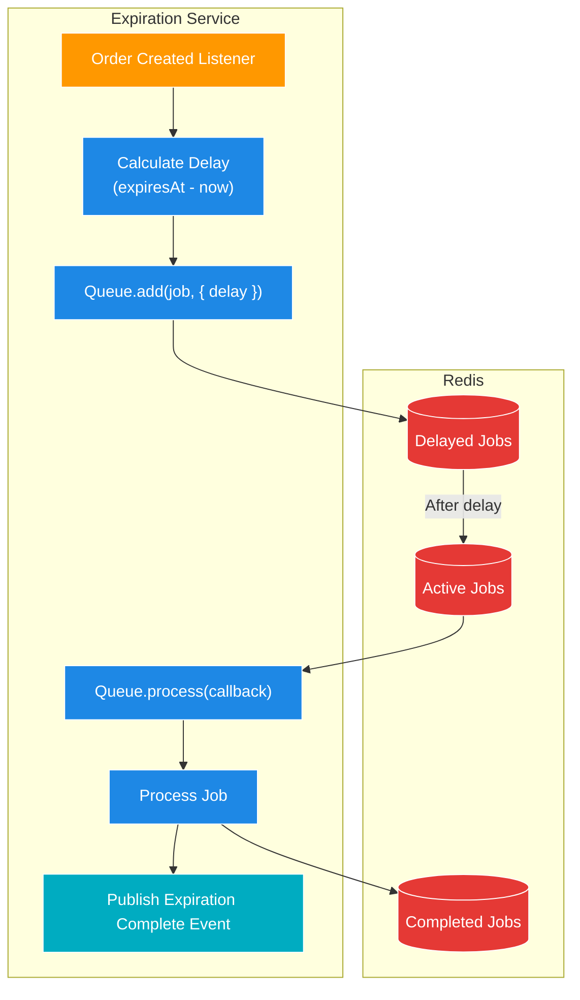
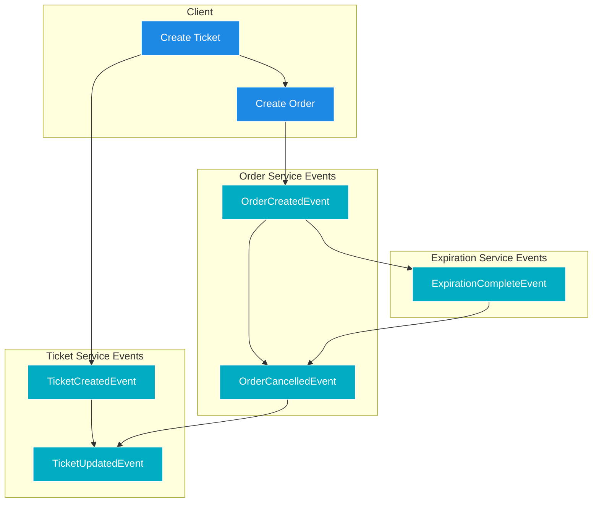
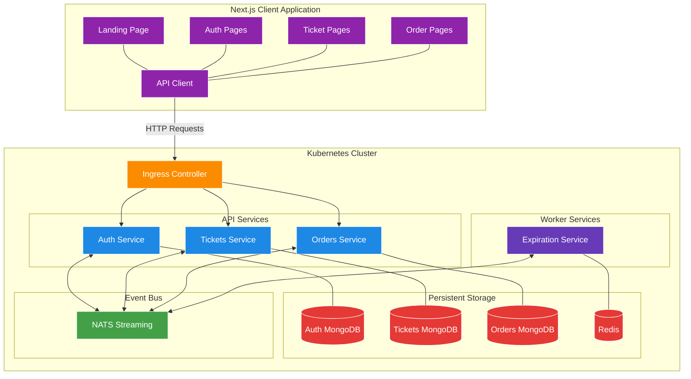

# Ticketing Application - Worker Services

A microservices-based ticketing platform built with Node.js, TypeScript, and Kubernetes, now featuring a dedicated worker service for handling order expirations using job queues.

## What's Changed from Version 18 (Listening for Events and Handling Concurrency Issues)

Version 19 builds upon the bi-directional event flow architecture established in version 18, adding a dedicated worker service for handling time-dependent operations:

### New Expiration Service

- **Worker Service Pattern**: Added a dedicated service that exclusively processes background tasks

  ```typescript
  // in expiration/src/index.ts
  const start = async () => {
    // Connect to NATS
    await natsWrapper.connect(/* ... */);
    
    // Start listening for events
    new OrderCreatedListener(natsWrapper.client).listen();
  };
  
  start();
  ```

- **Bull.js Job Queue with Redis**: Implemented delayed job processing using Bull.js and Redis

  ```typescript
  // in expiration/src/queues/expiration-queue.ts
  import Queue from 'bull';
  import { ExpirationCompletePublisher } from '../events/publishers/expiration-complete-publisher';
  import { natsWrapper } from '../nats-wrapper';

  interface Payload {
    orderId: string;
  }

  const expirationQueue = new Queue<Payload>('order:expiration', {
    redis: {
      host: process.env.REDIS_HOST,
    },
  });

  expirationQueue.process(async (job) => {
    new ExpirationCompletePublisher(natsWrapper.client).publish({
      orderId: job.data.orderId,
    });
  });

  export { expirationQueue };
  ```

### Order Expiration Workflow

- **Expiration Scheduling**: Automatic scheduling of order expiration based on creation time

  ```typescript
  // in expiration/src/events/listeners/order-created-listener.ts
  async onMessage(data: OrderCreatedEvent['data'], msg: Message) {
    const delay = new Date(data.expiresAt).getTime() - new Date().getTime();
    console.log('Waiting this many milliseconds to process the job:', delay);

    await expirationQueue.add(
      {
        orderId: data.id,
      },
      {
        delay,
      }
    );

    msg.ack();
  }
  ```

- **Automatic Order Cancellation**: Handling expiration events to cancel orders

  ```typescript
  // in orders/src/events/listeners/expiration-complete-listener.ts
  async onMessage(data: ExpirationCompleteEvent['data'], msg: Message) {
    const order = await Order.findById(data.orderId).populate('ticket');

    if (!order) {
      throw new Error('Order not found');
    }

    order.set({
      status: OrderStatus.Cancelled,
    });
    await order.save();
    await new OrderCancelledPublisher(this.client).publish({
      id: order.id,
      version: order.version,
      ticket: {
        id: order.ticket.id,
      },
    });

    msg.ack();
  }
  ```

### New Event Types

- **Expiration Complete Event**: Added new event for order expiration notifications

  ```typescript
  // in common/src/events/expiration-complete-event.ts
  export interface ExpirationCompleteEvent {
    subject: Subjects.ExpirationComplete;
    data: {
      orderId: string;
    };
  }
  
  // in common/src/events/subjects.ts
  export enum Subjects {
    // ...existing subjects
    ExpirationComplete = 'expiration:complete',
  }
  ```

### New Infrastructure Components

- **Redis Deployment**: Added Redis for Bull.js job queue persistence
- **Expiration Service Deployment**: Kubernetes deployment for the new worker service

## Architecture Overview

The application has evolved to include a worker service pattern for handling background tasks:



### Components Explained

- **Client Application**: Next.js frontend for user interactions
- **API Gateway**: Ingress controller routing requests to appropriate services
- **Auth Service**: Handles user authentication and authorization
- **Tickets Service**: Manages ticket creation and updates
- **Orders Service**: Manages order creation and cancellation, listens for expiration events
- **Expiration Service**: Worker service that schedules and processes order expirations
- **Redis**: Persistence store for job queues
- **NATS Streaming**: Message broker for event-based communication

## Worker Service Pattern

The Expiration service demonstrates the Worker Service pattern, a specialized microservice dedicated to processing background tasks without external API endpoints:



### Key Characteristics

1. **No API Endpoints**: The service doesn't expose any HTTP endpoints
2. **Event-Driven**: Triggered exclusively through events
3. **Single Responsibility**: Focused solely on time-based operations
4. **Stateless Processing**: Doesn't maintain application state beyond the job queue
5. **Scalable**: Can be horizontally scaled for higher throughput

## Order Expiration Flow

The complete order expiration flow demonstrates the integration of the worker service pattern:



## Job Queue Implementation

The Expiration service implements a job queue using Bull.js and Redis:



### Job Queue Workflow

1. **Job Creation**: When an OrderCreatedEvent is received, a job is added to the queue with a delay
2. **Delay Calculation**: The delay is calculated as the time difference between the order expiration time and now
3. **Job Storage**: Redis stores the job in a sorted set, sorted by the time it should be executed
4. **Job Processing**: When the delay time elapses, the job is moved to the active queue and processed
5. **Event Publication**: Upon processing, an ExpirationCompleteEvent is published

## Complete Event Flow

The complete event flow now includes order expiration events:



## Implementation Details

### Expiration Service Core Components

1. **OrderCreatedListener**: Listens for OrderCreatedEvents and schedules jobs
2. **ExpirationQueue**: Bull.js queue that manages delayed job processing
3. **ExpirationCompletePublisher**: Publishes events when jobs complete

### Bull.js Queue Configuration

```typescript
// in expiration/src/queues/expiration-queue.ts
import Queue from 'bull';

// Define job payload type
interface Payload {
  orderId: string;
}

// Create queue with Redis connection
const expirationQueue = new Queue<Payload>('order:expiration', {
  redis: {
    host: process.env.REDIS_HOST,
  },
});

// Define job processor
expirationQueue.process(async (job) => {
  new ExpirationCompletePublisher(natsWrapper.client).publish({
    orderId: job.data.orderId,
  });
});
```

### Order Cancellation on Expiration

```typescript
// in orders/src/events/listeners/expiration-complete-listener.ts
export class ExpirationCompleteListener extends Listener<ExpirationCompleteEvent> {
  queueGroupName = queueGroupName;
  subject: Subjects.ExpirationComplete = Subjects.ExpirationComplete;

  async onMessage(data: ExpirationCompleteEvent['data'], msg: Message) {
    const order = await Order.findById(data.orderId).populate('ticket');

    if (!order) {
      throw new Error('Order not found');
    }

    order.set({
      status: OrderStatus.Cancelled,
    });
    await order.save();
    await new OrderCancelledPublisher(this.client).publish({
      id: order.id,
      version: order.version,
      ticket: {
        id: order.ticket.id,
      },
    });

    msg.ack();
  }
}
```

## Kubernetes Configuration

### Expiration Service Deployment

```yaml
# in infra/k8s/expiration-depl.yaml
apiVersion: apps/v1
kind: Deployment
metadata:
  name: expiration-depl
spec:
  replicas: 1
  selector:
    matchLabels:
      app: expiration
  template:
    metadata:
      labels:
        app: expiration
    spec:
      containers:
        - name: expiration
          image: rallycoding/expiration
          env:
            - name: NATS_CLIENT_ID
              valueFrom:
                fieldRef:
                  fieldPath: metadata.name
            - name: NATS_URL
              value: 'http://nats-srv:4222'
            - name: NATS_CLUSTER_ID
              value: ticketing
            - name: REDIS_HOST
              value: expiration-redis-srv
```

### Redis Deployment

```yaml
# in infra/k8s/expiration-redis-depl.yaml
apiVersion: apps/v1
kind: Deployment
metadata:
  name: expiration-redis-depl
spec:
  replicas: 1
  selector:
    matchLabels:
      app: expiration-redis
  template:
    metadata:
      labels:
        app: expiration-redis
    spec:
      containers:
        - name: expiration-redis
          image: redis
---
apiVersion: v1
kind: Service
metadata:
  name: expiration-redis-srv
spec:
  selector:
    app: expiration-redis
  ports:
    - name: db
      protocol: TCP
      port: 6379
      targetPort: 6379
```

## Frontend and Backend Integration

The frontend integration remains unchanged, but the backend now includes the expiration workflow:



## Running the Application

### Prerequisites

1. **Docker Desktop** with Kubernetes enabled
2. **kubectl** command-line tool
3. **Skaffold** for development workflow
4. **Ingress-NGINX Controller** installed in your cluster
5. **Redis** (automatically deployed via Kubernetes)

### Environment Setup

1. **Configure local hosts file**

   ```
   127.0.0.1 ticketing.dev
   ```

2. **Create JWT Secret**

   ```bash
   kubectl create secret generic jwt-secret --from-literal=JWT_KEY=your_jwt_secret_key
   ```

### Starting the Application

Start the development environment using Skaffold:

```bash
skaffold dev
```

This will:

1. Start all services (Auth, Tickets, Orders, Expiration, Client, NATS, Redis)
2. Configure all required connections
3. Set up the ingress controller for routing
4. Register event listeners for cross-service communication
5. Initialize the job queue for order expiration processing

## Conclusion

Version 19 represents a significant architectural enhancement with the addition of the Worker Service pattern through the Expiration service. This pattern enables reliable time-based operations and background processing, which are critical in real-world distributed systems. The use of Bull.js with Redis for job queues demonstrates how to handle delayed processing in a microservices environment, enabling the system to automatically expire and cancel orders that haven't been completed within the defined timeframe.
