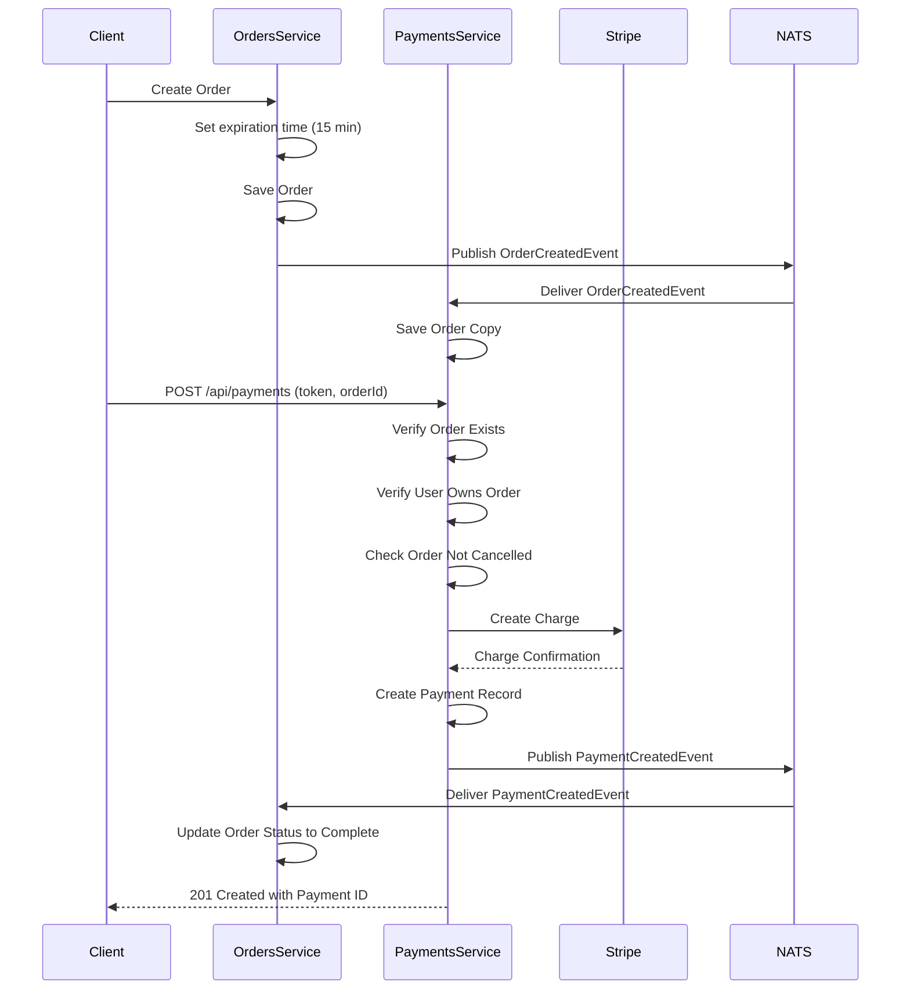
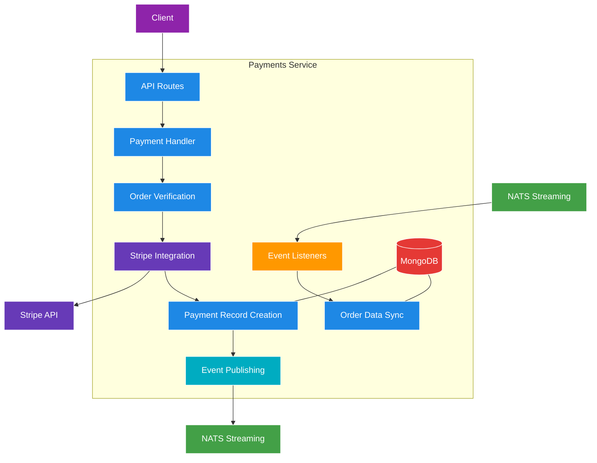
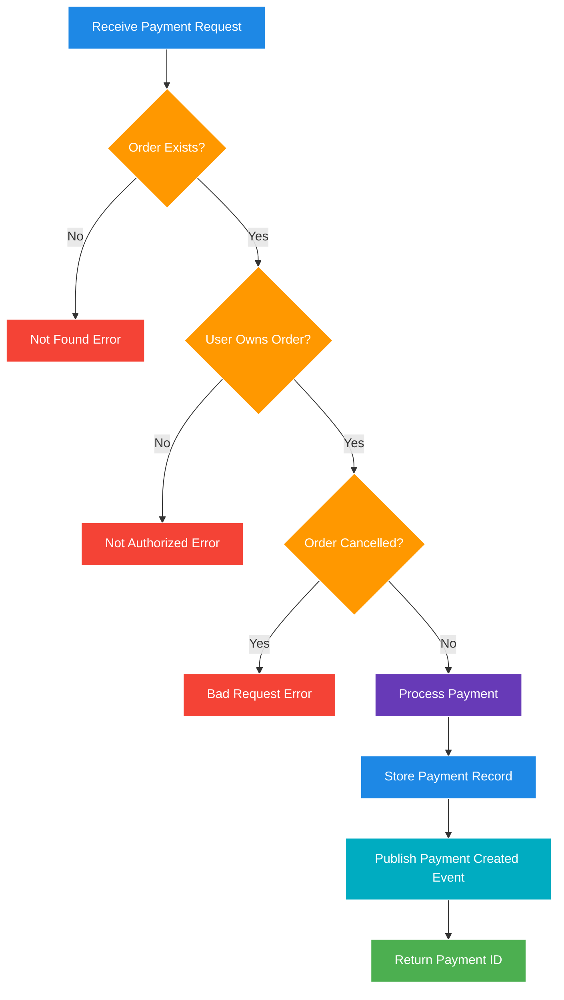
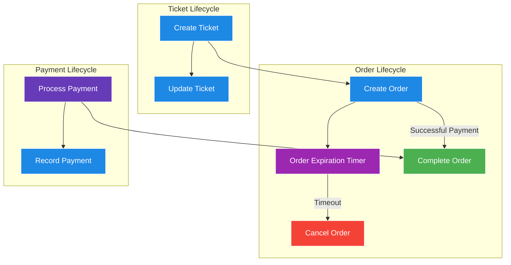
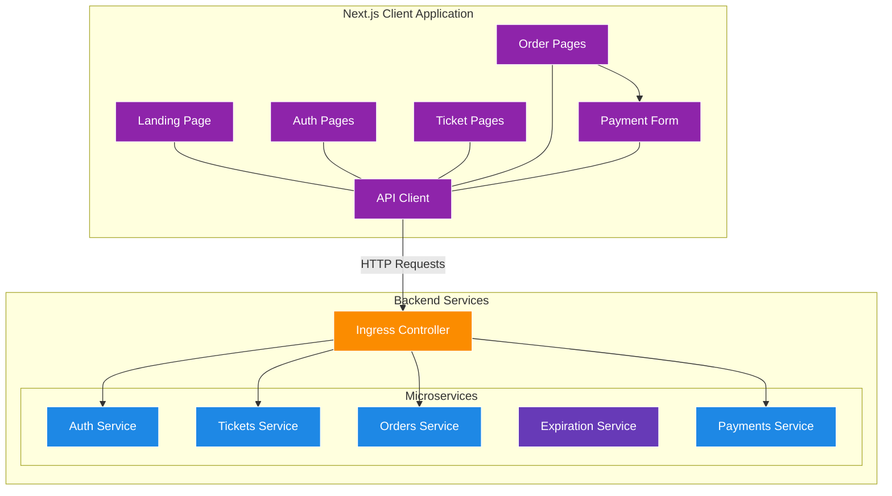
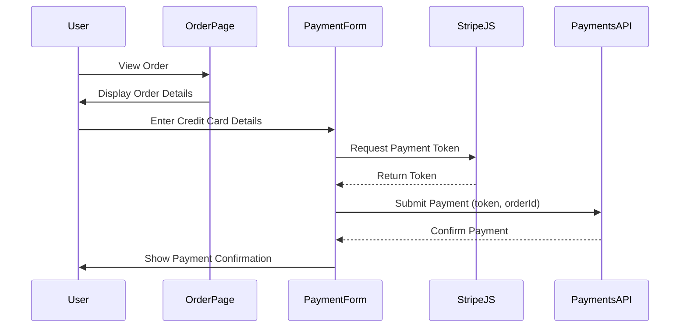

# Ticketing Application - Handling Payments

A microservices-based ticketing platform built with Node.js, TypeScript, and Kubernetes, now featuring payment processing capabilities with Stripe integration.

## What's Changed from Version 19 (Worker Services)

Version 20 builds upon the worker service pattern established in version 19, adding a complete payment processing system:

### New Payments Service

- **Payment Processing with Stripe**: Added a dedicated service for payment processing

  ```typescript
  // in payments/src/stripe.ts
  import Stripe from 'stripe';

  export const stripe = new Stripe(process.env.STRIPE_KEY!, {
    apiVersion: '2024-09-30.acacia',
  });
  ```

- **Payment API**: Created an endpoint for processing payments

  ```typescript
  // in payments/src/routes/new.ts
  router.post(
    '/api/payments',
    requireAuth,
    [body('token').not().isEmpty(), body('orderId').not().isEmpty()],
    validateRequest,
    async (req: Request, res: Response) => {
      const { token, orderId } = req.body;

      // Verify order and authorization
      const order = await Order.findById(orderId);
      if (!order) {
        throw new NotFoundError();
      }
      if (order.userId !== req.currentUser!.id) {
        throw new NotAuthorizedError();
      }
      if (order.status === OrderStatus.Cancelled) {
        throw new BadRequestError('Cannot pay for an cancelled order');
      }

      // Process payment with Stripe
      const charge = await stripe.charges.create({
        currency: 'usd',
        amount: order.price * 100,
        source: token,
      });

      // Save payment record
      const payment = Payment.build({
        orderId,
        stripeId: charge.id,
      });
      await payment.save();

      // Publish payment event
      new PaymentCreatedPublisher(natsWrapper.client).publish({
        id: payment.id,
        orderId: payment.orderId,
        stripeId: payment.stripeId,
      });

      res.status(201).send({ id: payment.id });
    }
  );
  ```

### Payment Data Models

- **Payment Record Storage**: Added a model for tracking payments

  ```typescript
  // in payments/src/models/payment.ts
  interface PaymentAttrs {
    orderId: string;
    stripeId: string;
  }

  interface PaymentDoc extends mongoose.Document {
    orderId: string;
    stripeId: string;
  }

  const paymentSchema = new mongoose.Schema(
    {
      orderId: {
        required: true,
        type: String,
      },
      stripeId: {
        required: true,
        type: String,
      },
    },
    {
      toJSON: {
        transform(doc, ret) {
          ret.id = ret._id;
          delete ret._id;
        },
      },
    }
  );
  ```

- **Order Replication**: Maintained order data in the payments service

  ```typescript
  // in payments/src/models/order.ts
  interface OrderAttrs {
    id: string;
    version: number;
    userId: string;
    price: number;
    status: OrderStatus;
  }

  const orderSchema = new mongoose.Schema(
    {
      userId: {
        type: String,
        required: true,
      },
      price: {
        type: Number,
        required: true,
      },
      status: {
        type: String,
        required: true,
      },
    },
    {
      toJSON: {
        transform(doc, ret) {
          ret.id = ret._id;
          delete ret._id;
        },
      },
    }
  );

  orderSchema.set('versionKey', 'version');
  orderSchema.plugin(updateIfCurrentPlugin);
  ```

### New Event Types

- **Payment Created Event**: Added event for notifying services about completed payments

  ```typescript
  // in common/src/events/payment-created-event.ts
  export interface PaymentCreatedEvent {
    subject: Subjects.PaymentCreated;
    data: {
      id: string;
      orderId: string;
      stripeId: string;
    };
  }
  
  // in common/src/events/subjects.ts
  export enum Subjects {
    // ...existing subjects
    PaymentCreated = 'payment:created',
  }
  ```

### Event Listeners for Payment Service

- **Order Created Listener**: Syncs order data to the payments service

  ```typescript
  // in payments/src/events/listeners/order-created-listener.ts
  export class OrderCreatedListener extends Listener<OrderCreatedEvent> {
    subject: Subjects.OrderCreated = Subjects.OrderCreated;
    queueGroupName = queueGroupName;

    async onMessage(data: OrderCreatedEvent['data'], msg: Message) {
      const order = Order.build({
        id: data.id,
        price: data.ticket.price,
        status: data.status,
        userId: data.userId,
        version: data.version,
      });
      await order.save();

      msg.ack();
    }
  }
  ```

- **Order Cancelled Listener**: Updates order status in the payments service

  ```typescript
  // in payments/src/events/listeners/order-cancelled-listener.ts
  export class OrderCancelledListener extends Listener<OrderCancelledEvent> {
    subject: Subjects.OrderCancelled = Subjects.OrderCancelled;
    queueGroupName = queueGroupName;

    async onMessage(data: OrderCancelledEvent['data'], msg: Message) {
      const order = await Order.findOne({
        _id: data.id,
        version: data.version - 1,
      });

      if (!order) {
        throw new Error('Order not found');
      }

      order.set({ status: OrderStatus.Cancelled });
      await order.save();

      msg.ack();
    }
  }
  ```

## Architecture Overview

The application has evolved to include payment processing capabilities:

```mermaid
graph TD
    subgraph "Client Application"
        ClientApp["Next.js Frontend"]
    end
    
    subgraph "API Gateway"
        Ingress["Ingress Controller"]
    end
    
    subgraph "Auth Service"
        AuthAPI["Auth API"]
        AuthDB[(Auth MongoDB)]
        AuthAPI --- AuthDB
    end
    
    subgraph "Tickets Service"
        TicketsAPI["Tickets API"]
        TicketsDB[(Tickets MongoDB)]
        TicketPublishers["Ticket Publishers"]
        TicketListeners["Ticket Listeners"]
        
        TicketsAPI --- TicketsDB
        TicketsAPI --> TicketPublishers
        TicketListeners --> TicketsAPI
    end
    
    subgraph "Orders Service"
        OrdersAPI["Orders API"]
        OrdersDB[(Orders MongoDB)]
        ReplicatedTickets["Replicated Tickets"]
        OrderPublishers["Order Publishers"]
        OrderListeners["Order Listeners"]
        ExpirationListener["Expiration Listener"]
        PaymentListener["Payment Listener"]
        
        OrdersAPI --- OrdersDB
        OrdersAPI --- ReplicatedTickets
        OrdersAPI --> OrderPublishers
        OrderListeners --> OrdersAPI
        OrderListeners --> ReplicatedTickets
        ExpirationListener --> OrdersAPI
        PaymentListener --> OrdersAPI
    end
    
    subgraph "Expiration Service"
        OrderCreatedListener2["Order Created Listener"]
        JobQueue["Job Queue (Bull.js)"]
        ExpirationPublisher["Expiration Publisher"]
        
        OrderCreatedListener2 --> JobQueue
        JobQueue --> ExpirationPublisher
    end
    
    subgraph "Payments Service"
        PaymentsAPI["Payments API"]
        PaymentsDB[(Payments MongoDB)]
        OrderCreatedListener3["Order Created Listener"]
        OrderCancelledListener["Order Cancelled Listener"]
        PaymentPublisher["Payment Publisher"]
        StripeAPI["Stripe API"]
        
        PaymentsAPI --- PaymentsDB
        PaymentsAPI --- StripeAPI
        OrderCreatedListener3 --> PaymentsAPI
        OrderCancelledListener --> PaymentsAPI
        PaymentsAPI --> PaymentPublisher
    end
    
    subgraph "Data Stores"
        Redis[(Redis)]
        JobQueue --- Redis
    end
    
    subgraph "Message Broker"
        NATS["NATS Streaming"]
    end
    
    subgraph "External Services"
        StripeGateway["Stripe Payment Gateway"]
        StripeAPI --- StripeGateway
    end
    
    ClientApp -- "HTTP Requests" --> Ingress
    Ingress -- "/api/users/*" --> AuthAPI
    Ingress -- "/api/tickets/*" --> TicketsAPI
    Ingress -- "/api/orders/*" --> OrdersAPI
    Ingress -- "/api/payments/*" --> PaymentsAPI
    
    TicketPublishers -- "Ticket Events" --> NATS
    OrderPublishers -- "Order Events" --> NATS
    ExpirationPublisher -- "Expiration Events" --> NATS
    PaymentPublisher -- "Payment Events" --> NATS
    
    NATS -- "Ticket Events" --> OrderListeners
    NATS -- "Order Events" --> TicketListeners
    NATS -- "Order Events" --> OrderCreatedListener2
    NATS -- "Order Events" --> OrderCreatedListener3
    NATS -- "Order Events" --> OrderCancelledListener
    NATS -- "Expiration Events" --> ExpirationListener
    NATS -- "Payment Events" --> PaymentListener
    
    style ClientApp fill:#8e24aa,stroke:#fff,stroke-width:1px,color:#fff
    style Ingress fill:#fb8c00,stroke:#fff,stroke-width:1px,color:#fff
    style AuthAPI fill:#1e88e5,stroke:#fff,stroke-width:1px,color:#fff
    style TicketsAPI fill:#1e88e5,stroke:#fff,stroke-width:1px,color:#fff
    style OrdersAPI fill:#1e88e5,stroke:#fff,stroke-width:1px,color:#fff
    style PaymentsAPI fill:#1e88e5,stroke:#fff,stroke-width:1px,color:#fff
    style AuthDB fill:#e53935,stroke:#fff,stroke-width:1px,color:#fff
    style TicketsDB fill:#e53935,stroke:#fff,stroke-width:1px,color:#fff
    style OrdersDB fill:#e53935,stroke:#fff,stroke-width:1px,color:#fff
    style PaymentsDB fill:#e53935,stroke:#fff,stroke-width:1px,color:#fff
    style Redis fill:#e53935,stroke:#fff,stroke-width:1px,color:#fff
    style NATS fill:#43a047,stroke:#fff,stroke-width:1px,color:#fff
    style TicketPublishers fill:#00acc1,stroke:#fff,stroke-width:1px,color:#fff
    style OrderPublishers fill:#00acc1,stroke:#fff,stroke-width:1px,color:#fff
    style ExpirationPublisher fill:#00acc1,stroke:#fff,stroke-width:1px,color:#fff
    style PaymentPublisher fill:#00acc1,stroke:#fff,stroke-width:1px,color:#fff
    style TicketListeners fill:#ff9800,stroke:#fff,stroke-width:1px,color:#fff
    style OrderListeners fill:#ff9800,stroke:#fff,stroke-width:1px,color:#fff
    style OrderCreatedListener2 fill:#ff9800,stroke:#fff,stroke-width:1px,color:#fff
    style OrderCreatedListener3 fill:#ff9800,stroke:#fff,stroke-width:1px,color:#fff
    style OrderCancelledListener fill:#ff9800,stroke:#fff,stroke-width:1px,color:#fff
    style ExpirationListener fill:#ff9800,stroke:#fff,stroke-width:1px,color:#fff
    style PaymentListener fill:#ff9800,stroke:#fff,stroke-width:1px,color:#fff
    style JobQueue fill:#9c27b0,stroke:#fff,stroke-width:1px,color:#fff
    style ReplicatedTickets fill:#00acc1,stroke:#fff,stroke-width:1px,color:#fff
    style StripeAPI fill:#673ab7,stroke:#fff,stroke-width:1px,color:#fff
    style StripeGateway fill:#673ab7,stroke:#fff,stroke-width:1px,color:#fff
```



### Components Explained

- **Client Application**: Next.js frontend for user interactions
- **API Gateway**: Ingress controller routing requests to appropriate services
- **Auth Service**: Handles user authentication and authorization
- **Tickets Service**: Manages ticket creation and updates
- **Orders Service**: Manages order creation and cancellation, listens for payment events
- **Expiration Service**: Worker service that schedules and processes order expirations
- **Payments Service**: New service that handles payment processing with Stripe
- **Redis**: Persistence store for job queues
- **NATS Streaming**: Message broker for event-based communication
- **Stripe Gateway**: External service for processing payments

## Payment Processing Flow

The payment processing flow integrates with the existing order workflow:



## Payment Service Architecture

The payments service includes several key components:



### API Endpoints

The payment service exposes the following API endpoint:

```
POST /api/payments
```

Request Body:

```json
{
  "token": "stripe_token",
  "orderId": "order_id"
}
```

Response:

```json
{
  "id": "payment_id"
}
```

### Payment Verification Process



## Complete Order-to-Payment Flow

The complete order-to-payment flow in the application:



## Frontend and Backend Integration

The frontend now includes payment processing UI components:



### User Payment Flow



## Implementation Details

### Payment Creation

```typescript
// in payments/src/routes/new.ts
const charge = await stripe.charges.create({
  currency: 'usd',
  amount: order.price * 100,
  source: token,
});

const payment = Payment.build({
  orderId,
  stripeId: charge.id,
});
await payment.save();

new PaymentCreatedPublisher(natsWrapper.client).publish({
  id: payment.id,
  orderId: payment.orderId,
  stripeId: payment.stripeId,
});
```

### Stripe Integration

```typescript
// in payments/src/stripe.ts
import Stripe from 'stripe';

export const stripe = new Stripe(process.env.STRIPE_KEY!, {
  apiVersion: '2024-09-30.acacia',
});
```

### Order Synchronization in Payment Service

```typescript
// in payments/src/events/listeners/order-created-listener.ts
async onMessage(data: OrderCreatedEvent['data'], msg: Message) {
  const order = Order.build({
    id: data.id,
    price: data.ticket.price,
    status: data.status,
    userId: data.userId,
    version: data.version,
  });
  await order.save();

  msg.ack();
}
```

## Kubernetes Configuration

### Payments Service Deployment

```yaml
# in infra/k8s/payments-depl.yaml
apiVersion: apps/v1
kind: Deployment
metadata:
  name: payments-depl
spec:
  replicas: 1
  selector:
    matchLabels:
      app: payments
  template:
    metadata:
      labels:
        app: payments
    spec:
      containers:
        - name: payments
          image: rallycoding/payments
          env:
            - name: NATS_CLIENT_ID
              valueFrom:
                fieldRef:
                  fieldPath: metadata.name
            - name: NATS_URL
              value: 'http://nats-srv:4222'
            - name: NATS_CLUSTER_ID
              value: ticketing
            - name: MONGO_URI
              value: 'mongodb://payments-mongo-srv:27017/payments'
            - name: JWT_KEY
              valueFrom:
                secretKeyRef:
                  name: jwt-secret
                  key: JWT_KEY
            - name: STRIPE_KEY
              valueFrom:
                secretKeyRef:
                  name: stripe-secret
                  key: STRIPE_KEY
---
apiVersion: v1
kind: Service
metadata:
  name: payments-srv
spec:
  selector:
    app: payments
  ports:
    - name: payments
      protocol: TCP
      port: 3000
      targetPort: 3000
```

### Payments MongoDB Deployment

```yaml
# in infra/k8s/payments-mongo-depl.yaml
apiVersion: apps/v1
kind: Deployment
metadata:
  name: payments-mongo-depl
spec:
  replicas: 1
  selector:
    matchLabels:
      app: payments-mongo
  template:
    metadata:
      labels:
        app: payments-mongo
    spec:
      containers:
        - name: payments-mongo
          image: mongo
---
apiVersion: v1
kind: Service
metadata:
  name: payments-mongo-srv
spec:
  selector:
    app: payments-mongo
  ports:
    - name: db
      protocol: TCP
      port: 27017
      targetPort: 27017
```

### Stripe Secret Configuration

```bash
kubectl create secret generic stripe-secret --from-literal=STRIPE_KEY=your_stripe_secret_key
```

## Running the Application

### Prerequisites

1. **Docker Desktop** with Kubernetes enabled
2. **kubectl** command-line tool
3. **Skaffold** for development workflow
4. **Ingress-NGINX Controller** installed in your cluster
5. **Redis** (automatically deployed via Kubernetes)
6. **Stripe Account** with API keys

### Environment Setup

1. **Configure local hosts file**

   ```
   127.0.0.1 ticketing.dev
   ```

2. **Create Secrets**

   ```bash
   kubectl create secret generic jwt-secret --from-literal=JWT_KEY=your_jwt_secret_key
   kubectl create secret generic stripe-secret --from-literal=STRIPE_KEY=your_stripe_secret_key
   ```

### Starting the Application

Start the development environment using Skaffold:

```bash
skaffold dev
```

This will:

1. Start all services (Auth, Tickets, Orders, Expiration, Payments, Client, NATS, Redis)
2. Configure all required connections
3. Set up the ingress controller for routing
4. Register event listeners for cross-service communication
5. Initialize the payment processing system

## Conclusion

Version 20 represents a significant enhancement to the ticketing application by implementing a complete payment processing system. This enables users to purchase tickets securely through Stripe, with proper order verification and status handling. The payments service seamlessly integrates with the existing event-driven architecture, maintaining data consistency across the system while adding crucial e-commerce functionality.
