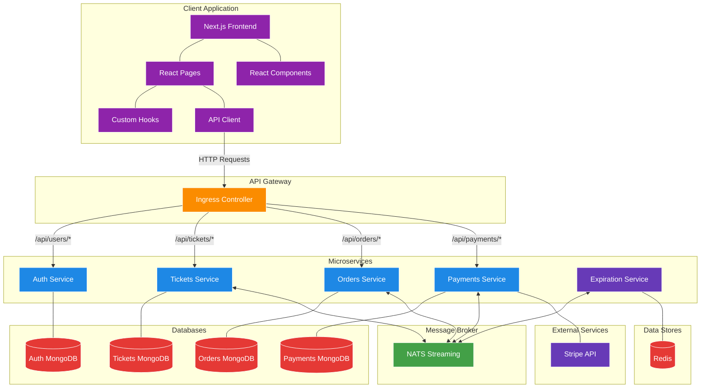
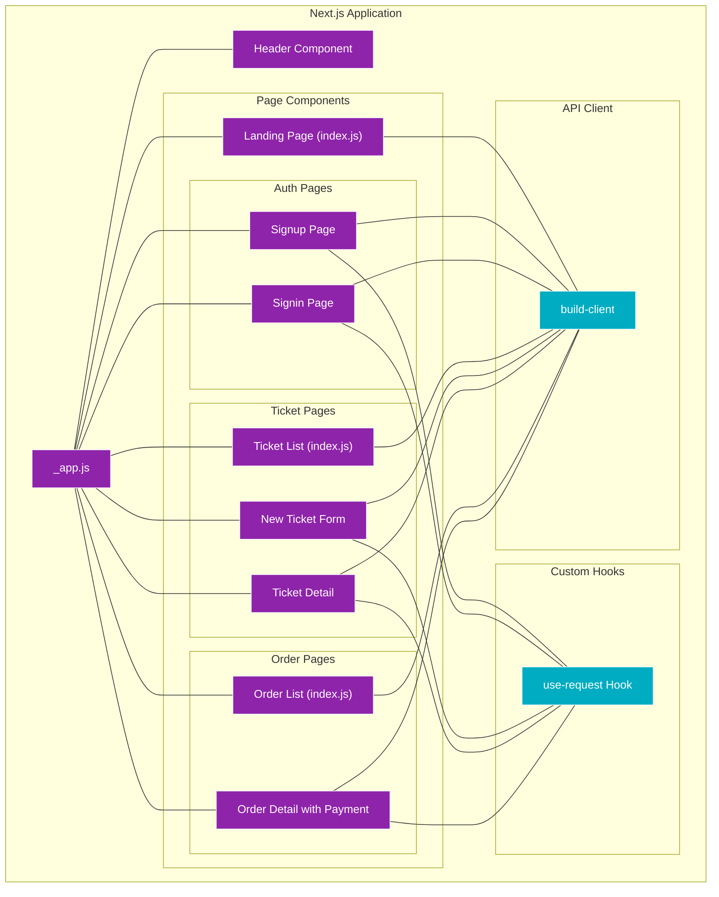
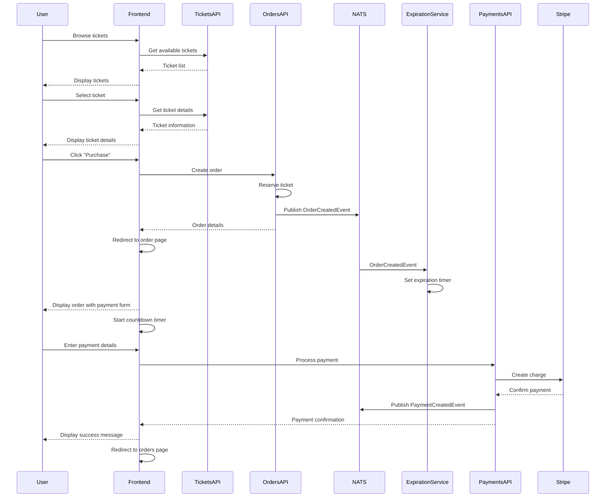
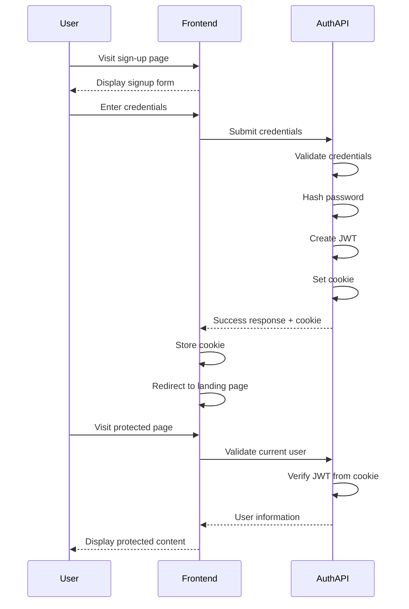
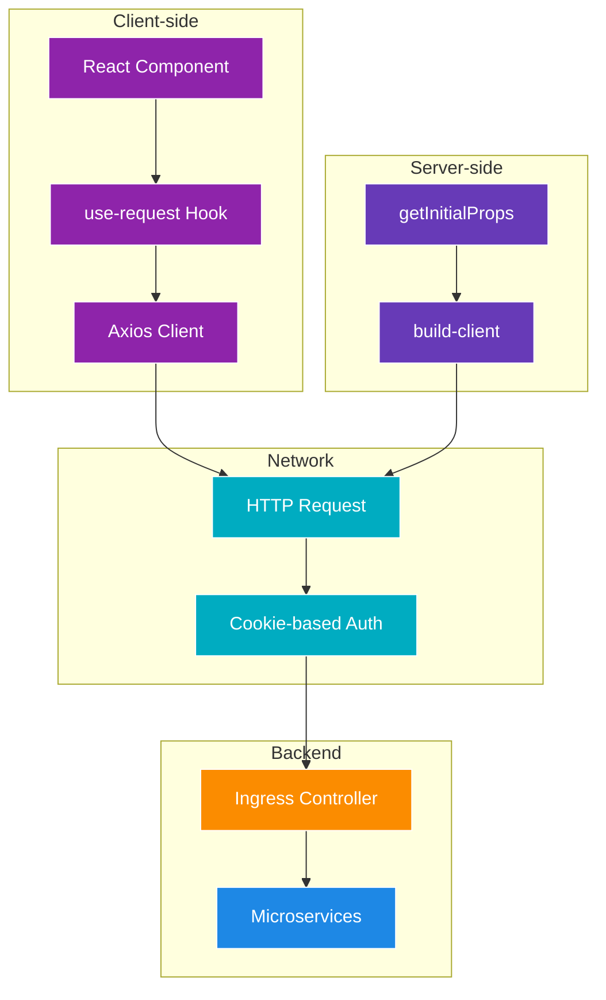
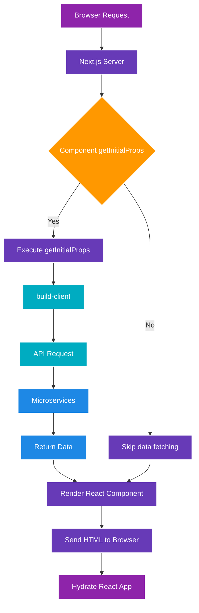

# Ticketing Application - Back to the Client

A complete microservices-based ticketing platform built with Node.js, TypeScript, React, and Kubernetes, featuring a comprehensive frontend interface that connects to all backend services.

## What's Changed from Version 20 (Handling Payments)

Version 21 builds upon the payment processing system established in version 20, completing the application with a full-featured frontend interface:

### Complete Client Application

- **Next.js-based Frontend**: Implemented server-side rendered React application with proper routing

  ```jsx
  // in client/pages/index.js
  const LandingPage = ({ currentUser, tickets }) => {
    const ticketList = tickets.map((ticket) => {
      return (
        <tr key={ticket.id}>
          <td>{ticket.title}</td>
          <td>{ticket.price}</td>
          <td>
            <Link href="/tickets/[ticketId]" as={`/tickets/${ticket.id}`}>
              View
            </Link>
          </td>
        </tr>
      );
    });

    return (
      <div>
        <h1>Tickets</h1>
        <table className="table">
          <thead>
            <tr>
              <th>Title</th>
              <th>Price</th>
              <th>Link</th>
            </tr>
          </thead>
          <tbody>{ticketList}</tbody>
        </table>
      </div>
    );
  };
  ```

- **Authentication UI**: Sign-in and sign-up forms with client-side validation

  ```jsx
  // in client/pages/auth/signin.js
  export default () => {
    const [email, setEmail] = useState('');
    const [password, setPassword] = useState('');
    const { doRequest, errors } = useRequest({
      url: '/api/users/signin',
      method: 'post',
      body: {
        email,
        password
      },
      onSuccess: () => Router.push('/')
    });

    // Form rendering and submission logic
  };
  ```

### Ticket Management Interface

- **Ticket Creation**: Form for creating new tickets with input validation

  ```jsx
  // in client/pages/tickets/new.js
  const NewTicket = () => {
    const [title, setTitle] = useState('');
    const [price, setPrice] = useState('');
    
    // Price formatting on blur
    const onBlur = () => {
      const value = parseFloat(price);
      if (isNaN(value)) {
        return;
      }
      setPrice(value.toFixed(2));
    };

    // Form rendering and submission logic
  };
  ```

- **Ticket Display**: List view and detail view for available tickets

  ```jsx
  // in client/pages/tickets/[ticketId].js
  const TicketShow = ({ ticket }) => {
    // Purchase request setup
    const { doRequest, errors } = useRequest({
      url: '/api/orders',
      method: 'post',
      body: {
        ticketId: ticket.id,
      },
      onSuccess: (order) =>
        Router.push('/orders/[orderId]', `/orders/${order.id}`),
    });

    return (
      <div>
        <h1>{ticket.title}</h1>
        <h4>Price: {ticket.price}</h4>
        {errors}
        <button onClick={() => doRequest()} className="btn btn-primary">
          Purchase
        </button>
      </div>
    );
  };
  ```

### Order & Payment Flow

- **Order Display**: List view and detail view for user's orders

  ```jsx
  // in client/pages/orders/index.js
  const OrderIndex = ({ orders }) => {
    return (
      <ul>
        {orders.map((order) => {
          return (
            <li key={order.id}>
              {order.ticket.title} - {order.status}
            </li>
          );
        })}
      </ul>
    );
  };
  ```

- **Payment Integration**: Stripe checkout component with expiration timer

  ```jsx
  // in client/pages/orders/[orderId].js
  const OrderShow = ({ order, currentUser }) => {
    const [timeLeft, setTimeLeft] = useState(0);
    
    // Timer logic
    useEffect(() => {
      const findTimeLeft = () => {
        const msLeft = new Date(order.expiresAt) - new Date();
        setTimeLeft(Math.round(msLeft / 1000));
      };

      findTimeLeft();
      const timerId = setInterval(findTimeLeft, 1000);

      return () => {
        clearInterval(timerId);
      };
    }, [order]);

    if (timeLeft < 0) {
      return <div>Order Expired</div>;
    }

    return (
      <div>
        Time left to pay: {timeLeft} seconds
        <StripeCheckout
          token={({ id }) => doRequest({ token: id })}
          stripeKey="pk_test_JMdyKVvf8EGTB0Fl28GsN7YY"
          amount={order.ticket.price * 100}
          email={currentUser.email}
        />
        {errors}
      </div>
    );
  };
  ```

### API Client Architecture

- **Request Management Hook**: Custom hook for handling API requests

  ```jsx
  // in client/hooks/use-request.js
  export default ({ url, method, body, onSuccess }) => {
    const [errors, setErrors] = useState(null);

    const doRequest = async (props = {}) => {
      try {
        setErrors(null);
        const response = await axios[method](url, { ...body, ...props });

        if (onSuccess) {
          onSuccess(response.data);
        }

        return response.data;
      } catch (err) {
        // Error handling logic
      }
    };

    return { doRequest, errors };
  };
  ```

- **Server-side and Client-side Data Fetching**: Next.js getInitialProps for SSR

  ```jsx
  // Example from client/pages/index.js
  LandingPage.getInitialProps = async (context, client, currentUser) => {
    const { data } = await client.get('/api/tickets');
    return { tickets: data };
  };
  ```

## Complete Application Architecture

The application now implements a full-stack architecture with frontend integration:



## Frontend Component Structure

The client application is organized around Next.js pages and components:



## User Flow Diagrams

### Ticket Purchase Flow

The complete user flow for purchasing a ticket:



### Authentication Flow

The authentication flow implemented in the frontend:



## Client-Server Communication

The client application communicates with backend services through the API client:



## Next.js Data Fetching Patterns

The application uses Next.js data fetching for server-side rendering:



## Key Client-side Implementation Details

### Error Handling Pattern

```jsx
// In use-request.js
try {
  setErrors(null);
  const response = await axios[method](url, { ...body, ...props });
  
  if (onSuccess) {
    onSuccess(response.data);
  }
  
  return response.data;
} catch (err) {
  setErrors(
    <div className="alert alert-danger">
      <h4>Ooops....</h4>
      <ul className="my-0">
        {err.response.data.errors.map((err) => (
          <li key={err.message}>{err.message}</li>
        ))}
      </ul>
    </div>
  );
}
```

### Countdown Timer Implementation

```jsx
// In orders/[orderId].js
useEffect(() => {
  const findTimeLeft = () => {
    const msLeft = new Date(order.expiresAt) - new Date();
    setTimeLeft(Math.round(msLeft / 1000));
  };

  findTimeLeft();
  const timerId = setInterval(findTimeLeft, 1000);

  return () => {
    clearInterval(timerId);
  };
}, [order]);
```

### Form Validation

```jsx
// In tickets/new.js
const onBlur = () => {
  const value = parseFloat(price);

  if (isNaN(value)) {
    return;
  }

  setPrice(value.toFixed(2));
};
```

### Client-side Navigation

```jsx
// Example from orders/[orderId].js
const { doRequest, errors } = useRequest({
  url: '/api/payments',
  method: 'post',
  body: {
    orderId: order.id,
  },
  onSuccess: () => Router.push('/orders'),
});
```

## Running the Application

### Prerequisites

1. **Docker Desktop** with Kubernetes enabled
2. **kubectl** command-line tool
3. **Skaffold** for development workflow
4. **Ingress-NGINX Controller** installed in your cluster
5. **Redis** (automatically deployed via Kubernetes)
6. **Stripe Account** with API keys

### Environment Setup

1. **Configure local hosts file**

   ```
   127.0.0.1 ticketing.dev
   ```

2. **Create Secrets**

   ```bash
   kubectl create secret generic jwt-secret --from-literal=JWT_KEY=your_jwt_secret_key
   kubectl create secret generic stripe-secret --from-literal=STRIPE_KEY=your_stripe_secret_key
   ```

### Starting the Application

Start the development environment using Skaffold:

```bash
skaffold dev
```

This will:

1. Start all services (Auth, Tickets, Orders, Expiration, Payments, Client, NATS, Redis)
2. Configure all required connections
3. Set up the ingress controller for routing
4. Register event listeners for cross-service communication
5. Start the Next.js frontend application

### Accessing the Application

Access the application at:

```
https://ticketing.dev
```

## Conclusion

Version 21 completes the ticketing application by implementing the full frontend interface, creating a comprehensive full-stack application with microservices architecture. The Next.js client application provides a user-friendly interface for ticket browsing, purchasing, and payment processing, all integrated with the backend services developed in previous versions. This architecture demonstrates a modern approach to building scalable, maintainable web applications with clear separation of concerns between frontend and backend components.
