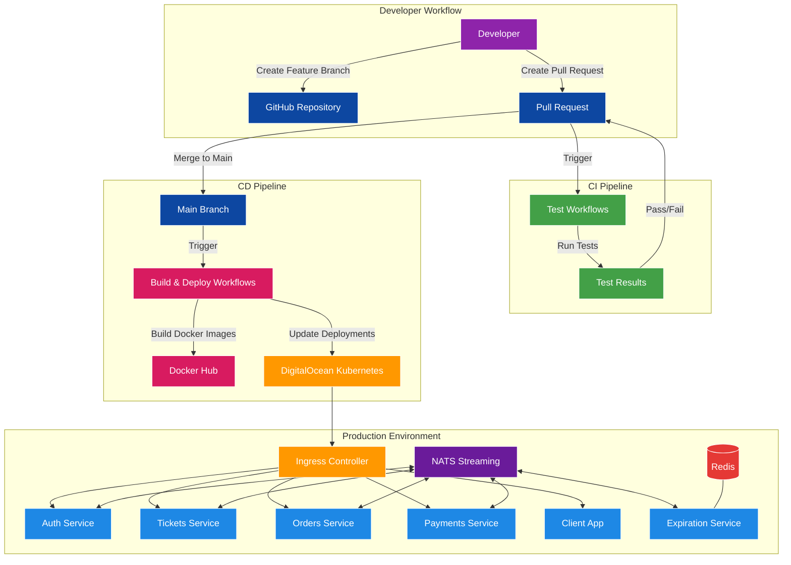
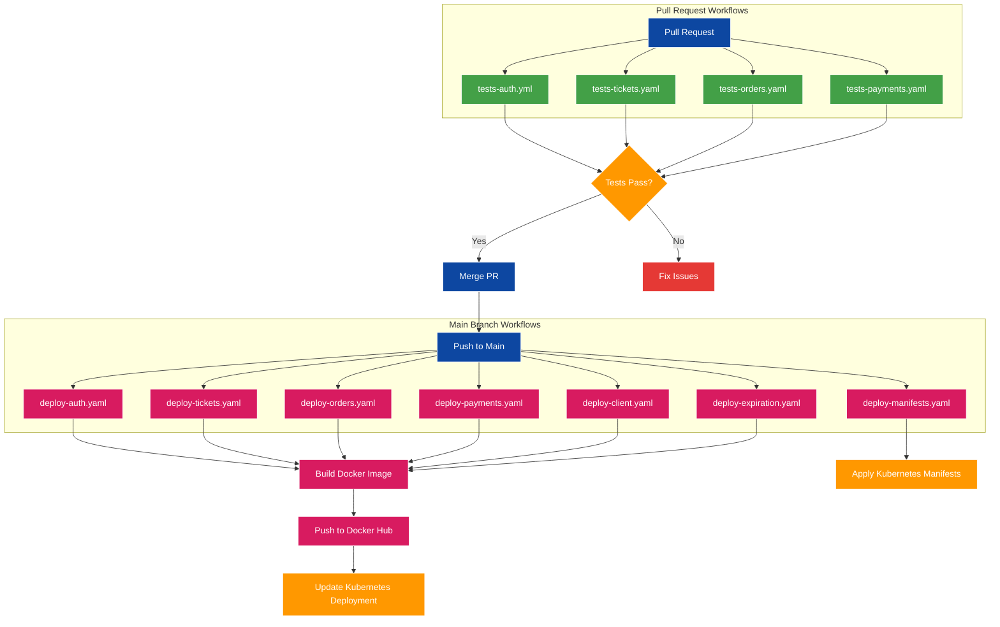
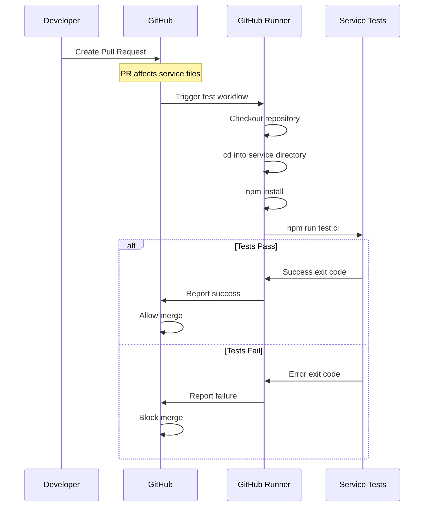
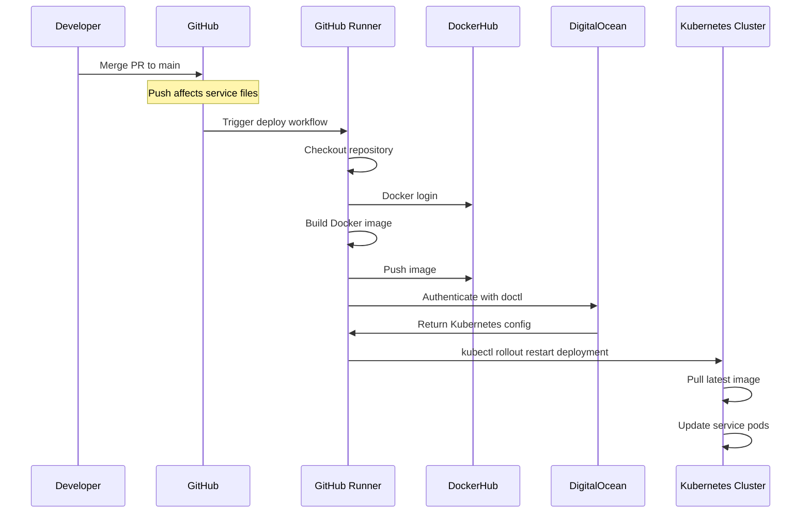
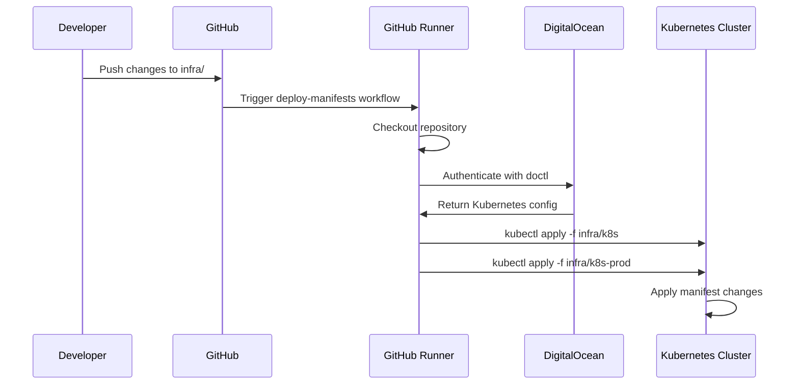
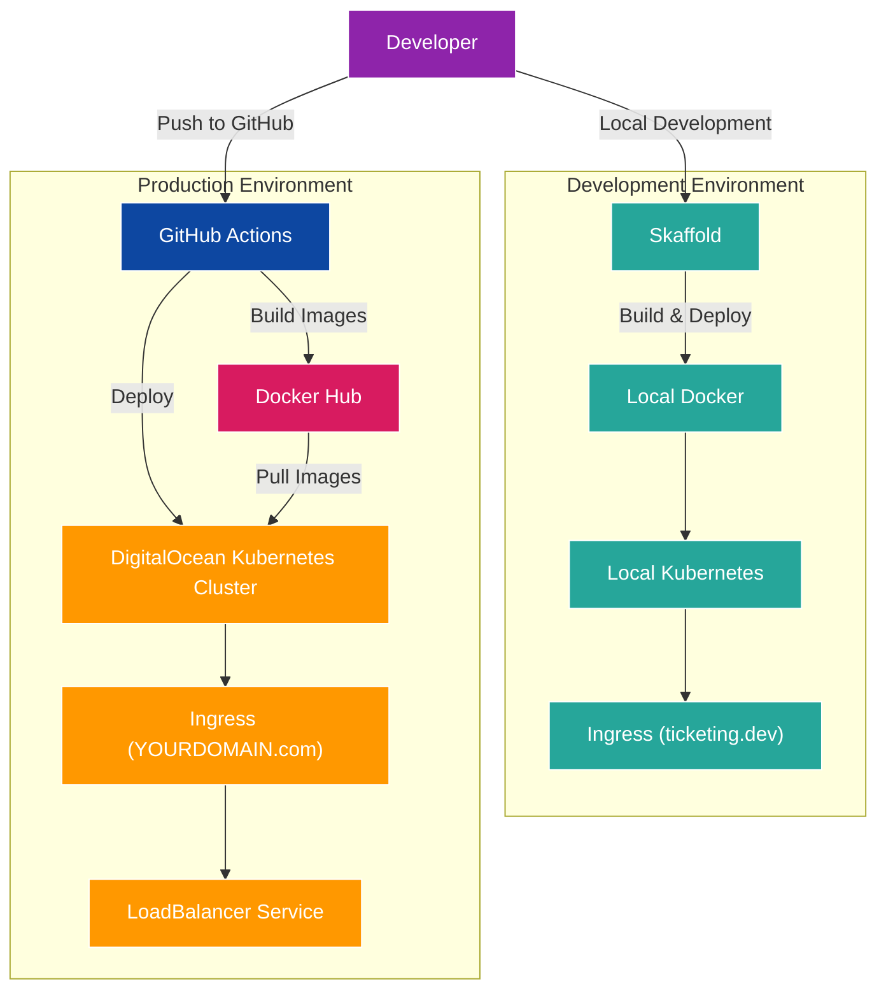
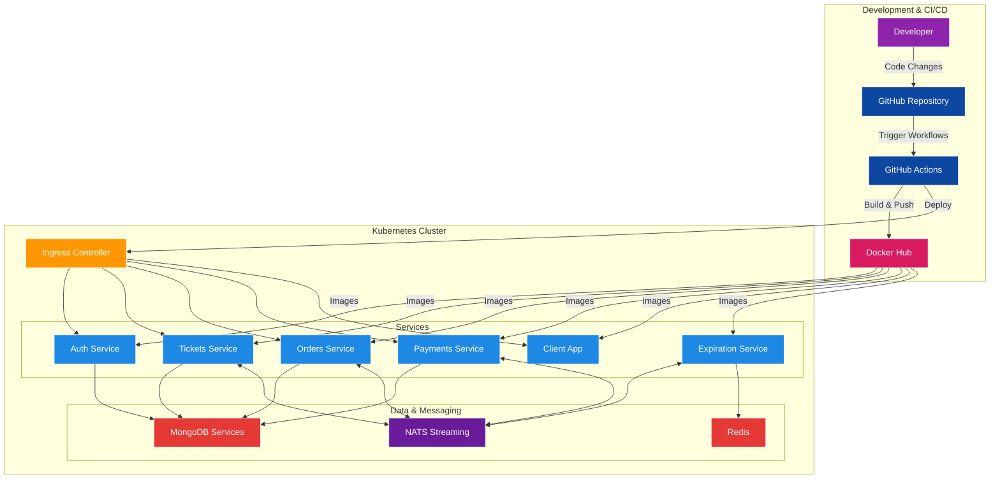
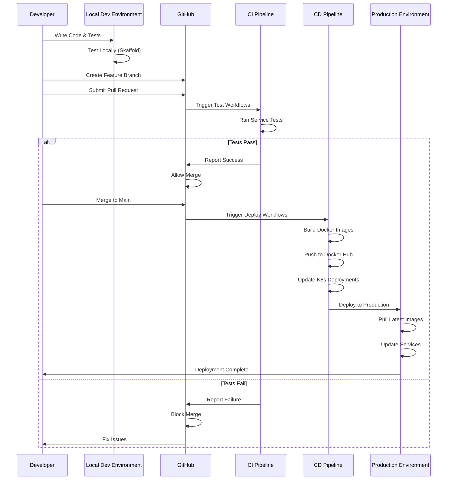

# Ticketing Application - CI/CD Pipeline

A complete microservices-based ticketing platform built with Node.js, TypeScript, React, and Kubernetes, now featuring a comprehensive CI/CD pipeline using GitHub Actions with deployment to DigitalOcean Kubernetes.

## What's Changed from Version 21 (Back to the Client)

Version 22 builds upon the full-stack application established in version 21, adding a production-grade CI/CD pipeline:

### CI/CD Pipeline with GitHub Actions

- **Testing Workflows**: Added automated testing for each service triggered on pull requests

  ```yaml
  # in .github/workflows/tests-auth.yml
  name: tests-auth

  on:
    pull_request:
      paths:
        - 'auth/**'

  jobs:
    build:
      runs-on: ubuntu-latest
      steps:
        - uses: actions/checkout@v3
        - run: cd auth && npm install && npm run test:ci
  ```

- **Deployment Workflows**: Added automated deployment to DigitalOcean Kubernetes

  ```yaml
  # in .github/workflows/deploy-auth.yaml
  name: deploy-auth

  on:
    push:
      branches:
        - main
      paths:
        - 'auth/**'

  jobs:
    build:
      runs-on: ubuntu-latest
      steps:
        - uses: actions/checkout@v3
        - run: docker login -u $DOCKER_USERNAME -p $DOCKER_PASSWORD
          env:
            DOCKER_USERNAME: ${{ secrets.DOCKER_USERNAME }}
            DOCKER_PASSWORD: ${{ secrets.DOCKER_PASSWORD }}
        - run: cd auth && docker build -t rallycoding/auth .
        - run: docker push rallycoding/auth
        - uses: digitalocean/action-doctl@v2
          with:
            token: ${{ secrets.DIGITALOCEAN_ACCESS_TOKEN }}
        - run: doctl kubernetes cluster kubeconfig save ticketing
        - run: kubectl rollout restart deployment auth-depl
  ```

### Production Environment Configuration

- **Production Kubernetes Manifests**: Added separate deployment configuration for production

  ```yaml
  # in infra/k8s-prod/ingress-srv.yaml
  apiVersion: networking.k8s.io/v1
  kind: Ingress
  metadata:
    name: ingress-service
    annotations:
      kubernetes.io/ingress.class: nginx
      nginx.ingress.kubernetes.io/use-regex: "true"
  spec:
    rules:
      - host: www.YOURDOMAIN.com
        http:
          paths:
            # Routing paths to different services
  ```

- **Production-specific LoadBalancer**: Configured for cloud deployment

  ```yaml
  # in infra/k8s-prod/ingress-srv.yaml (continued)
  apiVersion: v1
  kind: Service
  metadata:
    annotations:
      service.beta.kubernetes.io/do-loadbalancer-enable-proxy-protocol: "true"
      service.beta.kubernetes.io/do-loadbalancer-hostname: "www.YOURDOMAIN.com"
    # ... other metadata
  spec:
    type: LoadBalancer
    externalTrafficPolicy: Local
    # ... other specifications
  ```

### Infrastructure as Code

- **Manifest Deployment Workflow**: Added automated Kubernetes manifest deployment

  ```yaml
  # in .github/workflows/deploy-manifests.yaml
  name: deploy-manifests

  on:
    push:
      branches:
        - main
      paths:
        - 'infra/**'

  jobs:
    build:
      runs-on: ubuntu-latest
      steps:
        - uses: actions/checkout@v3
        - uses: digitalocean/action-doctl@v2
          with:
            token: ${{ secrets.DIGITALOCEAN_ACCESS_TOKEN }}
        - run: doctl kubernetes cluster kubeconfig save ticketing
        - run: kubectl apply -f infra/k8s && kubectl apply -f infra/k8s-prod
  ```

## Complete CI/CD Architecture

The CI/CD pipeline integrates with the existing microservices architecture:



## GitHub Actions Workflow Structure

The GitHub Actions workflows are divided into testing and deployment categories:



## Testing Pipeline Workflow

Each service has its own testing workflow triggered by pull requests:



## Deployment Pipeline Workflow

Each service has its own deployment workflow triggered by pushes to main:



## Infrastructure Deployment Workflow

Changes to Kubernetes manifests trigger a deployment workflow:



## Development vs. Production Environment

The application now has distinct configurations for development and production:



## Complete System Architecture with CI/CD

The complete ticketing application architecture with CI/CD pipeline:



## End-to-End Workflow

The complete workflow from development to production deployment:



## Setting Up the CI/CD Pipeline

### Prerequisites

1. **GitHub Repository** for your code
2. **Docker Hub Account** for hosting images
3. **DigitalOcean Account** with Kubernetes cluster
4. **Domain Name** configured for your application

### GitHub Secrets Configuration

Setup the following repository secrets in GitHub:

1. `DOCKER_USERNAME`: Your Docker Hub username
2. `DOCKER_PASSWORD`: Your Docker Hub password
3. `DIGITALOCEAN_ACCESS_TOKEN`: API token for DigitalOcean

### Production Deployment Steps

1. **Initial Cluster Setup**:

   ```bash
   # Install doctl
   brew install doctl  # For Mac, use appropriate command for your OS
   
   # Authenticate with DigitalOcean
   doctl auth init
   
   # Create Kubernetes cluster
   doctl kubernetes cluster create ticketing --region nyc1 --size s-2vcpu-4gb --count 3
   
   # Configure kubectl
   doctl kubernetes cluster kubeconfig save ticketing
   ```

2. **Deploy Kubernetes Resources**:

   ```bash
   # Create secrets in production
   kubectl create secret generic jwt-secret --from-literal=JWT_KEY=your_jwt_secret_key
   kubectl create secret generic stripe-secret --from-literal=STRIPE_KEY=your_stripe_secret_key
   
   # Update domain name in manifests
   # Edit infra/k8s-prod/ingress-srv.yaml and update YOURDOMAIN.com
   
   # Apply manifests
   kubectl apply -f infra/k8s
   kubectl apply -f infra/k8s-prod
   ```

3. **Configure Domain**:
   - Point your domain to the DigitalOcean LoadBalancer IP
   - Configure DNS settings in your domain registrar

### Development Workflow

1. **Local Development**:

   ```bash
   # Start local development environment
   skaffold dev
   ```

2. **Feature Development**:
   - Create feature branch
   - Make changes to service(s)
   - Run tests locally
   - Push branch to GitHub
   - Create a pull request

3. **Code Review & CI**:
   - GitHub Actions automatically runs tests
   - Fix any failing tests
   - Get code review approvals
   - Merge pull request to main branch

4. **Automatic Deployment**:
   - GitHub Actions automatically builds and deploys changes
   - Monitor deployment status in GitHub Actions
   - Verify changes in production

## GitHub Actions Configuration

### Testing Workflow Example

```yaml
name: tests-auth

on:
  pull_request:
    paths:
      - 'auth/**'

jobs:
  build:
    runs-on: ubuntu-latest
    steps:
      - uses: actions/checkout@v3
      - run: cd auth && npm install && npm run test:ci
```

### Deployment Workflow Example

```yaml
name: deploy-auth

on:
  push:
    branches:
      - main
    paths:
      - 'auth/**'

jobs:
  build:
    runs-on: ubuntu-latest
    steps:
      - uses: actions/checkout@v3
      - run: docker login -u $DOCKER_USERNAME -p $DOCKER_PASSWORD
        env:
          DOCKER_USERNAME: ${{ secrets.DOCKER_USERNAME }}
          DOCKER_PASSWORD: ${{ secrets.DOCKER_PASSWORD }}
      - run: cd auth && docker build -t rallycoding/auth .
      - run: docker push rallycoding/auth
      - uses: digitalocean/action-doctl@v2
        with:
          token: ${{ secrets.DIGITALOCEAN_ACCESS_TOKEN }}
      - run: doctl kubernetes cluster kubeconfig save ticketing
      - run: kubectl rollout restart deployment auth-depl
```

### Infrastructure Deployment Workflow

```yaml
name: deploy-manifests

on:
  push:
    branches:
      - main
    paths:
      - 'infra/**'

jobs:
  build:
    runs-on: ubuntu-latest
    steps:
      - uses: actions/checkout@v3
      - uses: digitalocean/action-doctl@v2
        with:
          token: ${{ secrets.DIGITALOCEAN_ACCESS_TOKEN }}
      - run: doctl kubernetes cluster kubeconfig save ticketing
      - run: kubectl apply -f infra/k8s && kubectl apply -f infra/k8s-prod
```

## Key Differences Between Development and Production

| Feature | Development | Production |
|---------|-------------|------------|
| **Environment** | Local Kubernetes | DigitalOcean Kubernetes |
| **Domain** | ticketing.dev | <www.YOURDOMAIN.com> |
| **Deployment** | Skaffold | GitHub Actions |
| **Docker Images** | Built locally | Pushed to Docker Hub |
| **Ingress** | Local NGINX | LoadBalancer service |
| **Configuration** | k8s/ | k8s/ + k8s-prod/ |
| **Secrets** | Local | Production Kubernetes secrets |

## Conclusion

Version 22 completes the ticketing application by adding a comprehensive CI/CD pipeline for automated testing and deployment. The GitHub Actions workflows provide a robust system for ensuring code quality through automated testing on pull requests, and streamlined deployment through automated builds and updates to the production Kubernetes cluster. This architecture demonstrates a modern approach to deploying microservices applications in a production environment with proper CI/CD practices.

The addition of separate configurations for development and production environments ensures a clear separation of concerns, allowing developers to work efficiently locally while maintaining a stable and scalable production deployment. The infrastructure-as-code approach, with all Kubernetes manifests and deployment configurations tracked in version control, provides reproducibility and transparency in the deployment process.
