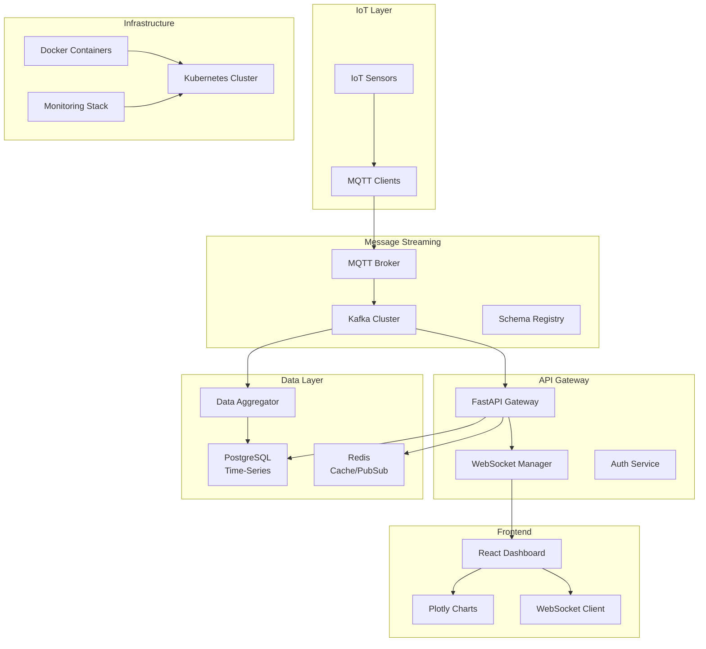
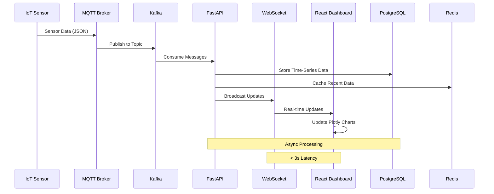
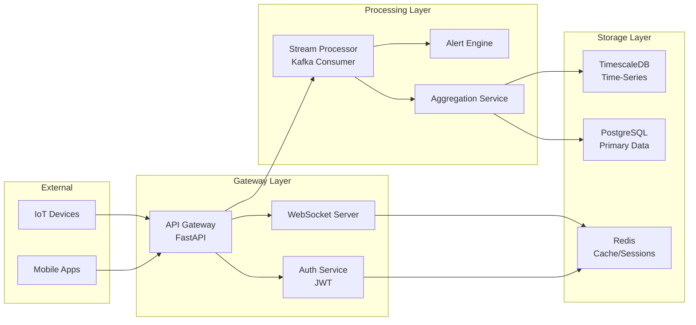
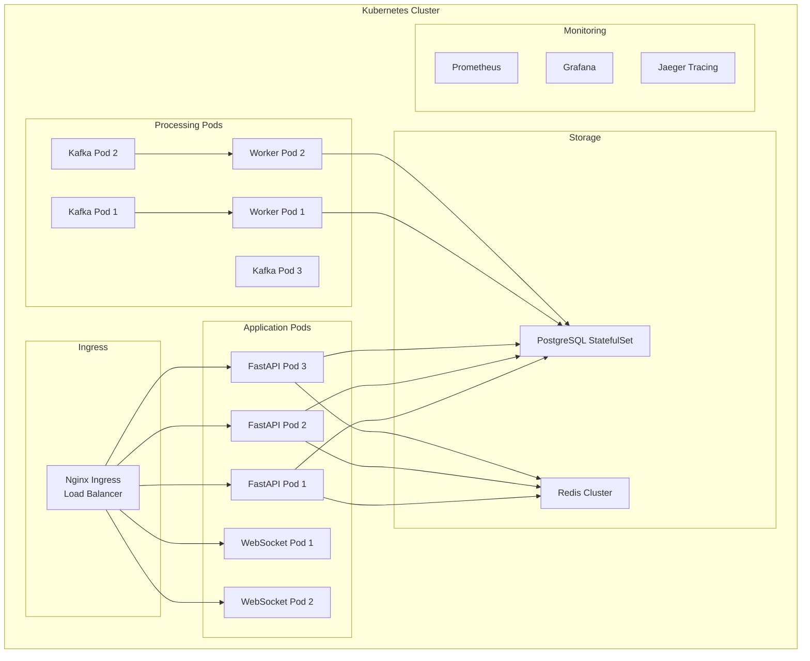

# Digital Twin Manufacturing Platform - Project Architecture

## Overview
A comprehensive real-time manufacturing digital twin platform demonstrating senior full-stack engineering skills for Grid Dynamics → Apple interview preparation.

---

## System Architecture Diagram



---

## Data Flow Architecture



---

## Service Interaction Diagram



---

## Deployment Architecture



---

# 4-Day Progressive Build Plan

## Day 1: Foundation (FastAPI + WebSocket + Redis) ✅ COMPLETED - EXCEEDED TARGETS
**Focus**: Core backend services with real-time capabilities

### Morning Session (3h): FastAPI Foundation ✅ COMPLETED
- [x] **Project Setup**
  - [x] Create project structure and virtual environment
  - [x] Install FastAPI, uvicorn, asyncio dependencies
  - [x] Setup development Docker environment
  
- [x] **Async Python Deep-dive**
  - [x] Implement asyncio patterns (gather, create_task, semaphore)
  - [x] FastAPI dependency injection system
  - [x] Pydantic models for sensor data validation
  
- [x] **Basic API Endpoints**
  - [x] Health check endpoint
  - [x] Sensor data ingestion endpoint
  - [x] Machine status endpoints

### Midday Session (2h): Theory & Testing ✅ COMPLETED
- [x] **Redis Integration**
  - [x] Redis connection setup and configuration
  - [x] Caching patterns for sensor data
  - [x] Session management setup
  
- [x] **Testing Framework**
  - [x] pytest-asyncio setup
  - [x] TestClient configuration
  - [x] Mock Redis with fakeredis

### Afternoon Session (3h): WebSocket Implementation ✅ EXCEEDED
- [x] **WebSocket Server**
  - [x] Connection manager implementation
  - [x] Real-time sensor data broadcasting
  - [x] Connection lifecycle management
  
- [x] **Integration**
  - [x] Connect API endpoints to WebSocket broadcasts
  - [x] Redis pub/sub for horizontal scaling
  - [x] Error handling and reconnection logic

### Day 1 Deliverables ✅ ALL COMPLETED
- [x] Working FastAPI server with async endpoints
- [x] WebSocket server broadcasting sensor data
- [x] Redis integration for caching and pub/sub
- [x] Basic test suite with 70%+ coverage
- [x] Docker setup for development

### 🚀 Additional Achievements Beyond Plan:
- [x] **Advanced Redis Patterns**: Rate limiting, metrics storage, multiple data types
- [x] **Production-Grade Logging**: Structured JSON logging with context
- [x] **Comprehensive Error Handling**: Graceful degradation and recovery
- [x] **API Documentation**: Auto-generated OpenAPI/Swagger interface
- [x] **Background Processing**: Async task processing with FastAPI
- [x] **Health Monitoring**: Detailed health checks and system metrics
- [x] **Connection Scaling**: Redis pub/sub for horizontal WebSocket scaling

---

## Day 2: Data Pipeline (Kafka + MQTT + PostgreSQL)
**Focus**: Reliable data ingestion and storage

### Morning Session (3h): Message Streaming
- [ ] **MQTT Setup**
  - [ ] MQTT broker configuration (Mosquitto)
  - [ ] IoT sensor simulation clients
  - [ ] QoS levels and topic hierarchy design
  
- [ ] **Kafka Integration**
  - [ ] Kafka cluster setup with Docker
  - [ ] Producer configuration for MQTT bridge
  - [ ] Topic design and partitioning strategy

### Midday Session (2h): Data Processing
- [ ] **Kafka Consumer Implementation**
  - [ ] Consumer groups for parallel processing
  - [ ] Exactly-once semantics configuration
  - [ ] Dead letter queue handling
  
- [ ] **Data Transformation**
  - [ ] Message validation and enrichment
  - [ ] Aggregation workers (10-second windows)
  - [ ] Event sourcing patterns

### Afternoon Session (3h): Database Design
- [ ] **PostgreSQL Setup**
  - [ ] Time-partitioned table design
  - [ ] Indexes for time-series queries
  - [ ] Connection pooling configuration
  
- [ ] **Data Models**
  - [ ] Machine state schemas
  - [ ] Sensor reading tables
  - [ ] Aggregated metrics tables
  
- [ ] **Integration Testing**
  - [ ] End-to-end data flow testing
  - [ ] Performance benchmarking
  - [ ] Data consistency verification

### Day 2 Deliverables
- [ ] MQTT broker with simulated IoT devices
- [ ] Kafka cluster with reliable message processing
- [ ] PostgreSQL with optimized time-series schema
- [ ] Data aggregation workers
- [ ] Event sourcing implementation

---

## Day 3: Frontend + Orchestration (React + Docker + K8s)
**Focus**: User interface and container orchestration

### Morning Session (2h): React Dashboard
- [ ] **React Setup**
  - [ ] Create React app with TypeScript
  - [ ] WebSocket hooks implementation
  - [ ] Real-time data state management
  
- [ ] **Plotly Integration**
  - [ ] Time-series chart components
  - [ ] Real-time data visualization
  - [ ] Performance optimization for large datasets

### Midday Session (3h): Container Orchestration
- [ ] **Docker Compose Stack**
  - [ ] Multi-service compose file
  - [ ] Environment configuration
  - [ ] Volume management for persistence
  
- [ ] **Kubernetes Manifests**
  - [ ] Deployment configurations
  - [ ] Service definitions
  - [ ] ConfigMaps and Secrets
  - [ ] Health checks (readiness/liveness probes)

### Afternoon Session (2h): Integration & Testing
- [ ] **Full Stack Integration**
  - [ ] Frontend-backend communication
  - [ ] WebSocket connection management
  - [ ] Error handling and recovery
  
- [ ] **Performance Testing**
  - [ ] Load testing with realistic data volumes
  - [ ] Latency measurements
  - [ ] Resource utilization monitoring

### Day 3 Deliverables
- [ ] React dashboard with real-time charts
- [ ] Docker-compose for full stack deployment
- [ ] Kubernetes manifests with auto-scaling
- [ ] Performance benchmarks documented
- [ ] Complete integration testing

---

## Day 4: Production Ready (Monitoring + Security + Performance)
**Focus**: Production-grade features and interview polish

### Morning Session (2h): Monitoring & Observability
- [ ] **OpenTelemetry Setup**
  - [ ] Distributed tracing implementation
  - [ ] Metrics collection and export
  - [ ] Custom instrumentation for business metrics
  
- [ ] **Grafana Dashboards**
  - [ ] System metrics visualization
  - [ ] Business KPI dashboards
  - [ ] Alert rule configuration

### Midday Session (2h): Security & Authentication
- [ ] **JWT Authentication**
  - [ ] User authentication system
  - [ ] Role-based access control
  - [ ] API rate limiting
  
- [ ] **Security Hardening**
  - [ ] TLS/SSL configuration
  - [ ] Network policies
  - [ ] Secret management

### Afternoon Session (3h): Final Polish
- [ ] **Performance Optimization**
  - [ ] Database query optimization
  - [ ] Caching strategy refinement
  - [ ] WebSocket connection pooling
  
- [ ] **Documentation & Demo Prep**
  - [ ] Architecture documentation
  - [ ] API documentation with OpenAPI
  - [ ] Demo script preparation
  - [ ] Interview talking points

### Day 4 Deliverables
- [ ] Production-ready monitoring stack
- [ ] Comprehensive security implementation
- [ ] Performance-optimized system
- [ ] Complete documentation package
- [ ] Interview demonstration ready

---

# Component Specifications

## IoT Simulation Layer
**Technology**: Python MQTT clients, JSON sensor data
**Purpose**: Simulate 1000+ manufacturing sensors
**Data Format**:
```json
{
  "timestamp": "2024-01-15T10:30:00Z",
  "machineId": "CNC-001",
  "sensorType": "temperature",
  "value": 85.4,
  "unit": "celsius",
  "quality": "good"
}
```

## Message Streaming
**Technology**: Apache Kafka, MQTT Bridge
**Topics**:
- `sensor.raw` - Raw sensor readings
- `sensor.aggregated` - Processed metrics
- `alerts.critical` - System alerts
**Partitioning**: By machineId for ordering guarantees

## API Gateway
**Technology**: FastAPI with uvicorn/gunicorn
**Features**:
- Async request handling
- WebSocket connection management
- Dependency injection for services
- Automatic OpenAPI documentation
- Rate limiting and authentication

## Data Storage
**PostgreSQL Schema**:
```sql
-- Time-partitioned sensor data
CREATE TABLE sensor_readings (
    id BIGSERIAL,
    machine_id VARCHAR(50),
    sensor_type VARCHAR(50),
    timestamp TIMESTAMPTZ,
    value DECIMAL(10,4),
    unit VARCHAR(20),
    quality VARCHAR(20)
) PARTITION BY RANGE (timestamp);

-- Indexes for time-series queries
CREATE INDEX idx_sensor_machine_time 
ON sensor_readings (machine_id, timestamp DESC);
```

**Redis Patterns**:
- Session storage: `session:{user_id}`
- Real-time cache: `sensor:{machine_id}:latest`
- Pub/Sub channels: `alerts`, `sensor_updates`

## Frontend Architecture
**Technology**: React 18 with TypeScript, Plotly.js
**Components**:
- Dashboard layout with real-time metrics
- Time-series charts with live updates
- Machine status grid
- Alert notification system
**Performance**: < 100ms render time for chart updates

## Infrastructure
**Docker**: Multi-stage builds, distroless base images
**Kubernetes**: 
- HPA based on CPU/memory
- Rolling deployments
- Circuit breaker patterns
- Graceful shutdown handling

---

# File Structure

```
digital-twin-platform/
├── backend/
│   ├── app/
│   │   ├── api/
│   │   │   ├── endpoints/
│   │   │   └── websockets/
│   │   ├── core/
│   │   │   ├── config.py
│   │   │   └── dependencies.py
│   │   ├── models/
│   │   ├── services/
│   │   └── main.py
│   ├── tests/
│   ├── Dockerfile
│   └── requirements.txt
├── frontend/
│   ├── src/
│   │   ├── components/
│   │   ├── hooks/
│   │   ├── services/
│   │   └── App.tsx
│   ├── public/
│   └── package.json
├── infrastructure/
│   ├── docker-compose.yml
│   ├── kubernetes/
│   │   ├── deployments/
│   │   ├── services/
│   │   └── configmaps/
│   └── monitoring/
├── data-pipeline/
│   ├── kafka/
│   ├── mqtt/
│   └── workers/
└── docs/
    ├── api/
    ├── deployment/
    └── architecture/
```

---

# Development Workflow

## Local Development
1. Start infrastructure: `docker-compose up -d postgres redis kafka`
2. Run backend: `uvicorn app.main:app --reload`
3. Run frontend: `npm start`
4. Run IoT simulator: `python simulate_sensors.py`

## Testing Strategy
- **Unit Tests**: Individual service components
- **Integration Tests**: API endpoints with database
- **E2E Tests**: Full data flow from IoT to dashboard
- **Load Tests**: Performance under realistic load

## Deployment Pipeline
1. **Development**: Docker-compose for local testing
2. **Staging**: Kubernetes cluster with reduced resources
3. **Production**: Auto-scaling Kubernetes with monitoring

---

# Interview Integration Points

## System Design Questions
- **Scalability**: How to handle 50k messages/sec
- **Reliability**: Exactly-once processing, circuit breakers
- **Performance**: < 3s end-to-end latency
- **Security**: Authentication, authorization, data encryption

## Technical Deep-dives
- **Async Programming**: FastAPI dependency injection, WebSocket scaling
- **Data Engineering**: Time-series optimization, event sourcing
- **DevOps**: Kubernetes patterns, monitoring, deployment strategies
- **Frontend**: Real-time updates, performance optimization

## Behavioral Examples
- **Leadership**: Architecting the streaming pipeline
- **Problem Solving**: Handling out-of-order events
- **Collaboration**: API design for frontend integration
- **Quality**: Comprehensive testing strategy
