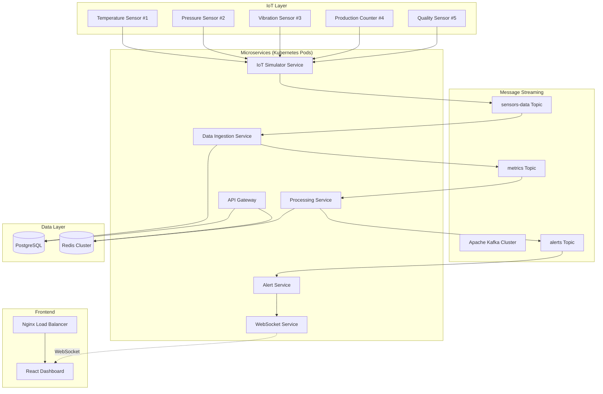

# System Architecture Document
## IoT Manufacturing Monitoring System

### 1. General System Overview

**Purpose**: A real-time IoT monitoring system that simulates a manufacturing environment with 5 IoT devices, processing their data through a microservices architecture and displaying insights on a real-time dashboard.

**Core Technologies**: Node.js, PostgreSQL, Redis, Kafka, WebSockets, Docker, Kubernetes, React, Plotly

**Business Context**: This system simulates a digital twin ecosystem for advanced manufacturing operations, collecting, processing, and visualizing data from IoT sensors in real-time to enable proactive maintenance and operational optimization.

### 2. System Architecture Diagram



### 3. IoT Device Specifications

| Device ID | Type | Metrics | Normal Range | Alert Threshold | Update Frequency |
|-----------|------|---------|--------------|-----------------|------------------|
| device-001 | Temperature | celsius | 20-80°C | >85°C, <15°C | 2 seconds |
| device-002 | Pressure | psi | 10-50 PSI | >55 PSI, <5 PSI | 3 seconds |
| device-003 | Vibration | hz | 0-100 Hz | >120 Hz | 1 second |
| device-004 | Production Counter | units/hour | 100-500 | <50 | 5 seconds |
| device-005 | Quality Score | percentage | 85-100% | <80% | 4 seconds |

### 4. Services Breakdown

#### 4.1 IoT Simulator Service
**Purpose**: Simulate 5 IoT devices sending realistic sensor data
**Technology**: Node.js + Kafka Producer
**Port**: 3001

**Input Interface**:
- Configuration file for device parameters
- Environment variables for Kafka connection

**Output Interface**:
```json
{
  "deviceId": "device-001",
  "timestamp": "2025-01-11T10:00:00.000Z",
  "sensorType": "temperature",
  "value": 75.2,
  "unit": "celsius",
  "location": "assembly-line-1",
  "status": "active"
}
```

**Implementation Plan**:
- Device simulation classes for each sensor type
- Configurable anomaly injection (5% chance)
- Kafka producer with proper error handling
- Health check endpoint
- Graceful shutdown handling

**Dependencies**:
- kafkajs: Kafka client library
- node-cron: Scheduled data generation
- dotenv: Environment configuration

#### 4.2 Data Ingestion Service
**Purpose**: Consume Kafka messages and store raw sensor data
**Technology**: Node.js + Kafka Consumer + PostgreSQL
**Port**: 3002

**Input Interface**:
- Kafka topic: `sensors-data`
- Message format: Same as simulator output

**Output Interface**:
- PostgreSQL insert operations
- Kafka producer for processed metrics topic

**Database Schema**:
```sql
-- Main sensor readings table
CREATE TABLE sensor_readings (
  id SERIAL PRIMARY KEY,
  device_id VARCHAR(50) NOT NULL,
  timestamp TIMESTAMPTZ NOT NULL,
  sensor_type VARCHAR(50) NOT NULL,
  value DECIMAL(10,2) NOT NULL,
  unit VARCHAR(20) NOT NULL,
  location VARCHAR(100),
  status VARCHAR(20) DEFAULT 'active',
  created_at TIMESTAMPTZ DEFAULT NOW()
);

-- Indexes for performance
CREATE INDEX idx_sensor_readings_device_timestamp 
ON sensor_readings(device_id, timestamp DESC);

CREATE INDEX idx_sensor_readings_sensor_type 
ON sensor_readings(sensor_type, timestamp DESC);

CREATE INDEX idx_sensor_readings_location 
ON sensor_readings(location, timestamp DESC);

-- Device metadata table
CREATE TABLE devices (
  device_id VARCHAR(50) PRIMARY KEY,
  device_type VARCHAR(50) NOT NULL,
  location VARCHAR(100) NOT NULL,
  normal_min DECIMAL(10,2),
  normal_max DECIMAL(10,2),
  alert_min DECIMAL(10,2),
  alert_max DECIMAL(10,2),
  unit VARCHAR(20),
  status VARCHAR(20) DEFAULT 'active',
  created_at TIMESTAMPTZ DEFAULT NOW(),
  updated_at TIMESTAMPTZ DEFAULT NOW()
);

-- Alerts table
CREATE TABLE alerts (
  id SERIAL PRIMARY KEY,
  device_id VARCHAR(50) NOT NULL,
  alert_type VARCHAR(50) NOT NULL,
  message TEXT NOT NULL,
  severity VARCHAR(20) DEFAULT 'medium',
  value DECIMAL(10,2),
  threshold DECIMAL(10,2),
  status VARCHAR(20) DEFAULT 'active',
  triggered_at TIMESTAMPTZ NOT NULL,
  acknowledged_at TIMESTAMPTZ,
  resolved_at TIMESTAMPTZ,
  created_at TIMESTAMPTZ DEFAULT NOW()
);

CREATE INDEX idx_alerts_device_status ON alerts(device_id, status);
CREATE INDEX idx_alerts_triggered_at ON alerts(triggered_at DESC);
```

**Implementation Plan**:
- Kafka consumer group configuration
- Batch processing for high throughput (process 100 messages per batch)
- Database connection pooling (max 10 connections)
- Data validation and sanitization
- Error handling with dead letter queue
- Metrics collection for monitoring

**Dependencies**:
- kafkajs: Kafka consumer
- pg: PostgreSQL client
- joi: Input validation

#### 4.3 Data Processing Service
**Purpose**: Calculate real-time metrics and aggregations
**Technology**: Node.js + Redis + PostgreSQL
**Port**: 3003

**Input Interface**:
- Kafka topic: `metrics`
- PostgreSQL queries for historical data

**Output Interface**:
- Redis cache updates
- Kafka producer for alerts topic

**Redis Data Structures**:
```javascript
// Real-time device status
"device:device-001:current" = {
  value: 75.2,
  timestamp: "2025-01-11T10:00:00.000Z",
  status: "normal"
}

// Device statistics (last hour)
"device:device-001:stats:1h" = {
  avg: 73.5,
  min: 68.2,
  max: 78.9,
  count: 1800,
  trend: "stable"
}

// Device statistics (last day)
"device:device-001:stats:24h" = {
  avg: 72.8,
  min: 65.1,
  max: 82.3,
  count: 43200,
  trend: "increasing"
}

// System alerts
"alerts:active" = [
  {
    id: "alert-001",
    deviceId: "device-002",
    type: "high_pressure",
    value: 58.5,
    threshold: 55,
    severity: "high",
    timestamp: "2025-01-11T10:05:00.000Z"
  }
]

// System metrics
"system:metrics" = {
  totalDevices: 5,
  activeDevices: 5,
  activeAlertsCount: 2,
  dataPointsLastHour: 7200,
  systemHealth: "healthy"
}
```

**Implementation Plan**:
- Moving window calculations using Redis sorted sets
- Threshold monitoring with configurable rules
- Redis pub/sub for real-time updates
- Alert condition evaluation engine
- Statistical calculations (mean, median, standard deviation)
- Trend analysis using linear regression

**Dependencies**:
- redis: Redis client
- kafkajs: Kafka client
- simple-statistics: Statistical calculations

#### 4.4 Alert Service
**Purpose**: Monitor thresholds and manage alert lifecycle
**Technology**: Node.js + Redis + WebSocket Client
**Port**: 3004

**Input Interface**:
- Kafka topic: `alerts`
- Redis alert configurations

**Output Interface**:
- WebSocket messages to frontend
- Alert state management in Redis
- Email notifications (configurable)

**Alert States**:
- `triggered`: New alert condition detected
- `acknowledged`: Alert seen by operator
- `resolved`: Condition returned to normal
- `escalated`: Alert persisted beyond time limit (5 minutes)

**Alert Types**:
- `threshold_exceeded`: Value above maximum threshold
- `threshold_below`: Value below minimum threshold
- `device_offline`: No data received for > 30 seconds
- `data_anomaly`: Statistical anomaly detected
- `trend_warning`: Concerning trend detected

**Implementation Plan**:
- Alert rule engine with configurable thresholds
- Escalation logic based on time and severity
- Alert deduplication (prevent spam)
- Notification prioritization and rate limiting
- Alert history and analytics
- Integration with external notification systems

**Dependencies**:
- redis: Alert state management
- kafkajs: Alert consumption
- socket.io-client: WebSocket communication
- nodemailer: Email notifications

#### 4.5 API Gateway
**Purpose**: RESTful API for dashboard data access
**Technology**: Node.js + Express + PostgreSQL + Redis
**Port**: 3005

**API Endpoints**:
```
# Device Management
GET    /api/devices                    - List all devices with current status
GET    /api/devices/:id                - Get device details
GET    /api/devices/:id/current        - Current device readings
GET    /api/devices/:id/history        - Historical data (?from=&to=&limit=)
PUT    /api/devices/:id/config         - Update device configuration

# Alerts Management
GET    /api/alerts                     - Active alerts (?status=&severity=)
GET    /api/alerts/:id                 - Specific alert details
PUT    /api/alerts/:id/acknowledge     - Acknowledge alert
PUT    /api/alerts/:id/resolve         - Resolve alert
GET    /api/alerts/history             - Alert history

# Analytics and Metrics
GET    /api/metrics/dashboard          - Dashboard summary data
GET    /api/metrics/system             - System health metrics
GET    /api/analytics/trends/:deviceId - Trend analysis for device
GET    /api/analytics/summary          - Overall system analytics

# System
GET    /api/health                     - Service health check
GET    /api/status                     - System status overview
```

**Response Formats**:
```javascript
// GET /api/devices
{
  "success": true,
  "data": {
    "devices": [
      {
        "deviceId": "device-001",
        "type": "temperature",
        "location": "assembly-line-1",
        "status": "active",
        "lastReading": {
          "value": 75.2,
          "timestamp": "2025-01-11T10:00:00.000Z"
        },
        "alertStatus": "normal",
        "stats": {
          "avg24h": 73.5,
          "trend": "stable"
        }
      }
    ]
  },
  "meta": {
    "totalDevices": 5,
    "activeDevices": 5,
    "timestamp": "2025-01-11T10:00:00.000Z"
  }
}

// GET /api/alerts
{
  "success": true,
  "data": {
    "alerts": [
      {
        "id": "alert-001",
        "deviceId": "device-002",
        "type": "high_pressure",
        "message": "Pressure sensor reading above threshold",
        "severity": "high",
        "value": 58.5,
        "threshold": 55,
        "status": "active",
        "triggeredAt": "2025-01-11T10:05:00.000Z",
        "acknowledgedAt": null,
        "resolvedAt": null
      }
    ]
  },
  "meta": {
    "totalAlerts": 1,
    "criticalAlerts": 0,
    "highAlerts": 1,
    "mediumAlerts": 0
  }
}
```

**Implementation Plan**:
- Express.js router setup with modular route handlers
- Input validation middleware using Joi
- Error handling middleware with proper HTTP status codes
- API documentation with Swagger/OpenAPI
- Rate limiting (100 requests per minute per IP)
- Security headers and CORS configuration
- Request logging and monitoring
- Response caching for expensive queries

**Dependencies**:
- express: Web framework
- joi: Input validation
- helmet: Security headers
- cors: Cross-origin requests
- express-rate-limit: Rate limiting
- swagger-jsdoc: API documentation

#### 4.6 WebSocket Service
**Purpose**: Real-time data streaming to frontend
**Technology**: Node.js + Socket.io + Redis
**Port**: 3006

**Input Interface**:
- Redis pub/sub channels
- WebSocket client connections

**Output Interface**:
- Real-time sensor data streams
- Alert notifications
- System status updates

**WebSocket Events**:
```javascript
// Client -> Server Events
'subscribe-device'     // Subscribe to specific device updates
'subscribe-alerts'     // Subscribe to alert notifications
'subscribe-system'     // Subscribe to system status
'unsubscribe-device'   // Unsubscribe from device updates
'unsubscribe-alerts'   // Unsubscribe from alerts
'ping'                 // Connection health check

// Server -> Client Events
'sensor-data'          // Real-time sensor readings
'alert-triggered'      // New alert notification
'alert-resolved'       // Alert resolution notification
'system-status'        // Overall system health
'device-status'        // Device online/offline status
'connection-status'    // Connection confirmation
'error'                // Error notifications
```

**Event Data Formats**:
```javascript
// sensor-data event
{
  deviceId: "device-001",
  timestamp: "2025-01-11T10:00:00.000Z",
  data: {
    value: 75.2,
    unit: "celsius",
    status: "normal"
  },
  stats: {
    avg: 73.5,
    trend: "stable"
  }
}

// alert-triggered event
{
  alertId: "alert-001",
  deviceId: "device-002",
  type: "high_pressure",
  severity: "high",
  message: "Pressure reading above threshold",
  value: 58.5,
  threshold: 55,
  timestamp: "2025-01-11T10:05:00.000Z"
}
```

**Implementation Plan**:
- Socket.io server configuration with clustering support
- Redis pub/sub integration for scalability
- Connection management with auto-reconnection
- Client subscription handling with room-based broadcasting
- Message queuing for offline clients
- Authentication and authorization for connections
- Connection monitoring and health checks

**Dependencies**:
- socket.io: WebSocket server
- redis: Pub/sub functionality
- ioredis: Redis client with clustering support

### 5. React Dashboard Design

**Project Structure**:
```
src/
├── components/
│   ├── Dashboard/
│   │   ├── DashboardOverview.jsx
│   │   ├── DeviceGrid.jsx
│   │   ├── DeviceCard.jsx
│   │   ├── MetricsPanel.jsx
│   │   └── SystemHealth.jsx
│   ├── Charts/
│   │   ├── RealTimeChart.jsx (Plotly)
│   │   ├── HistoricalChart.jsx (Plotly)
│   │   ├── GaugeChart.jsx (Plotly)
│   │   ├── TrendChart.jsx (Plotly)
│   │   └── HeatmapChart.jsx (Plotly)
│   ├── Alerts/
│   │   ├── AlertsList.jsx
│   │   ├── AlertCard.jsx
│   │   ├── AlertModal.jsx
│   │   └── AlertFilters.jsx
│   ├── Devices/
│   │   ├── DeviceDetails.jsx
│   │   ├── DeviceConfig.jsx
│   │   └── DeviceHistory.jsx
│   └── Layout/
│       ├── Header.jsx
│       ├── Sidebar.jsx
│       ├── Navigation.jsx
│       └── Footer.jsx
├── hooks/
│   ├── useWebSocket.js
│   ├── useApi.js
│   ├── useRealTimeData.js
│   ├── useAlerts.js
│   └── useDevices.js
├── services/
│   ├── api.js
│   ├── websocket.js
│   ├── plotlyConfig.js
│   └── notifications.js
├── store/
│   ├── index.js (Redux Toolkit)
│   ├── slices/
│   │   ├── devicesSlice.js
│   │   ├── alertsSlice.js
│   │   └── systemSlice.js
├── utils/
│   ├── dateHelpers.js
│   ├── chartHelpers.js
│   ├── dataFormatters.js
│   └── constants.js
└── styles/
    ├── globals.css
    ├── dashboard.css
    └── charts.css
```

**Dashboard Views**:

1. **Overview Dashboard** (`/`):
   - Real-time device status grid (5 device cards)
   - System health indicators
   - Active alerts summary
   - Key performance metrics

2. **Device Details** (`/devices/:id`):
   - Individual device monitoring
   - Real-time and historical charts
   - Device configuration
   - Alert history for the device

3. **Alerts Management** (`/alerts`):
   - Active alerts list
   - Alert management (acknowledge/resolve)
   - Alert history and analytics
   - Alert configuration

4. **Analytics Dashboard** (`/analytics`):
   - Trend analysis across all devices
   - Performance metrics over time
   - Comparative analysis
   - System utilization reports

**Key Features**:
- Responsive design (mobile-first approach)
- Real-time updates via WebSocket
- Interactive Plotly charts with zoom/pan
- Dark/light theme toggle
- Export functionality for charts and data
- Offline mode with data synchronization

**Dependencies**:
- react: Frontend framework
- react-router-dom: Routing
- @reduxjs/toolkit: State management
- react-redux: Redux integration
- plotly.js-dist-min: Charting library
- socket.io-client: WebSocket client
- axios: HTTP client
- date-fns: Date utilities
- react-toastify: Notifications

### 6. Database Design

#### 6.1 PostgreSQL Schema

**Performance Considerations**:
- Time-series data partitioning by month
- Composite indexes for common query patterns
- Connection pooling (max 10 connections per service)
- Read replicas for analytics queries

**Data Retention Policy**:
- Raw sensor data: 3 months
- Aggregated hourly data: 1 year
- Alert data: 6 months
- System logs: 1 month

**Additional Tables**:
```sql
-- Aggregated statistics for performance
CREATE TABLE device_stats_hourly (
  id SERIAL PRIMARY KEY,
  device_id VARCHAR(50) NOT NULL,
  hour_timestamp TIMESTAMPTZ NOT NULL,
  avg_value DECIMAL(10,2),
  min_value DECIMAL(10,2),
  max_value DECIMAL(10,2),
  count_readings INTEGER,
  std_deviation DECIMAL(10,2),
  created_at TIMESTAMPTZ DEFAULT NOW()
);

CREATE UNIQUE INDEX idx_device_stats_hourly_unique 
ON device_stats_hourly(device_id, hour_timestamp);

-- System events log
CREATE TABLE system_events (
  id SERIAL PRIMARY KEY,
  event_type VARCHAR(50) NOT NULL,
  service_name VARCHAR(50),
  message TEXT,
  metadata JSONB,
  severity VARCHAR(20) DEFAULT 'info',
  timestamp TIMESTAMPTZ NOT NULL DEFAULT NOW()
);

CREATE INDEX idx_system_events_type_timestamp 
ON system_events(event_type, timestamp DESC);
```

#### 6.2 Redis Configuration

**Memory Management**:
- Max memory: 512MB
- Eviction policy: allkeys-lru
- Persistence: RDB snapshots every 15 minutes

**Key Expiration**:
- Real-time data: 1 hour TTL
- Statistics: 24 hours TTL
- Session data: 30 minutes TTL

### 7. Kubernetes Cluster Configuration

**Namespace**: `iot-monitoring`

#### 7.1 Resource Allocation

```yaml
# Service Resource Requests and Limits
services:
  iot-simulator:
    replicas: 1
    resources:
      requests: { cpu: 100m, memory: 128Mi }
      limits: { cpu: 200m, memory: 256Mi }
  
  data-ingestion:
    replicas: 2
    resources:
      requests: { cpu: 200m, memory: 256Mi }
      limits: { cpu: 400m, memory: 512Mi }
  
  data-processing:
    replicas: 2
    resources:
      requests: { cpu: 300m, memory: 512Mi }
      limits: { cpu: 600m, memory: 1Gi }
  
  alert-service:
    replicas: 1
    resources:
      requests: { cpu: 100m, memory: 128Mi }
      limits: { cpu: 200m, memory: 256Mi }
  
  api-gateway:
    replicas: 2
    resources:
      requests: { cpu: 200m, memory: 256Mi }
      limits: { cpu: 400m, memory: 512Mi }
  
  websocket-service:
    replicas: 1
    resources:
      requests: { cpu: 150m, memory: 256Mi }
      limits: { cpu: 300m, memory: 512Mi }
  
  react-dashboard:
    replicas: 2
    resources:
      requests: { cpu: 50m, memory: 64Mi }
      limits: { cpu: 100m, memory: 128Mi }

# Infrastructure Components
infrastructure:
  kafka:
    replicas: 3
    resources:
      requests: { cpu: 500m, memory: 1Gi }
      limits: { cpu: 1000m, memory: 2Gi }
    storage: 10Gi per replica
  
  postgresql:
    replicas: 1
    resources:
      requests: { cpu: 300m, memory: 512Mi }
      limits: { cpu: 600m, memory: 1Gi }
    storage: 20Gi
  
  redis:
    replicas: 1
    resources:
      requests: { cpu: 200m, memory: 256Mi }
      limits: { cpu: 400m, memory: 512Mi }
    storage: 5Gi
```

#### 7.2 Service Configuration

**Service Types**:
- ClusterIP: Internal service communication
- NodePort: Development access
- LoadBalancer: External access to dashboard
- Ingress: HTTP routing with SSL termination

**ConfigMaps and Secrets**:
- Database connection strings
- Kafka configuration
- Redis configuration
- API keys and tokens
- SSL certificates

#### 7.3 Deployment Strategy

**Rolling Updates**:
- Max unavailable: 25%
- Max surge: 25%
- Update strategy: RollingUpdate

**Health Checks**:
- Liveness probes: HTTP endpoints
- Readiness probes: Service-specific checks
- Startup probes: For slow-starting services

**Monitoring and Logging**:
- Prometheus metrics collection
- Grafana dashboards
- ELK stack for log aggregation
- Jaeger for distributed tracing

### 8. Development Timeline (1-2 Days)

## Phase-Based Development Approach
**Goal**: Build system incrementally with thorough testing at each phase to ensure stability and proper functionality before proceeding to the next component.

### Phase 1: Foundation Layer (Database & Infrastructure) - 2 hours
**Goal**: Establish the data foundation and messaging infrastructure

#### Tasks:
- [ ] **Database Setup (PostgreSQL)**:
  - Create Docker Compose configuration
  - Set up PostgreSQL database with schema
  - Create all tables (sensor_readings, devices, alerts, device_stats_hourly, system_events)
  - Add indexes for performance
  - Create seed data for device configurations

- [ ] **Infrastructure Setup (Kafka + Redis)**:
  - Add Kafka and Redis to Docker Compose
  - Configure Kafka topics (sensors-data, alerts, metrics)
  - Set up Redis with proper configuration
  - Create health check scripts

#### Testing Criteria:
- [ ] Database connection and table creation
- [ ] Kafka producer/consumer test
- [ ] Redis read/write operations
- [ ] Container connectivity verification

**Checkpoint**: All infrastructure components running and communicating

---

### Phase 2: Data Generation & Ingestion - 2 hours
**Goal**: Create data flow from simulation to database

#### Tasks:
- [ ] **IoT Simulator Service**:
  - Create Node.js service with Kafka producer
  - Implement 5 device simulators (Temperature, Pressure, Vibration, Production, Quality)
  - Add realistic data generation with anomaly injection (5% rate)
  - Implement health check endpoint
  - Configure timing and data ranges per device specification

- [ ] **Data Ingestion Service**:
  - Create Kafka consumer for sensor data
  - Implement PostgreSQL data insertion with batch processing
  - Add error handling and retry logic
  - Create metrics collection for monitoring

#### Testing Criteria:
- [ ] Kafka message production from all 5 devices
- [ ] End-to-end data flow (Simulator → Kafka → Database)
- [ ] Database insert performance (target: >1000 inserts/sec)
- [ ] Data validation and anomaly generation verification

**Checkpoint**: Continuous data flow from 5 devices to database with proper error handling

---

### Phase 3: Data Processing & Analytics - 1.5 hours
**Goal**: Real-time processing and caching layer

#### Tasks:
- [ ] **Data Processing Service**:
  - Create Kafka consumer for metrics processing
  - Implement Redis caching for device statistics
  - Add real-time calculations (avg, min, max, trends)
  - Create threshold monitoring logic
  - Implement pub/sub for real-time updates

#### Testing Criteria:
- [ ] Real-time statistics calculation accuracy
- [ ] Redis cache performance and data structure validation
- [ ] Threshold detection for all alert conditions
- [ ] Memory usage optimization verification

**Checkpoint**: Real-time metrics available in Redis with proper calculations

---

### Phase 4: Alert Management - 1 hour
**Goal**: Alert detection, lifecycle management, and notifications

#### Tasks:
- [ ] **Alert Service**:
  - Create alert rule engine with configurable thresholds
  - Implement alert state management (triggered, acknowledged, resolved, escalated)
  - Add alert deduplication logic
  - Create escalation timers (5-minute threshold)
  - Implement notification system preparation

#### Testing Criteria:
- [ ] Alert triggering on threshold violations
- [ ] Alert lifecycle state transitions
- [ ] Deduplication effectiveness testing
- [ ] Escalation timing accuracy

**Checkpoint**: Complete alert system with proper state management

---

### Phase 5: API Layer - 1.5 hours
**Goal**: RESTful API access to all system data

#### Tasks:
- [ ] **API Gateway**:
  - Create Express.js application with modular routing
  - Implement all REST endpoints (devices, alerts, metrics, analytics)
  - Add input validation middleware (Joi)
  - Create comprehensive error handling
  - Add rate limiting and security headers
  - Implement response caching for expensive queries

#### Testing Criteria:
- [ ] All API endpoints functionality verification
- [ ] Response format validation against specification
- [ ] Error handling scenarios testing
- [ ] Performance under concurrent requests
- [ ] Security measures validation

**Checkpoint**: Complete REST API with proper documentation and testing

---

### Phase 6: Real-time Communication - 1 hour
**Goal**: WebSocket service for live dashboard updates

#### Tasks:
- [ ] **WebSocket Service**:
  - Create Socket.io server with clustering support
  - Implement Redis pub/sub integration
  - Add subscription management (devices, alerts, system)
  - Create connection management with auto-reconnection
  - Add authentication and connection monitoring

#### Testing Criteria:
- [ ] WebSocket connection establishment and stability
- [ ] Real-time data streaming to multiple clients
- [ ] Subscription management functionality
- [ ] Connection handling under load
- [ ] Message delivery reliability

**Checkpoint**: Real-time data streaming to connected clients with proper connection management

---

### Phase 7: Frontend Dashboard - 4 hours
**Goal**: React dashboard with real-time visualization

#### Tasks:
- [ ] **React Dashboard Foundation** (2 hours):
  - Create React application with routing
  - Implement component structure and layout
  - Add state management (Redux Toolkit)
  - Create responsive design framework

- [ ] **Data Visualization & Real-time Integration** (2 hours):
  - Integrate Plotly charts (RealTime, Historical, Gauge, Trend)
  - Create WebSocket client integration
  - Implement real-time chart updates
  - Add device monitoring components
  - Create alert management interface

#### Testing Criteria:
- [ ] Component rendering and interactions
- [ ] Real-time chart updates with live data
- [ ] WebSocket connection handling and reconnection
- [ ] Responsive design across different screen sizes
- [ ] Performance optimization verification

**Checkpoint**: Fully functional dashboard with real-time updates and interactive charts

---

## Development Environment Setup

### Prerequisites Checklist:
- [ ] Docker and Docker Compose installed
- [ ] Node.js 18+ installed
- [ ] Git for version control
- [ ] Code editor with Node.js debugging support

### Project Structure:
```
iot-monitoring-system/
├── docker-compose.yml              # Infrastructure orchestration
├── .env                           # Environment configuration
├── infrastructure/                # Database schemas and configs
│   ├── postgres/init.sql
│   ├── kafka/topics.sh
│   └── redis/redis.conf
├── services/                      # Microservices
│   ├── iot-simulator/            # Phase 2
│   ├── data-ingestion/           # Phase 2
│   ├── data-processing/          # Phase 3
│   ├── alert-service/            # Phase 4
│   ├── api-gateway/              # Phase 5
│   └── websocket-service/        # Phase 6
├── dashboard/                     # Phase 7
│   └── react-app/
├── scripts/                       # Automation scripts
│   ├── setup.sh
│   ├── test-phase.sh
│   └── cleanup.sh
└── docs/
    ├── api-documentation.md
    └── testing-guide.md
```

## Testing Strategy

### Phase-Level Testing:
- **Unit Tests**: Service logic, data transformations, alert conditions
- **Integration Tests**: Service communication, database operations, message handling
- **End-to-End Tests**: Complete workflows, performance validation

### Testing Commands:
```bash
# Test individual phase
npm run test:phase1  # Infrastructure
npm run test:phase2  # Data flow
npm run test:phase3  # Processing
npm run test:phase4  # Alerts
npm run test:phase5  # API
npm run test:phase6  # WebSocket
npm run test:phase7  # Dashboard

# Test complete system
npm run test:e2e
```

## Success Metrics Per Phase:

### Phase 1: Infrastructure
- ✅ All containers running and healthy
- ✅ Database schema created successfully
- ✅ Kafka topics configured and accessible
- ✅ Redis responding to commands

### Phase 2: Data Ingestion
- ✅ 5 devices generating data at specified intervals
- ✅ >1000 database inserts per second capability
- ✅ Data validation and anomaly injection working
- ✅ Error handling and recovery mechanisms

### Phase 3: Processing
- ✅ Real-time statistics calculations accurate
- ✅ Redis caching performing efficiently
- ✅ Threshold monitoring detecting violations
- ✅ Pub/sub messaging working correctly

### Phase 4: Alerts
- ✅ Alert generation on threshold violations
- ✅ State transitions working properly
- ✅ Deduplication preventing alert spam
- ✅ Escalation timers functioning correctly

### Phase 5: API
- ✅ All REST endpoints responding correctly
- ✅ Proper error handling and validation
- ✅ Performance meeting requirements
- ✅ Security measures implemented

### Phase 6: WebSocket
- ✅ Real-time data streaming to clients
- ✅ Connection management stable
- ✅ Subscription system working
- ✅ Auto-reconnection functioning

### Phase 7: Dashboard
- ✅ Real-time charts updating correctly
- ✅ Responsive design working across devices
- ✅ User interactions functioning properly
- ✅ Performance optimized for smooth experience

## Risk Mitigation:

### Common Issues & Solutions:
- **Database Connection Issues**: Connection pooling and retry logic
- **Kafka Consumer Lag**: Batch processing and consumer group scaling
- **Memory Usage**: Redis memory management and data expiration
- **WebSocket Disconnections**: Auto-reconnection and message queuing
- **Chart Performance**: Data sampling and update throttling

This phase-based approach ensures that each component is fully functional and tested before building the next layer, reducing integration issues and providing early feedback on system performance and reliability.

### 9. Success Metrics and Demo Scenarios

#### 9.1 Technical Demonstrations

**Real-time Data Flow**:
- 5 devices generating data every 1-5 seconds
- Sub-second latency from sensor to dashboard
- Concurrent WebSocket connections handling
- Database write performance (>1000 inserts/sec)

**Alert System**:
- Threshold violation detection
- Real-time alert notifications
- Alert lifecycle management
- Escalation and resolution workflows

**System Scalability**:
- Horizontal scaling of microservices
- Load balancing across service instances
- Database query performance under load
- Message throughput in Kafka

**Dashboard Functionality**:
- Real-time chart updates
- Interactive data exploration
- Responsive design across devices
- Historical data analysis

#### 9.2 Interview Talking Points

**Architecture Patterns**:
- Microservices decomposition strategies
- Event-driven architecture benefits and challenges
- Database per service pattern
- API Gateway pattern implementation

**Technology Choices**:
- Kafka vs alternatives for streaming
- PostgreSQL for time-series data
- Redis for caching and real-time features
- WebSockets vs Server-Sent Events

**Scalability Considerations**:
- Horizontal vs vertical scaling approaches
- Database partitioning strategies
- Caching layers and invalidation
- Load balancing and service discovery

**Operational Excellence**:
- Health checks and monitoring
- Error handling and circuit breakers
- Logging and distributed tracing
- Deployment strategies and rollbacks

### 10. Monitoring and Observability

#### 10.1 Application Metrics

**Business Metrics**:
- Device uptime percentage
- Alert response times
- Data processing latency
- Dashboard user engagement

**Technical Metrics**:
- Service response times
- Database connection pool usage
- Kafka consumer lag
- Memory and CPU utilization

#### 10.2 Health Checks

**Service Health Endpoints**:
```javascript
// GET /health response format
{
  "status": "healthy",
  "timestamp": "2025-01-11T10:00:00.000Z",
  "version": "1.0.0",
  "dependencies": {
    "database": { "status": "healthy", "responseTime": 5 },
    "redis": { "status": "healthy", "responseTime": 2 },
    "kafka": { "status": "healthy", "responseTime": 10 }
  },
  "metrics": {
    "uptime": 86400,
    "requestsPerMinute": 150,
    "errorRate": 0.001
  }
}
```

**Monitoring Stack**:
- Prometheus: Metrics collection
- Grafana: Visualization and alerting
- ELK Stack: Log analysis
- Jaeger: Distributed tracing

### 11. Security Considerations

#### 11.1 Application Security

**API Security**:
- JWT-based authentication
- Rate limiting per client
- Input validation and sanitization
- CORS configuration

**Data Security**:
- Database connection encryption
- Redis AUTH configuration
- Secrets management with Kubernetes secrets
- Environment variable protection

**Network Security**:
- Service mesh for internal communication
- TLS termination at ingress
- Network policies in Kubernetes
- Firewall rules for database access

#### 11.2 Compliance

**Data Privacy**:
- GDPR compliance for user data
- Data retention policies
- Audit logging
- Data anonymization options

### 12. Testing Strategy

#### 12.1 Testing Levels

**Unit Tests**:
- Service logic testing
- Data transformation functions
- Alert condition evaluation
- Chart data processing

**Integration Tests**:
- Service-to-service communication
- Database integration
- Kafka message handling
- WebSocket connections

**End-to-End Tests**:
- Full user workflows
- Dashboard functionality
- Alert generation and resolution
- Performance under load

#### 12.2 Testing Tools

**Backend Testing**:
- Jest: Unit and integration tests
- Supertest: API endpoint testing
- Testcontainers: Database integration
- Artillery: Load testing

**Frontend Testing**:
- React Testing Library: Component tests
- Cypress: End-to-end testing
- Storybook: Component development
- Lighthouse: Performance testing

### 13. Future Enhancements

#### 13.1 Potential Extensions

**Advanced Analytics**:
- Machine learning for anomaly detection
- Predictive maintenance algorithms
- Pattern recognition in sensor data
- Advanced statistical analysis

**Integration Capabilities**:
- MQTT support for additional IoT protocols
- Integration with industrial IoT platforms
- Third-party alert management systems
- ERP system integrations

**Operational Features**:
- Multi-tenant architecture
- Role-based access control
- Advanced alerting rules engine
- Mobile application companion

This comprehensive architecture document serves as the complete blueprint for building our IoT monitoring system. It provides all the technical specifications, implementation details, and architectural decisions needed to create a production-ready system that demonstrates all the required technologies for your interview preparation.
