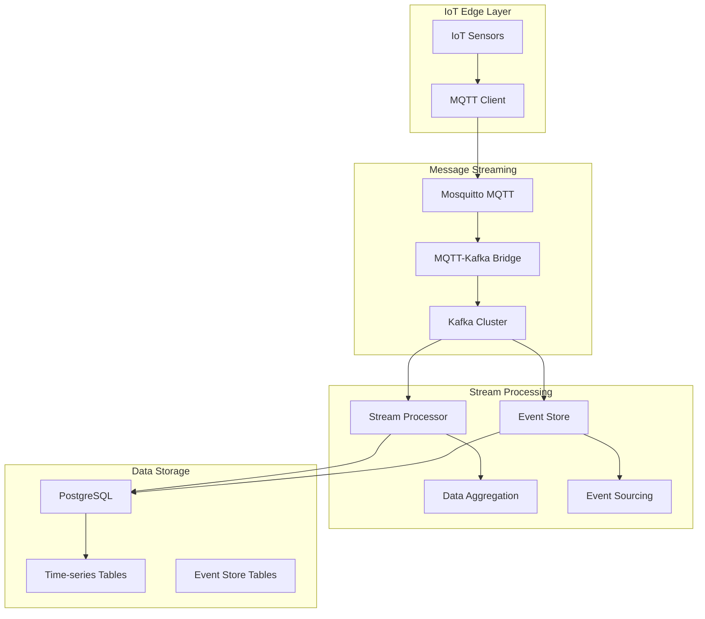

# Digital Twin Data Pipeline - Day 2 Implementation

## 🏗️ **Architecture Overview**

The Day 2 data pipeline provides enterprise-grade data processing capabilities with the following components:



## 📁 **Directory Structure**

```
data-pipeline/
├── mqtt/
│   └── config/          # MQTT broker configuration
├── sql/
│   └── init/            # PostgreSQL initialization scripts
├── src/
│   ├── bridge/          # MQTT-Kafka bridge
│   ├── processor/       # Stream processing engine
│   ├── eventstore/      # Event sourcing implementation
│   ├── simulator/       # IoT device simulator
│   └── shared/          # Common utilities and models
├── Dockerfile.bridge    # MQTT-Kafka bridge container
├── Dockerfile.processor # Stream processor container
├── Dockerfile.eventstore # Event store container
├── Dockerfile.simulator # IoT simulator container
└── requirements.txt     # Python dependencies
```

## 🚀 **Key Features**

### **Message Streaming Pipeline**
- **MQTT**: IoT device connectivity with QoS guarantees
- **Kafka**: Reliable event streaming with exactly-once semantics
- **Bridge**: Automatic MQTT to Kafka message forwarding

### **Stream Processing**
- **Real-time Aggregation**: 10-second windowing for metrics
- **Exactly-Once Processing**: Idempotent consumers with database transactions
- **Dead Letter Queues**: Error handling and message replay

### **Event Sourcing**
- **Complete Audit Trail**: Every sensor reading preserved
- **Temporal Queries**: Time-travel capabilities
- **State Reconstruction**: Rebuild machine state from events

### **Data Storage**
- **Time-series Optimization**: Partitioned tables by time
- **Efficient Indexing**: Optimized for time-range queries
- **Scalable Architecture**: Horizontal partitioning ready

## 🔧 **Technology Stack**

- **MQTT**: Eclipse Mosquitto 2.0
- **Event Streaming**: Apache Kafka with Confluent Platform
- **Database**: PostgreSQL 16 with time-series extensions
- **Processing**: Python asyncio with aiokafka
- **Monitoring**: Kafka UI, pgAdmin

## 📊 **Performance Targets**

- **Throughput**: 10K+ messages/second
- **Latency**: <5s end-to-end pipeline
- **Durability**: Zero message loss
- **Availability**: 99.9% uptime
