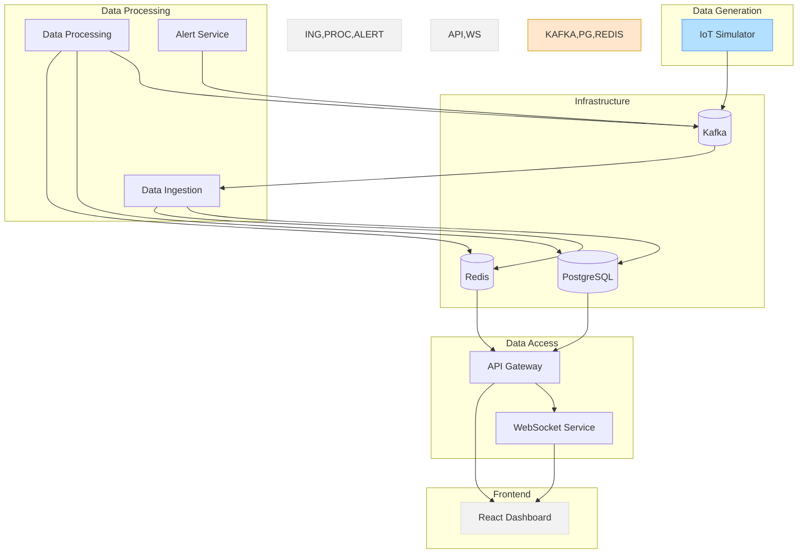

# Interview Preparation Summary

## Project Overview

The IoT Monitoring System provides a comprehensive implementation of technologies mentioned in the job description. The system demonstrates how to build real-time dashboards and APIs that collect, process, and visualize data from a digital twin ecosystem for advanced manufacturing operations.

## Technologies Demonstrated

| Technology       | Role in Project                                         | Implementation                                           |
|------------------|--------------------------------------------------------|----------------------------------------------------------|
| **Node.js**      | Backend microservices                                   | IoT Simulator service with device simulators              |
| **PostgreSQL**   | Time-series data storage                                | Database schema for IoT sensors, readings, and alerts     |
| **Redis**        | Caching and real-time state                             | Redis configuration for performance optimization          |
| **Kafka**        | Event streaming between services                        | Message broker with topics for sensors, alerts, metrics   |
| **Docker**       | Containerization and deployment                         | Docker Compose environment for all components             |
| **WebSockets**   | Real-time data delivery                                 | Planned for dashboard integration                         |
| **Kubernetes**   | Container orchestration                                 | Planned for production deployment                         |
| **React/Plotly** | Interactive data visualization                          | Planned for dashboard implementation                      |

## Key Components

### 1. Infrastructure Layer

This layer provides the foundation for the entire system:

- **PostgreSQL Database**: Schema design for IoT data with tables for:
  - Device configuration and metadata
  - Sensor readings (time-series data)
  - Alerts and notifications
  - Aggregated statistics

- **Redis Cache**: Configuration for:
  - Real-time data access
  - Memory optimization
  - Persistence settings

- **Kafka Message Broker**: Topics for:
  - Sensor data streaming
  - Alerts and notifications
  - System metrics

### 2. Data Generation & Ingestion

The first functional layer of the system:

- **IoT Simulator Service**: Generates realistic IoT data with:
  - Five distinct device simulators with unique patterns
  - Configurable data generation parameters
  - Anomaly injection for testing alerting
  - Kafka integration for data publishing

- **Data Ingestion Service**: (Planned) Will consume and process data with:
  - Kafka consumer for high-throughput ingestion
  - Batch processing for database efficiency
  - Validation and transformation pipeline

## System Architecture

The system uses a microservices architecture with clearly defined components that communicate through Kafka:

## Interview Talking Points

### System Design Decisions

1. **Microservices Architecture**
   - Each service has a single responsibility
   - Services communicate through Kafka for decoupling
   - Stateless services for horizontal scalability

2. **Event-Driven Design**
   - Kafka as the central event bus
   - Services react to events rather than direct API calls
   - Enables real-time processing and asynchronous operations

3. **Data Management**
   - PostgreSQL for structured time-series data
   - Redis for real-time data access and caching
   - Batch processing for database efficiency

4. **Scalability Considerations**
   - Horizontal scaling of stateless services
   - Kafka partitioning for parallel processing
   - Connection pooling for database performance

5. **Monitoring and Reliability**
   - Health check endpoints for each service
   - Metrics collection for performance monitoring
   - Graceful error handling and retries

### Technology-Specific Points

#### Node.js
- Asynchronous event-driven architecture
- Express for lightweight HTTP servers
- Structured logging with Pino
- Error handling and graceful shutdown

#### PostgreSQL
- Schema design for time-series data
- Indexing strategies for query performance
- Connection pooling for concurrent access
- Batch operations for high-throughput writes

#### Redis
- Caching strategies for real-time data
- Memory optimization with maxmemory settings
- Data structures (hashes, lists) for different use cases

#### Kafka
- Topic design and partitioning strategies
- Producer configuration for reliability
- Consumer groups for parallel processing
- Message format and serialization

#### Docker & Kubernetes
- Container design and optimization
- Multi-stage builds for smaller images
- Docker Compose for development environment
- Health checks and readiness probes

#### WebSockets
- Real-time data streaming to clients
- Connection management and scaling
- Integration with Kafka for event sourcing

#### React & Plotly
- Component architecture for dashboards
- Real-time data visualization
- Performance optimization for large datasets
- Responsive design for different screen sizes

## Sample Questions and Answers

### Architecture & Design

**Q: How would you design a system to handle real-time data from thousands of IoT devices?**

A: I would implement an event-driven architecture with Kafka at its core. IoT devices would publish data to Kafka topics, which would then be consumed by specialized services. For real-time processing, I'd use stream processing to analyze the data and detect anomalies. For persistence, I'd use a time-series database like PostgreSQL with optimized schemas and indexes. To ensure real-time delivery to dashboards, I'd implement WebSockets for pushing updates to clients. This architecture provides:
- Scalability through horizontal scaling of stateless services
- Resilience through message persistence in Kafka
- Performance through specialized processing and caching
- Real-time capabilities through event streaming and WebSockets

### Specific Technologies

**Q: How would you optimize database performance for time-series data in PostgreSQL?**

A: For time-series data in PostgreSQL, I would:
1. Implement table partitioning by time ranges to improve query performance
2. Create appropriate indexes on timestamp and device ID columns
3. Use batch inserts to minimize write overhead
4. Implement materialized views for commonly accessed aggregations
5. Configure connection pooling to manage concurrent connections
6. Set up regular maintenance tasks for vacuuming and analyzing tables
7. Consider hypertables (TimescaleDB) for very large datasets

### Implementation Details

**Q: How would you implement a Kafka consumer that processes messages reliably?**

A: I would implement a Kafka consumer with these reliability features:
1. Consumer group configuration for parallel processing and failover
2. Explicit offset management with commits only after successful processing
3. Idempotent processing to handle potential message duplicates
4. Circuit breakers for downstream service dependencies
5. Exponential backoff for retries on transient failures
6. Dead-letter queue for messages that can't be processed
7. Monitoring and alerting on consumer lag
8. Graceful shutdown handling to avoid losing messages

## Final Thoughts

This project demonstrates practical knowledge of the technologies mentioned in the job description. It shows the ability to design and implement a complex system using microservices architecture, event streaming, and real-time data processing - all key skills for a Full-Stack Engineer building real-time dashboards and APIs for manufacturing operations.
Interview preparation for Full-Stack Engineer position is progressing well. Phase 2 completed with IoT Simulator service running successfully.
