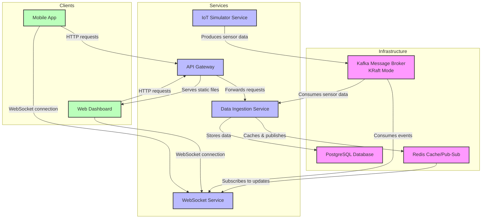

# IoT Monitoring System Architecture

This document describes the architecture of the IoT Monitoring System, including the relationships between different microservices and components.

## System Architecture Diagram

## Data Flow

1. **IoT Simulator Service**:
   - Simulates multiple IoT devices
   - Generates sensor readings (temperature, humidity, pressure, vibration)
   - Publishes readings to Kafka topic "sensors-data"

2. **Data Ingestion Service**:
   - Consumes sensor data from Kafka
   - Validates and processes the data
   - Stores data in PostgreSQL for persistent storage
   - Publishes real-time updates to Redis channels

3. **WebSocket Service**:
   - Subscribes to Redis channels for real-time updates
   - Maintains WebSocket connections with clients
   - Broadcasts updates to connected clients
   - Handles client subscriptions to specific devices

4. **API Gateway**:
   - Routes client requests to appropriate services
   - Serves the web dashboard static files
   - Handles authentication and authorization
   - Provides a unified API for clients

5. **Web Dashboard**:
   - Displays real-time data visualization
   - Allows users to monitor device status
   - Provides historical data analysis
   - Connects to WebSocket for real-time updates

## Technologies Used

- **Node.js**: Runtime for all microservices
- **PostgreSQL**: Persistent storage for IoT data
- **Redis**: Caching and pub/sub communication
- **Kafka (KRaft Mode)**: Message queue for handling high-volume sensor data without Zookeeper dependency
- **Docker & Docker Compose**: Containerization and orchestration
- **Express.js**: Web framework for API services
- **Socket.IO**: WebSocket implementation for real-time communication
- **HTML/CSS/JavaScript**: Frontend dashboard

## Component Details

### IoT Simulator Service

The simulator creates virtual IoT devices that generate various types of sensor readings. Each device has unique characteristics and can simulate different conditions (normal operation, warnings, critical states).

### Data Ingestion Service

This service is responsible for consuming, processing, and storing all IoT data. It validates incoming data, applies business rules, and ensures data is properly stored for both real-time access and historical analysis.

### WebSocket Service

Handles real-time communication with clients. It maintains WebSocket connections, manages client subscriptions to specific devices or data types, and broadcasts updates as they occur.

### API Gateway

Acts as a single entry point for all client applications. It routes requests to the appropriate services, handles cross-cutting concerns like authentication, and serves static files for the web dashboard.

### Dashboard

A web-based user interface that visualizes the IoT data in real-time. It includes charts, gauges, and alerts to help users monitor and analyze device performance and status.
