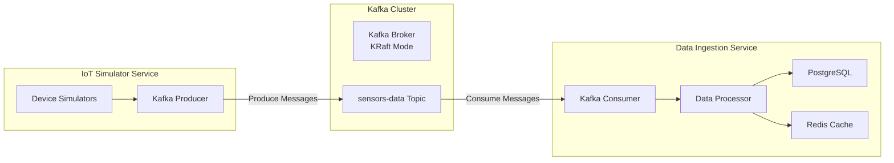

# Kafka Integration Guide

This document provides a comprehensive guide on how Apache Kafka is integrated into the IoT Monitoring System, including complete data flow traces from frontend to backend.

## Table of Contents
1. [Architecture Overview](#architecture-overview)
2. [Kafka Configuration](#kafka-configuration)
3. [Producer Implementation](#producer-implementation)
4. [Consumer Implementation](#consumer-implementation)
5. [Data Flow Trace](#data-flow-trace)
6. [Message Schemas](#message-schemas)
7. [Error Handling](#error-handling)
8. [Performance Optimizations](#performance-optimizations)
9. [Monitoring and Troubleshooting](#monitoring-and-troubleshooting)

## Architecture Overview



### Role in System
- **Message Broker**: Central hub for streaming IoT sensor data
- **Decoupling**: Separates data producers (simulators) from consumers (processors)
- **Scalability**: Handles high-throughput sensor data streams
- **Reliability**: Ensures message durability and delivery guarantees

## Kafka Configuration

### Broker Configuration (KRaft Mode)
```yaml
# docker-compose.yml
kafka:
  image: confluentinc/cp-kafka:latest
  environment:
    KAFKA_KRAFT_MODE: "true"
    KAFKA_NODE_ID: 1
    KAFKA_PROCESS_ROLES: broker,controller
    KAFKA_CONTROLLER_LISTENER_NAMES: CONTROLLER
    KAFKA_LISTENERS: PLAINTEXT://0.0.0.0:9092,CONTROLLER://0.0.0.0:9093
    KAFKA_ADVERTISED_LISTENERS: PLAINTEXT://kafka:9092
    KAFKA_CONTROLLER_QUORUM_VOTERS: 1@kafka:9093
    KAFKA_CLUSTER_ID: "your-cluster-id"
    KAFKA_AUTO_CREATE_TOPICS_ENABLE: "true"
    KAFKA_NUM_PARTITIONS: 3
    KAFKA_DEFAULT_REPLICATION_FACTOR: 1
```

### Application Configuration
```javascript
// services/iot-simulator/src/config/index.js
module.exports = {
  kafka: {
    // Unique client identifier - helps Kafka brokers identify this specific producer instance
    // Used for monitoring, logging, and debugging connection issues
    clientId: 'iot-simulator',
    
    // Array of Kafka broker addresses - provides high availability through multiple brokers
    // Format: 'hostname:port' - using Docker service name 'kafka' with default port 9092
    brokers: ['kafka:9092'],
    
    // Topic name where sensor data will be published
    // All IoT device readings flow through this single topic for centralized processing
    sensorsTopic: 'sensors-data',
    
    // Number of messages to batch together before sending to Kafka
    // Improves throughput by reducing network calls - balance between latency and efficiency
    batchSize: 100,
    
    // Maximum number of retry attempts for failed operations
    // Handles transient network issues and temporary broker unavailability
    maxRetries: 5,
    
    // Delay in milliseconds between retry attempts
    // Prevents overwhelming the broker during recovery periods
    retryInterval: 1000
  }
};
```

## Producer Implementation

### IoT Simulator - Kafka Producer

**File**: `services/iot-simulator/src/kafka/producer.js`

```javascript
// Import KafkaJS library - the Node.js client for Apache Kafka
const { Kafka } = require('kafkajs');
// Import application configuration containing broker addresses and settings
const config = require('../config');
// Import logging utility for structured logging and debugging
const logger = require('../utils/logger');

class KafkaProducerService {
  constructor() {
    // Create Kafka client instance - the main entry point for Kafka operations
    this.kafka = new Kafka({
      // Unique identifier for this client - helps with monitoring and debugging
      clientId: config.kafka.clientId,
      // Array of broker addresses - provides failover if primary broker fails
      brokers: config.kafka.brokers,
      // Retry configuration for handling network failures and broker unavailability
      retry: {
        // Initial delay before first retry - starts small to handle quick recoveries
        initialRetryTime: 100,
        // Maximum number of retry attempts before giving up
        retries: config.kafka.maxRetries
      }
    });
    
    // Create producer instance - handles message publishing to topics
    this.producer = this.kafka.producer();
    
    // Track connection state to prevent operations on disconnected producer
    this.connected = false;
    
    // Buffer to accumulate messages for batch sending - improves throughput
    this.messageBuffer = [];
    
    // Timer for periodic buffer flushing - ensures messages aren't held indefinitely
    this.flushInterval = null;
  }

  async connect() {
    try {
      // Establish connection to Kafka cluster - may take time if brokers are starting
      await this.producer.connect();
      
      // Mark as connected to enable message buffering and sending
      this.connected = true;
      
      // Set up periodic message flushing to ensure timely delivery
      // Using bind() to maintain correct 'this' context in the interval callback
      this.flushInterval = setInterval(
        this.flushMessages.bind(this), 
        config.kafka.retryInterval  // Flush every 1 second by default
      );
      
      logger.info('Connected to Kafka');
      return true;
    } catch (error) {
      // Reset connection state on failure
      this.connected = false;
      logger.error('Failed to connect to Kafka', { error });
      return false;
    }
  }

  sendMessage(message) {
    // Transform message into Kafka format with key, value, and timestamp
    this.messageBuffer.push({
      // Use deviceId as partition key - ensures all messages from same device 
      // go to same partition, maintaining order for that device
      key: message.deviceId,
      
      // Serialize message to JSON string - Kafka requires string or Buffer values
      value: JSON.stringify(message),
      
      // Add timestamp for message ordering and debugging
      timestamp: new Date().getTime()
    });
    
    // Check if buffer has reached optimal batch size for sending
    if (this.messageBuffer.length >= config.kafka.batchSize) {
      // Use setImmediate to flush on next event loop tick - prevents blocking
      setImmediate(() => this.flushMessages());
    }
    
    // Return true to indicate message was accepted (buffered, not yet sent)
    return true;
  }

  async flushMessages() {
    // Skip if no messages to send or not connected to Kafka
    if (this.messageBuffer.length === 0 || !this.connected) {
      return;
    }
    
    // Copy current buffer and clear it immediately to avoid double-sending
    const messagesToSend = [...this.messageBuffer];
    this.messageBuffer = [];
    
    try {
      // Send batch of messages to Kafka topic
      await this.producer.send({
        // Target topic where sensor data is collected
        topic: config.kafka.sensorsTopic,
        // Array of messages in Kafka format
        messages: messagesToSend
      });
      
      logger.debug(`Sent ${messagesToSend.length} messages to Kafka`);
    } catch (error) {
      // On failure, restore messages to buffer for retry
      // Prepend failed messages to maintain order
      this.messageBuffer = [...messagesToSend, ...this.messageBuffer];
      logger.error('Failed to send messages to Kafka', { error });
    }
  }
}
```

### Device Simulator Usage
```javascript
// services/iot-simulator/src/simulators/temperature.js
class TemperatureSimulator {
  constructor(deviceConfig, sendMessage) {
    this.deviceId = deviceConfig.deviceId;
    this.sendMessage = sendMessage;
  }

  generateReading() {
    const reading = {
      deviceId: this.deviceId,
      sensorType: 'temperature',
      value: this.generateTemperatureValue(),
      unit: '°C',
      timestamp: new Date().toISOString(),
      location: this.location,
      status: this.determineStatus()
    };

    // Send to Kafka via producer
    this.sendMessage(reading);
  }
}
```

## Consumer Implementation

### Data Ingestion - Kafka Consumer

**File**: `services/data-ingestion/src/kafka/consumer.js`

```javascript
const { Kafka } = require('kafkajs');
const config = require('../config');
const logger = require('../utils/logger');
const { DeviceRepository, SensorReadingRepository } = require('../db/repositories');

const kafka = new Kafka({
  clientId: config.kafka.clientId,
  brokers: config.kafka.brokers
});

const consumer = kafka.consumer({
  groupId: config.kafka.groupId,
  sessionTimeout: config.kafka.sessionTimeout,
  heartbeatInterval: config.kafka.heartbeatInterval
});

let batchedReadings = [];
let deviceRepository = null;
let sensorReadingRepository = null;

async function processSensorReading(reading) {
  try {
    const data = JSON.parse(reading);
    
    // Prepare for database insertion
    const dbReading = {
      device_id: data.deviceId,
      timestamp: data.timestamp,
      sensor_type: data.sensorType,
      value: data.value,
      unit: data.unit,
      location: data.location,
      status: data.status,
      created_at: new Date()
    };
    
    // Add to batch for database insertion
    batchedReadings.push(dbReading);
    
    // Cache in Redis for real-time access
    await redisClient.storeSensorReading(data);
    
    // Ensure device exists in database
    await deviceRepository.ensureDeviceExists(data.deviceId, {
      deviceType: data.sensorType,
      location: data.location,
      status: data.status
    });
    
    return true;
  } catch (error) {
    logger.error('Failed to process sensor reading', { error, reading });
    return false;
  }
}

async function initialize() {
  try {
    // Initialize repositories
    deviceRepository = new DeviceRepository();
    sensorReadingRepository = new SensorReadingRepository();
    
    // Connect to Kafka
    await consumer.connect();
    await consumer.subscribe({
      topic: config.kafka.topic,
      fromBeginning: false
    });
    
    // Start consuming with batch processing
    await consumer.run({
      partitionsConsumedConcurrently: 3,
      eachBatchAutoResolve: true,
      eachBatch: async ({ batch, resolveOffset, heartbeat }) => {
        const { messages } = batch;
        
        for (const message of messages) {
          const value = message.value?.toString();
          if (value) {
            await processSensorReading(value);
          }
          resolveOffset(message.offset);
        }
        
        // Flush batch to database
        if (batchedReadings.length >= config.postgres.batchSize) {
          await sensorReadingRepository.batchInsertSensorReadings(batchedReadings);
          batchedReadings = [];
        }
        
        await heartbeat();
      }
    });
    
    logger.info('Kafka consumer started successfully');
  } catch (error) {
    logger.error('Failed to initialize Kafka consumer', { error });
    throw error;
  }
}
```

## Data Flow Trace

### Complete End-to-End Flow

1. **Frontend Dashboard Request**
   ```javascript
   // Frontend requests current device data
   const response = await apiService.getDeviceCurrent('device-001');
   ```

2. **Device Simulator Generation**
   ```javascript
   // Simulator generates reading every 5 seconds
   const reading = {
     deviceId: 'device-001',
     sensorType: 'temperature',
     value: 25.5,
     unit: '°C',
     timestamp: '2025-06-13T10:00:00Z'
   };
   
   // Send to Kafka producer
   kafkaProducer.sendMessage(reading);
   ```

3. **Kafka Message Flow**
   ```
   Producer → sensors-data Topic (Partition 0) → Consumer Group
   ```

4. **Data Ingestion Processing**
   ```javascript
   // Consumer receives message
   await processSensorReading(message.value);
   
   // Stores in PostgreSQL
   await sensorReadingRepository.batchInsertSensorReadings([reading]);
   
   // Caches in Redis
   await redisClient.storeSensorReading(reading);
   
   // Publishes to Redis channel for real-time updates
   await redisClient.publishToChannel('sensor-readings', reading);
   ```

5. **Real-time Updates**
   ```javascript
   // WebSocket service receives from Redis
   redisSubscriber.on('sensor-readings', (data) => {
     socketIO.emit('sensor:all', data);
   });
   
   // Frontend receives real-time update
   socket.on('sensor:all', (data) => {
     dispatch(updateRealTimeData(data));
   });
   ```

## Message Schemas

### Sensor Reading Message
```javascript
{
  "deviceId": "device-001",
  "sensorType": "temperature|pressure|vibration|production|quality",
  "value": 25.5,
  "unit": "°C|PSI|Hz|units/hour|%",
  "timestamp": "2025-06-13T10:00:00.000Z",
  "location": "Assembly Line 1",
  "status": "normal|warning|critical",
  "metadata": {
    "firmware": "1.2.3",
    "batteryLevel": 85
  }
}
```

### Device Status Message
```javascript
{
  "deviceId": "device-001",
  "status": "online|offline|maintenance",
  "timestamp": "2025-06-13T10:00:00.000Z",
  "location": "Assembly Line 1"
}
```

## Error Handling

### Producer Error Handling
```javascript
async flushMessages() {
  try {
    await this.producer.send({
      topic: config.kafka.sensorsTopic,
      messages: messagesToSend
    });
  } catch (error) {
    // Retry logic with exponential backoff
    if (error.retriable) {
      this.messageBuffer = [...messagesToSend, ...this.messageBuffer];
      logger.warn('Retriable error, messages added back to buffer', { error });
    } else {
      logger.error('Non-retriable error, messages lost', { error });
    }
  }
}
```

### Consumer Error Handling
```javascript
await consumer.run({
  eachBatch: async ({ batch, resolveOffset }) => {
    for (const message of batch.messages) {
      try {
        await processSensorReading(message.value.toString());
        resolveOffset(message.offset);
      } catch (error) {
        logger.error('Failed to process message', { 
          error, 
          offset: message.offset,
          partition: batch.partition 
        });
        
        // Dead letter queue logic could be added here
        if (error.severity === 'critical') {
          await sendToDeadLetterQueue(message);
        }
        
        // Still resolve offset to avoid reprocessing
        resolveOffset(message.offset);
      }
    }
  }
});
```

## Performance Optimizations

### Batching Strategy
```javascript
// Producer batching
const batchConfig = {
  batchSize: 100,           // Messages per batch
  lingerMs: 100,           // Wait time before sending
  compression: 'gzip'       // Compression type
};

// Consumer batching
const consumerConfig = {
  maxBytesPerPartition: 1048576,    // 1MB per partition
  partitionsConsumedConcurrently: 3, // Parallel processing
  eachBatchAutoResolve: true        // Auto-resolve offsets
};
```

### Partitioning Strategy
```javascript
// Partition by device ID for ordering guarantees
const message = {
  key: reading.deviceId,    // Ensures same device goes to same partition
  value: JSON.stringify(reading),
  timestamp: Date.now()
};
```

### Memory Management
```javascript
// Monitor memory usage
setInterval(() => {
  const memUsage = process.memoryUsage();
  if (memUsage.heapUsed > config.memory.maxHeapSize) {
    logger.warn('High memory usage detected', { memUsage });
    // Force garbage collection or reduce batch sizes
  }
}, 30000);
```

## Monitoring and Troubleshooting

### Key Metrics to Monitor
```javascript
// Producer metrics
const producerMetrics = {
  messagesSent: stats.messagesSent,
  messageErrors: stats.messageErrors,
  batchesSent: stats.batchesSent,
  avgBatchSize: stats.messagesSent / stats.batchesSent,
  bufferSize: messageBuffer.length
};

// Consumer metrics
const consumerMetrics = {
  messagesProcessed: processedCount,
  processingErrors: errorCount,
  lagTime: Date.now() - lastMessageTimestamp,
  batchProcessingTime: avgBatchTime
};
```

### Common Issues and Solutions

| Issue | Symptoms | Solution |
|-------|----------|----------|
| Consumer Lag | Messages piling up | Increase consumer instances or partition count |
| Connection Failures | Producer/consumer disconnects | Check network, increase retry settings |
| Memory Issues | High heap usage | Reduce batch sizes, implement backpressure |
| Duplicate Messages | Same message processed twice | Implement idempotency in consumer logic |
| Message Loss | Missing data points | Check producer acknowledgment settings |

### Debugging Commands
```bash
# Check topic details
kafka-topics --bootstrap-server kafka:9092 --describe --topic sensors-data

# Check consumer group status
kafka-consumer-groups --bootstrap-server kafka:9092 --describe --group data-ingestion-group

# Monitor real-time messages
kafka-console-consumer --bootstrap-server kafka:9092 --topic sensors-data --from-beginning
```

## Best Practices

1. **Producer Best Practices**
   - Use appropriate partitioning strategy
   - Implement proper error handling and retries
   - Monitor producer metrics
   - Use compression for large messages

2. **Consumer Best Practices**
   - Process messages idempotently
   - Handle poison messages gracefully
   - Monitor consumer lag
   - Use appropriate commit strategies

3. **Topic Management**
   - Set appropriate retention policies
   - Monitor disk usage
   - Use meaningful topic names
   - Configure proper replication factor

4. **Security Considerations**
   - Enable SSL/SASL authentication
   - Use ACLs for authorization
   - Encrypt sensitive data in messages
   - Monitor access logs

This comprehensive guide covers the complete Kafka integration in the IoT Monitoring System, from message production to consumption, with practical examples and best practices for production deployment.
