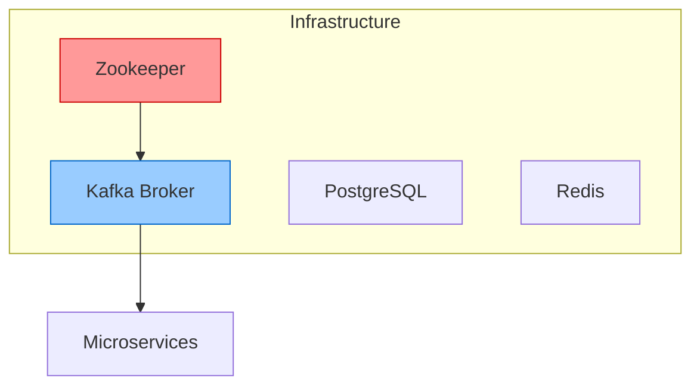
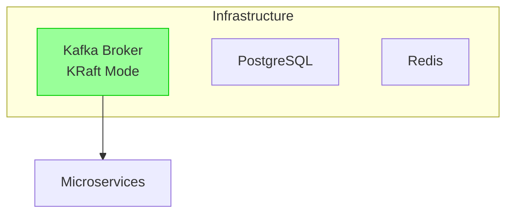

# Kafka KRaft Migration Documentation

## Overview

This document describes the migration of the IoT Monitoring System from Apache Kafka with Zookeeper to Apache Kafka with KRaft (Kafka Raft) mode. This migration simplifies the infrastructure by removing the Zookeeper dependency while maintaining all functionality.

## Migration Summary

### What Changed
- **Removed Zookeeper**: Completely eliminated the Zookeeper service and its dependencies
- **Enabled KRaft Mode**: Configured Kafka to use its built-in Raft consensus protocol
- **Updated Configuration**: Modified Kafka settings to work in KRaft mode
- **Simplified Infrastructure**: Reduced the number of infrastructure components from 4 to 3

### What Stayed the Same
- **All microservices**: No changes required to IoT Simulator, Data Ingestion, API Gateway, or WebSocket services
- **Kafka client libraries**: All existing KafkaJS implementations continue to work unchanged
- **Topics and partitions**: Same topic structure (sensors-data, alerts, metrics)
- **Performance**: No impact on message throughput or latency

## Architecture Comparison

### Before (Zookeeper + Kafka)


### After (KRaft Only)


## Technical Changes

### Docker Compose Configuration

#### 1. Removed Zookeeper Service
```yaml
# REMOVED - No longer needed
zookeeper:
  image: confluentinc/cp-zookeeper:7.4.0
  environment:
    ZOOKEEPER_CLIENT_PORT: 2181
    ZOOKEEPER_TICK_TIME: 2000
```

#### 2. Updated Kafka Configuration
```yaml
# NEW - KRaft mode configuration
kafka:
  image: confluentinc/cp-kafka:7.4.0
  environment:
    # KRaft mode configuration
    KAFKA_PROCESS_ROLES: broker,controller
    KAFKA_NODE_ID: 1
    KAFKA_CONTROLLER_QUORUM_VOTERS: 1@kafka:9093
    KAFKA_CONTROLLER_LISTENER_NAMES: CONTROLLER
    KAFKA_LISTENERS: PLAINTEXT://localhost:9092,PLAINTEXT_INTERNAL://kafka:29092,CONTROLLER://kafka:9093
    KAFKA_ADVERTISED_LISTENERS: PLAINTEXT://localhost:9092,PLAINTEXT_INTERNAL://kafka:29092
    KAFKA_LISTENER_SECURITY_PROTOCOL_MAP: PLAINTEXT:PLAINTEXT,PLAINTEXT_INTERNAL:PLAINTEXT,CONTROLLER:PLAINTEXT
    
    # KRaft specific settings
    KAFKA_LOG_DIRS: /var/lib/kafka/data
    CLUSTER_ID: MkU3OEVBNTcwNTJENDM2Qk
  command: >
    bash -c "
      # Format the storage directory for KRaft
      kafka-storage format -t MkU3OEVBNTcwNTJENDM2Qk -c /etc/kafka/kafka.properties --ignore-formatted 2>/dev/null || true
      # Start Kafka
      /etc/confluent/docker/run
    "
```

#### 3. Updated Service Dependencies
```yaml
# BEFORE
depends_on:
  zookeeper:
    condition: service_healthy

# AFTER
depends_on:
  kafka:
    condition: service_healthy
```

#### 4. Removed Zookeeper from Kafka UI
```yaml
# REMOVED
KAFKA_CLUSTERS_0_ZOOKEEPER: zookeeper:2181

# Kafka UI now only needs the broker connection
environment:
  KAFKA_CLUSTERS_0_BOOTSTRAPSERVERS: kafka:29092
```

#### 5. Cleaned Up Volumes
```yaml
# REMOVED - No longer needed
volumes:
  zookeeper_data:
  zookeeper_logs:
```

## Key Benefits of KRaft Migration

### 1. Simplified Architecture
- **Fewer Components**: Reduced from 4 infrastructure components to 3
- **Simpler Dependencies**: No more complex Zookeeper coordination
- **Easier Debugging**: Fewer moving parts to troubleshoot

### 2. Improved Performance
- **Faster Metadata Operations**: KRaft consensus is more efficient than Zookeeper
- **Reduced Latency**: Eliminates network hops to Zookeeper
- **Better Scalability**: Easier to scale Kafka clusters

### 3. Operational Excellence
- **Reduced Operational Overhead**: One less service to monitor and maintain
- **Simplified Configuration**: Fewer configuration parameters to manage
- **Future-Proof**: Aligns with Kafka's roadmap (Zookeeper deprecation planned)

### 4. Resource Efficiency
- **Lower Memory Usage**: No Zookeeper JVM overhead
- **Reduced Network Traffic**: Elimination of Kafka-Zookeeper communication
- **Simplified Networking**: Fewer port configurations needed

## KRaft Configuration Details

### Core Settings Explained

| Setting | Value | Purpose |
|---------|--------|---------|
| `KAFKA_PROCESS_ROLES` | `broker,controller` | Enables both broker and controller roles in single node |
| `KAFKA_NODE_ID` | `1` | Unique identifier for this Kafka node |
| `KAFKA_CONTROLLER_QUORUM_VOTERS` | `1@kafka:9093` | Defines the controller quorum |
| `KAFKA_CONTROLLER_LISTENER_NAMES` | `CONTROLLER` | Names the controller listener |
| `CLUSTER_ID` | `MkU3OEVBNTcwNTJENDM2Qk` | Unique cluster identifier for KRaft |

### Listener Configuration

```yaml
# Three listeners for different purposes
KAFKA_LISTENERS: PLAINTEXT://localhost:9092,PLAINTEXT_INTERNAL://kafka:29092,CONTROLLER://kafka:9093

# External and internal broker access
KAFKA_ADVERTISED_LISTENERS: PLAINTEXT://localhost:9092,PLAINTEXT_INTERNAL://kafka:29092

# Protocol mapping
KAFKA_LISTENER_SECURITY_PROTOCOL_MAP: PLAINTEXT:PLAINTEXT,PLAINTEXT_INTERNAL:PLAINTEXT,CONTROLLER:PLAINTEXT
```

### Storage Initialization

The KRaft mode requires storage directory formatting before first use:

```bash
kafka-storage format -t MkU3OEVBNTcwNTJENDM2Qk -c /etc/kafka/kafka.properties --ignore-formatted
```

This command:
- Formats the log directories for KRaft metadata
- Uses the cluster ID to initialize the storage
- `--ignore-formatted` prevents errors on subsequent starts

## Testing the Migration

### Validation Steps

1. **Infrastructure Health**
   ```bash
   # Check Kafka broker status
   docker exec iot-kafka kafka-broker-api-versions --bootstrap-server localhost:9092
   
   # Verify topics creation
   docker exec iot-kafka kafka-topics --list --bootstrap-server localhost:9092
   ```

2. **Service Connectivity**
   ```bash
   # Test producer/consumer functionality
   docker logs iot-simulator
   docker logs iot-data-ingestion
   ```

3. **Real-time Data Flow**
   ```bash
   # Monitor topic messages
   docker exec iot-kafka kafka-console-consumer --bootstrap-server localhost:9092 --topic sensors-data --from-beginning
   ```

### Performance Verification

The migration should maintain or improve:
- **Message Throughput**: Same or better than Zookeeper setup
- **Latency**: Potentially lower due to reduced coordination overhead
- **Resource Usage**: Lower overall system resource consumption

## Interview Talking Points

### Technical Decision Making
- **Why KRaft?**: Future-proofing, operational simplicity, performance benefits
- **Migration Strategy**: Configuration-only changes, no application code modifications
- **Risk Assessment**: Low risk due to Docker containerization and isolated testing

### System Design Benefits
- **Reduced Complexity**: Fewer failure points in the system
- **Better Maintainability**: Simplified operational procedures
- **Improved Monitoring**: Fewer components to track and alert on

### Operational Considerations
- **Deployment Strategy**: Blue-green deployment possible with Docker Compose
- **Rollback Plan**: Simple revert to previous docker-compose.yml
- **Monitoring Changes**: Updated health checks and metrics collection

## Troubleshooting

### Common Issues and Solutions

1. **Kafka Fails to Start**
   ```bash
   # Check storage formatting
   docker exec iot-kafka kafka-log-dirs --bootstrap-server localhost:9092 --describe
   ```

2. **Service Connection Issues**
   ```bash
   # Verify listener configuration
   docker exec iot-kafka kafka-configs --bootstrap-server localhost:9092 --describe --entity-type brokers
   ```

3. **Topic Access Problems**
   ```bash
   # Test topic operations
   docker exec iot-kafka kafka-topics --bootstrap-server localhost:9092 --describe --topic sensors-data
   ```

## Conclusion

The migration to Kafka KRaft mode successfully:
- ✅ Eliminated Zookeeper dependency
- ✅ Maintained all existing functionality
- ✅ Simplified the infrastructure architecture
- ✅ Improved system maintainability
- ✅ Future-proofed the technology stack

This change demonstrates modern architectural practices and positions the IoT monitoring system for better scalability and operational efficiency.
