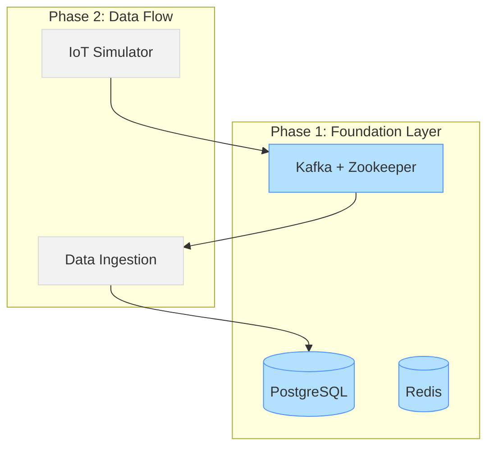

# Phase 1: Foundation Layer - Completion Report

## ✅ Phase 1 Complete: Infrastructure Foundation

The Foundation Layer of our IoT Manufacturing Monitoring System has been successfully set up. This phase provides the core infrastructure needed for the entire system.

## Accomplishments

1. **Database Setup**
   - PostgreSQL database with schema design
   - Tables for sensor readings, devices, alerts, and statistics
   - Optimized indexes for time-series data queries
   - Seed data for 5 IoT device configurations

2. **Messaging Infrastructure**
   - Kafka message broker for event streaming
   - Three Kafka topics: sensors-data, alerts, metrics
   - High-availability configuration with Zookeeper

3. **Caching Layer**
   - Redis cache for real-time data access
   - Memory-optimized configuration (512MB, LRU eviction)
   - Persistence enabled for data durability

4. **Docker Environment**
   - Docker Compose configuration for all services
   - Health checks for service monitoring
   - Container networking
   - Volume management for data persistence

5. **Developer Tools**
   - Kafka UI for topic management and monitoring
   - Redis Commander for cache inspection
   - Health check scripts for system verification

## Technical Overview

### Database Schema

The PostgreSQL database includes well-designed tables with proper relationships:
- `devices` - Configuration for 5 IoT sensors
- `sensor_readings` - Time-series data from device readings
- `alerts` - Alert lifecycle management
- `device_stats_hourly` - Aggregated statistics for performance
- `system_events` - System operation logs

### Messaging Structure

Kafka provides reliable message delivery with:
- `sensors-data` topic - 3 partitions for high throughput
- `alerts` topic - 2 partitions for notification events
- `metrics` topic - 2 partitions for system metrics

### Infrastructure Monitoring

Health check scripts verify:
- Container status and connectivity
- Database schema and seed data
- Kafka topic configuration
- Redis memory settings and operations
- Basic performance benchmarks

## Next Steps: Phase 2

Now that the infrastructure is in place, we're ready to proceed with Phase 2: Data Generation & Ingestion. In the next phase, we will:

1. **Implement IoT Simulator Service**
   - Create Node.js service to generate realistic sensor data
   - Implement 5 device simulators with configurable parameters
   - Add anomaly generation for testing alerts
   - Set up Kafka producer integration

2. **Implement Data Ingestion Service**
   - Create Kafka consumer for processing sensor data
   - Implement PostgreSQL batch insertion for performance
   - Add data validation and error handling
   - Set up metrics collection

To proceed with Phase 2, run:

```bash
# Make sure Phase 1 infrastructure is running
cd iot-monitoring-system
./scripts/setup.sh

# Once infrastructure is confirmed working
# We'll proceed with service implementation
```

## System Architecture Diagram



## Summary

Phase 1 provides a solid foundation for our IoT monitoring system. The infrastructure components are containerized for easy deployment and configured for optimal performance. This architecture will enable the real-time data processing, visualization, and alerting capabilities needed in subsequent phases.
