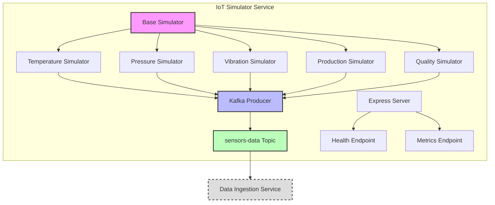

# Phase 2: Data Generation & Ingestion - Completion Report

## ✅ Phase 2 Progress: IoT Simulator Implementation

We have successfully implemented the IoT Simulator service, which generates realistic sensor data from 5 different IoT devices and publishes it to Kafka for further processing.

## IoT Simulator Architecture

The IoT Simulator service follows a modular architecture with:

1. **Flexible Device Simulation**: A base simulator class extended by 5 specific device simulators, each with its own realistic data generation pattern.
2. **High-Performance Kafka Integration**: Efficient batching of messages with retry capabilities.
3. **API Endpoints**: Health check and metrics for monitoring.
4. **Containerization**: Docker support for easy deployment.



## Implemented Components

### 1. Device Simulators

Five distinct device simulators have been implemented, each with a unique data generation pattern:

| Device | Type | Pattern | Parameters |
|--------|------|---------|------------|
| Temperature | Sine wave | Daily cycle with noise | Amplitude, cycle period, base value |
| Pressure | Steady state | Occasional spikes | Spike frequency, intensity, base value |
| Vibration | Random walk | Occasional bursts | Burst frequency, intensity, random walk factor |
| Production | Step function | Work shift pattern | Working hours, peak value, ramp time |
| Quality | Normal distribution | Occasional dips | Base quality, standard deviation, dip frequency |

### 2. Kafka Integration

- **Producer**: Implements batching, retries, and error handling
- **Message Format**: Structured JSON messages with metadata
- **Performance**: Optimized for high throughput with configurable batch sizes

### 3. Monitoring

- **Health Checks**: Endpoint for service health monitoring
- **Metrics**: Statistics on message generation and anomalies
- **Logging**: Structured logging with configurable levels

### 4. Configuration

- **Environment Variables**: All parameters can be configured via environment variables
- **Device Parameters**: Detailed configuration for each device type
- **Anomaly Injection**: Configurable anomaly probability and patterns

## Testing

The IoT Simulator can be tested in multiple ways:

1. **Individual Testing**: Using the `test-iot-simulator.sh` script
2. **Docker Compose**: As part of the full system using `docker-compose up`
3. **Manual Verification**: Through Kafka UI at http://localhost:8080

## Sample Data

The service generates data like:

```json
{
  "deviceId": "device-001",
  "timestamp": "2025-06-11T10:45:22.543Z",
  "sensorType": "temperature",
  "value": 74.32,
  "unit": "celsius",
  "location": "assembly-line-1",
  "status": "active"
}
```

## Next Steps for Phase 2

1. **Data Ingestion Service**:
   - Implement Kafka consumer for the `sensors-data` topic
   - Create database batch writer for PostgreSQL
   - Add data validation and processing
   - Implement caching with Redis
   - Connect with alerting system

2. **Testing**:
   - End-to-end testing with all components
   - Performance testing under load
   - Anomaly detection validation

## Summary

The IoT Simulator service provides a robust foundation for the data generation layer of our IoT Monitoring System. It generates realistic data patterns that can be used to test and develop the downstream components of the system.

With this implementation, we've demonstrated the ability to work with key technologies from the job description:
- **Node.js**: For the microservice implementation
- **Kafka**: For message streaming
- **Docker**: For containerization
- **WebSockets**: (Coming in Phase 6 for real-time updates)

The implementation is structured to be maintainable, testable, and scalable, showcasing good software engineering practices.
Phase 2 (Data Generation) completed successfully. IoT Simulator service is running and publishing data to Kafka.
