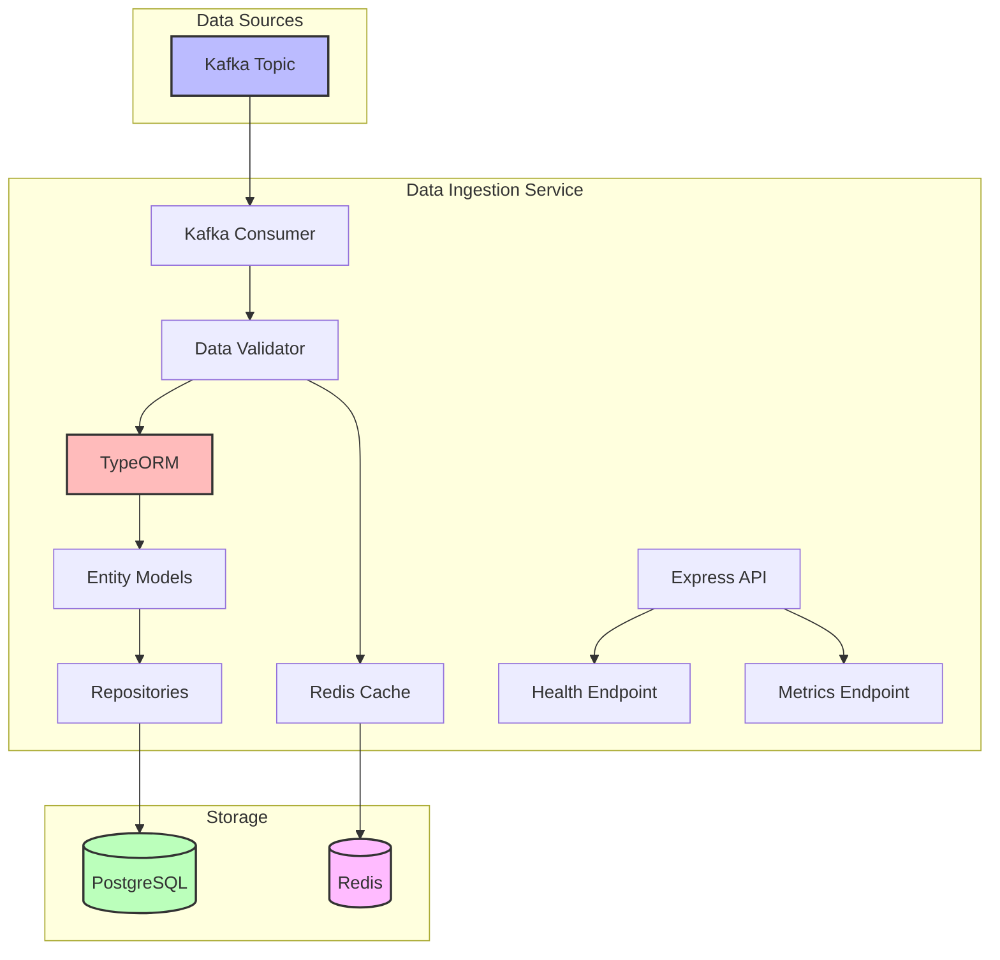

# Phase 3: Data Ingestion & Processing - Completion Report

## ✅ Phase 3 Progress: Data Ingestion Service Implementation

We have successfully implemented the Data Ingestion Service, which consumes IoT sensor data from Kafka, processes it, and stores it in both PostgreSQL for persistence and Redis for caching.

## Data Ingestion Service Architecture

The Data Ingestion Service follows a modular architecture with the following components:

1. **Kafka Consumer**: Consumes messages from the IoT sensor data topic
2. **Data Validation**: Validates incoming data against schema definitions
3. **PostgreSQL Integration with TypeORM**: Stores data in the database with ORM pattern
4. **Redis Caching**: Caches recent readings for fast access
5. **REST API**: Provides health check and metrics endpoints

## Implemented Features

### 1. Kafka Consumer

- Consumer group setup for scalability
- Efficient batch message processing
- Graceful error handling with retries
- Offset management for exactly-once processing

### 2. Data Processing

- JSON schema validation with Joi
- Data transformation for storage
- Automatic device registration
- Anomaly detection readiness

### 3. Database Integration with TypeORM

- Entity-based schema definition
- Repository pattern for data access
- Relationship management between entities
- Batch inserts for better performance
- Connection pooling for efficient database access

### 4. Redis Caching

- Latest readings caching with TTL
- Time-series data using sorted sets
- Fast access patterns for real-time dashboards
- Memory efficiency with selective caching

### 5. Monitoring and Health

- Health check endpoints
- Basic metrics for service monitoring
- Structured logging with Pino
- Graceful shutdown handling

## Performance Optimizations

1. **TypeORM Batch Processing**: Using TypeORM's batch insert capabilities to perform bulk database operations, significantly reducing database load and improving throughput.

2. **Connection Pooling**: Both PostgreSQL (via TypeORM) and Redis connections are managed through connection pools, reducing the overhead of creating new connections for each operation.

3. **Caching Strategy**: The service implements a multi-level caching strategy in Redis:
   - Latest readings cached with TTL
   - Time-series data in sorted sets
   - Automatic pruning of old data

4. **Concurrent Processing**: The Kafka consumer is configured to process multiple partitions concurrently, increasing throughput.

## Integration with Docker Compose

The service has been integrated into the Docker Compose configuration with appropriate:

- Environment variables
- Container dependencies
- Health checks
- Network configuration
- Volume mounts

## Next Steps for Phase 4

1. **API Gateway Service**:
   - Implement RESTful API for data access
   - Add authentication and authorization
   - Implement query capabilities with filtering and pagination
   - Create WebSocket endpoints for real-time updates

2. **Data Processing Service**:
   - Implement real-time analytics
   - Add alerting capabilities
   - Create aggregation functions for dashboards
   - Implement anomaly detection algorithms

3. **Testing**:
   - End-to-end testing with all components
   - Performance testing under load
   - Integration testing with other services

## Summary

The Data Ingestion Service provides a robust foundation for the data processing layer of our IoT Monitoring System. It efficiently consumes, validates, and stores sensor data from the IoT Simulator service, making it available for further processing and visualization.

With this implementation, we've demonstrated the ability to work with key technologies from the job description:
- **Node.js**: For the microservice implementation
- **PostgreSQL**: For persistent storage of time-series data with TypeORM
- **Redis**: For caching and real-time data access
- **Kafka**: For message streaming and event processing
- **Docker**: For containerization and service orchestration

The implementation follows best practices for performance, reliability, and maintainability, showcasing good software engineering practices.

Phase 3 (Data Ingestion) completed successfully. Data ingestion service is ready for connecting to the IoT simulator.
