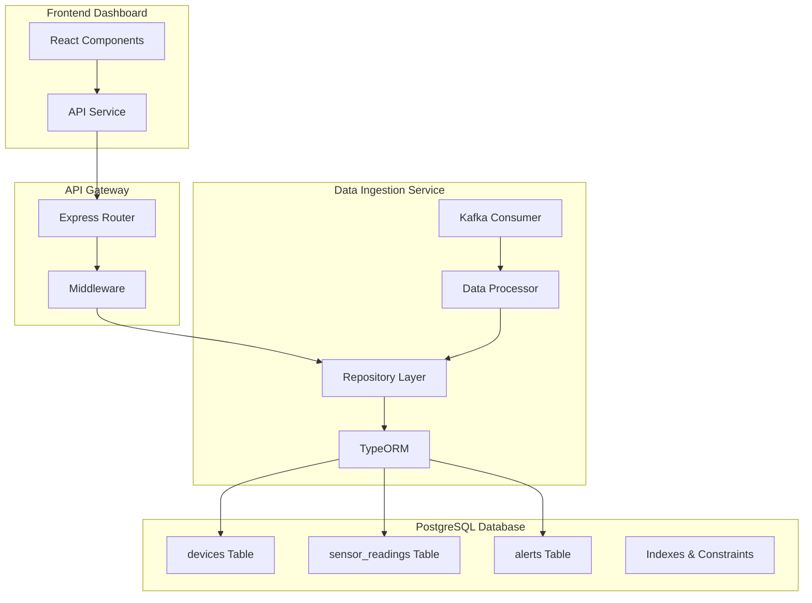
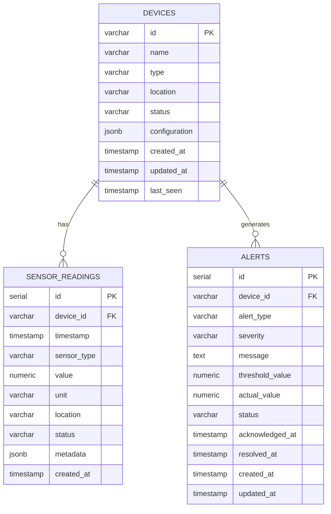

# PostgreSQL Integration Guide

This document provides a comprehensive guide on how PostgreSQL is integrated into the IoT Monitoring System using TypeORM for data persistence, including complete data flow traces from frontend API requests to database operations.

## Table of Contents
1. [Architecture Overview](#architecture-overview)
2. [Database Schema](#database-schema)
3. [TypeORM Configuration](#typeorm-configuration)
4. [Repository Pattern Implementation](#repository-pattern-implementation)
5. [Data Flow Trace](#data-flow-trace)
6. [Query Patterns](#query-patterns)
7. [Performance Optimizations](#performance-optimizations)
8. [Error Handling](#error-handling)
9. [Monitoring and Maintenance](#monitoring-and-maintenance)

## Architecture Overview



### Role in System
- **Data Persistence**: Long-term storage for IoT sensor readings and device metadata
- **Historical Data**: Time-series data for analytics and reporting
- **ACID Compliance**: Ensures data consistency for critical device information
- **Relational Structure**: Maintains relationships between devices, readings, and alerts

## Database Schema

### Core Tables

**Devices Table**
```sql
CREATE TABLE devices (
    id VARCHAR(50) PRIMARY KEY,
    name VARCHAR(255) NOT NULL,
    type VARCHAR(100) NOT NULL,
    location VARCHAR(255),
    status VARCHAR(50) DEFAULT 'active',
    configuration JSONB,
    created_at TIMESTAMP WITH TIME ZONE DEFAULT NOW(),
    updated_at TIMESTAMP WITH TIME ZONE DEFAULT NOW(),
    last_seen TIMESTAMP WITH TIME ZONE
);

-- Indexes for performance
CREATE INDEX idx_devices_type ON devices(type);
CREATE INDEX idx_devices_status ON devices(status);
CREATE INDEX idx_devices_location ON devices(location);
CREATE INDEX idx_devices_last_seen ON devices(last_seen);
```

**Sensor Readings Table**
```sql
CREATE TABLE sensor_readings (
    id SERIAL PRIMARY KEY,
    device_id VARCHAR(50) NOT NULL REFERENCES devices(id) ON DELETE CASCADE,
    timestamp TIMESTAMP WITH TIME ZONE NOT NULL,
    sensor_type VARCHAR(100) NOT NULL,
    value NUMERIC(10,3) NOT NULL,
    unit VARCHAR(20) NOT NULL,
    location VARCHAR(255),
    status VARCHAR(50) DEFAULT 'normal',
    metadata JSONB,
    created_at TIMESTAMP WITH TIME ZONE DEFAULT NOW()
);

-- Indexes for time-series queries
CREATE INDEX idx_sensor_readings_device_timestamp ON sensor_readings(device_id, timestamp DESC);
CREATE INDEX idx_sensor_readings_sensor_type_timestamp ON sensor_readings(sensor_type, timestamp DESC);
CREATE INDEX idx_sensor_readings_timestamp ON sensor_readings(timestamp DESC);
CREATE INDEX idx_sensor_readings_status ON sensor_readings(status);

-- Partitioning for large datasets (optional)
-- Partition by month for better performance on large datasets
ALTER TABLE sensor_readings PARTITION BY RANGE (timestamp);
```

**Alerts Table**
```sql
CREATE TABLE alerts (
    id SERIAL PRIMARY KEY,
    device_id VARCHAR(50) NOT NULL REFERENCES devices(id) ON DELETE CASCADE,
    alert_type VARCHAR(100) NOT NULL,
    severity VARCHAR(50) NOT NULL,
    message TEXT NOT NULL,
    threshold_value NUMERIC(10,3),
    actual_value NUMERIC(10,3),
    status VARCHAR(50) DEFAULT 'active',
    acknowledged_at TIMESTAMP WITH TIME ZONE,
    resolved_at TIMESTAMP WITH TIME ZONE,
    created_at TIMESTAMP WITH TIME ZONE DEFAULT NOW(),
    updated_at TIMESTAMP WITH TIME ZONE DEFAULT NOW()
);

-- Indexes for alert queries
CREATE INDEX idx_alerts_device_id ON alerts(device_id);
CREATE INDEX idx_alerts_status ON alerts(status);
CREATE INDEX idx_alerts_severity ON alerts(severity);
CREATE INDEX idx_alerts_created_at ON alerts(created_at DESC);
```

### Entity Relationships



## TypeORM Configuration

### Database Connection Setup

**File**: `services/data-ingestion/src/db/database.js`

```javascript
// Import TypeORM DataSource - the main entry point for database operations
const { DataSource } = require('typeorm');
// Import application configuration containing database connection settings
const config = require('../config');
// Import structured logging utility for database operation monitoring
const logger = require('../utils/logger');

// Import entity definitions - TypeORM uses these to map JavaScript objects to database tables
const Device = require('./entities/Device');
const SensorReading = require('./entities/SensorReading');
const Alert = require('./entities/Alert');

// Create TypeORM DataSource - manages database connection and entity operations
const AppDataSource = new DataSource({
  // Database type - using PostgreSQL for ACID compliance and complex queries
  type: 'postgres',
  
  // Connection parameters from configuration
  host: config.postgres.host,
  port: config.postgres.port,
  username: config.postgres.username,
  password: config.postgres.password,
  database: config.postgres.database,
  
  // Connection pool settings for handling multiple concurrent requests
  extra: {
    // Maximum number of connections in pool - balances performance vs resource usage
    connectionLimit: config.postgres.maxConnections,
    
    // Time to wait for connection from pool before timing out
    acquireTimeout: 60000,
    
    // Query execution timeout - prevents hanging queries
    timeout: 60000,
    
    // Character set for text encoding - supports international characters
    charset: 'utf8mb4'
  },
  
  // Register entity classes that TypeORM will manage
  // Each entity represents a database table with defined columns and relationships
  entities: [Device, SensorReading, Alert],
  
  // Migration settings for database schema management
  // Migrations allow versioned database schema changes
  migrations: ['src/db/migrations/*.js'],
  
  // Whether to automatically run pending migrations on startup
  // Useful for development but should be controlled in production
  migrationsRun: config.postgres.runMigrations,
  
  // Development-only settings
  // Automatically creates/updates database schema based on entities
  // NEVER use in production - can cause data loss
  synchronize: config.postgres.synchronize,
  
  // Enable SQL query logging for debugging - set log level in config
  logging: config.postgres.logging,
  
  // Production SSL settings for secure connections
  ssl: config.postgres.ssl ? {
    // In development, don't verify SSL certificates
    rejectUnauthorized: false
  } : false,
  
  // Query result caching using Redis for improved performance
  cache: {
    // Cache duration in milliseconds - 30 seconds for balance of freshness vs performance
    duration: 30000,
    
    // Use Redis as cache storage - shared across service instances
    type: 'redis',
    
    // Redis connection options - reuses existing Redis infrastructure
    options: {
      host: config.redis.host,
      port: config.redis.port
    }
  }
});

/**
 * Initialize database connection
 */
async function initializeDatabase() {
  try {
    await AppDataSource.initialize();
    logger.info('PostgreSQL database connection established');
    
    // Run migrations if needed
    if (config.postgres.runMigrations) {
      await AppDataSource.runMigrations();
      logger.info('Database migrations completed');
    }
    
    return AppDataSource;
  } catch (error) {
    logger.error('Failed to initialize database connection', { error });
    throw error;
  }
}

/**
 * Close database connection
 */
async function closeDatabase() {
  try {
    await AppDataSource.destroy();
    logger.info('Database connection closed');
  } catch (error) {
    logger.error('Error closing database connection', { error });
    throw error;
  }
}

/**
 * Health check for database
 */
async function checkDatabaseHealth() {
  try {
    await AppDataSource.query('SELECT 1');
    return { status: 'healthy', timestamp: new Date() };
  } catch (error) {
    logger.error('Database health check failed', { error });
    return { status: 'unhealthy', error: error.message, timestamp: new Date() };
  }
}

module.exports = {
  AppDataSource,
  initializeDatabase,
  closeDatabase,
  checkDatabaseHealth
};
```

### Entity Definitions

**File**: `services/data-ingestion/src/db/entities/Device.js`

```javascript
const { EntitySchema } = require('typeorm');

module.exports = new EntitySchema({
  name: 'Device',
  tableName: 'devices',
  columns: {
    id: {
      type: 'varchar',
      length: 50,
      primary: true
    },
    name: {
      type: 'varchar',
      length: 255,
      nullable: false
    },
    type: {
      type: 'varchar',
      length: 100,
      nullable: false
    },
    location: {
      type: 'varchar',
      length: 255,
      nullable: true
    },
    status: {
      type: 'varchar',
      length: 50,
      default: 'active'
    },
    configuration: {
      type: 'jsonb',
      nullable: true
    },
    created_at: {
      type: 'timestamp with time zone',
      createDate: true
    },
    updated_at: {
      type: 'timestamp with time zone',
      updateDate: true
    },
    last_seen: {
      type: 'timestamp with time zone',
      nullable: true
    }
  },
  relations: {
    sensorReadings: {
      type: 'one-to-many',
      target: 'SensorReading',
      inverseSide: 'device'
    },
    alerts: {
      type: 'one-to-many',
      target: 'Alert',
      inverseSide: 'device'
    }
  },
  indices: [
    { name: 'IDX_DEVICE_TYPE', columns: ['type'] },
    { name: 'IDX_DEVICE_STATUS', columns: ['status'] },
    { name: 'IDX_DEVICE_LOCATION', columns: ['location'] },
    { name: 'IDX_DEVICE_LAST_SEEN', columns: ['last_seen'] }
  ]
});
```

**File**: `services/data-ingestion/src/db/entities/SensorReading.js`

```javascript
const { EntitySchema } = require('typeorm');

module.exports = new EntitySchema({
  name: 'SensorReading',
  tableName: 'sensor_readings',
  columns: {
    id: {
      type: 'int',
      primary: true,
      generated: true
    },
    device_id: {
      type: 'varchar',
      length: 50,
      nullable: false
    },
    timestamp: {
      type: 'timestamp with time zone',
      nullable: false
    },
    sensor_type: {
      type: 'varchar',
      length: 100,
      nullable: false
    },
    value: {
      type: 'decimal',
      precision: 10,
      scale: 3,
      nullable: false
    },
    unit: {
      type: 'varchar',
      length: 20,
      nullable: false
    },
    location: {
      type: 'varchar',
      length: 255,
      nullable: true
    },
    status: {
      type: 'varchar',
      length: 50,
      default: 'normal'
    },
    metadata: {
      type: 'jsonb',
      nullable: true
    },
    created_at: {
      type: 'timestamp with time zone',
      createDate: true
    }
  },
  relations: {
    device: {
      type: 'many-to-one',
      target: 'Device',
      joinColumn: { name: 'device_id' },
      onDelete: 'CASCADE'
    }
  },
  indices: [
    { 
      name: 'IDX_SENSOR_READINGS_DEVICE_TIMESTAMP', 
      columns: ['device_id', 'timestamp'] 
    },
    { 
      name: 'IDX_SENSOR_READINGS_SENSOR_TYPE_TIMESTAMP', 
      columns: ['sensor_type', 'timestamp'] 
    },
    { 
      name: 'IDX_SENSOR_READINGS_TIMESTAMP', 
      columns: ['timestamp'] 
    },
    { 
      name: 'IDX_SENSOR_READINGS_STATUS', 
      columns: ['status'] 
    }
  ]
});
```

## Repository Pattern Implementation

### Base Repository

**File**: `services/data-ingestion/src/db/repositories/BaseRepository.js`

```javascript
const logger = require('../../utils/logger');

class BaseRepository {
  constructor(repository) {
    this.repository = repository;
  }

  /**
   * Create a new entity
   */
  async create(entityData) {
    try {
      const entity = this.repository.create(entityData);
      return await this.repository.save(entity);
    } catch (error) {
      logger.error('Error creating entity', { error, entityData });
      throw error;
    }
  }

  /**
   * Find entity by ID
   */
  async findById(id) {
    try {
      return await this.repository.findOne({ where: { id } });
    } catch (error) {
      logger.error('Error finding entity by ID', { error, id });
      throw error;
    }
  }

  /**
   * Update entity
   */
  async update(id, updateData) {
    try {
      await this.repository.update(id, updateData);
      return await this.findById(id);
    } catch (error) {
      logger.error('Error updating entity', { error, id, updateData });
      throw error;
    }
  }

  /**
   * Delete entity
   */
  async delete(id) {
    try {
      const result = await this.repository.delete(id);
      return result.affected > 0;
    } catch (error) {
      logger.error('Error deleting entity', { error, id });
      throw error;
    }
  }

  /**
   * Count entities with optional conditions
   */
  async count(conditions = {}) {
    try {
      return await this.repository.count({ where: conditions });
    } catch (error) {
      logger.error('Error counting entities', { error, conditions });
      throw error;
    }
  }

  /**
   * Execute raw query
   */
  async executeRawQuery(query, parameters = []) {
    try {
      return await this.repository.query(query, parameters);
    } catch (error) {
      logger.error('Error executing raw query', { error, query, parameters });
      throw error;
    }
  }
}

module.exports = BaseRepository;
```

### Device Repository

**File**: `services/data-ingestion/src/db/repositories/DeviceRepository.js`

```javascript
const { AppDataSource } = require('../database');
const BaseRepository = require('./BaseRepository');
const logger = require('../../utils/logger');

class DeviceRepository extends BaseRepository {
  constructor() {
    super(AppDataSource.getRepository('Device'));
  }

  /**
   * Ensure device exists, create if not
   */
  async ensureDeviceExists(deviceId, deviceData = {}) {
    try {
      let device = await this.findById(deviceId);
      
      if (!device) {
        logger.info(`Creating new device: ${deviceId}`);
        device = await this.create({
          id: deviceId,
          name: deviceData.name || `Device ${deviceId}`,
          type: deviceData.deviceType || 'unknown',
          location: deviceData.location || null,
          status: deviceData.status || 'active',
          configuration: deviceData.configuration || {},
          last_seen: new Date()
        });
      } else {
        // Update last seen timestamp
        await this.updateLastSeen(deviceId);
      }
      
      return device;
    } catch (error) {
      logger.error('Error ensuring device exists', { error, deviceId, deviceData });
      throw error;
    }
  }

  /**
   * Update device last seen timestamp
   */
  async updateLastSeen(deviceId) {
    try {
      await this.repository.update(deviceId, {
        last_seen: new Date(),
        updated_at: new Date()
      });
    } catch (error) {
      logger.error('Error updating device last seen', { error, deviceId });
      throw error;
    }
  }

  /**
   * Get all active devices
   */
  async getActiveDevices() {
    try {
      return await this.repository.find({
        where: { status: 'active' },
        order: { updated_at: 'DESC' }
      });
    } catch (error) {
      logger.error('Error getting active devices', { error });
      throw error;
    }
  }

  /**
   * Get devices by type
   */
  async getDevicesByType(deviceType) {
    try {
      return await this.repository.find({
        where: { type: deviceType },
        order: { name: 'ASC' }
      });
    } catch (error) {
      logger.error('Error getting devices by type', { error, deviceType });
      throw error;
    }
  }

  /**
   * Get device status summary
   */
  async getDeviceStatusSummary() {
    try {
      const result = await this.repository
        .createQueryBuilder('device')
        .select('device.status')
        .addSelect('COUNT(device.id)', 'count')
        .groupBy('device.status')
        .getRawMany();
      
      return result.reduce((summary, row) => {
        summary[row.status] = parseInt(row.count);
        return summary;
      }, {});
    } catch (error) {
      logger.error('Error getting device status summary', { error });
      throw error;
    }
  }

  /**
   * Get offline devices (not seen in last N minutes)
   */
  async getOfflineDevices(minutesThreshold = 10) {
    try {
      const thresholdTime = new Date(Date.now() - minutesThreshold * 60 * 1000);
      
      return await this.repository
        .createQueryBuilder('device')
        .where('device.last_seen < :threshold OR device.last_seen IS NULL', {
          threshold: thresholdTime
        })
        .andWhere('device.status = :status', { status: 'active' })
        .getMany();
    } catch (error) {
      logger.error('Error getting offline devices', { error, minutesThreshold });
      throw error;
    }
  }
}

module.exports = DeviceRepository;
```

### Sensor Reading Repository

**File**: `services/data-ingestion/src/db/repositories/SensorReadingRepository.js`

```javascript
const { AppDataSource } = require('../database');
const BaseRepository = require('./BaseRepository');
const logger = require('../../utils/logger');

class SensorReadingRepository extends BaseRepository {
  constructor() {
    super(AppDataSource.getRepository('SensorReading'));
  }

  /**
   * Batch insert sensor readings for performance
   */
  async batchInsertSensorReadings(readings) {
    try {
      if (!readings.length) {
        logger.debug('No readings to insert in batch');
        return [];
      }
      
      logger.info(`Batch inserting ${readings.length} sensor readings`);
      
      // Use queryBuilder for better performance on large batches
      const queryBuilder = this.repository.createQueryBuilder()
        .insert()
        .into('sensor_readings')
        .values(readings);
      
      const result = await queryBuilder.execute();
      logger.debug(`Successfully inserted ${readings.length} readings`);
      
      return result;
    } catch (error) {
      logger.error('Failed to batch insert sensor readings', { 
        error, 
        count: readings.length 
      });
      throw error;
    }
  }

  /**
   * Get latest reading for a device
   */
  async getLatestReading(deviceId, sensorType = null) {
    try {
      const queryBuilder = this.repository
        .createQueryBuilder('reading')
        .where('reading.device_id = :deviceId', { deviceId })
        .orderBy('reading.timestamp', 'DESC')
        .limit(1);
      
      if (sensorType) {
        queryBuilder.andWhere('reading.sensor_type = :sensorType', { sensorType });
      }
      
      return await queryBuilder.getOne();
    } catch (error) {
      logger.error('Error getting latest reading', { error, deviceId, sensorType });
      throw error;
    }
  }

  /**
   * Get readings by time range
   */
  async getReadingsByTimeRange(deviceId, startTime, endTime, limit = 1000) {
    try {
      return await this.repository
        .createQueryBuilder('reading')
        .where('reading.device_id = :deviceId', { deviceId })
        .andWhere('reading.timestamp >= :startTime', { startTime })
        .andWhere('reading.timestamp <= :endTime', { endTime })
        .orderBy('reading.timestamp', 'DESC')
        .limit(limit)
        .getMany();
    } catch (error) {
      logger.error('Error getting readings by time range', { 
        error, deviceId, startTime, endTime, limit 
      });
      throw error;
    }
  }

  /**
   * Get aggregated data for analytics
   */
  async getAggregatedData(deviceId, sensorType, interval = '1 hour', duration = '24 hours') {
    try {
      const query = `
        SELECT 
          date_trunc($3, timestamp) as time_bucket,
          AVG(value) as avg_value,
          MIN(value) as min_value,
          MAX(value) as max_value,
          COUNT(*) as reading_count
        FROM sensor_readings 
        WHERE device_id = $1 
          AND sensor_type = $2 
          AND timestamp >= NOW() - INTERVAL '${duration}'
        GROUP BY time_bucket 
        ORDER BY time_bucket DESC
      `;
      
      return await this.repository.query(query, [deviceId, sensorType, interval]);
    } catch (error) {
      logger.error('Error getting aggregated data', { 
        error, deviceId, sensorType, interval, duration 
      });
      throw error;
    }
  }

  /**
   * Get reading count by status
   */
  async getReadingCountByStatus(deviceId, hours = 24) {
    try {
      const query = `
        SELECT 
          status,
          COUNT(*) as count
        FROM sensor_readings 
        WHERE device_id = $1 
          AND timestamp >= NOW() - INTERVAL '${hours} hours'
        GROUP BY status
      `;
      
      const result = await this.repository.query(query, [deviceId]);
      
      return result.reduce((summary, row) => {
        summary[row.status] = parseInt(row.count);
        return summary;
      }, {});
    } catch (error) {
      logger.error('Error getting reading count by status', { error, deviceId, hours });
      throw error;
    }
  }

  /**
   * Delete old readings (data retention)
   */
  async deleteOldReadings(daysToKeep = 90) {
    try {
      const cutoffDate = new Date(Date.now() - daysToKeep * 24 * 60 * 60 * 1000);
      
      const result = await this.repository
        .createQueryBuilder()
        .delete()
        .from('sensor_readings')
        .where('timestamp < :cutoffDate', { cutoffDate })
        .execute();
      
      logger.info(`Deleted ${result.affected} old sensor readings`, { 
        daysToKeep, 
        cutoffDate 
      });
      
      return result.affected;
    } catch (error) {
      logger.error('Error deleting old readings', { error, daysToKeep });
      throw error;
    }
  }
}

module.exports = SensorReadingRepository;
```

## Data Flow Trace

### Complete Frontend-to-Database Flow

1. **Frontend API Request**
   ```javascript
   // Frontend requests current device data
   const response = await apiService.getDeviceCurrent('device-001');
   ```

2. **API Gateway Routing**
   ```javascript
   // API Gateway routes request
   app.get('/api/devices/:deviceId/current', async (req, res) => {
     const { deviceId } = req.params;
     
     try {
       // Get from repository
       const reading = await sensorReadingRepository.getLatestReading(deviceId);
       
       res.json({
         success: true,
         data: reading
       });
     } catch (error) {
       res.status(500).json({
         success: false,
         error: error.message
       });
     }
   });
   ```

3. **Repository Layer**
   ```javascript
   // Repository executes query
   async getLatestReading(deviceId, sensorType = null) {
     const queryBuilder = this.repository
       .createQueryBuilder('reading')
       .where('reading.device_id = :deviceId', { deviceId })
       .orderBy('reading.timestamp', 'DESC')
       .limit(1);
     
     return await queryBuilder.getOne();
   }
   ```

4. **TypeORM Query Generation**
   ```sql
   -- Generated SQL query
   SELECT 
     reading.id,
     reading.device_id,
     reading.timestamp,
     reading.sensor_type,
     reading.value,
     reading.unit,
     reading.location,
     reading.status,
     reading.metadata,
     reading.created_at
   FROM sensor_readings reading 
   WHERE reading.device_id = $1 
   ORDER BY reading.timestamp DESC 
   LIMIT 1;
   ```

5. **Database Execution**
   ```
   PostgreSQL executes query using indexes:
   - Uses idx_sensor_readings_device_timestamp for optimal performance
   - Returns single row with latest reading
   ```

6. **Response Chain**
   ```javascript
   // Data flows back through layers
   Database → TypeORM → Repository → API Gateway → Frontend
   ```

### Kafka Consumer to Database Flow

1. **Kafka Message Reception**
   ```javascript
   // Kafka consumer receives sensor reading
   const message = {
     deviceId: 'device-001',
     sensorType: 'temperature',
     value: 25.5,
     unit: '°C',
     timestamp: '2025-06-13T10:00:00Z'
   };
   ```

2. **Data Processing**
   ```javascript
   // Process and transform data
   const dbReading = {
     device_id: message.deviceId,
     timestamp: message.timestamp,
     sensor_type: message.sensorType,
     value: message.value,
     unit: message.unit,
     location: message.location,
     status: message.status || 'normal',
     created_at: new Date()
   };
   ```

3. **Device Verification**
   ```javascript
   // Ensure device exists
   await deviceRepository.ensureDeviceExists(message.deviceId, {
     deviceType: message.sensorType,
     location: message.location,
     status: message.status
   });
   ```

4. **Batch Insertion**
   ```javascript
   // Add to batch for efficient insertion
   batchedReadings.push(dbReading);
   
   if (batchedReadings.length >= BATCH_SIZE) {
     await sensorReadingRepository.batchInsertSensorReadings(batchedReadings);
     batchedReadings = [];
   }
   ```

5. **Database Persistence**
   ```sql
   -- Batch INSERT query
   INSERT INTO sensor_readings 
     (device_id, timestamp, sensor_type, value, unit, location, status, created_at)
   VALUES 
     ($1, $2, $3, $4, $5, $6, $7, $8),
     ($9, $10, $11, $12, $13, $14, $15, $16),
     -- ... more rows
   ```

## Query Patterns

### Time-Series Queries

```javascript
// Get hourly averages for last 24 hours
async getHourlyAverages(deviceId, sensorType) {
  const query = `
    SELECT 
      date_trunc('hour', timestamp) as hour,
      AVG(value) as avg_value,
      MIN(value) as min_value,
      MAX(value) as max_value,
      COUNT(*) as reading_count
    FROM sensor_readings 
    WHERE device_id = $1 
      AND sensor_type = $2 
      AND timestamp >= NOW() - INTERVAL '24 hours'
    GROUP BY hour 
    ORDER BY hour DESC
  `;
  
  return await this.repository.query(query, [deviceId, sensorType]);
}

// Get readings with pagination
async getReadingsPaginated(deviceId, page = 1, limit = 100) {
  const offset = (page - 1) * limit;
  
  return await this.repository
    .createQueryBuilder('reading')
    .where('reading.device_id = :deviceId', { deviceId })
    .orderBy('reading.timestamp', 'DESC')
    .skip(offset)
    .take(limit)
    .getMany();
}
```

### Analytical Queries

```javascript
// Device performance analytics
async getDevicePerformanceMetrics(deviceId, days = 7) {
  const query = `
    SELECT 
      sensor_type,
      COUNT(*) as total_readings,
      AVG(value) as avg_value,
      STDDEV(value) as value_std_dev,
      COUNT(CASE WHEN status != 'normal' THEN 1 END) as abnormal_readings,
      MAX(timestamp) as last_reading
    FROM sensor_readings 
    WHERE device_id = $1 
      AND timestamp >= NOW() - INTERVAL '${days} days'
    GROUP BY sensor_type
  `;
  
  return await this.repository.query(query, [deviceId]);
}

// System-wide statistics
async getSystemStatistics() {
  const queries = {
    deviceCount: 'SELECT COUNT(*) as count FROM devices WHERE status = $1',
    activeDeviceCount: 'SELECT COUNT(*) as count FROM devices WHERE status = $1 AND last_seen >= NOW() - INTERVAL $2',
    totalReadings: 'SELECT COUNT(*) as count FROM sensor_readings WHERE timestamp >= NOW() - INTERVAL $1',
    avgReadingsPerDevice: `
      SELECT AVG(reading_count) as avg_readings 
      FROM (
        SELECT device_id, COUNT(*) as reading_count 
        FROM sensor_readings 
        WHERE timestamp >= NOW() - INTERVAL $1 
        GROUP BY device_id
      ) device_readings
    `
  };
  
  const results = await Promise.all([
    this.repository.query(queries.deviceCount, ['active']),
    this.repository.query(queries.activeDeviceCount, ['active', '10 minutes']),
    this.repository.query(queries.totalReadings, ['24 hours']),
    this.repository.query(queries.avgReadingsPerDevice, ['24 hours'])
  ]);
  
  return {
    totalDevices: parseInt(results[0][0].count),
    activeDevices: parseInt(results[1][0].count),
    totalReadings24h: parseInt(results[2][0].count),
    avgReadingsPerDevice: parseFloat(results[3][0].avg_readings) || 0
  };
}
```

## Performance Optimizations

### Indexing Strategy

```sql
-- Essential indexes for IoT workloads
CREATE INDEX CONCURRENTLY idx_sensor_readings_device_timestamp_desc 
  ON sensor_readings(device_id, timestamp DESC);

CREATE INDEX CONCURRENTLY idx_sensor_readings_timestamp_brin 
  ON sensor_readings USING BRIN(timestamp);

CREATE INDEX CONCURRENTLY idx_sensor_readings_composite 
  ON sensor_readings(device_id, sensor_type, timestamp DESC);

-- Partial indexes for active data
CREATE INDEX CONCURRENTLY idx_sensor_readings_recent 
  ON sensor_readings(device_id, timestamp DESC) 
  WHERE timestamp >= NOW() - INTERVAL '7 days';

-- GIN index for JSONB metadata queries
CREATE INDEX CONCURRENTLY idx_sensor_readings_metadata_gin 
  ON sensor_readings USING GIN(metadata);
```

### Table Partitioning

```javascript
// Automatic partitioning setup for sensor_readings
class PartitionManager {
  constructor(repository) {
    this.repository = repository;
  }

  async createMonthlyPartition(year, month) {
    const partitionName = `sensor_readings_${year}_${month.toString().padStart(2, '0')}`;
    const startDate = `${year}-${month.toString().padStart(2, '0')}-01`;
    const endDate = new Date(year, month, 1).toISOString().slice(0, 10);
    
    const query = `
      CREATE TABLE IF NOT EXISTS ${partitionName} 
      PARTITION OF sensor_readings 
      FOR VALUES FROM ('${startDate}') TO ('${endDate}');
      
      CREATE INDEX IF NOT EXISTS ${partitionName}_device_timestamp_idx 
        ON ${partitionName}(device_id, timestamp DESC);
    `;
    
    await this.repository.query(query);
    logger.info(`Created partition: ${partitionName}`);
  }

  async createFuturePartitions(monthsAhead = 3) {
    const now = new Date();
    
    for (let i = 0; i <= monthsAhead; i++) {
      const futureDate = new Date(now.getFullYear(), now.getMonth() + i, 1);
      await this.createMonthlyPartition(
        futureDate.getFullYear(), 
        futureDate.getMonth() + 1
      );
    }
  }

  async dropOldPartitions(monthsToKeep = 12) {
    const cutoffDate = new Date();
    cutoffDate.setMonth(cutoffDate.getMonth() - monthsToKeep);
    
    const year = cutoffDate.getFullYear();
    const month = cutoffDate.getMonth() + 1;
    
    const query = `
      SELECT schemaname, tablename 
      FROM pg_tables 
      WHERE tablename LIKE 'sensor_readings_%' 
        AND tablename < 'sensor_readings_${year}_${month.toString().padStart(2, '0')}'
    `;
    
    const oldPartitions = await this.repository.query(query);
    
    for (const partition of oldPartitions) {
      await this.repository.query(`DROP TABLE IF EXISTS ${partition.tablename}`);
      logger.info(`Dropped old partition: ${partition.tablename}`);
    }
  }
}
```

### Connection Pool Optimization

```javascript
// Optimized connection pool configuration
const poolConfig = {
  // Connection limits
  max: 20,                    // Maximum connections
  min: 2,                     // Minimum connections
  
  // Timing
  acquireTimeoutMillis: 30000,  // 30 seconds
  createTimeoutMillis: 30000,   // 30 seconds
  destroyTimeoutMillis: 5000,   // 5 seconds
  idleTimeoutMillis: 30000,     // 30 seconds
  reapIntervalMillis: 1000,     // 1 second
  
  // Retry logic
  createRetryIntervalMillis: 200,
  
  // Health checks
  validate: (client) => {
    return client.query('SELECT 1').then(() => true).catch(() => false);
  }
};

// Monitor connection pool
class ConnectionPoolMonitor {
  constructor(dataSource) {
    this.dataSource = dataSource;
    this.metrics = {
      totalConnections: 0,
      activeConnections: 0,
      idleConnections: 0,
      waitingClients: 0
    };
  }

  async collectMetrics() {
    try {
      const pool = this.dataSource.driver.master;
      
      this.metrics = {
        totalConnections: pool.totalCount,
        activeConnections: pool.totalCount - pool.idleCount,
        idleConnections: pool.idleCount,
        waitingClients: pool.waitingCount || 0
      };
      
      return this.metrics;
    } catch (error) {
      logger.error('Failed to collect connection pool metrics', { error });
      return null;
    }
  }

  startMonitoring(intervalMs = 30000) {
    setInterval(async () => {
      const metrics = await this.collectMetrics();
      if (metrics) {
        logger.debug('Connection pool metrics', metrics);
        
        // Alert on high connection usage
        if (metrics.activeConnections / (metrics.totalConnections || 1) > 0.8) {
          logger.warn('High connection pool usage', metrics);
        }
      }
    }, intervalMs);
  }
}
```

### Query Optimization

```javascript
// Efficient batch operations
class OptimizedQueries {
  constructor(repository) {
    this.repository = repository;
  }

  async batchUpsertDevices(devices) {
    if (!devices.length) return;
    
    const query = `
      INSERT INTO devices (id, name, type, location, status, configuration, last_seen)
      VALUES ${devices.map((_, i) => 
        `($${i * 7 + 1}, $${i * 7 + 2}, $${i * 7 + 3}, $${i * 7 + 4}, $${i * 7 + 5}, $${i * 7 + 6}, $${i * 7 + 7})`
      ).join(', ')}
      ON CONFLICT (id) DO UPDATE SET
        name = EXCLUDED.name,
        type = EXCLUDED.type,
        location = EXCLUDED.location,
        status = EXCLUDED.status,
        configuration = EXCLUDED.configuration,
        last_seen = EXCLUDED.last_seen,
        updated_at = NOW()
    `;
    
    const params = devices.flatMap(device => [
      device.id, device.name, device.type, device.location,
      device.status, JSON.stringify(device.configuration), device.last_seen
    ]);
    
    return await this.repository.query(query, params);
  }

  async getDeviceReadingsSummary(deviceIds, hours = 24) {
    if (!deviceIds.length) return [];
    
    const query = `
      WITH device_stats AS (
        SELECT 
          device_id,
          sensor_type,
          COUNT(*) as reading_count,
          AVG(value) as avg_value,
          MIN(value) as min_value,
          MAX(value) as max_value,
          MAX(timestamp) as last_reading
        FROM sensor_readings 
        WHERE device_id = ANY($1)
          AND timestamp >= NOW() - INTERVAL '${hours} hours'
        GROUP BY device_id, sensor_type
      )
      SELECT 
        d.id as device_id,
        d.name,
        d.type,
        d.location,
        d.status,
        d.last_seen,
        COALESCE(
          json_agg(
            json_build_object(
              'sensor_type', ds.sensor_type,
              'reading_count', ds.reading_count,
              'avg_value', ds.avg_value,
              'min_value', ds.min_value,
              'max_value', ds.max_value,
              'last_reading', ds.last_reading
            )
          ) FILTER (WHERE ds.sensor_type IS NOT NULL), 
          '[]'::json
        ) as sensor_stats
      FROM devices d
      LEFT JOIN device_stats ds ON d.id = ds.device_id
      WHERE d.id = ANY($1)
      GROUP BY d.id, d.name, d.type, d.location, d.status, d.last_seen
    `;
    
    return await this.repository.query(query, [deviceIds]);
  }
}
```

## Error Handling

### Database Error Recovery

```javascript
class DatabaseErrorHandler {
  constructor(dataSource) {
    this.dataSource = dataSource;
    this.reconnectAttempts = 0;
    this.maxReconnectAttempts = 5;
  }

  async handleConnectionError(error) {
    logger.error('Database connection error', { error: error.message });
    
    if (this.reconnectAttempts < this.maxReconnectAttempts) {
      this.reconnectAttempts++;
      const delay = Math.min(1000 * Math.pow(2, this.reconnectAttempts), 30000);
      
      logger.info(`Attempting database reconnection in ${delay}ms`, {
        attempt: this.reconnectAttempts,
        maxAttempts: this.maxReconnectAttempts
      });
      
      setTimeout(async () => {
        try {
          await this.dataSource.initialize();
          this.reconnectAttempts = 0;
          logger.info('Database reconnection successful');
        } catch (reconnectError) {
          logger.error('Database reconnection failed', { error: reconnectError.message });
          this.handleConnectionError(reconnectError);
        }
      }, delay);
    } else {
      logger.error('Max database reconnection attempts reached');
      // Implement fallback mechanism or alert administrators
    }
  }

  async executeWithRetry(operation, maxRetries = 3) {
    for (let attempt = 1; attempt <= maxRetries; attempt++) {
      try {
        return await operation();
      } catch (error) {
        logger.warn(`Database operation failed, attempt ${attempt}/${maxRetries}`, {
          error: error.message
        });
        
        if (attempt === maxRetries) {
          throw error;
        }
        
        // Wait before retry with exponential backoff
        const delay = Math.min(1000 * Math.pow(2, attempt - 1), 5000);
        await new Promise(resolve => setTimeout(resolve, delay));
      }
    }
  }

  isRetriableError(error) {
    const retriableErrors = [
      'ECONNRESET',
      'ECONNREFUSED',
      'ETIMEDOUT',
      'EHOSTUNREACH'
    ];
    
    return retriableErrors.some(code => error.code === code) ||
           error.message.includes('connection') ||
           error.message.includes('timeout');
  }
}

// Transaction error handling
async function executeInTransaction(dataSource, operation) {
  const queryRunner = dataSource.createQueryRunner();
  await queryRunner.connect();
  await queryRunner.startTransaction();
  
  try {
    const result = await operation(queryRunner);
    await queryRunner.commitTransaction();
    return result;
  } catch (error) {
    await queryRunner.rollbackTransaction();
    logger.error('Transaction rolled back', { error: error.message });
    throw error;
  } finally {
    await queryRunner.release();
  }
}
```

### Data Validation and Constraints

```javascript
// Schema validation
class DataValidator {
  static validateSensorReading(reading) {
    const errors = [];
    
    if (!reading.device_id || typeof reading.device_id !== 'string') {
      errors.push('device_id is required and must be a string');
    }
    
    if (!reading.timestamp || !Date.parse(reading.timestamp)) {
      errors.push('timestamp is required and must be a valid date');
    }
    
    if (!reading.sensor_type || typeof reading.sensor_type !== 'string') {
      errors.push('sensor_type is required and must be a string');
    }
    
    if (reading.value === undefined || isNaN(reading.value)) {
      errors.push('value is required and must be a number');
    }
    
    if (!reading.unit || typeof reading.unit !== 'string') {
      errors.push('unit is required and must be a string');
    }
    
    return {
      isValid: errors.length === 0,
      errors
    };
  }

  static sanitizeInput(input) {
    if (typeof input === 'string') {
      // Remove SQL injection patterns
      return input.replace(/['";\\]/g, '');
    }
    return input;
  }
}

// Constraint violation handling
async function handleConstraintViolation(error, operation) {
  if (error.code === '23505') { // Unique violation
    logger.warn('Unique constraint violation', { 
      error: error.message,
      operation
    });
    return { success: false, reason: 'duplicate_entry' };
  }
  
  if (error.code === '23503') { // Foreign key violation
    logger.warn('Foreign key constraint violation', {
      error: error.message,
      operation
    });
    return { success: false, reason: 'invalid_reference' };
  }
  
  if (error.code === '23514') { // Check constraint violation
    logger.warn('Check constraint violation', {
      error: error.message,
      operation
    });
    return { success: false, reason: 'invalid_data' };
  }
  
  throw error; // Re-throw if not a known constraint violation
}
```

## Monitoring and Maintenance

### Database Health Monitoring

```javascript
class DatabaseMonitor {
  constructor(dataSource) {
    this.dataSource = dataSource;
    this.metrics = {};
  }

  async collectMetrics() {
    try {
      const queries = {
        connectionCount: `
          SELECT count(*) as active_connections 
          FROM pg_stat_activity 
          WHERE state = 'active'
        `,
        
        tableStats: `
          SELECT 
            schemaname,
            tablename,
            n_tup_ins as inserts,
            n_tup_upd as updates,
            n_tup_del as deletes,
            n_live_tup as live_tuples,
            n_dead_tup as dead_tuples
          FROM pg_stat_user_tables 
          WHERE tablename IN ('devices', 'sensor_readings', 'alerts')
        `,
        
        indexUsage: `
          SELECT 
            indexrelname as index_name,
            idx_tup_read as index_reads,
            idx_tup_fetch as index_fetches
          FROM pg_stat_user_indexes 
          WHERE schemaname = 'public'
        `,
        
        slowQueries: `
          SELECT 
            query,
            calls,
            total_time,
            mean_time,
            rows
          FROM pg_stat_statements 
          WHERE mean_time > 1000 
          ORDER BY mean_time DESC 
          LIMIT 10
        `,
        
        databaseSize: `
          SELECT pg_size_pretty(pg_database_size(current_database())) as db_size
        `
      };

      const results = {};
      for (const [key, query] of Object.entries(queries)) {
        try {
          results[key] = await this.dataSource.query(query);
        } catch (error) {
          logger.warn(`Failed to collect ${key} metrics`, { error: error.message });
          results[key] = null;
        }
      }

      this.metrics = {
        timestamp: new Date(),
        connectionCount: results.connectionCount?.[0]?.active_connections || 0,
        tableStats: results.tableStats || [],
        indexUsage: results.indexUsage || [],
        slowQueries: results.slowQueries || [],
        databaseSize: results.databaseSize?.[0]?.db_size || 'unknown'
      };

      return this.metrics;
    } catch (error) {
      logger.error('Failed to collect database metrics', { error });
      return null;
    }
  }

  async checkReplicationLag() {
    try {
      const result = await this.dataSource.query(`
        SELECT 
          client_addr,
          state,
          pg_wal_lsn_diff(pg_current_wal_lsn(), sent_lsn) as lag_bytes
        FROM pg_stat_replication
      `);
      
      return result.map(row => ({
        replica: row.client_addr,
        state: row.state,
        lagBytes: parseInt(row.lag_bytes) || 0
      }));
    } catch (error) {
      logger.error('Failed to check replication lag', { error });
      return [];
    }
  }
}
```

### Automated Maintenance

```javascript
class DatabaseMaintenance {
  constructor(dataSource) {
    this.dataSource = dataSource;
  }

  async runVacuumAnalyze(tableName = null) {
    try {
      const tables = tableName ? [tableName] : ['devices', 'sensor_readings', 'alerts'];
      
      for (const table of tables) {
        logger.info(`Running VACUUM ANALYZE on ${table}`);
        await this.dataSource.query(`VACUUM ANALYZE ${table}`);
      }
      
      logger.info('VACUUM ANALYZE completed successfully');
    } catch (error) {
      logger.error('VACUUM ANALYZE failed', { error });
    }
  }

  async reindexTables() {
    try {
      const tables = ['devices', 'sensor_readings', 'alerts'];
      
      for (const table of tables) {
        logger.info(`Reindexing table: ${table}`);
        await this.dataSource.query(`REINDEX TABLE ${table}`);
      }
      
      logger.info('Reindexing completed successfully');
    } catch (error) {
      logger.error('Reindexing failed', { error });
    }
  }

  async cleanupOldData(daysToKeep = 90) {
    try {
      const cutoffDate = new Date(Date.now() - daysToKeep * 24 * 60 * 60 * 1000);
      
      // Clean up old sensor readings
      const readingsResult = await this.dataSource.query(`
        DELETE FROM sensor_readings 
        WHERE timestamp < $1
      `, [cutoffDate]);
      
      // Clean up resolved alerts older than 30 days
      const alertsCutoff = new Date(Date.now() - 30 * 24 * 60 * 60 * 1000);
      const alertsResult = await this.dataSource.query(`
        DELETE FROM alerts 
        WHERE status = 'resolved' AND resolved_at < $1
      `, [alertsCutoff]);
      
      logger.info('Data cleanup completed', {
        deletedReadings: readingsResult.affected,
        deletedAlerts: alertsResult.affected,
        cutoffDate
      });
      
      return {
        deletedReadings: readingsResult.affected,
        deletedAlerts: alertsResult.affected
      };
    } catch (error) {
      logger.error('Data cleanup failed', { error });
      throw error;
    }
  }

  scheduleMaintenanceTasks() {
    // Daily vacuum analyze at 2 AM
    cron.schedule('0 2 * * *', () => {
      this.runVacuumAnalyze();
    });

    // Weekly data cleanup on Sunday at 3 AM
    cron.schedule('0 3 * * 0', () => {
      this.cleanupOldData();
    });

    // Monthly reindex on first day at 4 AM
    cron.schedule('0 4 1 * *', () => {
      this.reindexTables();
    });

    logger.info('Database maintenance tasks scheduled');
  }
}
```

### Performance Baselines

```javascript
// Benchmark common operations
class PerformanceBenchmark {
  constructor(dataSource) {
    this.dataSource = dataSource;
  }

  async benchmarkInsertPerformance(batchSizes = [100, 500, 1000, 2000]) {
    const results = [];
    
    for (const batchSize of batchSizes) {
      const testData = Array.from({ length: batchSize }, (_, i) => ({
        device_id: `test-device-${i % 10}`,
        timestamp: new Date(),
        sensor_type: 'temperature',
        value: Math.random() * 100,
        unit: '°C',
        status: 'normal'
      }));
      
      const startTime = Date.now();
      
      try {
        await this.dataSource.query(`
          INSERT INTO sensor_readings (device_id, timestamp, sensor_type, value, unit, status)
          VALUES ${testData.map((_, i) => 
            `($${i * 6 + 1}, $${i * 6 + 2}, $${i * 6 + 3}, $${i * 6 + 4}, $${i * 6 + 5}, $${i * 6 + 6})`
          ).join(', ')}
        `, testData.flatMap(row => [
          row.device_id, row.timestamp, row.sensor_type, 
          row.value, row.unit, row.status
        ]));
        
        const duration = Date.now() - startTime;
        const throughput = (batchSize / duration * 1000).toFixed(2);
        
        results.push({
          batchSize,
          duration,
          throughput: `${throughput} inserts/sec`
        });
        
        // Cleanup test data
        await this.dataSource.query(`
          DELETE FROM sensor_readings 
          WHERE device_id LIKE 'test-device-%'
        `);
        
      } catch (error) {
        logger.error(`Benchmark failed for batch size ${batchSize}`, { error });
      }
    }
    
    return results;
  }

  async benchmarkQueryPerformance() {
    const queries = [
      {
        name: 'Latest reading by device',
        sql: `
          SELECT * FROM sensor_readings 
          WHERE device_id = $1 
          ORDER BY timestamp DESC 
          LIMIT 1
        `,
        params: ['device-001']
      },
      {
        name: 'Hourly aggregates',
        sql: `
          SELECT 
            date_trunc('hour', timestamp) as hour,
            AVG(value) as avg_value
          FROM sensor_readings 
          WHERE device_id = $1 
            AND timestamp >= NOW() - INTERVAL '24 hours'
          GROUP BY hour 
          ORDER BY hour DESC
        `,
        params: ['device-001']
      }
    ];
    
    const results = [];
    
    for (const query of queries) {
      const iterations = 100;
      const times = [];
      
      for (let i = 0; i < iterations; i++) {
        const startTime = Date.now();
        await this.dataSource.query(query.sql, query.params);
        times.push(Date.now() - startTime);
      }
      
      const avgTime = times.reduce((a, b) => a + b, 0) / times.length;
      const minTime = Math.min(...times);
      const maxTime = Math.max(...times);
      
      results.push({
        query: query.name,
        avgTime: `${avgTime.toFixed(2)}ms`,
        minTime: `${minTime}ms`,
        maxTime: `${maxTime}ms`
      });
    }
    
    return results;
  }
}
```

This comprehensive PostgreSQL integration guide covers the complete database layer of the IoT Monitoring System, from schema design to advanced performance optimization and maintenance strategies, providing a production-ready foundation for storing and querying IoT data at scale.
