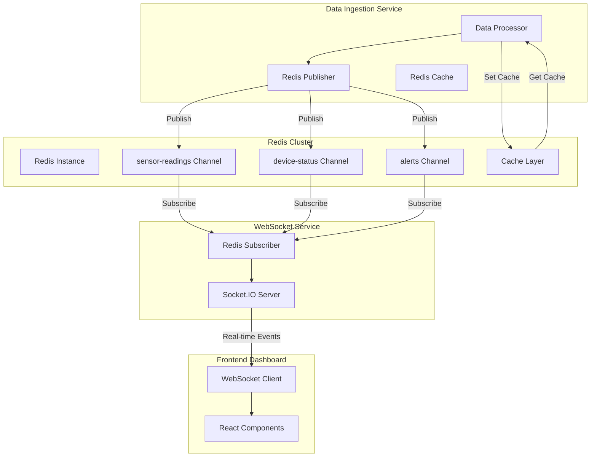

# Redis Integration Guide

This document provides a comprehensive guide on how Redis is integrated into the IoT Monitoring System, serving as both a cache layer and pub/sub messaging system for real-time data distribution.

## Table of Contents
1. [Architecture Overview](#architecture-overview)
2. [Redis Configuration](#redis-configuration)
3. [Pub/Sub Implementation](#pubsub-implementation)
4. [Caching Strategy](#caching-strategy)
5. [Data Flow Trace](#data-flow-trace)
6. [Performance Optimizations](#performance-optimizations)
7. [Error Handling](#error-handling)
8. [Monitoring and Troubleshooting](#monitoring-and-troubleshooting)

## Architecture Overview



### Role in System
- **Real-time Messaging**: Pub/Sub channels for instant data distribution
- **Caching Layer**: High-speed cache for frequently accessed data
- **Session Management**: WebSocket connection state storage
- **Rate Limiting**: API throttling and request limiting

## Redis Configuration

### Docker Configuration
```yaml
# docker-compose.yml
redis:
  image: redis:7-alpine
  ports:
    - "6379:6379"
  command: redis-server --appendonly yes --maxmemory 512mb --maxmemory-policy allkeys-lru
  volumes:
    - redis_data:/data
  environment:
    - REDIS_PASSWORD=your_redis_password
  networks:
    - iot_network
```

### Application Configuration
```javascript
// services/data-ingestion/src/config/index.js
module.exports = {
  redis: {
    // Redis server hostname - using Docker service name for container networking
    host: process.env.REDIS_HOST || 'redis',
    
    // Redis server port - standard Redis port 6379
    port: process.env.REDIS_PORT || 6379,
    
    // Authentication password for Redis server - undefined if no auth required
    password: process.env.REDIS_PASSWORD,
    
    // Delay in milliseconds before retrying after failover - keeps reconnects fast
    retryDelayOnFailover: 100,
    
    // Maximum retry attempts per request before giving up - prevents infinite loops
    maxRetriesPerRequest: 3,
    
    // Pub/Sub channel names for different types of real-time messages
    channels: {
      // Channel for broadcasting sensor reading updates to WebSocket service
      sensorReadings: 'sensor-readings',
      // Channel for broadcasting device status changes (online/offline)
      deviceStatus: 'device-status', 
      // Channel for broadcasting alert notifications to dashboard
      alerts: 'alerts'
    },
    
    // Time-To-Live settings for different cached data types
    cache: {
      // Default cache expiration for general data - 1 hour
      defaultTTL: 3600,
      // Short TTL for sensor data - 5 minutes (data changes frequently)
      sensorDataTTL: 300,
      // Medium TTL for device status - 30 minutes (changes less frequently)
      deviceStatusTTL: 1800
    }
  }
};
```

## Pub/Sub Implementation

### Data Ingestion Service - Redis Publisher

**File**: `services/data-ingestion/src/db/redis.js`

```javascript
// Import Redis client library - official Node.js client for Redis
const { createClient } = require('redis');
// Import application configuration for Redis connection settings
const config = require('../config');
// Import structured logging utility for debugging and monitoring
const logger = require('../utils/logger');

class RedisService {
  constructor() {
    // Main Redis client for cache operations (GET, SET, HGET, etc.)
    this.client = null;
    
    // Separate Redis client for publishing messages - prevents blocking cache operations
    // Redis pub/sub operations can block the connection, so we use dedicated client
    this.publisher = null;
    
    // Track connection state to avoid operations on disconnected clients
    this.isConnected = false;
  }

  async initialize() {
    try {
      // Create main Redis client for caching operations
      this.client = createClient({
        // Build Redis URL with host and port from configuration
        url: `redis://${config.redis.host}:${config.redis.port}`,
        
        // Authentication password if Redis server requires it
        password: config.redis.password,
        
        // Custom retry strategy for handling connection failures
        retry_strategy: (options) => {
          // Check if connection was actively refused (Redis server down)
          if (options.error && options.error.code === 'ECONNREFUSED') {
            logger.error('Redis server connection refused');
            return new Error('Redis server connection refused');
          }
          
          // Stop retrying after 1 hour of attempts
          if (options.total_retry_time > 1000 * 60 * 60) {
            logger.error('Redis retry time exhausted');
            return new Error('Retry time exhausted');
          }
          
          // Stop retrying after 10 attempts
          if (options.attempt > 10) {
            logger.error('Redis max retry attempts reached');
            return undefined;
          }
          
          // Calculate exponential backoff delay (100ms, 200ms, 400ms, etc.)
          // Max delay capped at 3 seconds to avoid long waits
          return Math.min(options.attempt * 100, 3000);
        }
      });

      // Create separate client for publishing - duplicate shares connection pool
      // but provides independent command pipeline for pub/sub operations
      this.publisher = this.client.duplicate();

      // Set up event listeners for connection monitoring and error handling
      this.setupEventListeners();

      // Establish connections to Redis server for both clients
      await this.client.connect();
      await this.publisher.connect();

      // Mark service as connected to enable cache and pub/sub operations
      this.isConnected = true;
      logger.info('Redis clients connected successfully');
    } catch (error) {
      logger.error('Failed to initialize Redis clients', { error });
      throw error;
    }
  }

  setupEventListeners() {
    this.client.on('error', (error) => {
      logger.error('Redis client error', { error });
      this.isConnected = false;
    });

    this.client.on('connect', () => {
      logger.info('Redis client connected');
      this.isConnected = true;
    });

    this.client.on('disconnect', () => {
      logger.warn('Redis client disconnected');
      this.isConnected = false;
    });
  }

  // Caching Methods
  async storeSensorReading(reading) {
    try {
      const key = `sensor:${reading.deviceId}:latest`;
      const value = JSON.stringify({
        ...reading,
        cachedAt: new Date().toISOString()
      });

      await this.client.setEx(key, config.redis.cache.sensorDataTTL, value);
      
      // Also store in device-specific hash for multiple sensor types
      const deviceKey = `device:${reading.deviceId}:sensors`;
      await this.client.hSet(deviceKey, reading.sensorType, value);
      await this.client.expire(deviceKey, config.redis.cache.sensorDataTTL);

      logger.debug(`Cached sensor reading for device ${reading.deviceId}`);
    } catch (error) {
      logger.error('Failed to cache sensor reading', { error, reading });
    }
  }

  async getSensorReading(deviceId, sensorType = null) {
    try {
      if (sensorType) {
        // Get specific sensor type
        const deviceKey = `device:${deviceId}:sensors`;
        const value = await this.client.hGet(deviceKey, sensorType);
        return value ? JSON.parse(value) : null;
      } else {
        // Get latest reading
        const key = `sensor:${deviceId}:latest`;
        const value = await this.client.get(key);
        return value ? JSON.parse(value) : null;
      }
    } catch (error) {
      logger.error('Failed to get cached sensor reading', { error, deviceId, sensorType });
      return null;
    }
  }

  async storeDeviceStatus(deviceId, status) {
    try {
      const key = `device:${deviceId}:status`;
      const value = JSON.stringify({
        ...status,
        lastUpdated: new Date().toISOString()
      });

      await this.client.setEx(key, config.redis.cache.deviceStatusTTL, value);
      logger.debug(`Cached device status for ${deviceId}`);
    } catch (error) {
      logger.error('Failed to cache device status', { error, deviceId, status });
    }
  }

  // Pub/Sub Methods
  async publishSensorReading(reading) {
    try {
      const message = {
        type: 'sensor-reading',
        deviceId: reading.deviceId,
        sensorType: reading.sensorType,
        value: reading.value,
        unit: reading.unit,
        timestamp: reading.timestamp,
        status: reading.status
      };

      await this.publisher.publish(
        config.redis.channels.sensorReadings,
        JSON.stringify(message)
      );

      logger.debug(`Published sensor reading to Redis channel`, { deviceId: reading.deviceId });
    } catch (error) {
      logger.error('Failed to publish sensor reading', { error, reading });
    }
  }

  async publishDeviceStatus(deviceId, status) {
    try {
      const message = {
        type: 'device-status',
        deviceId,
        status: status.status,
        timestamp: status.timestamp || new Date().toISOString()
      };

      await this.publisher.publish(
        config.redis.channels.deviceStatus,
        JSON.stringify(message)
      );

      logger.debug(`Published device status to Redis channel`, { deviceId });
    } catch (error) {
      logger.error('Failed to publish device status', { error, deviceId, status });
    }
  }

  async publishAlert(alert) {
    try {
      const message = {
        type: 'alert',
        alertId: alert.id,
        deviceId: alert.deviceId,
        severity: alert.severity,
        message: alert.message,
        timestamp: alert.timestamp
      };

      await this.publisher.publish(
        config.redis.channels.alerts,
        JSON.stringify(message)
      );

      logger.info(`Published alert to Redis channel`, { alertId: alert.id, deviceId: alert.deviceId });
    } catch (error) {
      logger.error('Failed to publish alert', { error, alert });
    }
  }

  // Statistics and Monitoring
  async getStats() {
    try {
      const info = await this.client.info();
      const memory = await this.client.info('memory');
      
      return {
        connected: this.isConnected,
        memory: this.parseRedisInfo(memory),
        stats: this.parseRedisInfo(info)
      };
    } catch (error) {
      logger.error('Failed to get Redis stats', { error });
      return { connected: false, error: error.message };
    }
  }

  parseRedisInfo(info) {
    const lines = info.split('\r\n');
    const result = {};
    
    lines.forEach(line => {
      if (line && !line.startsWith('#')) {
        const [key, value] = line.split(':');
        if (key && value) {
          result[key] = isNaN(value) ? value : Number(value);
        }
      }
    });
    
    return result;
  }

  async close() {
    try {
      if (this.client) await this.client.disconnect();
      if (this.publisher) await this.publisher.disconnect();
      logger.info('Redis clients disconnected');
    } catch (error) {
      logger.error('Error closing Redis clients', { error });
    }
  }
}

module.exports = new RedisService();
```

### WebSocket Service - Redis Subscriber

**File**: `services/websocket-service/src/redis/client.js`

```javascript
const { createClient } = require('redis');
const config = require('../config');
const logger = require('../utils/logger');

class RedisClient {
  constructor() {
    this.client = null;
    this.subscribers = new Map();
    this.isConnected = false;
  }

  async initRedis() {
    try {
      this.client = createClient({
        url: `redis://${config.redis.host}:${config.redis.port}`,
        password: config.redis.password
      });

      this.client.on('connect', () => {
        logger.info('Connected to Redis server');
        this.isConnected = true;
      });

      this.client.on('error', (err) => {
        logger.error('Redis client error', { error: err });
        this.isConnected = false;
      });

      this.client.on('reconnecting', () => {
        logger.warn('Redis client reconnecting');
      });

      await this.client.connect();
      return this.client;
    } catch (error) {
      logger.error('Failed to initialize Redis client', { error });
      throw error;
    }
  }

  async subscribeToChannel(channel, callback) {
    try {
      const subscriber = this.client.duplicate();
      await subscriber.connect();
      
      await subscriber.subscribe(channel, (message) => {
        logger.debug(`Received message from Redis channel '${channel}'`);
        try {
          const parsedMessage = JSON.parse(message);
          callback(parsedMessage);
        } catch (error) {
          logger.error('Error parsing message from Redis', { error, message, channel });
        }
      });
      
      // Store subscriber for cleanup
      this.subscribers.set(channel, subscriber);
      
      logger.info(`Subscribed to Redis channel: ${channel}`);
      return subscriber;
    } catch (error) {
      logger.error(`Failed to subscribe to Redis channel '${channel}'`, { error });
      throw error;
    }
  }

  async publishToChannel(channel, message) {
    try {
      if (!this.isConnected) {
        logger.warn('Redis not connected, cannot publish message');
        return false;
      }

      const stringMessage = typeof message === 'string' ? message : JSON.stringify(message);
      await this.client.publish(channel, stringMessage);
      logger.debug(`Published message to Redis channel '${channel}'`);
      return true;
    } catch (error) {
      logger.error(`Failed to publish to Redis channel '${channel}'`, { error });
      return false;
    }
  }

  async unsubscribeFromChannel(channel) {
    try {
      const subscriber = this.subscribers.get(channel);
      if (subscriber) {
        await subscriber.unsubscribe(channel);
        await subscriber.disconnect();
        this.subscribers.delete(channel);
        logger.info(`Unsubscribed from Redis channel: ${channel}`);
      }
    } catch (error) {
      logger.error(`Failed to unsubscribe from Redis channel '${channel}'`, { error });
    }
  }

  async close() {
    try {
      // Close all subscribers
      for (const [channel, subscriber] of this.subscribers) {
        await subscriber.disconnect();
        logger.debug(`Closed subscriber for channel: ${channel}`);
      }
      this.subscribers.clear();

      // Close main client
      if (this.client) {
        await this.client.disconnect();
      }
      
      this.isConnected = false;
      logger.info('Redis client closed');
    } catch (error) {
      logger.error('Error closing Redis client', { error });
    }
  }
}

module.exports = new RedisClient();
```

## Caching Strategy

### Cache Key Patterns
```javascript
// Cache key patterns used throughout the system
const cacheKeys = {
  // Individual sensor readings
  sensorLatest: (deviceId) => `sensor:${deviceId}:latest`,
  sensorHistory: (deviceId, timeRange) => `sensor:${deviceId}:history:${timeRange}`,
  
  // Device-specific data
  deviceSensors: (deviceId) => `device:${deviceId}:sensors`,
  deviceStatus: (deviceId) => `device:${deviceId}:status`,
  deviceConfig: (deviceId) => `device:${deviceId}:config`,
  
  // System-wide caches
  systemMetrics: 'system:metrics',
  activeDevices: 'system:devices:active',
  alertsCount: 'system:alerts:count',
  
  // Session management
  websocketSession: (sessionId) => `ws:session:${sessionId}`,
  userSessions: (userId) => `user:${userId}:sessions`
};
```

### Cache TTL Strategy
```javascript
// TTL configuration for different data types
const cacheTTL = {
  // Real-time data (short TTL)
  sensorData: 300,        // 5 minutes
  deviceStatus: 600,      // 10 minutes
  
  // Semi-static data (medium TTL)
  deviceConfig: 3600,     // 1 hour
  systemMetrics: 1800,    // 30 minutes
  
  // Static data (long TTL)
  deviceInfo: 86400,      // 24 hours
  userPreferences: 604800, // 7 days
  
  // Session data
  websocketSession: 7200,  // 2 hours
  apiSession: 3600        // 1 hour
};
```

### Advanced Caching Patterns
```javascript
// Cache-aside pattern for sensor readings
async function getSensorReading(deviceId, sensorType) {
  // Try cache first
  const cached = await redisClient.getSensorReading(deviceId, sensorType);
  if (cached) {
    logger.debug(`Cache hit for sensor reading: ${deviceId}:${sensorType}`);
    return cached;
  }
  
  // Cache miss - fetch from database
  logger.debug(`Cache miss for sensor reading: ${deviceId}:${sensorType}`);
  const reading = await sensorRepository.getLatestReading(deviceId, sensorType);
  
  if (reading) {
    // Store in cache for future requests
    await redisClient.storeSensorReading(reading);
  }
  
  return reading;
}

// Write-through pattern for device status
async function updateDeviceStatus(deviceId, status) {
  // Update database first
  await deviceRepository.updateStatus(deviceId, status);
  
  // Update cache
  await redisClient.storeDeviceStatus(deviceId, status);
  
  // Publish real-time update
  await redisClient.publishDeviceStatus(deviceId, status);
}

// Cache warming strategy
async function warmCache() {
  logger.info('Starting cache warming process');
  
  try {
    // Warm device status cache
    const activeDevices = await deviceRepository.getActiveDevices();
    for (const device of activeDevices) {
      const status = await deviceRepository.getDeviceStatus(device.id);
      await redisClient.storeDeviceStatus(device.id, status);
    }
    
    // Warm latest sensor readings
    for (const device of activeDevices) {
      const reading = await sensorRepository.getLatestReading(device.id);
      if (reading) {
        await redisClient.storeSensorReading(reading);
      }
    }
    
    logger.info(`Cache warmed for ${activeDevices.length} devices`);
  } catch (error) {
    logger.error('Cache warming failed', { error });
  }
}
```

## Data Flow Trace

### Complete Real-time Data Flow

1. **Sensor Reading Generation**
   ```javascript
   // IoT Simulator generates reading
   const reading = {
     deviceId: 'device-001',
     sensorType: 'temperature',
     value: 25.5,
     unit: '°C',
     timestamp: '2025-06-13T10:00:00Z'
   };
   ```

2. **Data Ingestion Processing**
   ```javascript
   // Kafka consumer processes message
   await processSensorReading(reading);
   
   // Store in PostgreSQL
   await sensorRepository.batchInsertSensorReadings([reading]);
   
   // Cache in Redis
   await redisClient.storeSensorReading(reading);
   
   // Publish to Redis channel
   await redisClient.publishSensorReading(reading);
   ```

3. **Redis Pub/Sub Distribution**
   ```javascript
   // WebSocket service subscribes to Redis channel
   await redisClient.subscribeToChannel('sensor-readings', (message) => {
     handleSensorReading(message);
   });
   
   function handleSensorReading(message) {
     // Transform message for WebSocket clients
     const wsMessage = {
       deviceId: message.deviceId,
       value: message.value,
       unit: message.unit,
       timestamp: message.timestamp,
       status: message.status
     };
     
     // Broadcast to WebSocket clients
     socketIO.emit('sensor:all', wsMessage);
     socketIO.to(`device:${message.deviceId}`).emit('sensor:reading', wsMessage);
   }
   ```

4. **Frontend Real-time Update**
   ```javascript
   // React dashboard receives WebSocket event
   socket.on('sensor:all', (data) => {
     console.log('📊 Received sensor data (sensor:all):', data);
     
     dispatch(updateRealTimeData({
       deviceId: data.deviceId,
       data: {
         value: data.value,
         unit: data.unit,
         status: data.status,
         timestamp: data.timestamp
       }
     }));
     
     // Track data points for metrics
     dispatch(incrementDataPoints());
   });
   ```

5. **Cache Utilization**
   ```javascript
   // API request uses cache for fast response
   app.get('/api/devices/:deviceId/current', async (req, res) => {
     const { deviceId } = req.params;
     
     // Try Redis cache first
     let reading = await redisClient.getSensorReading(deviceId);
     
     if (!reading) {
       // Fallback to database
       reading = await sensorRepository.getLatestReading(deviceId);
       
       if (reading) {
         // Update cache for next request
         await redisClient.storeSensorReading(reading);
       }
     }
     
     res.json({ success: true, data: reading });
   });
   ```

## Performance Optimizations

### Connection Pooling
```javascript
// Redis connection pool configuration
const redisPool = {
  min: 2,                    // Minimum connections
  max: 10,                   // Maximum connections
  acquireTimeoutMillis: 30000, // Connection timeout
  idleTimeoutMillis: 30000,    // Idle timeout
  reapIntervalMillis: 1000,    // Cleanup interval
  createRetryIntervalMillis: 200, // Retry interval
  createTimeoutMillis: 20000,  // Creation timeout
  destroyTimeoutMillis: 5000   // Destruction timeout
};
```

### Batch Operations
```javascript
// Batch cache operations for better performance
async function batchCacheSensorReadings(readings) {
  const pipeline = redisClient.client.multi();
  
  readings.forEach(reading => {
    const key = `sensor:${reading.deviceId}:latest`;
    const value = JSON.stringify(reading);
    pipeline.setEx(key, config.redis.cache.sensorDataTTL, value);
  });
  
  await pipeline.exec();
  logger.debug(`Batch cached ${readings.length} sensor readings`);
}

// Batch publish operations
async function batchPublishReadings(readings) {
  const pipeline = redisClient.publisher.multi();
  
  readings.forEach(reading => {
    const message = JSON.stringify({
      type: 'sensor-reading',
      deviceId: reading.deviceId,
      value: reading.value,
      timestamp: reading.timestamp
    });
    
    pipeline.publish(config.redis.channels.sensorReadings, message);
  });
  
  await pipeline.exec();
  logger.debug(`Batch published ${readings.length} sensor readings`);
}
```

### Memory Optimization
```javascript
// Memory-efficient cache patterns
class MemoryEfficientCache {
  constructor() {
    this.compressionEnabled = true;
    this.maxMemoryUsage = 256 * 1024 * 1024; // 256MB
  }

  async store(key, value, ttl) {
    let data = JSON.stringify(value);
    
    // Compress large payloads
    if (this.compressionEnabled && data.length > 1024) {
      data = await this.compress(data);
    }
    
    await redisClient.client.setEx(key, ttl, data);
  }

  async get(key) {
    const data = await redisClient.client.get(key);
    
    if (!data) return null;
    
    // Decompress if needed
    const decompressed = await this.decompress(data);
    return JSON.parse(decompressed);
  }

  async compress(data) {
    // Implementation would use zlib or similar
    return Buffer.from(data).toString('base64');
  }

  async decompress(data) {
    // Implementation would decompress
    return Buffer.from(data, 'base64').toString();
  }
}
```

## Error Handling

### Redis Connection Failures
```javascript
class ResilientRedisClient {
  constructor() {
    this.client = null;
    this.reconnectAttempts = 0;
    this.maxReconnectAttempts = 10;
    this.fallbackCache = new Map(); // In-memory fallback
  }

  async executeWithFallback(operation, fallbackOperation) {
    try {
      if (this.isConnected) {
        return await operation();
      } else {
        logger.warn('Redis not connected, using fallback');
        return await fallbackOperation();
      }
    } catch (error) {
      logger.error('Redis operation failed, using fallback', { error });
      return await fallbackOperation();
    }
  }

  async get(key) {
    return this.executeWithFallback(
      () => this.client.get(key),
      () => this.fallbackCache.get(key) || null
    );
  }

  async set(key, value, ttl) {
    return this.executeWithFallback(
      () => this.client.setEx(key, ttl, value),
      () => {
        this.fallbackCache.set(key, value);
        // Clean up fallback cache periodically
        setTimeout(() => this.fallbackCache.delete(key), ttl * 1000);
        return 'OK';
      }
    );
  }

  async handleConnectionError(error) {
    this.reconnectAttempts++;
    
    if (this.reconnectAttempts <= this.maxReconnectAttempts) {
      const delay = Math.min(1000 * Math.pow(2, this.reconnectAttempts), 30000);
      logger.info(`Attempting Redis reconnect in ${delay}ms`, { 
        attempt: this.reconnectAttempts 
      });
      
      setTimeout(() => this.initRedis(), delay);
    } else {
      logger.error('Max Redis reconnect attempts reached, switching to fallback mode');
    }
  }
}
```

### Message Processing Errors
```javascript
async function safeMessageHandler(channel, message, handler) {
  try {
    await handler(message);
  } catch (error) {
    logger.error('Message processing failed', { 
      error, 
      channel, 
      message: message.slice(0, 100) // Log first 100 chars
    });
    
    // Implement dead letter queue for failed messages
    await publishToDeadLetterQueue(channel, message, error);
  }
}

// Subscribe with error handling
await redisClient.subscribeToChannel('sensor-readings', (message) => {
  safeMessageHandler('sensor-readings', message, (msg) => {
    const data = JSON.parse(msg);
    socketIO.emit('sensor:all', data);
  });
});
```

## Monitoring and Troubleshooting

### Redis Health Monitoring
```javascript
class RedisMonitor {
  constructor() {
    this.metrics = {
      connections: 0,
      commandsProcessed: 0,
      memoryUsed: 0,
      keyspaceHits: 0,
      keyspaceMisses: 0,
      publishedMessages: 0,
      subscribedChannels: 0
    };
  }

  async collectMetrics() {
    try {
      const info = await redisClient.client.info();
      const memory = await redisClient.client.info('memory');
      const stats = await redisClient.client.info('stats');
      
      this.metrics = {
        connections: this.parseRedisInfo(info).connected_clients || 0,
        memoryUsed: this.parseRedisInfo(memory).used_memory || 0,
        keyspaceHits: this.parseRedisInfo(stats).keyspace_hits || 0,
        keyspaceMisses: this.parseRedisInfo(stats).keyspace_misses || 0,
        commandsProcessed: this.parseRedisInfo(stats).total_commands_processed || 0
      };
      
      // Calculate cache hit ratio
      const totalRequests = this.metrics.keyspaceHits + this.metrics.keyspaceMisses;
      this.metrics.hitRatio = totalRequests > 0 ? 
        (this.metrics.keyspaceHits / totalRequests * 100).toFixed(2) : 0;
      
      return this.metrics;
    } catch (error) {
      logger.error('Failed to collect Redis metrics', { error });
      return null;
    }
  }

  parseRedisInfo(info) {
    const lines = info.split('\r\n');
    const result = {};
    
    lines.forEach(line => {
      if (line && !line.startsWith('#')) {
        const [key, value] = line.split(':');
        if (key && value) {
          result[key] = isNaN(value) ? value : Number(value);
        }
      }
    });
    
    return result;
  }
}
```

### Performance Benchmarking
```javascript
// Benchmark Redis operations
async function benchmarkRedisOperations() {
  const iterations = 1000;
  const testData = { deviceId: 'test-001', value: 25.5, timestamp: new Date() };
  
  // Benchmark SET operations
  const setStart = Date.now();
  for (let i = 0; i < iterations; i++) {
    await redisClient.client.set(`test:${i}`, JSON.stringify(testData));
  }
  const setDuration = Date.now() - setStart;
  
  // Benchmark GET operations
  const getStart = Date.now();
  for (let i = 0; i < iterations; i++) {
    await redisClient.client.get(`test:${i}`);
  }
  const getDuration = Date.now() - getStart;
  
  // Benchmark PUBLISH operations
  const publishStart = Date.now();
  for (let i = 0; i < iterations; i++) {
    await redisClient.publisher.publish('test-channel', JSON.stringify(testData));
  }
  const publishDuration = Date.now() - publishStart;
  
  logger.info('Redis benchmark results', {
    setOpsPerSecond: (iterations / setDuration * 1000).toFixed(2),
    getOpsPerSecond: (iterations / getDuration * 1000).toFixed(2),
    publishOpsPerSecond: (iterations / publishDuration * 1000).toFixed(2)
  });
  
  // Cleanup test data
  for (let i = 0; i < iterations; i++) {
    await redisClient.client.del(`test:${i}`);
  }
}
```

### Debugging Tools
```bash
# Redis CLI commands for debugging
redis-cli info                          # General info
redis-cli info memory                   # Memory usage
redis-cli info stats                    # Performance stats
redis-cli monitor                       # Monitor real-time commands
redis-cli --latency                     # Latency monitoring
redis-cli --bigkeys                     # Find large keys
redis-cli keys "sensor:*"               # List sensor keys
redis-cli pubsub channels               # List active channels
redis-cli pubsub numsub sensor-readings # Subscriber count
redis-cli slowlog get 10                # Slow queries
```

## Best
