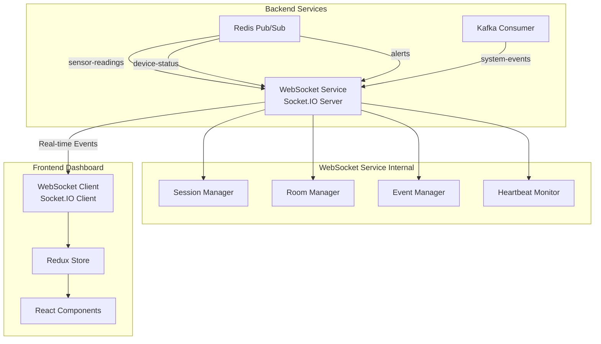

# WebSocket Integration Guide

This document provides a comprehensive guide on how WebSockets are integrated into the IoT Monitoring System using Socket.IO for real-time communication between backend services and the frontend dashboard.

## Table of Contents
1. [Architecture Overview](#architecture-overview)
2. [Socket.IO Configuration](#socketio-configuration)
3. [Backend Implementation](#backend-implementation)
4. [Frontend Implementation](#frontend-implementation)
5. [Data Flow Trace](#data-flow-trace)
6. [Event Schemas](#event-schemas)
7. [Error Handling](#error-handling)
8. [Performance Optimizations](#performance-optimizations)

## Architecture Overview



### Role in System
- **Real-time Communication**: Instant data updates to frontend
- **Event Broadcasting**: Distributes sensor readings, alerts, status changes
- **Session Management**: Tracks connected clients and subscriptions
- **Room Management**: Groups clients by device/topic subscriptions

## Socket.IO Configuration

### Backend WebSocket Service Configuration

**File**: `services/websocket-service/src/config/index.js`

```javascript
module.exports = {
  service: {
    // Service name for identification in logs and monitoring
    name: 'websocket-service',
    
    // Port for HTTP server hosting Socket.IO - separate from API Gateway
    port: process.env.PORT || 3003,
    
    // Environment setting affects logging levels and error handling
    environment: process.env.NODE_ENV || 'development'
  },
  
  socketIO: {
    // Path where Socket.IO server will be accessible - standard Socket.IO path
    path: '/socket.io',
    
    // Don't serve Socket.IO client files - frontend bundles its own client
    serveClient: false,
    
    // Interval between ping packets sent to clients - detects disconnections
    // 25 seconds allows for network delays while detecting dead connections
    pingInterval: 25000,
    
    // Time to wait for pong response before considering client disconnected
    // 20 seconds handles slow networks but prevents zombie connections
    pingTimeout: 20000,
    
    // Don't use cookies for session management - use stateless approach
    cookie: false,
    
    // Allowed transport methods - websocket preferred, polling as fallback
    // Polling works through firewalls that block websocket connections
    transports: ['websocket', 'polling'],
    
    // Allow Engine.IO v3 clients for backward compatibility
    allowEIO3: true,
    
    // CORS configuration for browser security
    cors: {
      // Allow frontend origin - React dev server typically runs on port 5173
      origin: process.env.FRONTEND_URL || "http://localhost:5173",
      
      // Allow GET for connection establishment, POST for polling transport
      methods: ["GET", "POST"],
      
      // Allow cookies and authentication headers to be sent
      credentials: true
    }
  },
  
  redis: {
    // Redis server for subscribing to real-time data updates
    host: process.env.REDIS_HOST || 'redis',
    port: process.env.REDIS_PORT || 6379,
    
    // Channel names that this service subscribes to for real-time updates
    channels: {
      // Channel for sensor reading updates from Data Ingestion service
      sensorReadings: 'sensor-readings',
      
      // Channel for device online/offline status changes
      deviceStatus: 'device-status',
      
      // Channel for alert notifications that need immediate broadcast
      alerts: 'alerts'
    }
  },
  
  kafka: {
    // Kafka topics for direct consumption (alternative to Redis pub/sub)
    topics: {
      // Main sensor data topic - same as producer uses
      sensorReadings: 'sensors-data',
      
      // Device status change events
      deviceStatus: 'device-status',
      
      // Alert generation events
      alerts: 'alerts'
    }
  }
};
```

### Frontend WebSocket Configuration

**File**: `dashboard/react-app/src/services/websocket.js`

```javascript
class WebSocketService {
  constructor() {
    this.socket = null;
    this.reconnectAttempts = 0;
    this.maxReconnectAttempts = 5;
    this.reconnectDelay = 3000;
    this.isConnecting = false;
    this.subscribedDevices = new Set();
    this.heartbeatInterval = null;
    
    // WebSocket URL from environment
    this.wsUrl = import.meta.env.VITE_WS_URL || 'ws://localhost:3003';
  }

  connect() {
    if (this.isConnecting || (this.socket && this.socket.connected)) {
      return;
    }

    this.isConnecting = true;
    store.dispatch(setConnectionStatus('connecting'));
    
    this.socket = io(this.wsUrl, {
      transports: ['websocket', 'polling'],
      reconnection: true,
      reconnectionAttempts: this.maxReconnectAttempts,
      reconnectionDelay: this.reconnectDelay,
      timeout: 20000,
      forceNew: true,
    });

    this.setupEventListeners();
  }
}
```

## Backend Implementation

### Socket.IO Server Setup

**File**: `services/websocket-service/src/socket/io.js`

```javascript
const { Server } = require('socket.io');
const config = require('../config');
const logger = require('../utils/logger');

let io;

function initSocketIO(httpServer) {
  // Create Socket.IO server
  io = new Server(httpServer, {
    cors: config.socketIO.cors,
    path: config.socketIO.path,
    serveClient: config.socketIO.serveClient,
    pingInterval: config.socketIO.pingInterval,
    pingTimeout: config.socketIO.pingTimeout,
    cookie: config.socketIO.cookie,
  });

  // Connection handler
  io.on('connection', (socket) => {
    const clientId = socket.id;
    logger.info(`Client connected: ${clientId}`);

    // Send welcome message
    socket.emit('welcome', {
      message: 'Connected to IoT Monitoring System',
      timestamp: new Date().toISOString(),
    });

    // Device subscription handlers
    socket.on('subscribe:device', (deviceId) => {
      logger.info(`Client ${clientId} subscribed to device: ${deviceId}`);
      socket.join(`device:${deviceId}`);
    });

    socket.on('unsubscribe:device', (deviceId) => {
      logger.info(`Client ${clientId} unsubscribed from device: ${deviceId}`);
      socket.leave(`device:${deviceId}`);
    });

    // All devices subscription
    socket.on('subscribe-all-devices', () => {
      logger.info(`Client ${clientId} subscribed to all devices`);
      socket.join('all-devices');
    });

    // System status subscription
    socket.on('subscribe-system', () => {
      logger.info(`Client ${clientId} subscribed to system status`);
      socket.join('system-status');
    });

    // Alert subscription
    socket.on('subscribe-alerts', () => {
      logger.info(`Client ${clientId} subscribed to alerts`);
      socket.join('alerts');
    });

    // Historical data request handler
    socket.on('get:history', async (params, callback) => {
      try {
        logger.info(`Client ${clientId} requested historical data`, params);
        // Implementation would fetch from database
        callback({
          success: true,
          message: 'Historical data retrieved',
          data: []
        });
      } catch (error) {
        logger.error('Error retrieving historical data', { error, params });
        callback({
          success: false,
          message: 'Failed to retrieve historical data',
          error: error.message,
        });
      }
    });

    // Heartbeat handler
    socket.on('ping', () => {
      socket.emit('pong');
    });

    // Disconnect handler
    socket.on('disconnect', (reason) => {
      logger.info(`Client disconnected: ${clientId}, reason: ${reason}`);
    });

    // Error handler
    socket.on('error', (error) => {
      logger.error(`Socket error for client ${clientId}`, { error });
    });
  });

  logger.info('Socket.IO server initialized');
  return io;
}

// Broadcasting functions
function broadcastSensorReading(reading) {
  if (!io) {
    logger.warn('Socket.IO not initialized, cannot broadcast');
    return;
  }

  try {
    if (reading && reading.deviceId) {
      // Broadcast to device subscribers
      io.to(`device:${reading.deviceId}`).emit('sensor:reading', reading);
      
      // Broadcast to all devices subscribers
      io.to('all-devices').emit('sensor:all', reading);
      
      logger.debug(`Broadcast sensor reading for device: ${reading.deviceId}`);
    }
  } catch (error) {
    logger.error('Error broadcasting sensor reading', { error, reading });
  }
}

function broadcastDeviceStatus(status) {
  if (!io) {
    logger.warn('Socket.IO not initialized, cannot broadcast');
    return;
  }

  try {
    if (status && status.deviceId) {
      // Broadcast to device subscribers
      io.to(`device:${status.deviceId}`).emit('device:status', status);
      
      // Broadcast to all devices subscribers
      io.to('all-devices').emit('device:all', status);
      
      logger.debug(`Broadcast device status for device: ${status.deviceId}`);
    }
  } catch (error) {
    logger.error('Error broadcasting device status', { error, status });
  }
}

function broadcastAlert(alert) {
  if (!io) {
    logger.warn('Socket.IO not initialized, cannot broadcast');
    return;
  }

  try {
    // Broadcast to alert subscribers
    io.to('alerts').emit('alert', alert);
    
    // Also broadcast to device subscribers if device-specific
    if (alert.deviceId) {
      io.to(`device:${alert.deviceId}`).emit('alert:device', alert);
    }
    
    // System-wide alert broadcast
    io.emit('alert:system', alert);
    
    logger.info('Broadcast alert', { alertId: alert.id, deviceId: alert.deviceId });
  } catch (error) {
    logger.error('Error broadcasting alert', { error, alert });
  }
}

function broadcastSystemStatus(status) {
  if (!io) {
    logger.warn('Socket.IO not initialized, cannot broadcast');
    return;
  }

  try {
    io.to('system-status').emit('system:status', status);
    logger.debug('Broadcast system status update');
  } catch (error) {
    logger.error('Error broadcasting system status', { error, status });
  }
}

module.exports = {
  initSocketIO,
  broadcastSensorReading,
  broadcastDeviceStatus,
  broadcastAlert,
  broadcastSystemStatus,
};
```

### Redis Integration

**File**: `services/websocket-service/src/index.js`

```javascript
// Handle messages from Redis/Kafka
function handleMessage(topic, message) {
  logger.debug(`Handling message from topic: ${topic}`, { message });
  
  try {
    switch (topic) {
      case config.kafka.topics.sensorReadings:
        socketIO.broadcastSensorReading(message);
        break;
      case config.kafka.topics.deviceStatus:
        socketIO.broadcastDeviceStatus(message);
        break;
      case config.kafka.topics.alerts:
        socketIO.broadcastAlert(message);
        break;
      default:
        logger.warn(`Unknown topic: ${topic}`, { message });
    }
  } catch (error) {
    logger.error('Error handling message', { error, topic, message });
  }
}

// Initialize Redis subscribers
async function initializeService() {
  try {
    // Initialize Redis
    await redisClient.initRedis();
    
    // Subscribe to Redis channels
    await redisClient.subscribeToChannel(
      config.redis.channels.sensorReadings,
      (message) => handleMessage(config.kafka.topics.sensorReadings, message)
    );
    
    await redisClient.subscribeToChannel(
      config.redis.channels.deviceStatus,
      (message) => handleMessage(config.kafka.topics.deviceStatus, message)
    );
    
    await redisClient.subscribeToChannel(
      config.redis.channels.alerts,
      (message) => handleMessage(config.kafka.topics.alerts, message)
    );
    
    // Start HTTP server
    server.listen(PORT, () => {
      logger.info(`WebSocket service listening on port ${PORT}`);
    });
  } catch (error) {
    logger.error('Failed to initialize service', { error });
    process.exit(1);
  }
}
```

## Frontend Implementation

### WebSocket Client Service

**File**: `dashboard/react-app/src/services/websocket.js`

```javascript
import io from 'socket.io-client';
import { store } from '../store';
import { 
  updateRealTimeData, 
  updateDeviceStatus, 
  setConnectionStatus 
} from '../store/slices/devicesSlice';

class WebSocketService {
  setupEventListeners() {
    if (!this.socket) return;

    // Connection events
    this.socket.on('connect', () => {
      console.log('✅ WebSocket connected successfully');
      this.isConnecting = false;
      this.reconnectAttempts = 0;
      
      store.dispatch(setConnectionStatus('connected'));
      store.dispatch(addNotification({
        type: 'success',
        title: 'Connected',
        message: 'Real-time data connection established',
        autoClose: 3000
      }));
      
      this.subscribeToAllDevices();
      this.startHeartbeat();
    });

    this.socket.on('disconnect', (reason) => {
      console.log('❌ WebSocket disconnected:', reason);
      this.isConnecting = false;
      
      store.dispatch(setConnectionStatus('disconnected'));
      this.stopHeartbeat();
    });

    // Data events - Updated to match backend event names
    this.socket.on('sensor:all', (data) => {
      console.log('📊 Received sensor data (sensor:all):', data);
      
      store.dispatch(updateRealTimeData({
        deviceId: data.deviceId,
        data: {
          value: data.value,
          unit: data.unit,
          status: data.status || 'normal',
          timestamp: data.timestamp,
          location: data.location
        }
      }));
      
      store.dispatch(incrementDataPoints());
      store.dispatch(updateLastDataUpdate());
    });

    this.socket.on('sensor:reading', (data) => {
      console.log('📊 Received sensor reading (sensor:reading):', data);
      
      store.dispatch(updateRealTimeData({
        deviceId: data.deviceId,
        data: {
          value: data.value,
          unit: data.unit,
          status: data.status || 'normal',
          timestamp: data.timestamp,
          location: data.location
        }
      }));
      
      store.dispatch(incrementDataPoints());
      store.dispatch(updateLastDataUpdate());
    });

    this.socket.on('device:status', (data) => {
      console.log('🔧 Device status update (device:status):', data);
      
      store.dispatch(updateDeviceStatus({
        deviceId: data.deviceId,
        status: data.status,
      }));
      
      if (data.status === 'offline') {
        store.dispatch(addNotification({
          type: 'warning',
          title: 'Device Offline',
          message: `Device ${data.deviceId} has gone offline`,
          autoClose: 5000
        }));
      }
    });

    // Alert events
    this.socket.on('alert', (data) => {
      console.log('🚨 Alert received:', data);
      
      store.dispatch(addNotification({
        type: data.severity === 'critical' ? 'error' : 'warning',
        title: 'Alert Triggered',
        message: `${data.deviceId}: ${data.message}`,
        autoClose: data.severity === 'critical' ? false : 10000,
        alertId: data.alertId
      }));
    });

    this.socket.on('alert:system', (data) => {
      console.log('🚨 System alert:', data);
      
      store.dispatch(addNotification({
        type: 'error',
        title: 'System Alert',
        message: data.message,
        autoClose: false
      }));
    });

    // System events
    this.socket.on('system:status', (data) => {
      console.log('⚙️ System status update:', data);
      
      store.dispatch(updateSystemStatus({
        status: data.status,
        timestamp: data.timestamp
      }));
    });

    // Connection health
    this.socket.on('pong', () => {
      console.log('💓 WebSocket heartbeat received');
    });

    this.socket.on('welcome', (data) => {
      console.log('👋 Welcome message:', data.message);
    });
  }

  // Subscription methods
  subscribeToAllDevices() {
    if (this.socket && this.socket.connected) {
      console.log('📡 Subscribing to all device updates');
      this.socket.emit('subscribe-all-devices');
    }
  }

  subscribeToDevice(deviceId) {
    if (this.socket && this.socket.connected) {
      console.log(`📡 Subscribing to device: ${deviceId}`);
      this.socket.emit('subscribe:device', deviceId);
      this.subscribedDevices.add(deviceId);
    }
  }

  subscribeToAlerts() {
    if (this.socket && this.socket.connected) {
      console.log('🚨 Subscribing to alert notifications');
      this.socket.emit('subscribe-alerts');
    }
  }

  subscribeToSystem() {
    if (this.socket && this.socket.connected) {
      console.log('⚙️ Subscribing to system status');
      this.socket.emit('subscribe-system');
    }
  }

  // Heartbeat for connection monitoring
  startHeartbeat() {
    this.stopHeartbeat();
    
    this.heartbeatInterval = setInterval(() => {
      if (this.socket && this.socket.connected) {
        this.socket.emit('ping');
      }
    }, 30000); // Ping every 30 seconds
  }

  stopHeartbeat() {
    if (this.heartbeatInterval) {
      clearInterval(this.heartbeatInterval);
      this.heartbeatInterval = null;
    }
  }
}

export default new WebSocketService();
```

### React Component Integration

**File**: `dashboard/react-app/src/App.jsx`

```javascript
import { useEffect } from 'react';
import { useDispatch } from 'react-redux';
import websocketService from './services/websocket';

function App() {
  const dispatch = useDispatch();

  useEffect(() => {
    // Initialize WebSocket connection
    console.log('🔌 Initializing WebSocket connection');
    websocketService.connect();

    // Subscribe to various data streams
    websocketService.subscribeToAlerts();
    websocketService.subscribeToSystem();

    // Cleanup on unmount
    return () => {
      console.log('🔌 Cleaning up WebSocket connection');
      websocketService.disconnect();
    };
  }, []);

  return (
    <div className="app">
      {/* App components */}
    </div>
  );
}
```

## Data Flow Trace

### Complete Real-time Data Flow

1. **Sensor Data Generation**
   ```javascript
   // IoT Simulator generates reading
   const reading = {
     deviceId: 'device-001',
     sensorType: 'temperature',
     value: 25.5,
     unit: '°C',
     timestamp: '2025-06-13T10:00:00Z'
   };
   ```

2. **Data Processing Chain**
   ```
   Kafka → Data Ingestion → Redis Pub/Sub → WebSocket Service
   ```

3. **WebSocket Service Receives**
   ```javascript
   // Redis subscriber receives message
   redisClient.subscribeToChannel('sensor-readings', (message) => {
     handleMessage('sensors-data', message);
   });
   
   function handleMessage(topic, message) {
     switch (topic) {
       case 'sensors-data':
         socketIO.broadcastSensorReading(message);
         break;
     }
   }
   ```

4. **Socket.IO Broadcasting**
   ```javascript
   function broadcastSensorReading(reading) {
     // Broadcast to specific device subscribers
     io.to(`device:${reading.deviceId}`).emit('sensor:reading', reading);
     
     // Broadcast to all devices subscribers
     io.to('all-devices').emit('sensor:all', reading);
   }
   ```

5. **Frontend Reception**
   ```javascript
   socket.on('sensor:all', (data) => {
     // Update Redux store
     dispatch(updateRealTimeData({
       deviceId: data.deviceId,
       data: {
         value: data.value,
         unit: data.unit,
         status: data.status,
         timestamp: data.timestamp
       }
     }));
     
     // Track metrics
     dispatch(incrementDataPoints());
   });
   ```

6. **UI Update**
   ```javascript
   // React component automatically re-renders
   const deviceData = useSelector(state => 
     selectDeviceCurrentReading(state, deviceId)
   );
   
   return (
     <DeviceCard 
       deviceId={deviceId}
       value={deviceData.value}
       unit={deviceData.unit}
       status={deviceData.status}
       lastUpdate={deviceData.timestamp}
     />
   );
   ```

## Event Schemas

### Sensor Data Events

```javascript
// sensor:reading event
{
  "deviceId": "device-001",
  "sensorType": "temperature",
  "value": 25.5,
  "unit": "°C",
  "timestamp": "2025-06-13T10:00:00.000Z",
  "status": "normal",
  "location": "Assembly Line 1"
}

// sensor:all event (same schema as sensor:reading)
{
  "deviceId": "device-001",
  "sensorType": "temperature", 
  "value": 25.5,
  "unit": "°C",
  "timestamp": "2025-06-13T10:00:00.000Z",
  "status": "normal",
  "location": "Assembly Line 1"
}
```

### Device Status Events

```javascript
// device:status event
{
  "deviceId": "device-001",
  "status": "online|offline|maintenance",
  "timestamp": "2025-06-13T10:00:00.000Z",
  "location": "Assembly Line 1",
  "lastSeen": "2025-06-13T09:59:45.000Z"
}

// device:all event (same schema)
{
  "deviceId": "device-001",
  "status": "online",
  "timestamp": "2025-06-13T10:00:00.000Z"
}
```

### Alert Events

```javascript
// alert event
{
  "alertId": "alert-12345",
  "deviceId": "device-001",
  "severity": "warning|critical",
  "type": "threshold|connectivity|system",
  "message": "Temperature threshold exceeded",
  "timestamp": "2025-06-13T10:00:00.000Z",
  "threshold": {
    "value": 85.0,
    "operator": ">",
    "current": 87.2
  }
}

// alert:system event
{
  "alertId": "system-alert-001",
  "severity": "critical",
  "type": "system",
  "message": "Database connection lost",
  "timestamp": "2025-06-13T10:00:00.000Z",
  "affectedServices": ["data-ingestion", "api-gateway"]
}
```

### System Events

```javascript
// system:status event
{
  "status": "healthy|degraded|down",
  "timestamp": "2025-06-13T10:00:00.000Z",
  "uptime": 7200,
  "services": {
    "data-ingestion": "healthy",
    "websocket-service": "healthy",
    "api-gateway": "healthy"
  },
  "metrics": {
    "activeDevices": 5,
    "totalDevices": 5,
    "dataPointsPerMinute": 50,
    "activeAlerts": 1
  }
}
```

## Error Handling

### Connection Error Handling

```javascript
class ResilientWebSocketService {
  constructor() {
    this.connectionAttempts = 0;
    this.maxConnectionAttempts = 10;
    this.backoffMultiplier = 1.5;
    this.initialDelay = 1000;
  }

  async connectWithRetry() {
    try {
      await this.connect();
      this.connectionAttempts = 0;
    } catch (error) {
      this.connectionAttempts++;
      
      if (this.connectionAttempts <= this.maxConnectionAttempts) {
        const delay = this.calculateBackoff();
        console.warn(`Connection failed, retrying in ${delay}ms...`, { 
          attempt: this.connectionAttempts,
          error: error.message 
        });
        
        setTimeout(() => this.connectWithRetry(), delay);
      } else {
        console.error('Max connection attempts reached, giving up');
        this.handleConnectionFailure();
      }
    }
  }

  calculateBackoff() {
    return Math.min(
      this.initialDelay * Math.pow(this.backoffMultiplier, this.connectionAttempts - 1),
      30000 // Max 30 seconds
    );
  }

  handleConnectionFailure() {
    store.dispatch(addNotification({
      type: 'error',
      title: 'Connection Failed',
      message: 'Unable to establish real-time connection. Some features may be unavailable.',
      autoClose: false
    }));
  }
}
```

### Message Processing Errors

```javascript
// Safe event handler wrapper
function safeEventHandler(eventName, handler) {
  return (data) => {
    try {
      handler(data);
    } catch (error) {
      console.error(`Error handling ${eventName} event:`, error);
      
      // Log error to monitoring service
      logger.error('WebSocket event handling error', {
        event: eventName,
        error: error.message,
        data: data
      });
      
      // Show user-friendly notification
      store.dispatch(addNotification({
        type: 'warning',
        title: 'Data Processing Error',
        message: 'There was an issue processing real-time data. Please refresh if problems persist.',
        autoClose: 5000
      }));
    }
  };
}

// Apply safe handlers
this.socket.on('sensor:all', safeEventHandler('sensor:all', (data) => {
  store.dispatch(updateRealTimeData({
    deviceId: data.deviceId,
    data: data
  }));
}));
```

## Performance Optimizations

### Message Batching

```javascript
class BatchingWebSocketService {
  constructor() {
    this.messageBuffer = [];
    this.batchSize = 50;
    this.flushInterval = 100; // 100ms
    this.flushTimer = null;
  }

  handleBatchedSensorData(data) {
    this.messageBuffer.push(data);
    
    if (this.messageBuffer.length >= this.batchSize) {
      this.flushBuffer();
    } else if (!this.flushTimer) {
      this.flushTimer = setTimeout(() => {
        this.flushBuffer();
      }, this.flushInterval);
    }
  }

  flushBuffer() {
    if (this.messageBuffer.length === 0) return;
    
    const batch = [...this.messageBuffer];
    this.messageBuffer = [];
    
    if (this.flushTimer) {
      clearTimeout(this.flushTimer);
      this.flushTimer = null;
    }
    
    // Process batch
    store.dispatch(updateMultipleDevices(batch));
  }
}
```

### Room Management

```javascript
// Efficient room management on backend
class RoomManager {
  constructor(io) {
    this.io = io;
    this.roomSubscriptions = new Map();
  }

  subscribeToDevice(socketId, deviceId) {
    const socket = this.io.sockets.sockets.get(socketId);
    if (!socket) return;
    
    socket.join(`device:${deviceId}`);
    
    // Track subscriptions
    if (!this.roomSubscriptions.has(deviceId)) {
      this.roomSubscriptions.set(deviceId, new Set());
    }
    this.roomSubscriptions.get(deviceId).add(socketId);
  }

  unsubscribeFromDevice(socketId, deviceId) {
    const socket = this.io.sockets.sockets.get(socketId);
    if (socket) {
      socket.leave(`device:${deviceId}`);
    }
    
    // Update tracking
    const subscribers = this.roomSubscriptions.get(deviceId);
    if (subscribers) {
      subscribers.delete(socketId);
      if (subscribers.size === 0) {
        this.roomSubscriptions.delete(deviceId);
      }
    }
  }

  getDeviceSubscriberCount(deviceId) {
    const subscribers = this.roomSubscriptions.get(deviceId);
    return subscribers ? subscribers.size : 0;
  }
}
```

This comprehensive WebSocket integration guide covers the complete real-time communication system in the IoT Monitoring platform, from backend Socket.IO server setup to frontend client implementation, with detailed event flows and error handling strategies.
