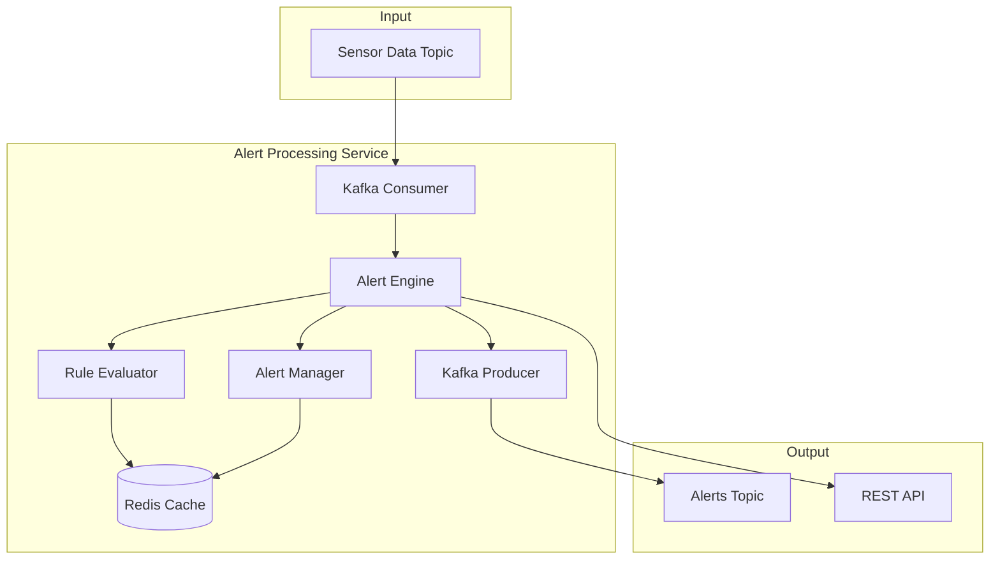

# Alert Processing Service

The Alert Processing Service is a core component of the IoT Monitoring System responsible for real-time monitoring of sensor data and generating alerts when predefined conditions are met.

## Overview

This service consumes sensor data from the Kafka `sensors-data` topic, evaluates it against configurable alert rules, and publishes alert events to the `alerts` topic. It provides intelligent alerting with features like deduplication, escalation, and automatic resolution.

## Features

### 🚨 **Alert Detection**
- **Threshold Monitoring**: Detects when sensor values exceed minimum/maximum thresholds
- **Trend Analysis**: Identifies concerning trends that may lead to threshold violations
- **Anomaly Detection**: Statistical analysis to detect outliers using z-score
- **Device Health Monitoring**: Detects communication issues and irregular data patterns

### 📊 **Alert Management**
- **Lifecycle Management**: Complete alert lifecycle (triggered → acknowledged → resolved)
- **Deduplication**: Prevents spam by avoiding duplicate alerts within time windows
- **Escalation**: Automatic severity escalation for unacknowledged alerts
- **Auto-Resolution**: Automatic resolution when conditions return to normal

### ⚡ **Real-time Processing**
- **Event-Driven Architecture**: Immediate processing of sensor data
- **Kafka Integration**: Consumes from sensors-data, publishes to alerts topic
- **Redis Caching**: Fast alert state management and metrics storage
- **Batch Processing**: Efficient handling of high-volume sensor data

## Architecture



## Alert Types

| Type | Description | Trigger Condition | Auto-Resolution |
|------|-------------|-------------------|-----------------|
| `threshold_exceeded` | Value above maximum threshold | `value > max_threshold` | When value ≤ max_threshold * 0.95 |
| `threshold_below` | Value below minimum threshold | `value < min_threshold` | When value ≥ min_threshold * 1.05 |
| `trend_warning` | Concerning trend detected | Rapid trend toward danger zone | After 10 minutes if no violation |
| `data_anomaly` | Statistical outlier detected | Z-score > 3 standard deviations | Immediate (next normal reading) |
| `device_communication` | Device not sending data | No data for 3x expected interval | When regular data resumes |

## Device Configurations

| Device ID | Type | Min | Max | Unit | Location | Interval |
|-----------|------|-----|-----|------|----------|----------|
| device-001 | Temperature | 15°C | 85°C | celsius | assembly-line-1 | 2s |
| device-002 | Pressure | 5 PSI | 55 PSI | psi | hydraulic-system-A | 3s |
| device-003 | Vibration | 0 Hz | 120 Hz | hz | motor-unit-3 | 1s |
| device-004 | Production | 50 units/hr | 1000 units/hr | units/hour | production-line-1 | 5s |
| device-005 | Quality | 80% | 100% | percentage | quality-control-station | 4s |

## API Endpoints

### Health & Monitoring
- `GET /health` - Basic health check
- `GET /health/detailed` - Detailed health with dependencies
- `GET /ready` - Readiness probe
- `GET /live` - Liveness probe
- `GET /metrics` - Service metrics

### Alert Management
- `GET /alerts/active` - List active alerts
- `GET /alerts/stats` - Alert statistics
- `POST /alerts/:id/acknowledge` - Acknowledge alert
- `POST /alerts/:id/resolve` - Resolve alert

### Example API Responses

#### Active Alerts
```json
GET /alerts/active
{
  "timestamp": "2025-06-12T10:18:25.000Z",
  "count": 2,
  "alerts": [
    {
      "id": "alert-1704708505000-device-001-threshold_exceeded-a1b2c3d4e",
      "deviceId": "device-001",
      "type": "threshold_exceeded",
      "severity": "high",
      "message": "temperature reading 89celsius exceeds maximum threshold of 85celsius",
      "value": 89,
      "threshold": 85,
      "status": "triggered",
      "triggeredAt": "2025-06-12T10:15:05.000Z",
      "sensorType": "temperature",
      "location": "assembly-line-1",
      "unit": "celsius"
    }
  ]
}
```

#### Alert Statistics
```json
GET /alerts/stats
{
  "timestamp": "2025-06-12T10:18:25.000Z",
  "stats": {
    "total": 5,
    "bySeverity": {
      "critical": 1,
      "high": 2,
      "medium": 1,
      "low": 1
    },
    "byDevice": {
      "device-001": 2,
      "device-002": 1,
      "device-003": 2
    },
    "byType": {
      "threshold_exceeded": 3,
      "trend_warning": 1,
      "data_anomaly": 1
    }
  }
}
```

## Configuration

The service is configured through environment variables:

```env
# Server Configuration
PORT=3004
NODE_ENV=development
LOG_LEVEL=info

# Kafka Configuration
KAFKA_BROKER=kafka:29092
KAFKA_CLIENT_ID=alert-processing
KAFKA_GROUP_ID=alert-processing-group

# Redis Configuration
REDIS_HOST=redis
REDIS_PORT=6379
```

## Advanced Features

### Severity Calculation
Severity is calculated based on deviation from thresholds:
- **Critical**: >30% deviation from threshold
- **High**: 20-30% deviation
- **Medium**: 10-20% deviation  
- **Low**: 5-10% deviation

### Escalation Logic
- Unacknowledged alerts escalate after 5 minutes
- Escalation increases severity level
- Multiple escalation levels supported
- Escalation timer resets after acknowledgment

### Trend Analysis
- Uses linear regression on last 5 readings
- Predicts time to threshold violation
- Triggers warnings for rapid trends toward danger zones
- Configurable trend sensitivity

### Deduplication
- Prevents duplicate alerts within 1-minute windows
- Based on device ID and alert type combination
- Configurable deduplication time window
- Smart spam prevention

## Performance

### Metrics
- **Throughput**: >1000 sensor readings/second
- **Latency**: <100ms average processing time
- **Memory**: ~50MB typical usage
- **CPU**: <10% under normal load

### Optimizations
- Batch processing for database operations
- Connection pooling for Redis and Kafka
- In-memory caching for frequently accessed data
- Efficient data structures for trend analysis

## Monitoring

### Health Checks
- **Liveness**: Basic service availability
- **Readiness**: All dependencies connected
- **Detailed**: Component-level health status

### Metrics Collection
- Processing statistics (messages, alerts, errors)
- Performance metrics (latency, throughput)
- Alert statistics (by type, severity, device)
- System resources (memory, CPU usage)

## Docker Integration

### Build & Run
```bash
# Build the service
docker build -t alert-processing .

# Run with docker-compose
docker-compose up alert-processing

# Check logs
docker logs iot-alert-processing
```

### Health Check
The Dockerfile includes a health check that validates the service endpoint:
```dockerfile
HEALTHCHECK --interval=30s --timeout=3s --start-period=5s --retries=3 \
    CMD wget --no-verbose --tries=1 --spider http://localhost:3004/health || exit 1
```

## Development

### Testing
```bash
# Install dependencies
npm install

# Run tests
npm test

# Run in development mode
npm run dev
```

### Debugging
The service provides comprehensive logging at different levels:
- **Error**: Critical issues and failures
- **Warn**: Important but non-critical issues
- **Info**: General operational information
- **Debug**: Detailed diagnostic information

## Integration

### With Other Services
- **IoT Simulator**: Receives sensor data via Kafka
- **Data Ingestion**: Parallel processing of sensor data
- **WebSocket Service**: Will consume alert events for real-time notifications
- **API Gateway**: Will proxy alert management requests

### Event Flow
```
IoT Simulator → Kafka (sensors-data) → Alert Processing → Kafka (alerts) → WebSocket Service → Dashboard
                                     ↓
                                   Redis (alert state)
```

This service is a critical component of Phase 4 implementation, providing intelligent and scalable alert management for the IoT monitoring system.
