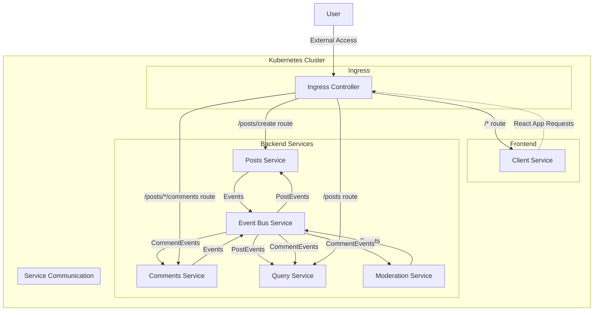

# Blog Microservices Application with Kubernetes

This project evolves the Docker-containerized blog application into a fully orchestrated Kubernetes environment. It demonstrates modern microservices architecture practices, service discovery, container orchestration, and automated development workflows.

## Microservices Architecture

The application follows an event-driven microservices architecture with the following services:

| Service | Port | Purpose |
|---------|------|---------|
| **Client** | 3000 | React frontend that displays posts and comments |
| **Posts** | 4000 | Creates and manages blog posts |
| **Comments** | 4001 | Creates and manages comments on posts |
| **Query** | 4002 | Aggregates data for efficient reads |
| **Moderation** | 4003 | Moderates comment content |
| **Event Bus** | 4005 | Facilitates communication between services |

## Kubernetes Cluster Architecture



## Key Improvements from Docker Version

The Kubernetes implementation provides several significant advantages:

1. **Service Discovery**
   - Docker Version: Services communicated via hardcoded localhost addresses
   - Kubernetes Version: Services use Kubernetes DNS-based service discovery (e.g., `http://posts-clusterip-srv:4000`)

2. **Networking**
   - Docker Version: Manual port publishing with `-p` flags
   - Kubernetes Version: Declarative networking with ClusterIP for internal communication and Ingress for external access

3. **Deployment Management**
   - Docker Version: Manual container startup and management
   - Kubernetes Version: Declarative deployments with versioned container images and scalable replicas

4. **Load Balancing**
   - Docker Version: None built-in
   - Kubernetes Version: Automatic load balancing across service instances

5. **Development Workflow**
   - Docker Version: Manual rebuilds and container restarts
   - Kubernetes Version: Automated with Skaffold for continuous development

6. **Routing**
   - Docker Version: None (direct service access)
   - Kubernetes Version: Ingress controller with path-based routing to different services

7. **Scalability**
   - Docker Version: Manual scaling through multiple container instances
   - Kubernetes Version: Declarative scaling through replicas in deployment specs

## Prerequisites

To run this application, you'll need:

1. **Docker Desktop** with Kubernetes enabled, or a separate Kubernetes cluster (e.g., minikube)
2. **kubectl** command-line tool installed and configured
3. **Skaffold** for development workflow automation
4. **Ingress-NGINX Controller** installed in your cluster

## Setting Up Your Environment

1. **Configure Local Hosts File**

   Add this entry to your `/etc/hosts` file (or `C:\Windows\System32\drivers\etc\hosts` on Windows):

   ```
   127.0.0.1 posts.com
   ```

2. **Install Ingress-NGINX Controller** (if not already installed)

   ```bash
   kubectl apply -f https://raw.githubusercontent.com/kubernetes/ingress-nginx/controller-v1.8.2/deploy/static/provider/cloud/deploy.yaml
   ```

3. **Verify Kubernetes Setup**

   ```bash
   kubectl get nodes
   kubectl get pods -A
   ```

## Starting the Application

With Skaffold, starting the entire application is simple:

```bash
# Navigate to the project directory
cd blog

# Start the development environment
skaffold dev
```

This will:

1. Build all service images
2. Deploy all Kubernetes resources
3. Stream logs from all running pods
4. Watch for file changes and automatically update services

## Application Workflow

1. **Creating a Post**
   - User submits a post through the client interface
   - Request goes to Ingress controller
   - Routed to Posts service via `/posts/create` path
   - Post is created and a "PostCreated" event is emitted to Event Bus
   - Event Bus broadcasts to all services
   - Query service stores the post for efficient reading

2. **Adding a Comment**
   - User adds a comment through the client interface
   - Request goes to Comments service via `/posts/:id/comments`
   - Comment is created with "pending" status
   - "CommentCreated" event is emitted to Event Bus
   - Event Bus broadcasts to all services
   - Moderation service processes the comment
   - Moderation service emits "CommentModerated" event
   - Comments service updates comment status
   - "CommentUpdated" event is broadcast
   - Query service updates its database

3. **Viewing Posts and Comments**
   - Client requests posts from Query service
   - Query service returns all posts with their comments
   - Client renders the data

## Directory Structure

- `client/` - React frontend application
- `posts/` - Post creation and management service
- `comments/` - Comment creation and management service
- `event-bus/` - Event broadcasting service
- `query/` - Data aggregation service for efficient reads
- `moderation/` - Comment moderation service
- `infra/k8s/` - Kubernetes configuration files
- `skaffold.yaml` - Skaffold configuration for development workflow

## Kubernetes Resources

The application uses these Kubernetes resource types:

1. **Deployments** - Manage the pods that run our services
2. **Services (ClusterIP)** - Enable internal cluster communication
3. **Services (NodePort)** - Allow direct external access to a service
4. **Ingress** - Route external requests to the appropriate services

For detailed information about the Kubernetes configuration, see the [README in the k8s directory](infra/k8s/README.md).

## Development with Skaffold

Skaffold automates the development workflow:

1. **Code Changes**
   - Modify code in any service
   - Skaffold detects the change
   - For small changes, Skaffold syncs files directly into containers
   - For significant changes, Skaffold rebuilds and redeploys

2. **Monitoring**
   - Skaffold aggregates logs from all services
   - Errors and application output are centralized

3. **Cleanup**
   - Press Ctrl+C to stop Skaffold
   - Skaffold automatically cleans up all deployed resources

## Troubleshooting

### Common Issues

1. **Ingress Not Working**
   - Ensure Ingress-NGINX controller is installed
   - Check the hosts file has the correct entry for posts.com
   - Verify Ingress resource is correctly configured: `kubectl get ingress`

2. **Service Communication Errors**
   - Check service names and ports in the requests
   - Ensure ClusterIP services are running: `kubectl get services`
   - Examine pod logs: `kubectl logs <pod-name>`

3. **Skaffold Issues**
   - Ensure Docker is running and Kubernetes is enabled
   - Check Skaffold version compatibility
   - Try running with increased verbosity: `skaffold dev -v debug`

## Further Improvements

While this Kubernetes implementation is a major step forward, future enhancements could include:

1. **Persistent Storage** - Adding StatefulSets and PersistentVolumes for data
2. **Secrets Management** - Using Kubernetes Secrets for sensitive data
3. **Horizontal Pod Autoscaling** - Dynamically scaling based on load
4. **Health Checks** - Adding readiness and liveness probes
5. **Resource Limits** - Setting CPU and memory constraints
6. **CI/CD Pipeline** - Automating testing and deployment
7. **Monitoring and Logging** - Implementing centralized monitoring and logging
