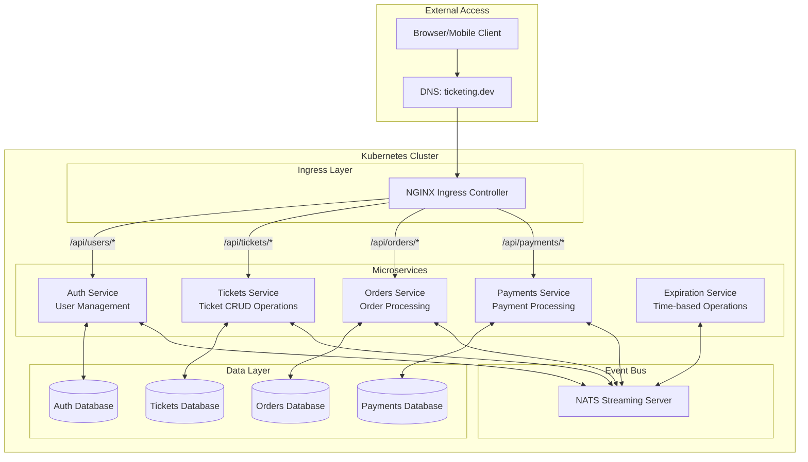

# Ticketing Application

A microservices-based ticketing platform built with Node.js, TypeScript, and Kubernetes.

## Application Overview

The Ticketing application is designed to allow users to list tickets for events (concerts, sports) for sale and for other users to purchase these tickets. This application demonstrates modern microservices architecture principles, combining event-driven design with Kubernetes orchestration.

### Core Functionality

- Users can list tickets for events (concerts, sports) for sale
- Other users can purchase these tickets
- When a user attempts to purchase a ticket, it is "locked" for 15 minutes
- During this 15-minute window, no other user can purchase the ticket
- After 15 minutes without payment, the ticket "unlocks" and becomes available
- Ticket prices can be edited by the owner (if not currently locked)

## Microservices Architecture

The application is built as a collection of independent microservices, each responsible for a specific domain of functionality. The services communicate with each other through events, enabling loose coupling and high resilience.

### Kubernetes Cluster Architecture



### Service Descriptions

| Service | Purpose | API Endpoints |
|---------|---------|---------------|
| **Auth** | User authentication and registration | `/api/users/signup`, `/api/users/signin`, `/api/users/currentuser` |
| **Tickets** | Creating and updating tickets | `/api/tickets/new`, `/api/tickets/:id` |
| **Orders** | Managing ticket purchase orders | `/api/orders/create`, `/api/orders/:id` |
| **Payments** | Processing payments for tickets | `/api/payments/create` |
| **Expiration** | Handling time-based operations (ticket lock expiry) | (No direct API, event-driven) |

### Event-Driven Communication

Services communicate with each other by publishing and subscribing to events through a central event bus (likely NATS Streaming):

1. **Auth Events**:
   - `UserCreated`
   - `UserUpdated`

2. **Ticket Events**:
   - `TicketCreated`
   - `TicketUpdated`

3. **Order Events**:
   - `OrderCreated` (locks a ticket)
   - `OrderCancelled` (releases a ticket)
   - `OrderExpired`

4. **Payment Events**:
   - `PaymentCreated`

Each service maintains its own database and only shares data through events, allowing for loose coupling and independent scaling.

## Data Flow for Ticket Purchase

1. User authenticates through Auth Service
2. User browses available tickets or creates a new ticket listing
3. When a user decides to purchase a ticket:
   - Orders service creates a new order and emits an `OrderCreated` event
   - Tickets service receives the event and marks the ticket as "locked"
   - Expiration service sets a 15-minute timer for the order
4. User submits payment:
   - Payments service processes the payment and emits a `PaymentCreated` event
   - Orders service updates the order to "complete"
   - Tickets service updates the ticket to "sold"
5. If the 15-minute window expires:
   - Expiration service emits an `OrderExpired` event
   - Orders service updates the order to "cancelled"
   - Tickets service unlocks the ticket

## Current Implementation Status

This project is in the early stages of development:

- **Implemented**: Auth service, basic Kubernetes infrastructure, Ingress setup
- **Pending**: Tickets, Orders, Payments, and Expiration services

## Setup and Running the Application

### Prerequisites

1. **Docker Desktop** with Kubernetes enabled, or a separate Kubernetes cluster (e.g., minikube)
2. **kubectl** command-line tool installed and configured
3. **Skaffold** for development workflow automation
4. **Ingress-NGINX Controller** installed in your cluster

### Environment Setup

1. **Clone the repository**

```bash
git clone <repository-url>
cd ticketing
```

2. **Configure local hosts file**

Add this entry to your hosts file (`/etc/hosts` on macOS/Linux, `C:\Windows\System32\drivers\etc\hosts` on Windows):

```
127.0.0.1 ticketing.dev
```

3. **Install NGINX Ingress Controller** (if not already installed)

```bash
kubectl apply -f https://raw.githubusercontent.com/kubernetes/ingress-nginx/controller-v1.8.2/deploy/static/provider/cloud/deploy.yaml
```

4. **Verify Kubernetes setup**

```bash
kubectl get pods -n ingress-nginx
```

You should see the NGINX controller running.

### Running the Application

Start the development environment using Skaffold:

```bash
skaffold dev
```

This will:

1. Build and deploy all services to Kubernetes
2. Stream logs from all pods
3. Watch for file changes and automatically update services
4. Set up port forwarding for local access

Once everything is running, you can access the application at:

- <https://ticketing.dev/>

> **Note**: You may need to accept the self-signed certificate warning in your browser.

## Development Workflow

### Adding a New Feature

1. Determine which service(s) need to be modified
2. Make code changes in the appropriate service directory
3. Skaffold will automatically rebuild and redeploy the affected services
4. Test your changes via the API or client application

### Creating a New Service

1. Create a new directory for the service
2. Add Dockerfile and required package configurations
3. Implement the service code
4. Create Kubernetes deployment and service files in `infra/k8s/`
5. Add the service to the Skaffold configuration in `skaffold.yaml`

### Common Commands

- `kubectl get pods` - List all running pods
- `kubectl logs <pod-name>` - View logs for a specific pod
- `kubectl exec -it <pod-name> sh` - Get an interactive shell in a pod
- `kubectl apply -f infra/k8s/<file>` - Apply a specific Kubernetes config file
